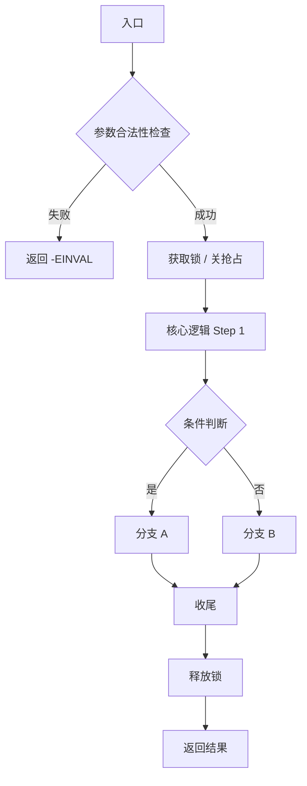
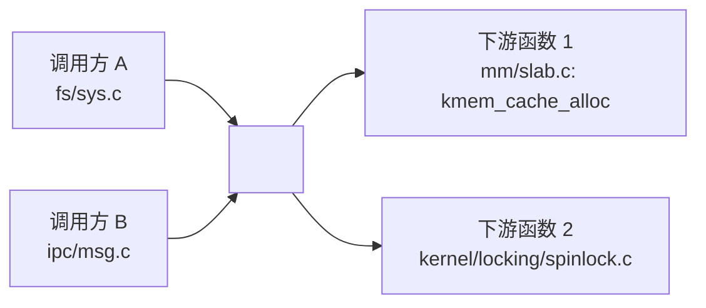

# Linux 内核源码每日学习工作流

本 Skill 定义了一套自动化的每日 Linux 内核源码深度分析流程，帮助 Agent 系统性地学习并积累内核核心代码的解读笔记。

## 一、触发条件

在以下任一情况发生时，调用本 Skill：

1. 用户明确要求「开始今天的内核学习」「每日内核源码分析」或类似语义的指令。
2. 定时 / 计划任务自动触发（例如每日早上 9 点）。
3. 用户指定某个子系统或函数希望按本工作流格式进行分析。

## 二、前置配置

| 配置项 | 默认值 | 说明 |
|--------|--------|------|
| `KERNEL_SRC_PATH` | `~/linux-stable` | 内核源码根目录。可被用户覆盖，例如 `~/linux-next` 或某特定版本路径。 |
| `ARCHIVE_ROOT` | `{Workspace}/daily/` | 每日归档根目录，按日期组织子目录。若 workspace 中存在已有分析目录（如本仓库中的 `mm/`、`fs/`、`kernel/` 等），同时更新对应子系统的就地分析文件。 |
| `PRIORITY_SUBSYSTEMS` | `mm/`, `kernel/sched/`, `drivers/`, `fs/`, `kernel/`, `ipc/`, `net/`, `block/`, `security/`, `lib/` | 选取目标时的优先子系统顺序，靠前的子系统权重更高。 |

## 三、工作流步骤

### Step 1：发现已分析过的函数，构建「已学习索引」

在开始选取新目标前，先扫描当前 workspace，找出已经分析过的函数或代码段，避免重复。

**具体操作：**

1. 从 `{Workspace}` 根目录递归搜索所有 `*.md` 文档。
2. 通过文件路径模式识别已分析函数：
   - 模式 A：`{子系统}/{源文件名.c或.h}/{函数名}.md`，例如 `mm/page_alloc.c/__alloc_pages_nodemask.md`
   - 模式 B：`{子系统}/{源文件名.c或.h}/README.md` 中列出的函数条目
3. 将所有已分析函数名 + 所在源文件路径记入本次运行的「排除集合」`ANALYZED_SET`。
4. 如果存在 `{ARCHIVE_ROOT}/INDEX.md`，同时解析其中已记录的条目并合并进 `ANALYZED_SET`。

### Step 2：从内核源码中随机选取一个「未分析过的核心目标」

#### 2.1 选取优先级规则

从 `PRIORITY_SUBSYSTEMS` 列表中按顺序加权采样：

- 权重分配：`mm/`(25%)、`kernel/sched/`(25%)、`drivers/`(15%)、`fs/`(15%)、其余子系统按顺序分摊剩余 20%。
- 若最高优先子系统已分析函数比例过高（> 70% 的可识别核心函数已分析），降级到下一个子系统。

#### 2.2 在选中子系统内识别「核心候选」

进入选中的子系统目录（例如 `mm/`），遍历其中的 `.c` 和 `.h` 源文件，对每个文件提取「核心函数 / 关键代码段」作为候选。

**核心函数判定标准（满足其一即可）：**

- 非 `static` 的全局导出函数（含 `EXPORT_SYMBOL` / `EXPORT_SYMBOL_GPL`）。
- 虽然是 `static`，但被 3 个以上调用点引用的函数。
- 带内核通用命名前缀的入口函数：`do_*`、`sys_*`、`__do_*`、`vfs_*`、`*_init`（早期 / 子系统初始化）、`*_alloc` / `*_free`、`*_map` / `*_unmap`。
- 关键数据结构定义所在的 `.h` 文件中的 `struct`、`enum`（当对应结构尚未被单独分析过时，可作为「关键代码段」选中）。

#### 2.3 过滤并最终随机选定

1. 移除所有在 `ANALYZED_SET` 中出现过的候选。
2. 若候选集为空，回退到下一个优先子系统，重复 2.1 ~ 2.3。
3. 在剩余候选中使用伪随机选定 **1 个**目标函数或关键结构。
4. 记录本次选定的目标元信息：
   ```
   TARGET = {
     name: "函数或结构名",
     file: "相对内核源码根的路径，如 mm/page_alloc.c",
     line_start: L,
     line_end:   M,
     subsystem: "mm",
     type: "function | struct | enum | code-block"
   }
   ```

> **注意：** 如果用户显式指定了「今天分析 X」，则跳过随机选择，直接将 X 作为 `TARGET`，但仍需校验是否已分析过；若已分析则建议用户换一个并给出未分析候选列表。

### Step 3：读取并解析目标源码

按 `TARGET.file` 从 `KERNEL_SRC_PATH` 读取对应源码文件的 `[line_start, line_end]` 范围（含前后若干行上下文，建议 ±20 行）。

若仅知道函数名不知行号，用以下方式定位：

- 在 `.c` / `.h` 中用 grep 匹配 `^<return_type>\s*\**<name>\s*\(` 或 `struct <name>\s*\{`。
- 若命中多个，以第一个定义位置为准（声明在头文件、实现在 .c 文件时优先 .c 实现）。

解析出的源码片段保存为本次分析的原始引用。

### Step 4：执行深度分析并输出中文解读

分析输出必须按以下固定结构组织，语言统一为中文。

---

#### 分析输出模板

```markdown
# 每日内核源码分析：<TARGET.name>

- **日期**：YYYY-MM-DD
- **子系统**：<TARGET.subsystem>
- **源文件**：<TARGET.file>:<TARGET.line_start>-<TARGET.line_end>
- **类型**：<TARGET.type>

---

## 1. 功能作用

<用通俗中文说明该函数/结构在内核中的角色、解决的问题、典型使用场景、何时被调用。>

## 2. 关键数据结构

<列出本函数参数、返回值、内部核心逻辑所依赖的关键 struct / enum / union：>

- `struct xxx`：字段含义、与其他结构的关联关系。
- `enum yyy`：各枚举值的语义。
- 关键全局变量 / per-cpu 变量。

> 每个结构给出核心字段的简明解读，不必抄全定义；引用头文件路径。

## 3. 核心逻辑流程图

<使用 Mermaid 的 `flowchart TD`（或 ASCII 流程图）表达核心执行路径。分支、循环、关键错误路径均需体现。典型结构：>



<随后用 3~8 条要点，逐条解释流程图中的关键决策点。>

## 4. 调用关系

### 4.1 调用者（who calls me）

<找出内核源码中调用本函数的上游入口，至少列出 3~5 个（若不足则全部列出）：>

| 调用方 | 所在文件 | 调用场景 |
|--------|----------|----------|
| `func_a` | `mm/xxx.c:123` | 系统调用 XX 路径 |
| ...    | ...      | ...      |

### 4.2 被调用者（who I call）

<列出本函数实现中调用的主要下游函数 / 内联函数 / 宏，分类为：>

- **核心路径调用**：驱动主逻辑的关键函数。
- **辅助调用**：锁、内存分配、打印等公共设施。
- **宏 / 内联**：影响性能或语义的关键内联展开点。

### 4.3 调用关系图（Mermaid）



## 5. 易错点 / 边界场景 / 设计权衡

<总结 3~6 条本函数中的：>
- 不直观的命名 / 宏行为。
- 竞态窗口与锁的设计（为什么用 spinlock 而不是 mutex）。
- 内存分配 gfp mask 的选择原因。
- 失败路径的资源回滚顺序。
- 跨版本 / 跨架构差异点（如发现）。

---

## 附：核心源码片段

```c
// <TARGET.file>:<TARGET.line_start>-<TARGET.line_end>
<粘贴去冗后的源码片段，保留关键注释、移除重复样板>
```
```

---

### Step 5：按日期归档保存

将 Step 4 的分析结果落到文件系统，**双写**两份以便检索：

#### 5.1 日期归档（主归档）

1. 目录：`{ARCHIVE_ROOT}/YYYY/MM/YYYY-MM-DD/`
2. 文件名：`<TARGET.subsystem>_<TARGET.name>.md`
3. 将完整分析模板写入该文件。
4. 附加生成或更新：
   - `{ARCHIVE_ROOT}/INDEX.md`：追加一条今日条目（日期 / 子系统 / 函数名 / 链接），并按日期倒序维护。
   - `{ARCHIVE_ROOT}/by-subsystem.md`：按子系统分类的索引，追加今日条目。
   - `{ARCHIVE_ROOT}/progress-stats.json`（存在则更新，不存在则初始化）：记录各子系统已分析数量。

#### 5.2 子系统就地归档（辅助索引）

若当前 workspace 采用与本仓库相同的子系统目录结构（如 `mm/`、`kernel/sched/`、`fs/`），则同时：

1. 在 `{Workspace}/<TARGET.subsystem>/<源文件名>/` 下生成 `<TARGET.name>.md`。
   - 内容可以是完整分析模板，也可以是「日期 + 摘要 + 指向主归档文件的相对链接」（建议内容完整，便于子系统内浏览）。
2. 若该目录下存在 `README.md`，在其中的函数索引表追加一行：
   ```
   | <TARGET.name> | <一句话功能摘要> | [分析笔记](./<TARGET.name>.md) | YYYY-MM-DD |
   ```

### Step 6：输出总结给用户

在对话中返回一份精简摘要，包含：

- 今日选中的函数名、所在文件、子系统。
- 功能作用 1~2 句话概括。
- 两个归档文件的**绝对路径链接**。
- 一张核心逻辑流程图（Mermaid 由对话渲染支持）。
- 累计学习进度：总分析数、子系统分布（读取 progress-stats.json）。

## 四、异常与降级策略

| 异常情况 | 处理方式 |
|----------|----------|
| `KERNEL_SRC_PATH` 不存在或为空 | 向用户报告「未找到内核源码，请设置 KERNEL_SRC_PATH」，并给出如何 `git clone` 内核源码的提示；不进行分析。 |
| 选定子系统中所有核心候选都已被分析 | 打印进度统计，提示用户「<子系统> 核心函数已覆盖 X%」，然后转入下一优先级子系统；若所有子系统核心候选均已分析，则改为随机选取：(a) 次级函数（static、调用点少）、(b) Kconfig、(c) 关键注释块 / TODO 条目。 |
| 源码读取失败（权限 / 编码） | 跳过该候选，重选 ≤ 3 次；仍失败则中止并说明原因。 |
| Mermaid 渲染不支持 | 同时输出同一份流程图的 ASCII 版本作为兜底。 |
| 用户希望「复习某旧函数」 | 读取对应归档展示，不重复生成；若用户要求深化，则在日期归档中生成 `_v2.md` 并在 INDEX 中标注。 |

## 五、使用示例

### 示例 A：默认触发

> 用户：「开始今天的内核源码学习」

Agent 行为：
1. 扫描 workspace 得到 `ANALYZED_SET`。
2. 加权随机命中 `kernel/sched/`，在 `core.c` 中选出未分析的 `check_preempt_curr`。
3. 读取源码 → 按模板分析 → 双写归档。
4. 回复摘要 + 归档链接 + Mermaid 流程图 + 进度。

### 示例 B：用户指定函数

> 用户：「今天分析 mm/vmalloc.c 里的 __vmalloc_node_range」

Agent 行为：
1. 校验 `__vmalloc_node_range` 是否已分析 → 未分析，直接定位。
2. 同 Step 3~6 流程产出归档。

### 示例 C：定时触发

Agent 按默认流程执行，**不向用户追问任何问题**，完成后将归档链接 + 摘要作为本次任务结果返回。

## 六、可复用的工具调用建议

本 Skill 执行时可组合以下工具（按实际环境选用）：

- **Grep / Glob / Read**：定位源码、提取函数定义。
- **TodoWrite**：将 Step 1~6 拆为内部任务以跟踪进度。
- **dynamic-ui / PureShowWidget**：以可视化方式呈现 Mermaid 流程图与调用关系。
- **RunCommand**：必要时通过 `ctags`、`cscope` 或 `grep -Rn` 辅助查找调用者 / 被调用者。
- **Write / Edit**：写归档文件、更新 INDEX。

---

> 本 Skill 的设计原则：**每天一个点、可追溯、不重复、面向积累**。即使单次分析体量不大，坚持 3~6 个月也将形成一个覆盖核心子系统的个人内核知识库。
