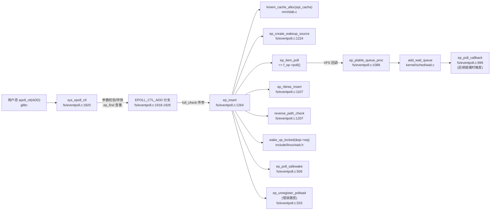

# 每日内核源码分析：ep_insert

- **日期**：2026-08-28
- **子系统**：fs / eventpoll（epoll 子系统）
- **源文件**：fs/eventpoll.c:1264-1386
- **类型**：function（static，epoll_ctl(EPOLL_CTL_ADD) 的核心实现）

---

## 1. 功能作用

`ep_insert` 是 Linux epoll 机制中执行 **EPOLL_CTL_ADD** 操作的核心静态函数，负责将用户指定的目标文件描述符（fd）正式加入到某个 epoll 实例的「兴趣集合」中。其主要职责包括：

1. **资源分配与初始化**：从 `epi_cache` slab 缓存分配 `struct epitem`（epoll 条目），初始化其链表节点、等待队列列表、关联的 epoll 实例和用户事件掩码。
2. **Poll 回调注册**：通过 `ep_item_poll()` 调用目标文件的 `f_op->poll()` 方法，驱动 VFS poll 机制调用 `ep_ptable_queue_proc` 回调，将 `ep_poll_callback` 挂到目标文件所有的等待队列头上。此后目标文件一旦就绪，就会通过该回调把 epitem 推入就绪链表。
3. **双向链接建立**：把新建的 epitem 同时挂到三个容器上：
   - 目标文件 `struct file` 的 `f_ep_links` 链表（用于文件关闭时反向清理）；
   - epoll 实例 `struct eventpoll` 的 `rbr` 红黑树（用于 O(log n) 的查找/删除）；
   - 如果目标文件此刻已经有就绪事件，则同时挂入 `rdllist` 就绪链表。
4. **拓扑安全检查**：当插入的目标文件本身也是一个 epoll fd 时，执行 `reverse_path_check` 检查回环与深度嵌套，防止产生死锁环路。
5. **即时就绪检测与唤醒**：在注册回调的同时通过返回的 `revents` 判断目标是否**已经就绪**，若已就绪则立即放入 rdllist，并唤醒正在 `epoll_wait` 上睡眠的进程。
6. **用户配额计费**：递增当前用户的 `epoll_watches` 计数，与 `max_user_watches`（`/proc/sys/fs/epoll/max_user_watches`） 比较以控制总监控数量。

典型调用场景：用户态调用 `epoll_ctl(epfd, EPOLL_CTL_ADD, fd, &event)` 时，经过 `sys_epoll_ctl` → 参数校验 → 红黑树查重 → **`ep_insert`**。

---

## 2. 关键数据结构

### 2.1 `struct eventpoll` — epoll 实例的主容器（fs/eventpoll.c:180-222）

每个 epoll 文件描述符对应一个实例，存储在 `file->private_data` 中。

| 字段 | 类型 | 含义 |
|---|---|---|
| `lock` | `spinlock_t` | 保护就绪链表/红黑树中 epitem 状态的自旋锁；**必须可在 IRQ 上下文持有**（因为 poll 回调可能来自中断唤醒）。 |
| `mtx` | `struct mutex` | 串行化 epoll_ctl 操作、事件收集循环、文件清理；允许睡眠（因为要 `copy_to_user`）。 |
| `wq` | `wait_queue_head_t` | 阻塞在 `epoll_wait()` 上的进程等待队列。 |
| `poll_wait` | `wait_queue_head_t` | 当 epoll fd 本身被另一个 poll/epoll 监控时使用的等待队列。 |
| `rdllist` | `struct list_head` | **就绪链表头**：所有当前已有事件的 epitem 通过 `rdllink` 链在这。 |
| `rbr` | `struct rb_root` | **红黑树根**：兴趣集合的主索引，以 (file*, fd) 为键实现 O(log n) 查找。 |
| `ovflist` | `struct epitem *` | **溢出单链表**：在向用户态拷贝事件（不能持锁）期间，新就绪的 epitem 先暂存于此，稍后再合并。`EP_UNACTIVE_PTR` 表示未激活。 |
| `ws` | `struct wakeup_source *` | 与系统休眠/唤醒配合，扫描就绪列表期间持有的 wakelock。 |
| `user` | `struct user_struct *` | 创建者用户，用于 `epoll_watches` 配额。 |
| `visited` / `visited_list_link` | `int` / `struct list_head` | ep_loop_check 中标记访问过的节点，避免死循环。 |

> 设计要点：采用三级锁 `epmutex (全局) → ep->mtx → ep->lock`，从上到下顺序获取，避免死锁。

### 2.2 `struct epitem` — 单个被监控 fd 的条目（fs/eventpoll.c:136-173）

epoll 中每 add 一个 (epfd, fd) 对就分配一个 epitem，是红黑树节点和就绪链表节点的**宿主结构**。

```c
struct epitem {
    union {
        struct rb_node  rbn;        /* 在 eventpoll->rbr 中的红黑树节点 */
        struct rcu_head rcu;        /* 释放时用的 RCU 头 */
    };
    struct list_head rdllink;      /* 在 eventpoll->rdllist 中的就绪链节点 */
    struct epitem    *next;        /* 挂入 ovflist 时用的单链 next */
    struct epoll_filefd ffd;       /* = { .file = tfile, .fd = user_fd } */
    int              nwait;        /* 已经挂到多少个目标文件的 wait_queue 上，-1 表示分配失败 */
    struct list_head pwqlist;      /* 挂 eppoll_entry：所有已注册的 poll 等待项 */
    struct eventpoll *ep;          /* 所属 epoll 实例，反向指针 */
    struct list_head fllink;       /* 挂在 tfile->f_ep_links 上，供文件关闭时清理 */
    struct wakeup_source __rcu *ws;/* EPOLLWAKEUP 时的唤醒源 */
    struct epoll_event event;      /* 用户态传入：events 兴趣掩码 + data 回传数据 */
};
```

> 性能考虑：注释明确强调「不要增大这个结构体大小」——高并发服务器单 epoll 实例可能承载数万条目，多一个指针就多一个 cache line。

### 2.3 `struct eppoll_entry` — poll 回调包装（fs/eventpoll.c:225-240）

每调用一次目标文件 poll 方法、每发现一个新的等待队列头，就分配一个 eppoll_entry。它把通用的 `wait_queue_t` 「着色」为 epoll 专用：

- `wait.func = ep_poll_callback` — 就绪时真正被调用的钩子
- `whead` — 记录挂到哪个等待队列头，注销时据此快速移除
- `base` — 回指所属 epitem，通过 `container_of` 取出

### 2.4 `struct ep_pqueue` — poll_table 封装（fs/eventpoll.c:243-246）

VFS 的 poll 框架要求调用方传入 `poll_table`（内部是一个 `_qproc` 函数指针）。epoll 用它把额外的 `epi` 指针捎带给 `ep_ptable_queue_proc`：

```c
struct ep_pqueue {
    poll_table pt;       // ._qproc = ep_ptable_queue_proc
    struct epitem *epi;  // 额外上下文
};
```

### 2.5 `struct epoll_event`（uapi/linux/eventpoll.h）

用户↔内核之间的 ABI 结构，32 位事件掩码 + 64 位用户数据（联合体，可存 fd/ptr/u64）。

### 2.6 全局变量

| 变量 | 说明 |
|---|---|
| `epmutex` | 全局互斥锁；仅在 `eventpoll_release_file`、`ep_free`、以及插入嵌套 epoll 时获取（非常见路径，因此不影响可扩展性）。 |
| `epi_cache` / `pwq_cache` | 分配 epitem / eppoll_entry 的专用 slab 缓存。 |
| `max_user_watches` | 每用户最多可监控 fd 数，可通过 `/proc/sys/fs/epoll/max_user_watches` 调。 |
| `poll_loop_ncalls` / `poll_safewake_ncalls` / `poll_readywalk_ncalls` | 嵌套调用追踪器，防止回环/深度超过 `EP_MAX_NESTS(4)` 引发栈爆。 |

---

## 3. 核心逻辑流程图

```mermaid
flowchart TD
  A[入口 ep_insert<br/>ep,event,tfile,fd,full_check<br/>持 ep->mtx] --> B[用户配额检查<br/>epoll_watches >= max_user_watches?]
  B -->|是| BZ[返回 -ENOSPC]
  B -->|否| C[kmem_cache_alloc(epi_cache, GFP_KERNEL)]
  C -->|失败| CZ[返回 -ENOMEM]
  C -->|成功| D[初始化 epitem<br/>链表/ffd/event/nwait=0/next=EP_UNACTIVE_PTR]
  D --> E{EPOLLWAKEUP 标志?}
  E -->|是| E1[ep_create_wakeup_source<br/>注册 wakeup_source]
  E1 -->|失败| E_ERR[goto error_create_wakeup_source]
  E -->|否| E2[RCU_INIT_POINTER(ws, NULL)]
  E1 -->|成功| F
  E2 --> F

  F[构造 ep_pqueue<br/>pt._qproc=ep_ptable_queue_proc<br/>epq.epi=epi] --> G[调用 ep_item_poll<br/>=> f_op->poll(tfile, &pt)]
  G --> H[=> 驱动回调 ep_ptable_queue_proc<br/>对每个等待队列分配 eppoll_entry<br/>注册 ep_poll_callback<br/>设置 epi->nwait++]
  G --> I[返回 revents 当前就绪位]
  H --> J{nwait < 0?<br/>eppoll_entry 分配失败?}
  J -->|是| J_ERR[goto error_unregister<br/>error=-ENOMEM]
  J -->|否| K

  K[spin_lock(tfile->f_lock)<br/>list_add_tail_rcu(&fllink, tfile->f_ep_links)<br/>spin_unlock] --> L[ep_rbtree_insert(ep, epi)<br/>按 ffd 插入红黑树 O(log n)]

  L --> M{full_check 为真?}
  M -->|是| M1[reverse_path_check<br/>检查 wakeup 路径爆炸]
  M1 -->|失败| M_ERR[goto error_remove_epi error=-EINVAL]
  M -->|否| N
  M1 -->|成功| N

  N[spin_lock_irqsave ep->lock] --> O{revents & event.events<br/>且未入就绪链?}
  O -->|是| O1[list_add_tail rdllist<br/>ep_pm_stay_awake]
  O1 --> O2{wq 有等待者?}
  O2 -->|ep->wq| O3[wake_up_locked(&ep->wq)]
  O2 -->|poll_wait| O4[pwake++]
  O -->|否| P
  O3 --> P
  O4 --> P
  P[spin_unlock_irqrestore] --> Q[atomic_long_inc epoll_watches]
  Q --> R{pwake > 0?}
  R -->|是| R1[ep_poll_safewake(&ep->poll_wait)]
  R -->|否| S[返回 0 成功]
  R1 --> S

  %% ========= 错误回滚路径 =========
  M_ERR --> ER1[从 f_ep_links 删除 fllink<br/>rb_erase 从红黑树删除]
  ER1 --> J_ERR
  J_ERR --> ER2[ep_unregister_pollwait<br/>从所有目标文件等待队列移除 pwq]
  ER2 --> ER3[持有 ep->lock 若已入 rdllist 则 list_del_init]
  ER3 --> ER4[wakeup_source_unregister]
  ER4 --> E_ERR
  E_ERR --> ER5[kmem_cache_free(epi_cache, epi)]
  ER5 --> ER_END[返回 error]
```

### 流程图关键决策点解读

1. **配额检查前置**：`epoll_watches` 检查和 `epi` slab 分配放在最前面，失败就快速返回，避免提前修改任何共享结构。

2. **先注册回调再挂树**：`ep_item_poll()` 在把 epitem 加入红黑树**之前**就已经让 `ep_poll_callback` 可能被触发。设计理由：如果先入树再 poll，中间窗口内的就绪事件会**丢失**；反过来，回调提前发生只会让 epitem 进入「已就绪但还没入树」的状态——后续的 spin_lock 区域会把它并入 rdllist，不会丢事件。

3. **`nwait` 错误码的巧设**：正常时 nwait ≥ 0；一旦任何一次 `kmem_cache_alloc` 失败就置 `nwait = -1`，由 `ep_insert` 统一跳转到 `error_unregister`，避免在回调里处理复杂回滚。

4. **`f_ep_links` 的双向挂钩**：用 RCU 版的 `list_add_tail_rcu` 挂到 `tfile->f_ep_links`，这样当用户进程 `close(fd)` 但忘了 `EPOLL_CTL_DEL` 时，`eventpoll_release_file` 仍能反向遍历这条链把所有相关 epitem 拆掉——这是 epoll 的「防泄漏」设计。

5. **`full_check` 与反向路径检查**：普通文件 ADD 时不做（成本高），只有当被插入目标本身也是 epoll fd，或当前 epoll fd 已被别人监控时，才升级到 `epmutex` 并执行 `reverse_path_check`，防止出现「十万条路径同时唤醒一次用户进程」的 thundering herd 爆炸。

6. **revents 预检查+即时唤醒**：poll 返回的 `revents` 若已满足用户兴趣，则**不等下一次回调**，直接手动把 epitem 挂入 rdllist 并唤醒 `epoll_wait` 的阻塞者。这保证了 `EPOLL_CTL_ADD` 返回后如果目标数据已经可读，用户下一次 `epoll_wait` 会立刻被唤醒而不会错过事件。

---

## 4. 调用关系

### 4.1 调用者（who calls me）

| 调用方 | 所在文件 | 调用场景 |
|---|---|---|
| `SYSCALL_DEFINE4(epoll_ctl)` 的 `EPOLL_CTL_ADD` 分支 | fs/eventpoll.c:1921 | 用户态调用 `epoll_ctl(epfd, EPOLL_CTL_ADD, fd, &ev)`。在查重 (`ep_find`) 确认不存在后调用 `ep_insert`，并根据嵌套与否决定传入 `full_check=0/1`。 |
| 无其他直接调用方 | — | `ep_insert` 是 static，只有 epoll_ctl 系统调用 ADD 路径会用到。 |

> 间接上游：库函数 `epoll_ctl` (glibc) → `sys_epoll_ctl` → 校验 fd/file/ops/poll 存在 → 持 `ep->mtx` → **ep_insert**。

### 4.2 被调用者（who I call）

#### 核心路径调用
| 函数 / 宏 | 所在位置 | 作用 |
|---|---|---|
| `ep_set_ffd(&epi->ffd, tfile, fd)` | eventpoll.c 内联 | 把 `file*` 与用户 fd 打包成 `epoll_filefd`，后续作为红黑树 key。 |
| `ep_create_wakeup_source(epi)` | eventpoll.c:1224 | 当 `EPOLLWAKEUP` 置位时，以被监控文件名注册 `wakeup_source`，在事件就绪时阻止系统进入 suspend。 |
| `init_poll_funcptr(&epq.pt, ep_ptable_queue_proc)` | include/linux/poll.h | 初始化 poll_table 的回调钩子为 `ep_ptable_queue_proc`。 |
| `ep_item_poll(epi, &epq.pt)` | eventpoll.c 内联展开 | 实际调用 `tfile->f_op->poll(tfile, &pt)`，遍历驱动/子系统注册的所有等待队列头并触发回调；同时返回当前就绪位图。 |
| `ep_ptable_queue_proc(file, whead, pt)` | eventpoll.c:1088 | **VFS poll 回调**：每发现一个等待队列就分配 `eppoll_entry`，设置 `func=ep_poll_callback`，调用 `add_wait_queue` 注册；维护 `epi->nwait`。 |
| `ep_rbtree_insert(ep, epi)` | eventpoll.c:1107 | 以 `ep_cmp_ffd(ffd)` 比较 (file*, fd)，按 BST 规则找到位置，插入红黑树。 |
| `reverse_path_check()` | eventpoll.c:1207 | 深度优先遍历已收集的非 epoll 目标文件，计算从任意唤醒源到当前用户进程的路径条数上限；超过阈值返回 -1 拒绝插入。 |
| `ep_pm_stay_awake(epi)` | eventpoll.c 内联 | 如果 epitem 上有 wakeup_source，调用 `__pm_stay_awake` 增加引用计数，阻止系统休眠。 |
| `wake_up_locked(&ep->wq)` | include/linux/wait.h | 在已经持有 `ep->lock` 的情况下，唤醒 epoll_wait 的等待者。 |
| `ep_poll_safewake(&ep->poll_wait)` | eventpoll.c:506 | 使用 `ep_call_nested` 安全地唤醒外部 poll/epoll 监控者，避免嵌套过深死循环。 |
| `atomic_long_inc(&ep->user->epoll_watches)` | 原子操作 | 用户监控计数 +1。 |

#### 辅助调用
- `kmem_cache_alloc / kmem_cache_free` (slab.c) — epitem 分配释放
- `list_add_tail_rcu / list_del_rcu / list_del_init` (list.h) — 链表操作
- `spin_lock_irqsave / spin_unlock_irqrestore` (spinlock) + `spin_lock(&tfile->f_lock)` — 多把锁的精细组合
- `RCU_INIT_POINTER / rcu_assign_pointer` — wakeup_source 的 RCU 赋值

#### 宏 / 内联（影响语义/性能）
- `EP_PRIVATE_BITS = EPOLLWAKEUP \| EPOLLONESHOT \| EPOLLET` — 内核私有的 3 位，不与标准事件冲突
- `EP_UNACTIVE_PTR = (void*)-1L` — 用作 ovflist / epi->next 的「未激活」哨兵
- `ep_item_from_wait(wait)` / `ep_item_from_epqueue(pt)` — 通过 `container_of` 从 wait_queue_t 或 poll_table 反向取出 epitem，热路径。

### 4.3 调用关系图（Mermaid）



---

## 5. 易错点 / 边界场景 / 设计权衡

### (1) 先 poll 注册，后入树 —— 避免丢事件
这是最容易被忽略的设计。初学者会写「先入树再 poll」，但那样会在「入树成功」和「第一次 poll()」之间漏掉中断触发的事件。epoll 采用「回调可以提前开火」的策略，并在后续持锁阶段用 `ep_is_linked` 幂等检查把结果合并进 rdllist。

### (2) 三级锁层次与不同上下文
- `epmutex`（全局 mutex，极低频）：跨实例拓扑检查。
- `ep->mtx`（per-epoll mutex）：epoll_ctl 三操作、事件拷贝到用户态。因为会 `copy_to_user` 可能睡眠，不能用自旋锁。
- `ep->lock`（per-epoll spinlock_irqsave）：就绪链表、ovflist 操作，回调函数里必须用。**IRQ-safe** 是硬要求——网卡收包中断里 wake_up 也会调到 `ep_poll_callback`。

错误顺序（如先拿 `lock` 再拿 `mtx`）会直接 ABBA 死锁。

### (3) `f_ep_links` 与 close 未 DEL 的泄漏防护
很多应用 `close(fd)` 前忘了 `EPOLL_CTL_DEL`。epoll 的策略是把每个 epitem 也反向挂入 `tfile->f_ep_links`。`__fput` 在文件引用计数归零时调用 `eventpoll_release_file`，遍历该链表替用户执行等效 DEL，从而不会泄漏 `struct epitem` 内存，也不会留下悬空指针。

### (4) POLLERR / POLLHUP 的无条件 OR
`sys_epoll_ctl` 在进入 `ep_insert` 前，把用户 events **强制 OR** 了 `POLLERR | POLLHUP`。这意味着用户不需要显式关心错误和挂起，epoll 总会报告它们。常见陷阱：用户掩码检查时忘了这两个位会自动进来。

### (5) 嵌套 epoll 与 reverse_path_check 的性能取舍
当 A→epoll(B)→epoll(C)→file 嵌套时，一次文件就绪会沿整条链唤醒，路径数是组合爆炸。`full_check` 只在有嵌套可能时才开启（`!list_empty(&f.file->f_ep_links) || is_file_epoll(tf.file)`），普通 insert 完全不走，避免 99% 场景下的 O(n) 路径扫描。

### (6) nwait = -1 的错误传递
`ep_ptable_queue_proc` 是 VFS 回调，返回 void 无法传错误码。它用「污染 `epi->nwait = -1`」的方式把错误状态带回去，外层 `ep_insert` 在 poll 返回后统一检查一次即可 clean rollback，避免在回调中做任何 rollback（这会非常麻烦，因为 VFS 可能还持有多个锁）。

### (7) EPOLLWAKEUP 与 RCU 释放顺序
错误路径 `error_create_wakeup_source` 之前会先 `wakeup_source_unregister`，然后才 `kmem_cache_free(epi)`；而 ep_destroy_wakeup_source 里特意 `synchronize_rcu`。这是因为 `ep_poll_callback` 运行中可能 rcu_dereference epi->ws，释放必须等待宽限期结束。

---

## 附：核心源码片段

```c
// fs/eventpoll.c:1264-1386  （Linux 4.4.302, torvalds/linux @ v4.4）
/*
 * Must be called with "mtx" held.
 */
static int ep_insert(struct eventpoll *ep, struct epoll_event *event,
		     struct file *tfile, int fd, int full_check)
{
	int error, revents, pwake = 0;
	unsigned long flags;
	long user_watches;
	struct epitem *epi;
	struct ep_pqueue epq;

	user_watches = atomic_long_read(&ep->user->epoll_watches);
	if (unlikely(user_watches >= max_user_watches))
		return -ENOSPC;
	if (!(epi = kmem_cache_alloc(epi_cache, GFP_KERNEL)))
		return -ENOMEM;

	/* Item initialization follow here ... */
	INIT_LIST_HEAD(&epi->rdllink);
	INIT_LIST_HEAD(&epi->fllink);
	INIT_LIST_HEAD(&epi->pwqlist);
	epi->ep = ep;
	ep_set_ffd(&epi->ffd, tfile, fd);
	epi->event = *event;
	epi->nwait = 0;
	epi->next = EP_UNACTIVE_PTR;
	if (epi->event.events & EPOLLWAKEUP) {
		error = ep_create_wakeup_source(epi);
		if (error)
			goto error_create_wakeup_source;
	} else {
		RCU_INIT_POINTER(epi->ws, NULL);
	}

	/* Initialize the poll table using the queue callback */
	epq.epi = epi;
	init_poll_funcptr(&epq.pt, ep_ptable_queue_proc);

	/*
	 * Attach the item to the poll hooks and get current event bits.
	 * We can safely use the file* here because its usage count has
	 * been increased by the caller of this function. Note that after
	 * this operation completes, the poll callback can start hitting
	 * the new item.
	 */
	revents = ep_item_poll(epi, &epq.pt);

	/*
	 * We have to check if something went wrong during the poll wait queue
	 * install process. Namely an allocation for a wait queue failed due
	 * high memory pressure.
	 */
	error = -ENOMEM;
	if (epi->nwait < 0)
		goto error_unregister;

	/* Add the current item to the list of active epoll hook for this file */
	spin_lock(&tfile->f_lock);
	list_add_tail_rcu(&epi->fllink, &tfile->f_ep_links);
	spin_unlock(&tfile->f_lock);

	/*
	 * Add the current item to the RB tree. All RB tree operations are
	 * protected by "mtx", and ep_insert() is called with "mtx" held.
	 */
	ep_rbtree_insert(ep, epi);

	/* now check if we've created too many backpaths */
	error = -EINVAL;
	if (full_check && reverse_path_check())
		goto error_remove_epi;

	/* We have to drop the new item inside our item list to keep track of it */
	spin_lock_irqsave(&ep->lock, flags);

	/* If the file is already "ready" we drop it inside the ready list */
	if ((revents & event->events) && !ep_is_linked(&epi->rdllink)) {
		list_add_tail(&epi->rdllink, &ep->rdllist);
		ep_pm_stay_awake(epi);

		/* Notify waiting tasks that events are available */
		if (waitqueue_active(&ep->wq))
			wake_up_locked(&ep->wq);
		if (waitqueue_active(&ep->poll_wait))
			pwake++;
	}

	spin_unlock_irqrestore(&ep->lock, flags);

	atomic_long_inc(&ep->user->epoll_watches);

	/* We have to call this outside the lock */
	if (pwake)
		ep_poll_safewake(&ep->poll_wait);

	return 0;

error_remove_epi:
	spin_lock(&tfile->f_lock);
	list_del_rcu(&epi->fllink);
	spin_unlock(&tfile->f_lock);

	rb_erase(&epi->rbn, &ep->rbr);

error_unregister:
	ep_unregister_pollwait(ep, epi);

	spin_lock_irqsave(&ep->lock, flags);
	if (ep_is_linked(&epi->rdllink))
		list_del_init(&epi->rdllink);
	spin_unlock_irqrestore(&ep->lock, flags);

	wakeup_source_unregister(ep_wakeup_source(epi));

error_create_wakeup_source:
	kmem_cache_free(epi_cache, epi);

	return error;
}
```
