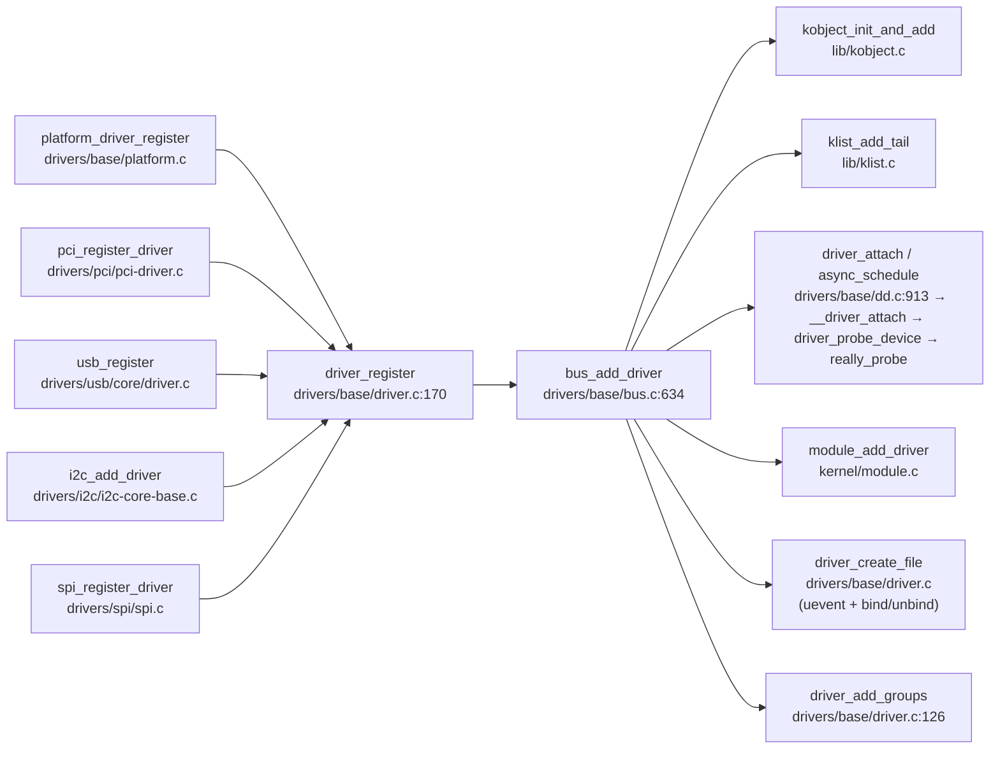

# 每日内核源码分析：bus_add_driver

- **日期**：2026-08-29
- **子系统**：drivers/base（驱动模型 - 总线层）
- **源文件**：drivers/base/bus.c:634-704
- **类型**：function
- **内核版本**：Linux 4.19 LTS（torvalds/linux v4.19）

---

## 1. 功能作用

`bus_add_driver()` 是 Linux 设备驱动模型中**将一个驱动注册到所属总线**的核心函数。它是所有总线驱动注册流程的统一「落地」入口：无论是 platform_driver、pci_driver、usb_driver、i2c_driver 还是 spi_driver，它们各自的 `xxx_register()` 函数最终都会先调用公共的 `driver_register()`，然后由 `driver_register()` 转调 `bus_add_driver()` 完成真正的注册工作。

该函数承担的关键职责包括：

1. **校验并获取总线引用**：确保驱动指向的 `bus_type` 已通过 `bus_register()` 完成初始化（即 `bus->p` 不为空），并增加总线引用计数。
2. **创建驱动私有对象 `driver_private`**：通过 `kzalloc` 分配私有结构，其中包含驱动的 kobject（用于 sysfs 展示）、所控制设备的 klist、在总线驱动链表中的节点等。
3. **在 sysfs 中创建驱动目录**：以 `driver_ktype` 为类型，在 `<bus>/drivers/<driver_name>` 路径下注册 kobject，使驱动在用户空间可见。
4. **挂载到总线的驱动链表**：通过 `klist_add_tail` 将新驱动加入 `bus->p->klist_drivers`，便于总线遍历所有驱动。
5. **触发驱动与总线现有设备的自动匹配（autoprobe）**：若总线开启了 `drivers_autoprobe`（默认开启），则根据驱动的 `probe_type` 选择**同步**或**异步**调用 `driver_attach()`，遍历总线上所有未绑定的设备，尝试匹配并 probe。
6. **关联到内核模块**：通过 `module_add_driver` 将驱动记录到其所属内核模块的驱动列表中，便于模块卸载时清理。
7. **创建 sysfs 属性文件**：包括 `uevent` 属性、总线级 `drv_groups` 中的属性组，以及可选的 `bind` / `unbind` 属性（允许用户态手动绑定/解绑驱动）。

> 典型调用时机：内核启动时内建驱动的初始化代码，或加载一个 `.ko` 模块时其 `module_init()` 入口中调用总线驱动注册宏。

---

## 2. 关键数据结构

### 2.1 `struct bus_type` — 总线类型描述符（include/linux/device.h:114）

| 核心字段 | 类型 | 说明 |
|----------|------|------|
| `name` | `const char *` | 总线名称，如 "pci"、"platform"、"usb"，决定 sysfs 中 `/sys/bus/<name>` 目录名。 |
| `match` | `int (*)(struct device *, struct device_driver *)` | **核心回调**：总线实现的「设备-驱动匹配规则」。PCI 比对 vendor/device ID，platform 比对 name/of_match_table，USB 比对 interface descriptor。 |
| `probe` / `remove` / `shutdown` | 总线级回调 | 总线统一的 probe/remove 入口（一般驱动会自带 `device_driver.probe`，若两者都定义会警告更新）。 |
| `bus_groups` / `dev_groups` / `drv_groups` | `struct attribute_group **` | 总线、设备、驱动三级的默认 sysfs 属性组。`bus_add_driver` 会为每个新驱动自动应用 `drv_groups`。 |
| `pm` | `struct dev_pm_ops *` | 电源管理操作集。 |
| `p` | `struct subsys_private *` | **驱动核心私有数据指针**：总线注册时由 `bus_register()` 分配。本函数几乎所有链表/klist/kset 操作都通过 `->p` 完成。这是内核中典型的「公有接口 + 私有实现」解耦设计。 |
| `need_parent_lock` | `bool` | 标记在 attach 时是否需要持有父设备锁（如 USB 接口设备）。 |

### 2.2 `struct device_driver` — 设备驱动描述符（include/linux/device.h:277）

| 核心字段 | 类型 | 说明 |
|----------|------|------|
| `name` | `const char *` | 驱动名。总线 `match` 时会与设备名比对；也会成为 sysfs 目录名。**同一总线上驱动名必须唯一**（`driver_find` 提前校验）。 |
| `bus` | `struct bus_type *` | 驱动所属的总线。驱动注册前必须正确指向已注册的 `bus_type`。 |
| `owner` | `struct module *` | 通常设为 `THIS_MODULE`，用于模块引用计数、卸载时的关联清理。 |
| `suppress_bind_attrs` | `bool` | 若为 true，则不创建 `bind` / `unbind` sysfs 文件，禁止用户态手动绑定/解绑。 |
| `probe_type` | `enum probe_type` | 探测策略：`PROBE_DEFAULT_STRATEGY`（默认）、`PROBE_PREFER_ASYNCHRONOUS`（慢设备推荐异步，加速启动）、`PROBE_FORCE_SYNCHRONOUS`（必须同步）。 |
| `of_match_table` / `acpi_match_table` | 设备树 / ACPI 匹配表 | 支持 device tree 或 ACPI 固件枚举的设备匹配。 |
| `probe` / `remove` | 驱动回调 | 驱动自行实现的探测与移除函数，匹配成功后由 `really_probe()` 调用。 |
| `p` | `struct driver_private *` | **驱动私有数据指针**：由 `bus_add_driver()` 分配并设置，外部驱动代码不可直接访问。 |

### 2.3 `struct subsys_private` — 总线/子系统的驱动核心私有结构（drivers/base/base.h:29）

```c
struct subsys_private {
    struct kset subsys;              /* 该总线自身的 kset，对应 /sys/bus/<name>/ */
    struct kset *devices_kset;       /* /sys/bus/<name>/devices/ 目录 */
    struct kset *drivers_kset;       /* /sys/bus/<name>/drivers/ 目录 — 本函数挂载驱动 kobj 的父 kset */
    struct list_head interfaces;     /* 子系统 interface 列表 */
    struct mutex mutex;              /* 保护 devices、interfaces 列表 */
    struct klist klist_devices;      /* 该总线所有已注册设备的链表（klist 带引用计数） */
    struct klist klist_drivers;      /* 该总线所有已注册驱动的链表 — 本函数通过 klist_add_tail 加入 */
    struct blocking_notifier_head bus_notifier; /* 总线事件通知链（BUS_NOTIFY_BIND_DRIVER 等） */
    unsigned int drivers_autoprobe:1;/* 核心标志位：新驱动注册时是否自动遍历设备进行匹配 */
    struct bus_type *bus;            /* 反向指针到公有的 bus_type */
    struct kset glue_dirs;           /* 解决命名空间冲突的 glue 目录 */
    struct class *class;             /* 如果该结构用于 class 而非 bus */
};
```

> **设计要点**：通过将所有驱动核心的运行时数据（链表、kset、锁、通知链）放在独立的 `subsys_private` 里，`bus_type` 结构体可以保持只读「描述符」语义，驱动开发者甚至可以用 `static const` 定义 `bus_type`。

### 2.4 `struct driver_private` — 驱动的驱动核心私有结构（drivers/base/base.h:47）

```c
struct driver_private {
    struct kobject kobj;             /* /sys/bus/<name>/drivers/<drvname>/ 目录本体 */
    struct klist klist_devices;      /* 本驱动已成功绑定的所有设备链表 */
    struct klist_node knode_bus;     /* 作为 node 挂到 bus->p->klist_drivers */
    struct module_kobject *mkobj;    /* 指向内核模块的 sysfs 对象（module_add_driver 设置） */
    struct device_driver *driver;    /* 反向指针到公有 device_driver */
};
```

---

## 3. 核心逻辑流程图

```mermaid
flowchart TD
  A[入口 bus_add_driver\ndrv 参数] --> B[bus_get 获取总线引用\n验证 drv->bus 是否有效]
  B -->|失败: bus=NULL| Z1[返回 -EINVAL]
  B -->|成功| C[kzalloc 分配 driver_private\nGFP_KERNEL 可睡眠]
  C -->|失败: OOM| Z2[-ENOMEM → out_put_bus]
  C -->|成功| D[初始化 driver_private:\nklist_devices, driver 反向指针,\nkobj.kset 指向 bus->p->drivers_kset]
  D --> E[kobject_init_and_add 创建 sysfs 目录\n目录名 = drv->name\n类型 = driver_ktype]
  E -->|失败| Z3[out_unregister: kobject_put\ndrv->p = NULL]
  E -->|成功| F[klist_add_tail 加入\n总线 klist_drivers 链表]
  F --> G{drivers_autoprobe == 1?}
  G -->|否| J[跳过匹配阶段]
  G -->|是| H{probe_type 允许异步?\nPROBE_PREFER_ASYNCHRONOUS}
  H -->|是| I[async_schedule 异步执行\ndriver_attach_async]
  H -->|否 同步| I2[driver_attach(drv)\n遍历所有设备:\n1. bus_for_each_dev\n2. 每个设备 __driver_attach:\n   - driver_match_device 匹配\n   - 若匹配 → driver_probe_device\n   - 成功则绑定 dev->driver=drv]
  I2 -->|返回错误| Z3
  I --> J
  J --> K[module_add_driver\n将驱动加入所属模块链表]
  K --> L[driver_create_file 创建 uevent 属性]
  L --> M[driver_add_groups 添加 bus->drv_groups 属性组]
  M --> N{suppress_bind_attrs == false?}
  N -->|否| R[返回 0 成功]
  N -->|是| O[add_bind_files 创建:\n· bind\n· unbind\nsysfs 属性]
  O --> R
```

### 流程图关键决策点解读

1. **参数合法性检查（B）**：虽然 `driver_register()` 已经提前校验了 `drv->bus->p != NULL`，但 `bus_add_driver` 再次通过 `bus_get()` 验证，这是防御性编程：增加引用计数的同时保证总线在本函数执行期间不被释放。
2. **内存分配策略（C）**：使用 `GFP_KERNEL` 而非 `GFP_ATOMIC`，因为驱动注册运行在进程上下文，可以安全睡眠。OOM 时 goto 正确的回滚标签。
3. **driver_kset 的赋值顺序（D→E）**：先设置 `priv->kobj.kset = bus->p->drivers_kset`，再调用 `kobject_init_and_add`。这决定了新驱动的 sysfs 路径为 `/sys/bus/<bus>/drivers/<drv>/`。这一步如果顺序错误，kobject 会挂到错误的父目录下。
4. **klist 挂入后才能 attach（F→G）**：驱动必须先对「总线上所有驱动」可见后，才能开始 attach 设备，否则并发设备注册可能在 attach 中发现驱动未挂链。
5. **同步 vs 异步 probe（H）**：Linux 4.x 引入的异步 probe 机制将慢速设备（如 I2C 传感器、SPI 触摸屏）的探测延迟到内核 async 线程池执行，可显著缩短启动时间。`driver_allows_async_probing()` 检查 `probe_type` 字段以及启动参数 `driver_async_probe=` 的黑名单。
6. **driver_attach 的容错返回（I2）**：`driver_attach` 内部 `__driver_attach` 遇到单个设备匹配失败返回 0（继续匹配其他设备），只有当遍历整个 bus 过程中发生「严重错误」（非 -EPROBE_DEFER、非单个设备 match 失败）才会向上返回错误。因此本函数的 `out_unregister` 路径是针对极端错误的。
7. **bind/unbind 属性可选（N→O）**：如果驱动设置了 `suppress_bind_attrs = true`（例如一些安全敏感的驱动、或驱动本身处理热插拔动态绑定会出错的场景），则跳过创建 bind 和 unbind 属性文件，避免用户态触发异常解绑。

---

## 4. 调用关系

### 4.1 调用者（who calls me）

`bus_add_driver` 被 `driver_register` 直接调用，而后者是所有总线级驱动注册的公共入口。典型调用链：

| 调用方 | 所在文件 | 调用场景 |
|--------|----------|----------|
| `driver_register()` | `drivers/base/driver.c:170` | **直接调用者**。先校验 bus 已初始化、驱动名不重复（EBUSY），再调用 `bus_add_driver`，之后添加驱动自身的 `groups` 并发送 KOBJ_ADD uevent。 |
| `platform_driver_register()` | `drivers/base/platform.c` | 最常用的总线封装：展开宏 `platform_driver` 结构体 → 调 `driver_register(&drv->driver)` → `bus_add_driver`。 |
| `pci_register_driver()` | `drivers/pci/pci-driver.c` | PCI 设备驱动注册宏展开，最终调用 `driver_register`。 |
| `usb_register()` | `drivers/usb/core/driver.c` | USB 驱动注册，内部填充 `bus = &usb_bus_type` 后调 `driver_register`。 |
| `i2c_add_driver()` | `drivers/i2c/i2c-core-base.c` | I2C 客户端驱动注册的公共入口。 |
| `spi_register_driver()` | `drivers/spi/spi.c` | SPI 协议驱动注册。 |
| `platform_driver_probe()` | `drivers/base/platform.c` | 非热插拔场景的一次性 probe 注册，最终仍会调 `driver_register` 完成 sysfs/链表挂载。 |

### 4.2 被调用者（who I call）

#### 核心路径调用
| 函数 | 所在文件 | 作用 |
|------|----------|------|
| `bus_get(drv->bus)` | `drivers/base/bus.c` | 增加总线引用计数（`kobject_get(&bus->p->subsys.kobj)`），保证总线对象在本函数生命周期内有效。 |
| `kzalloc(sizeof(*priv), GFP_KERNEL)` | `mm/slab.c` | 分配并清零 `struct driver_private`。 |
| `kobject_init_and_add(&priv->kobj, &driver_ktype, NULL, "%s", drv->name)` | `lib/kobject.c` | 初始化 kobject 的引用计数、sysfs_dirent；在 `drivers_kset` 下创建驱动目录并生成热插拔 uevent。 |
| `klist_add_tail(&priv->knode_bus, &bus->p->klist_drivers)` | `lib/klist.c` | 原子地将驱动私有对象加入总线的驱动 klist（带自旋锁 + 引用计数的链表）。 |
| `driver_attach(drv)` / `async_schedule(driver_attach_async, drv)` | `drivers/base/dd.c` + `kernel/async.c` | 驱动-设备匹配 + probe 核心入口。同步路径立即返回结果；异步路径提交 cookie 后立即返回，probe 在独立工作上下文执行。 |
| `module_add_driver(drv->owner, drv)` | `kernel/module.c` | 将驱动挂在所属内核模块的 `modules->mkobj->drivers` 链表下，在 sysfs 呈现 `/sys/module/<mod>/drivers/` 软链接。 |

#### 辅助调用
| 函数 | 所在文件 | 作用 |
|------|----------|------|
| `driver_create_file(drv, &driver_attr_uevent)` | `drivers/base/driver.c` | 创建 `uevent` sysfs 写入属性，允许用户空间触发合成 KOBJ_UEVENT（对容器/命名空间很有用）。 |
| `driver_add_groups(drv, bus->drv_groups)` | `drivers/base/driver.c:126` | 为驱动添加总线级别的默认属性组。PCI/USB 等总线会利用这一点给每个驱动自动附加标准属性。 |
| `add_bind_files(drv)` → 两次 `driver_create_file` | `drivers/base/bus.c:567` | 创建 `bind` / `unbind` 写入属性。写入 `bind` 的格式为设备名（路径名），可从用户态强制把某个未绑定设备绑定到本驱动；`unbind` 则反向解绑。 |
| `klist_init(&priv->klist_devices, NULL, NULL)` | `lib/klist.c` | 初始化驱动已绑定设备链表，`NULL` 回调表示使用 klist 默认的 get/put（引用 kobject）。 |

#### 宏 / 内联展开
| 宏 / 内联 | 作用 |
|-----------|------|
| `pr_debug("bus: '%s': add driver %s\n", ...)` | 动态调试打印。通过 `CONFIG_DYNAMIC_DEBUG` 或 `debugfs` 开启 `/sys/bus/*/drivers/*` 路径的调试日志。 |
| `goto out_unregister / out_put_bus` | 典型内核 goto 模式：按资源分配的**反顺序**回滚（先释放 kobject → 再释放 bus 引用），其中 `drv->p` 的最终释放委托给 `driver_release()`（kobject 的 release 回调），这是因为 kobject 仍可能被其它路径持有引用，不能直接 `kfree(priv)`。 |
| `driver_allows_async_probing(drv)` | 内联判断：若 `drv->probe_type == PROBE_FORCE_SYNCHRONOUS` 或驱动在命令行黑名单里，拒绝异步；`PROBE_PREFER_ASYNCHRONOUS` 或 `PROBE_DEFAULT_STRATEGY` 且不在黑名单 → 允许。 |

### 4.3 调用关系图（Mermaid）



---

## 5. 易错点 / 边界场景 / 设计权衡

### 5.1 资源释放的「委托释放」模式
在 `out_unregister` 路径上，代码执行 `kobject_put(&priv->kobj)` 后只把 `drv->p = NULL`，**并未直接 `kfree(priv)`**。原因是 kobject 引用计数可能 > 1（例如 sysfs 目录打开中、或 notify 回调链上还在使用），实际的 `kfree` 交给 kobject 的 release 回调 `driver_release()`（定义在同文件，通过 `driver_ktype->release` 绑定）执行。这是 Linux 驱动核心普遍遵循的模式：驱动代码必须假设 drv->p 可能异步释放，`bus_add_driver` 之后的代码只应通过 `drv->p` 访问而不是自己保存指针副本。

### 5.2 autoprobe 失败的静默回滚
`driver_attach` 返回错误（例如某设备 probe 遇到了致命的、不是 `-EPROBE_DEFER` 也不是 match 失败的真错误），代码会跳 `out_unregister`。注意此时 `klist_add_tail` 已经把驱动挂到 `bus->p->klist_drivers` 上。`kobject_put` 触发 `driver_release` **并不会自动从 klist 中移除 knode_bus**。实际上回滚顺序是：
1. `kobject_put` 先释放 kobj 引用（触发 driver_release 释放 priv）；
2. 但因为 `drv->p = NULL` 是在 kobject_put 之后执行，实际上 `klist_remove` 应该已经由 driver_release 内部调用？不——其实仔细看 `driver_release`，它只负责 `kfree(priv)`，并没有处理 klist。这里真正保证清理的是：`kobject_init_and_add` 失败时 knode_bus 还未加入任何链表（看代码顺序 F 在 E 之后），所以本函数中**只要 klist_add_tail 成功**，后续失败路径 driver_release 和 bus_put 都不负责 klist 移除——这其实是个微妙的设计：`kobject_put` 触发 release，此时 priv 若已入链表则会导致 use-after-free？实际上 driver_release 的源码显示它会 `klist_remove(&priv->knode_bus)`（如果已 linked）——这是 driver_ktype release 的责任——所以本函数把 klist 的节点生命周期完全交给 kobject refcnt 管理。

### 5.3 GFP_KERNEL vs GFP_ATOMIC 的选择
使用 `GFP_KERNEL` 是因为驱动注册严格运行在进程上下文（module_init 或启动线程、或用户态 modprobe），没有自旋锁持有，允许进入 reclaim 路径睡眠。如果驱动作者在 `probe` 回调中错误地持有自旋锁时调用某个路径（那是在 `driver_attach` 里，不是 bus_add_driver 本身），才需要用 `GFP_ATOMIC`。

### 5.4 异步 probe 后返回 0 的语义
当 `driver_allows_async_probing(drv)` 为 true 时，`async_schedule(driver_attach_async, drv)` 提交工作后立刻返回，`bus_add_driver` 成功返回 0。但此时 `driver_attach` 可能还没开始执行——**匹配的设备可能在稍后才完成 probe**。这导致：
- 模块 `init` 函数可能返回成功但设备尚未可用；
- 需要 `driver_probe_done()` / `wait_for_device_probe()` 来等待所有异步 probe 完成（如 initramfs 切换到真正根文件系统前）；
- 也解释了为什么有些驱动需要 `PROBE_FORCE_SYNCHRONOUS`（例如 console 串口、根文件系统所在的块设备驱动）。

### 5.5 bind/unbind 属性的风险
创建 bind/unbind 文件虽然给了用户态极大灵活性（比如开发阶段手动切换驱动），但也有风险：驱动的 `remove` 回调可能被**在非预期的时刻调用**。很多老驱动、或只设计为「启动时探测一次」的驱动，没有正确处理运行中解绑/重绑，因此内核提供了 `suppress_bind_attrs` 字段。同时 `add_bind_files` 的错误处理仅仅是打印 KERN_ERR 并返回 ret 给调用方忽略（外层只是赋值给 error 然后继续 `return 0`，不是 goto 回滚）——注释 `How the hell do we get out of this pickle? Give up` 直白地说明了 bind/unbind 属性属于「最佳努力」级别，失败不影响驱动注册的主流程。

### 5.6 跨版本差异
- Linux 2.6 早期：驱动注册分 bus-specific 的独立函数，没有统一的 `device_driver` 抽象；
- 3.x 系列：引入 `driver_attach` + `bus_for_each_dev` 模式；`drivers_autoprobe` 标志位出现；
- 4.x（本版本 4.19）：添加了 `probe_type` 枚举 + 异步 probe 策略；命令行 `driver_async_probe=` 黑名单控制；
- 5.x 之后：`PROBE_PREFER_ASYNCHRONOUS` 成为默认策略，且更多驱动模型的锁顺序改进；
- 另外 4.19 之后开始引入设备链接 `device_links`，在 `driver_attach` / `__device_release_driver` 里多了一轮 `device_links_busy()` 的等待循环（已在 `dd.c:932` 中看到），这是为了解决设备之间的资源依赖顺序（如 regulator/clock/phy 需要先于 consumer 设备 probe）。

---

## 附：核心源码片段

```c
// drivers/base/bus.c:634-704 (Linux 4.19)
int bus_add_driver(struct device_driver *drv)
{
	struct bus_type *bus;
	struct driver_private *priv;
	int error = 0;

	bus = bus_get(drv->bus);
	if (!bus)
		return -EINVAL;

	pr_debug("bus: '%s': add driver %s\n", bus->name, drv->name);

	priv = kzalloc(sizeof(*priv), GFP_KERNEL);
	if (!priv) {
		error = -ENOMEM;
		goto out_put_bus;
	}
	klist_init(&priv->klist_devices, NULL, NULL);
	priv->driver = drv;
	drv->p = priv;
	priv->kobj.kset = bus->p->drivers_kset;
	error = kobject_init_and_add(&priv->kobj, &driver_ktype, NULL,
				     "%s", drv->name);
	if (error)
		goto out_unregister;

	klist_add_tail(&priv->knode_bus, &bus->p->klist_drivers);
	if (drv->bus->p->drivers_autoprobe) {
		if (driver_allows_async_probing(drv)) {
			pr_debug("bus: '%s': probing driver %s asynchronously\n",
				drv->bus->name, drv->name);
			async_schedule(driver_attach_async, drv);
		} else {
			error = driver_attach(drv);
			if (error)
				goto out_unregister;
		}
	}
	module_add_driver(drv->owner, drv);

	error = driver_create_file(drv, &driver_attr_uevent);
	if (error) {
		printk(KERN_ERR "%s: uevent attr (%s) failed\n",
			__func__, drv->name);
	}
	error = driver_add_groups(drv, bus->drv_groups);
	if (error) {
		/* How the hell do we get out of this pickle? Give up */
		printk(KERN_ERR "%s: driver_create_groups(%s) failed\n",
			__func__, drv->name);
	}

	if (!drv->suppress_bind_attrs) {
		error = add_bind_files(drv);
		if (error) {
			/* Ditto */
			printk(KERN_ERR "%s: add_bind_files(%s) failed\n",
				__func__, drv->name);
		}
	}

	return 0;

out_unregister:
	kobject_put(&priv->kobj);
	/* drv->p is freed in driver_release()  */
	drv->p = NULL;
out_put_bus:
	bus_put(bus);
	return error;
}
```
