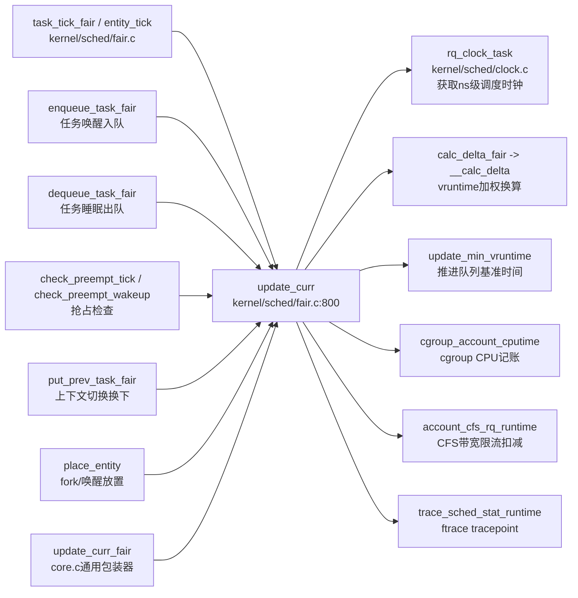

# 每日内核源码分析：update_curr

- **日期**：2026-08-30
- **子系统**：kernel/sched (CFS 调度器)
- **源文件**：kernel/sched/fair.c:800-833
- **类型**：function

---

## 1. 功能作用

`update_curr()` 是 Linux 内核 CFS（Completely Fair Scheduler，完全公平调度器）中**最核心的统计更新函数**，负责更新当前正在 CPU 上运行的调度实体（sched_entity）的运行时间统计信息。

它的核心职责可以概括为以下四点：

1. **累计物理运行时间（delta_exec）**：计算自上次统计更新以来当前实体实际在 CPU 上执行的时间差（纳秒级精度），并将其累加到 `sum_exec_runtime` 总运行时间中。
2. **推进虚拟运行时间（vruntime）**：根据任务的权重（`load.weight`，即 nice 值对应的优先级权重）将物理时间 delta_exec **按比例折算**为虚拟时间增量，并累加到 `se->vruntime`。这是 CFS "完全公平" 的数学基础——高权重（高优先级，nice 值小）的任务 vruntime 增长更慢，从而在红黑树中获得更靠前的位置，分得更多 CPU 时间。
3. **维护 cfs_rq 基准时间**：调用 `update_min_vruntime()` 更新 CFS 运行队列的最小虚拟运行时间 `min_vruntime`，这是整个队列所有调度决策的时间基准线，确保新入队或唤醒的任务不会因 vruntime 过旧而"占便宜"。
4. **辅助统计与记账**：更新最大单次执行时间 `exec_max`、CFS 队列执行时钟 `exec_clock`、向 cgroup 上报 CPU 时间、处理 CFS 带宽限流 runtime 扣减等。

**典型调用场景**：`update_curr` 被 CFS 调度类的几乎所有关键操作在开头处调用，包括：调度周期 tick（`task_tick_fair`）、任务入队/出队（`enqueue_task_fair` / `dequeue_task_fair`）、抢占检查（`check_preempt_tick`、`check_preempt_wakeup`）、选择下一个任务前后（`put_prev_task_fair` / `set_next_task_fair`）、以及 fork 新建任务的初始放置（`place_entity`）。可以说：**只要 CFS 的调度状态要发生变化，第一步一定是先"结算"当前任务的运行时间**，这就是 `update_curr` 的角色。

---

## 2. 关键数据结构

### 2.1 `struct sched_entity` — 调度实体 (include/linux/sched.h:396-426)

这是 CFS 中可被调度的基本抽象单元（既可以是单个 task_struct，也可以是 task_group 组调度实体），`update_curr` 的所有操作几乎都围绕它展开：

| 核心字段 | 类型 | 在 update_curr 中的作用 |
|----------|------|-------------------------|
| `load` | `struct load_weight` | 任务的权重，决定 vruntime 的折算比例。nice=0 对应 NICE_0_LOAD (1024)。nice 值越低权重越高 |
| `exec_start` | `u64` | **本次开始运行的时间戳**（ns）。update_curr 用它和当前时钟相减得出 delta_exec |
| `sum_exec_runtime` | `u64` | 累计物理运行时间总和。每次加上 delta_exec |
| `vruntime` | `u64` | **虚拟运行时间**。CFS 红黑树排序的 Key。每次加上 `calc_delta_fair(delta_exec, se)` 按权折算后的值 |
| `statistics` | `struct sched_statistics` | 详细统计块，其中 `exec_max` 记录最大单次执行时长 |
| `on_rq` | `unsigned int` | 标记实体是否已在运行队列上。当 curr 正在运行但不 on_rq 时（典型为正在上下文切换中间态）需要特殊处理 |
| `depth` / `parent` / `cfs_rq` | — | 组调度（CONFIG_FAIR_GROUP_SCHED）相关，指向父实体和所属 cfs_rq，用于 `for_each_sched_entity` 向上逐层更新 |

### 2.2 `struct load_weight` — 负载权重 (include/linux/sched.h:271-274)

```c
struct load_weight {
    unsigned long   weight;      // 权重主值，nice=0 为 1024，nice 每减 1 增 25%
    u32             inv_weight;  // WMULT_CONST / weight 的预计算倒数，用于快速定点除法
};
```

**设计要点**：`inv_weight` 采用预计算倒数 + 右移的定点算术技巧（配合 `__calc_delta` 内的 `WMULT_CONST / w`），把 `delta_exec / weight` 这种在热路径上的除法转换成乘法 + 移位，是调度器性能优化的典型手段。

### 2.3 `struct cfs_rq` — CFS 运行队列 (kernel/sched/sched.h:408+)

每个 CPU 每个组调度层级对应一个 cfs_rq，是 CFS 的调度容器：

| 关键字段 | 作用 |
|----------|------|
| `curr` | `struct sched_entity*`，**当前正在该 cfs_rq 上运行的实体**。update_curr 的入参处理起点。若为 NULL 则直接返回（队列为空时） |
| `min_vruntime` | 队列最小虚拟运行时间基准线。`update_min_vruntime()` 用 max(当前 min_vruntime, min(curr->vruntime, 最左节点 vruntime)) 单调推进，保证永不倒退 |
| `exec_clock` | 该 cfs_rq 总执行时钟，每次累加 delta_exec |
| `tasks_timeline` | `struct rb_root_cached`，按 vruntime 排序的红黑树（带最左节点缓存） |
| `load` | `struct load_weight`，队列上所有实体的总权重，被 `sched_slice` / `calc_delta_fair` 使用 |
| `nr_running` | 队列中可运行实体的数量，决定调度周期 `__sched_period` 是否拉伸 |

### 2.4 `struct sched_statistics` — 调度统计块 (include/linux/sched.h:365-395)

其中的 `exec_max` 字段在 `update_curr` 中通过 `max(delta_exec, curr->statistics.exec_max)` 持续更新，用于性能调优和调度延迟观测。CONFIG_SCHEDSTATS=y 时启用其余字段（等待时间、IO 等待、睡眠统计等）。

---

## 3. 核心逻辑流程图

```mermaid
flowchart TD
  A[入口 update_curr(cfs_rq)] --> B{"curr = cfs_rq->curr<br/>是否为空？"}
  B -->|是 / 无当前任务| Z1[直接 return]
  B -->|否| C["now = rq_clock_task(rq_of(cfs_rq))<br/>获取该CPU调度时钟(ns)"]
  C --> D["delta_exec = now - curr->exec_start<br/>计算本次运行时长"]
  D --> E{"delta_exec <= 0？<br/>(时钟回绕或刚切换)"}
  E -->|是| Z2[直接 return]
  E -->|否| F["curr->exec_start = now<br/>重置开始时间戳"]
  F --> G["exec_max = max(delta_exec, exec_max)<br/>更新单次最大执行"]
  G --> H["curr->sum_exec_runtime += delta_exec<br/>累计总物理运行时间"]
  H --> I["cfs_rq->exec_clock += delta_exec<br/>队列执行时钟累加"]
  I --> J["delta_fair = calc_delta_fair(delta_exec, curr)<br/>delta_exec * NICE_0_LOAD / curr->load.weight"]
  J --> K["curr->vruntime += delta_fair<br/>★ 推进虚拟运行时间 ★"]
  K --> L["update_min_vruntime(cfs_rq)<br/>推进队列 min_vruntime"]
  L --> M{"entity_is_task(curr)？<br/>（是单个任务，非组实体？）"}
  M -->|是| N["trace_sched_stat_runtime()<br/>cgroup_account_cputime()<br/>account_group_exec_runtime()<br/>任务级别CPU记账与tracepoint"]
  M -->|否| O[跳过任务级记账]
  N --> P["account_cfs_rq_runtime(cfs_rq, delta_exec)<br/>CFS带宽限流 runtime 扣减"]
  O --> P
  P --> Q[返回]
```

**流程图关键决策点逐条说明**：

1. **空指针提前返回（B）**：cfs_rq->curr == NULL 表示该 CFS 队列上当前没有正在运行的实体（例如 idle 状态下的组内子队列），直接跳过避免空指针引用。
2. **delta_exec <= 0 防护（E）**：在多核心环境下 `rq_clock_task` 可能因微小的时序或 `exec_start` 刚被更新（并发上下文切换刚结束的微小窗口）出现非正值，这里的防御性检查避免 vruntime 倒退或负值累加破坏统计一致性。
3. **先重置 exec_start = now（F），再做计算**：这是一个小而关键的顺序选择——先"盖章"当前时刻为新的起点，后续所有计算都基于这一瞬间锁定的 delta_exec；即使后续逻辑被中断或重入，exec_start 已推进到 now，保证下一次进入不会重复计算同一段时间（幂等性）。
4. **vruntime 的加权折算（J-K）**：这是 CFS 公平性的数学核心。`calc_delta_fair(delta, se)` 等价于 `delta * (NICE_0_LOAD / se->load.weight)`。
   - nice=0（weight=1024）：vruntime 增量 = delta_exec，1:1 推进。
   - nice=-20（最高优先级，weight=~88761）：vruntime 增量 ≈ delta_exec / 86，**比普通任务慢 86 倍**。
   - nice=+19（最低优先级，weight=15）：vruntime 增量 ≈ delta_exec * 68，**推进快 68 倍**，从而在红黑树中迅速"落后"，获得更少 CPU。
5. **单调推进 min_vruntime（L）**：`update_min_vruntime` 取 curr->vruntime（若在队）和红黑树最左节点 vruntime 两者的较小值，再和当前 `min_vruntime` 取 `max`。保证新唤醒任务的 vruntime 初始值至少是当前基准线，防止睡眠过久的任务"一觉醒来"拥有极小的 vruntime 进而霸占 CPU（经典的"睡眠者奖励"问题在 2.6.38 之后就是通过 `min_vruntime` 单调推进来解决的）。
6. **任务级 tracepoint 和 cgroup 记账（M-N）**：只有 `entity_is_task(curr)` 为真（即该实体是真正的 task_struct 而非 task_group）时才上报，避免对组调度层级中间节点进行无意义的 per-task 级统计上报。
7. **带宽限流扣减（P）**：`account_cfs_rq_runtime` 处理 CONFIG_CFS_BANDWIDTH 下的 cfs_rq runtime 配额扣减——若属于某个 cgroup 且启用了 CPU 限流，当累计执行时间耗尽 quota 时会在此处触发限流（throttle），是 cgroup CPU 带宽控制的生效点之一。

---

## 4. 调用关系

### 4.1 调用者（who calls me）

`update_curr` 是 `static` 函数（仅 fair.c 内部可见），被 CFS 调度类的所有关键入口在开头调用——因为任何调度状态变更前都必须先"结账"当前任务的运行时间。典型调用方：

| 调用方函数 | 所在文件 | 调用场景 |
|-----------|----------|----------|
| `task_tick_fair` | kernel/sched/fair.c | 每个调度 tick（周期性时钟中断）到来时，更新当前任务并检查是否需要触发抢占 |
| `entity_tick` | kernel/sched/fair.c | task_tick_fair 逐层向下调用的实体级 tick 处理（配合组调度 `for_each_sched_entity` 循环） |
| `enqueue_task_fair` | kernel/sched/fair.c | 任务唤醒或 fork 后入队 CFS 红黑树 **之前**，先更新当前任务的 vruntime 作为时间基准 |
| `dequeue_task_fair` | kernel/sched/fair.c | 任务睡眠/放弃CPU出队 **之前**，先结算 |
| `check_preempt_tick` | kernel/sched/fair.c | 周期性 tick 中判断当前任务是否应该被抢占 **之前**，需要最新的 vruntime 值来比较 |
| `check_preempt_wakeup` | kernel/sched/fair.c | 新任务唤醒时判断是否能抢占当前任务 **之前** |
| `put_prev_task_fair` | kernel/sched/fair.c | `__schedule()` 上下文切换时，换下当前任务 **之前** |
| `set_next_task_fair` | kernel/sched/fair.c | 选中新任务切换上去 **之后**，更新 prev 的统计并为 next 设置 exec_start（通过 `update_stats_curr_start`） |
| `place_entity` | kernel/sched/fair.c | fork 新任务或睡眠唤醒任务初次入队时，`se->vruntime` 的初始放置需要基于最新的 min_vruntime，因此先触发 update |
| `update_curr_fair` | kernel/sched/fair.c | 外部包器：`update_curr(cfs_rq_of(&rq->curr->se))`，供 core.c 中调度框架通用路径调用（如 `sched_class::task_tick` 宏展开路径） |

### 4.2 被调用者（who I call）

#### 核心路径调用
| 下游函数 | 语义 |
|----------|------|
| `rq_clock_task(rq_of(cfs_rq))` | 获取该 CPU 运行队列的纳秒级调度时钟（跳过了被 IRQ/softirq 占用的时间？`rq_clock_task` 相对 `rq_clock` 会在特定配置下扣减 IRQ 时间，更准确反映任务实际运行时长） |
| `calc_delta_fair(delta_exec, curr)` | → `__calc_delta(delta, NICE_0_LOAD, &se->load)`，核心加权换算函数，将物理时间按权重折算为虚拟时间增量 |
| `update_min_vruntime(cfs_rq)` | 单调推进 cfs_rq->min_vruntime，是 CFS 防止"睡眠者占便宜"的关键 |
| `account_cfs_rq_runtime(cfs_rq, delta_exec)` | CFS 带宽限流 runtime 扣减（CONFIG_CFS_BANDWIDTH），耗尽则触发 throttle |

#### 辅助调用（基础设施 / trace）
- `schedstat_set(curr->statistics.exec_max, ...)`：调度统计最大单次执行
- `schedstat_add(cfs_rq->exec_clock, delta_exec)`：队列时钟累加
- `trace_sched_stat_runtime(curtask, delta_exec, curr->vruntime)`：ftrace tracepoint，perf/ftrace/schedstat 的数据来源
- `cgroup_account_cputime(curtask, delta_exec)`：向 cgroup 子系统上报该任务消耗的 CPU 时间（cgroup cpuacct 的底层数据）
- `account_group_exec_runtime(curtask, delta_exec)`：组调度层级的 CPU 时间向上传播记账

#### 宏 / 内联（性能关键）
- `rq_of(cfs_rq)`：根据 CONFIG_FAIR_GROUP_SCHED 展开为不同实现。无组调度时直接 `container_of(cfs_rq, struct rq, cfs)`，有组调度时使用 `cfs_rq->rq` 指针。
- `entity_is_task(se)`：判断实体是 task 还是 group（se->my_q == NULL 为 task）。
- `task_of(se)`：`container_of(se, struct task_struct, se)`，从调度实体找回外层 task_struct。

### 4.3 调用关系图（Mermaid）



---

## 5. 易错点 / 边界场景 / 设计权衡

### 5.1 vruntime 是 u64 无符号值，比较必须使用有符号差
在 `entity_before(a, b)` 和 `min_vruntime/max_vruntime` 宏中，全都写成 `(s64)(a->vruntime - b->vruntime) < 0` 这种形式，**绝对不能直接写 `a->vruntime < b->vruntime`**。因为 vruntime 持续单调增长，u64 会发生回绕（wrap-around），此时直接大小比较会把"刚刚回绕的小值"误判为"真正更小的值"。强制转换为 s64 做差比较是内核中处理单调计数器回绕的标准范式（同 jiffies 的比较方式）。

### 5.2 为什么用 `(delta_exec <= 0)` 而不是 `== 0`？
因为 delta_exec 为 `u64`（无符号），若由于时序问题 `now < exec_start`（理论上不应该发生，但在某些半虚拟化时钟源或 CPU 热插拔的极端角落会出现），无符号减法会下溢成一个巨大的正数，此时判断 `<= 0` 永远为假。但内核代码中实际上是 `(s64)delta_exec <= 0`（见源码 L810）——**将 u64 差强制解释为 s64 再判断**，才能正确捕获 "now 落后于 exec_start" 的时钟回退异常并安全跳过。

### 5.3 组调度下 update_curr 会被"层层递归"调用吗？
**不会被递归，但会被外层循环在每个层级调用一次**。CFS 的组调度设计使用 `for_each_sched_entity(se)` 宏从叶子 task 开始，沿 `se->parent` 指针向上遍历每一层 task_group。例如一个 task 位于 cgroup A/B/C 中（A 是根目录子 cgroup），那么在 `entity_tick` 等路径会依次更新 C 层 cfs_rq 的 curr → B 层 → A 层 → 根 cfs_rq。每层的 update_curr 只处理该层自己的 curr 实体（它代表整个子组的聚合），因此 `calc_delta_fair` 时的 `se->load.weight` 使用的是该层级 group 实体的 shares 值，实现了"层级化 CPU 时间按权重分配"的 cgroup 语义。

### 5.4 exec_start 先重置、再计算其他——设计背后的容错性
在 update_curr 中，`curr->exec_start = now`（L813）写在 vruntime 累加之前。如果之后的代码在 cgroup 记账或 tracepoint 路径中被异常打断（如 unexpected NMI、future 的调度器 BUG），最坏情况是少算了一次 delta，但 exec_start 已经被推进，下次进入时不会重复计算同一段时间（不会"多记"）。反之如果先累加 vruntime 再写 exec_start，一旦中断就可能导致"重复加同一段 delta"（vruntime 异常膨胀导致任务被饿死）。这是"宁可少算不能多算"的鲁棒性设计选择。

### 5.5 min_vruntime "永不倒退"——防止睡眠者占便宜的历史包袱
在 Linux 2.6.23 CFS 刚合入的早期版本中，睡眠很久的任务会因为 vruntime 一直没增长、醒来后远小于当前 min_vruntime，从而"霸占"CPU 很久（被称为"sleep bonus 过大"问题）。后续版本的修复方案就是引入 `min_vruntime` 单调前进：`update_min_vruntime` 永远取 `max(旧min_vruntime, 新候选值)`。这样新唤醒任务在 `place_entity` 时会被强行"对齐"到至少 min_vruntime + 补偿偏移，不会因休眠时长而获得不公平优势。update_curr 则是推进 min_vruntime 的主要动力源。

### 5.6 calc_delta_fair 的定点算术 vs 浮点——纯粹的性能权衡
vruntime 的折算公式是小学数学的比例：`delta_fair = delta_exec * (基准权重 / 任务权重)`。但内核热路径上绝对不可能用浮点运算（无 FPU 上下文保存，成本极高）。因此采用 `inv_weight` 预计算倒数、结合 `WMULT_CONST (~0U) / weight` 的"放大再右移"定点乘法方案。`__calc_delta` 中的两轮 shift 调整保证中间值不溢出 32 位，最终的 `mul_u64_u32_shr` 是一条 CPU 原生的 widening-multiply 指令，纳秒级完成一次调度权重换算，性能开销可以忽略。

---

## 附：核心源码片段

```c
// kernel/sched/fair.c:797-833  (Linux v4.19)

/*
 * Update the current task's runtime statistics.
 */
static void update_curr(struct cfs_rq *cfs_rq)
{
	struct sched_entity *curr = cfs_rq->curr;
	u64 now = rq_clock_task(rq_of(cfs_rq));
	u64 delta_exec;

	if (unlikely(!curr))
		return;

	delta_exec = now - curr->exec_start;
	if (unlikely((s64)delta_exec <= 0))
		return;

	curr->exec_start = now;

	schedstat_set(curr->statistics.exec_max,
		      max(delta_exec, curr->statistics.exec_max));

	curr->sum_exec_runtime += delta_exec;
	schedstat_add(cfs_rq->exec_clock, delta_exec);

	curr->vruntime += calc_delta_fair(delta_exec, curr);
	update_min_vruntime(cfs_rq);

	if (entity_is_task(curr)) {
		struct task_struct *curtask = task_of(curr);

		trace_sched_stat_runtime(curtask, delta_exec, curr->vruntime);
		cgroup_account_cputime(curtask, delta_exec);
		account_group_exec_runtime(curtask, delta_exec);
	}

	account_cfs_rq_runtime(cfs_rq, delta_exec);
}
```

```c
// 辅助换算 calc_delta_fair + __calc_delta  (同文件 L626-241)

static inline u64 calc_delta_fair(u64 delta, struct sched_entity *se)
{
	if (unlikely(se->load.weight != NICE_0_LOAD))
		delta = __calc_delta(delta, NICE_0_LOAD, &se->load);
	return delta;
}

static u64 __calc_delta(u64 delta_exec, unsigned long weight, struct load_weight *lw)
{
	u64 fact = scale_load_down(weight);
	int shift = WMULT_SHIFT;

	__update_inv_weight(lw);

	if (unlikely(fact >> 32)) {
		while (fact >> 32) {
			fact >>= 1;
			shift--;
		}
	}
	fact = (u64)(u32)fact * lw->inv_weight;
	while (fact >> 32) {
		fact >>= 1;
		shift--;
	}
	return mul_u64_u32_shr(delta_exec, fact, shift);
}
```
