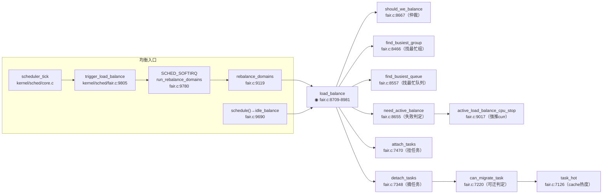

# 每日内核源码分析：load_balance

- **日期**：2026-08-31
- **子系统**：kernel/sched（进程调度 - CFS 完全公平调度器）
- **源文件**：kernel/sched/fair.c:8709-8981
- **类型**：function（SMP 负载均衡执行核心）

---

## 1. 功能作用

`load_balance()` 是 Linux SMP 调度器中**真正执行跨 CPU 任务迁移**的核心函数。它在指定的调度域（sched_domain）内检查当前 CPU 与其他 CPU 之间是否存在负载不均衡，如果发现最繁忙的源运行队列（busiest rq），则尝试将部分任务从该队列"拉"（pull）到本地运行队列，以实现系统整体负载的均衡分布。

**典型调用触发场景：**
- **周期性均衡（Periodic Balance）**：每个调度 tick 中通过 `trigger_load_balance` → `SCHED_SOFTIRQ` → `run_rebalance_domains` → `rebalance_domains` 路径按层次调用；
- **新空闲均衡（Newly Idle Balance）**：CPU 刚从运行态进入空闲时，通过 `idle_balance()` 主动拉取任务，避免 CPU 空转；
- **NOHZ 空闲均衡（ILB）**：全动态 tick（NOHZ_FULL）系统中，由一个"值班 CPU"通过 `nohz_idle_balance` 代替其他停 tick 的空闲 CPU 做均衡。

返回值 `ld_moved` 表示本次均衡实际迁移的任务权重（load）总和，0 表示未能迁移任何任务。

---

## 2. 关键数据结构

### 2.1 `struct lb_env`（fair.c:7097-7121）——负载均衡环境上下文
贯穿整个 `load_balance` 流程的"导航+状态"结构，保存本次均衡的全部参数与中间状态：

| 字段 | 类型 | 含义 |
|------|------|------|
| `sd` | `struct sched_domain*` | 当前正在做均衡的调度域（从最底层 MC/NUMA 逐层向上） |
| `src_rq / src_cpu` | `struct rq* / int` | 选定的"最繁忙源运行队列"及其 CPU 号（任务迁出方） |
| `dst_rq / dst_cpu` | `struct rq* / int` | 本地目的运行队列及其 CPU（任务迁入方） |
| `dst_grpmask` | `struct cpumask*` | 目的调度组 span 的 CPU 掩码，用于判断剩余候选是否还有意义 |
| `new_dst_cpu` | `int` | 亲和性无法迁入本 CPU 时，由 `can_migrate_task` 推荐的备选目标 CPU |
| `idle` | `enum cpu_idle_type` | 本次均衡的触发场景：`CPU_NOT_IDLE`/`CPU_IDLE`/`CPU_NEWLY_IDLE` |
| `imbalance` | `long` | `find_busiest_group` 计算出的本调度域内"负载差值"（需要迁移多少 load） |
| `cpus` | `struct cpumask*` | 当前调度域内 active CPU 集合（`load_balance_mask` percpu 变量） |
| `flags` | `unsigned int` | 标志位，见下表 `LBF_*` |
| `loop / loop_break / loop_max` | `unsigned int` | `detach_tasks` 循环控制：已遍历次数、强制中断阈值、本次最多尝试迁移数 |
| `fbq_type` | `enum fbq_type` | `detach_tasks` 中遍历 busiest 队列时挑选任务的策略（all / pinned / etc） |
| `tasks` | `struct list_head` | 从 src_rq 摘下来等待迁移的临时链表（每个 task 处于 `TASK_ON_RQ_MIGRATING` 状态） |

### 2.2 `LBF_*` 标志位（fair.c:7090-7095）
```c
#define LBF_ALL_PINNED     0x01   // 遍历过的任务全部因亲和性不能迁移
#define LBF_NEED_BREAK     0x02   // detach_tasks 遇到 nr_migrate_break，需释放锁再继续
#define LBF_DST_PINNED     0x04   // 有任务亲和性不能迁到 dst_cpu，但可迁到同组 new_dst_cpu
#define LBF_SOME_PINNED    0x08   // 至少有一个任务因亲和性被跳过（不一定全部）
#define LBF_NOHZ_STATS     0x10   // 在 nohz 场景下需要更新阻塞平均值统计
#define LBF_NOHZ_AGAIN     0x20   // nohz 统计更新后需重新计算 busiest group
```

### 2.3 其他依赖结构（已在 workspace/ 中有对应分析笔记）
- **`struct rq`**：每个 CPU 的运行队列，`kernel/sched/sched.h/struct_rq.md` 已分析。关键字段：`nr_running`（运行中任务数）、`active_balance`（主动均衡正在进行的标志）、`push_cpu`（主动均衡目标 CPU）、`lock`（per-rq spinlock）。
- **`struct sched_domain`**：调度域层次（SMT → MC → NUMA 等），承载 `balance_interval`（当前均衡间隔）、`min_interval/max_interval`（最小/最大间隔）、`nr_balance_failed`（连续失败次数）、`groups`（调度组链表）、`lb_count/lb_failed/lb_balanced/lb_imbalance` 等调度统计。
- **`struct sched_group` + `sgc`**：调度域下的组及其共享容量信息（`imbalance` 标志向上层域传递亲和性导致的遗留不均衡）。
- **`enum cpu_idle_type`**：`CPU_NOT_IDLE`（忙均衡）、`CPU_IDLE`（闲均衡）、`CPU_NEWLY_IDLE`（刚进入空闲均衡）。均衡阈值、失败计数策略因场景而异。

---

## 3. 核心逻辑流程图

```mermaid
flowchart TD
  A[入口 load_balance] --> B[初始化 lb_env<br/>sd/dst_cpu/dst_rq/idle/cpus]
  B --> C[调度域span & cpu_active_mask 取交集]
  C --> D[schedstat 统计<br/>lb_count[idle]++]

  D --> E{redo:<br/>should_we_balance?}
  E -->|否：本组其他CPU负责| F[continue_balancing=0<br/>goto out_balanced]
  E -->|是：本CPU负责均衡| G[find_busiest_group<br/>找最繁忙调度组]

  G --> H{group 存在?}
  H -->|否 已经均衡| I[lb_nobusyg++<br/>goto out_balanced]
  H -->|是| J[find_busiest_queue<br/>在组内找最繁忙rq]

  J --> K{busiest 存在?}
  K -->|否| L[lb_nobusyq++<br/>goto out_balanced]
  K -->|是| M[BUG_ON busiest==dst_rq<br/>统计 lb_imbalance]

  M --> N{busiest.nr_running > 1?}
  N -->|否 无法迁| O[跳到 !ld_moved 判断<br/>看是否要 active_balance]
  N -->|是| P[flags |= LBF_ALL_PINNED<br/>loop_max=min(迁移上限, nr_running)]

  P --> Q[more_balance:<br/>rq_lock_irqsave(busiest)<br/>update_rq_clock]
  Q --> R[detach_tasks 挑任务摘下<br/>→ TASK_ON_RQ_MIGRATING]
  R --> S[rq_unlock(busiest) 保持迁移状态<br/>任务不被其他路径操作]

  S --> T{cur_ld_moved > 0?}
  T -->|是| U[attach_tasks 挂到 dst_rq<br/>累计 ld_moved]
  T -->|否| V[ld_moved 不变]

  U --> W{flags & LBF_NEED_BREAK?}
  V --> W
  W -->|是：需要放锁间歇| X[清 NEED_BREAK<br/>goto more_balance]
  W -->|否| Y{flags & LBF_DST_PINNED<br/>且 imbalance > 0?}

  Y -->|是：换备选CPU| Z[从cpus里剔除旧dst<br/>dst_rq/dst_cpu=new_dst<br/>goto more_balance 同源续迁]
  Y -->|否| AA{sd_parent 存在<br/>&& LBF_SOME_PINNED<br/>&& imbalance>0?}

  AA -->|是| AB[sd_parent.groups.sgc.imbalance=1<br/>向上层遗留不均衡]
  AA -->|否| AC{flags & LBF_ALL_PINNED?}
  AB --> AC

  AC -->|是：全部亲和绑死| AD[从cpus里剔除src_cpu<br/>!cpus⊂dst_grpmask? goto redo 换src]
  AD -->|仍是子集| AE[goto out_all_pinned<br/>指望上层域解决]
  AC -->|否| AF[完成本轮迁任务]

  O --> AG
  AF --> AG{ld_moved == 0?}

  AG -->|是 未迁成功| AH[lb_failed++<br/>非 NEWLY_IDLE 则 nr_balance_failed++]
  AH --> AI{need_active_balance?<br/>cache_nice_tries+2 次失败后触发}
  AI -->|否| AJ[直接调优均衡间隔]
  AI -->|是| AK[检查 curr.亲和性是否允许迁<br/>不允许 → LBF_ALL_PINNED]
  AK --> AL[!active_balance? 置位<br/>push_cpu=this_cpu]
  AL --> AM[stop_one_cpu_nowait<br/>→ active_load_balance_cpu_stop<br/>在 src_cpu 上下文中强推 curr]
  AM --> AN[nr_balance_failed = cache_nice_tries+1]

  AG -->|否 成功迁移| AO[nr_balance_failed=0<br/>重置失败计数]

  AJ --> AP{active_balance == 0?}
  AN --> AP
  AO --> AP
  AP -->|是| AQ[balance_interval=min_interval<br/>恢复到最短间隔]
  AP -->|否| AR[balance_interval*=2<br/>退避避免反复打扰]
  AQ --> AS[goto out]
  AR --> AS

  F --> AT[out_balanced: 清上层域 imbalance<br/>仅当非 ALL_PINNED]
  I --> AT
  L --> AT
  AT --> AU[out_all_pinned:<br/>lb_balanced++<br/>nr_balance_failed=0]
  AE --> AU
  AU --> AV[out_one_pinned: ld_moved=0]
  AK --> AV
  AV --> AW{idle==NEWLY_IDLE?}
  AW -->|是| AS
  AW -->|否| AX[ALL_PINNED 且 < MAX_PINNED_INTERVAL<br/>或 < max_interval → *2]
  AX --> AS[out: return ld_moved]
```

**关键决策点解读（7 条）：**

1. **should_we_balance 仲裁**：同一调度组内只让"第一个空闲 CPU"或"组内第一个 CPU"执行均衡，避免多个 CPU 同时抢同一 busiest 源造成锁竞争；`CPU_NEWLY_IDLE` 场景例外（所有空闲 CPU 都允许尝试）。
2. **两阶段查找**：先 `find_busiest_group` 在调度域层比较调度组间平均负载，再 `find_busiest_queue` 在组内挑最忙 CPU，形成"组间 → 组内"的两级定位。
3. **nr_running > 1 才尝试迁移**：若最繁忙队列只剩 1 个任务，不做普通 pull（该任务正在运行，`detach_tasks` 只能摘非 curr 非 running 任务）；但仍作为不均衡保留，后续走 `active_balance` 强迁当前运行任务。
4. **detach → unlock → attach 三段式迁移**：先在 busiest 锁内把要迁的任务摘出队列、置 `TASK_ON_RQ_MIGRATING`、放锁，再 attach 到目的队列。放锁阶段保证两个 rq 的 `->lock` 不同时被长时间持有，降低调度域全局锁竞争。
5. **LBF_DST_PINNED 换家机制**：任务亲和性不允许迁入本 dst_cpu，但 `can_migrate_task` 发现可以迁入同调度组内另一个 `new_dst_cpu` 时，把当前 balance 转为向该 CPU 迁；这样一次均衡可以把源 CPU 的负载向多个目的 CPU 分流。
6. **亲和性遗留不均衡向上冒泡**：`LBF_SOME_PINNED` 置位时把 `sd_parent->groups->sgc->imbalance=1`，告诉上层 NUMA 域"这个 MC 域内因为亲和性调不平，你那边跨节点试试"。
7. **active_balance 强制均衡**：连续失败多次（`cache_nice_tries+2`）后仍不均衡，使用 `stop_one_cpu_nowait` 让最繁忙 CPU 自己在 `cpu_stop` 上下文（优先级最高、不可被抢占）中执行 `active_load_balance_cpu_stop`，将当前 `curr` 任务"推"到目的 CPU；若 busiest 只有 1 个任务，普通路径因 `nr_running<=1` 跳过 detach，也只能靠 active_balance 唯一途径。

---

## 4. 调用关系

### 4.1 调用者（who calls me）

`load_balance` 是 `static` 函数，仅在 fair.c 内部由两条路径调用：

| 调用方 | 所在文件 | 调用场景 |
|--------|----------|----------|
| `rebalance_domains` | `kernel/sched/fair.c:9168` | **周期性 / 常规均衡主路径**。由 `SCHED_SOFTIRQ` → `run_rebalance_domains` 触发，自底向上遍历每个调度域（sd child → parent），依次 `load_balance(cpu, rq, sd, idle, &continue_balancing)`，直到最顶层 NUMA 域。 |
| `idle_balance`（通过 `load_balance` 在 `fair.c:9724` 的调用点） | `kernel/sched/fair.c:9724` | **新空闲均衡路径**。CPU 正从忙态进入 idle（`schedule()` 中 pick_next_task 发现没有任务时），`idle_balance()` 主动从调度域最高层往低层遍历 `pulled_task = load_balance(...)`，成功拉到任务就返回该任务立即运行，避免空转。 |

> **间接入口**：两条路径的源头都是 `trigger_load_balance()` 和 `scheduler_tick()`（core.c:3069），已在 workspace 中分析。

### 4.2 被调用者（who I call）

**核心路径调用（主逻辑）：**
- `should_we_balance(env)` — 同组内谁来做均衡的仲裁
- `find_busiest_group(env)` — 计算调度域内各调度组负载，返回最繁忙组并填充 `env->imbalance`
- `find_busiest_queue(env, group)` — 在最繁忙调度组内找到最繁忙的 `struct rq*`
- `detach_tasks(env)` — 遍历 busiest rq 的 CFS 任务、按 `can_migrate_task` / `task_hot` 筛选，摘取适量任务挂入 `env->tasks`
- `attach_tasks(env)` — 将 `env->tasks` 链表的每个任务 attach 到 `dst_rq`，更新 load_avg、vruntime、触发 resched
- `need_active_balance(env)` — 判断是否达到触发"主动均衡"的失败次数阈值

**辅助 / 锁调用：**
- `rq_lock_irqsave(busiest, &rf)` + `rq_unlock(busiest, &rf)` + `local_irq_restore` — 源 rq 锁获取/释放与中断状态管理（`detach_tasks` 要求持源锁，`attach_tasks` 通过 `task_rq_lock` 内部持目的锁）
- `raw_spin_lock_irqsave(&busiest->lock, flags)` — active_balance 路径中单独持源锁
- `stop_one_cpu_nowait(cpu_of(busiest), active_load_balance_cpu_stop, busiest, &work)` — 发起 cpu_stop 工作队列回调

**宏 / 内联关键点（影响语义）：**
- `schedstat_inc / schedstat_add` — 仅在 `CONFIG_SCHED_DEBUG` 时生效，不计数 overhead
- `this_cpu_cpumask_var_ptr(load_balance_mask)` — percpu 的 cpumask 变量，避免每次均衡分配内存
- `cpumask_and / cpumask_clear_cpu / cpumask_test_cpu / cpumask_subset` — 亲和性与调度域 CPU 集合操作，全部为内联位操作
- `cpu_rq(env.new_dst_cpu)` — 由 cpu 号快速索引对应 `struct rq*`（全局 `runqueues[]` 数组或 per-cpu 变量）
- `sched_nr_migrate_break / sysctl_sched_nr_migrate` — sysctl 可调的最大迁移阈值，防止单次均衡拖慢 tick

### 4.3 调用关系图（Mermaid）



---

## 5. 易错点 / 边界场景 / 设计权衡

### 5.1 亲和性导致的"伪不均衡"
`LBF_ALL_PINNED` 并不代表系统真的均衡，只是当前调度域内因 `cpus_allowed` 任务绑核导致"想迁也迁不动"。代码通过 `sgc->imbalance=1` 向上层 NUMA 域冒泡，若最顶层也处理不了则永久保留不均衡——这是合理的工程权衡：尊重用户绑核意图高于完美负载分布。

### 5.2 balance_interval 的指数退避
均衡失败（含 all_pinned）时 `balance_interval *= 2`，上限 `max_interval` 或 `MAX_PINNED_INTERVAL`；成功时立刻重置为 `min_interval`。设计目的：避免每个 tick 都徒劳无功地走一遍大锁开销；但 `CPU_NEWLY_IDLE` 场景刻意跳过退避（代码 8971-8972），因为新空闲时"拉一个任务回来运行"的收益远大于均衡开销。

### 5.3 TASK_ON_RQ_MIGRATING 状态的妙用
`detach_tasks` 把任务摘下后先不释放 `src_rq->lock` 就不能长时间占用。内核在摘出后立刻置 `p->on_rq = TASK_ON_RQ_MIGRATING`，然后释放锁；此时其他路径（如 `try_to_wake_up`、`task_rq_lock`）看到这个中间态会按规则等待或切换锁，保证两个 rq 的锁不必同时持有，从而实现"细粒度分段锁"而不是"域级大锁"。

### 5.4 为什么用 pull 而不是 push？
`load_balance` 的思路是**空闲/较轻 CPU 主动 pull**。对 SMP 调度器来说这更高效：大多数情况下忙 CPU 正在运行它的 curr，不应该被频繁打断去 push；只有当 pull 多次失败（`cache_nice_tries+2`）且源只有 curr 可迁时，才通过 `active_balance` 走 push 路径（在源 CPU 的 `cpu_stop` 上下文 push 当前运行任务）——此时 push 的代价被认为值得。

### 5.5 nr_balance_failed 与 cache_nice_tries 的交互
`need_active_balance()` 判断失败次数：超过 `cache_nice_tries`（默认 2）后认为"这些任务可能 cache 太热拉不动"，允许 `cache_hot` 任务也被迁；超过 `cache_nice_tries+2` 才真正触发 active_balance。这样给了"冷热过渡期"几次机会再下狠手，避免了 ping-pong 迁移。

### 5.6 NEWLY_IDLE 不污染失败计数
代码 8879-8880 明确写：`if (idle != CPU_NEWLY_IDLE) sd->nr_balance_failed++`。原因是新空闲均衡非常频繁（每次 schedule 空转都可能来一次），若计入失败计数会很快打爆阈值，触发不必要的 active_balance。这点在注释里有清晰说明，也是阅读时容易忽略的关键边界条件。

---

## 附：核心源码片段（去冗）

```c
// kernel/sched/fair.c:8709-8981
/*
 * Check this_cpu to ensure it is balanced within domain. Attempt to move
 * tasks if there is an imbalance.
 */
static int load_balance(int this_cpu, struct rq *this_rq,
                        struct sched_domain *sd, enum cpu_idle_type idle,
                        int *continue_balancing)
{
        int ld_moved, cur_ld_moved, active_balance = 0;
        struct sched_domain *sd_parent = sd->parent;
        struct sched_group *group;
        struct rq *busiest;
        struct rq_flags rf;
        struct cpumask *cpus = this_cpu_cpumask_var_ptr(load_balance_mask);

        struct lb_env env = {
                .sd             = sd,
                .dst_cpu        = this_cpu,
                .dst_rq         = this_rq,
                .dst_grpmask    = sched_group_span(sd->groups),
                .idle           = idle,
                .loop_break     = sched_nr_migrate_break,
                .cpus           = cpus,
                .fbq_type       = all,
                .tasks          = LIST_HEAD_INIT(env.tasks),
        };

        cpumask_and(cpus, sched_domain_span(sd), cpu_active_mask);
        schedstat_inc(sd->lb_count[idle]);

redo:
        if (!should_we_balance(&env)) {
                *continue_balancing = 0;
                goto out_balanced;
        }

        group = find_busiest_group(&env);
        if (!group) {
                schedstat_inc(sd->lb_nobusyg[idle]);
                goto out_balanced;
        }

        busiest = find_busiest_queue(&env, group);
        if (!busiest) {
                schedstat_inc(sd->lb_nobusyq[idle]);
                goto out_balanced;
        }

        BUG_ON(busiest == env.dst_rq);
        schedstat_add(sd->lb_imbalance[idle], env.imbalance);

        env.src_cpu = busiest->cpu;
        env.src_rq  = busiest;

        ld_moved = 0;
        if (busiest->nr_running > 1) {
                env.flags   |= LBF_ALL_PINNED;
                env.loop_max = min(sysctl_sched_nr_migrate, busiest->nr_running);

more_balance:
                rq_lock_irqsave(busiest, &rf);
                update_rq_clock(busiest);

                cur_ld_moved = detach_tasks(&env);
                rq_unlock(busiest, &rf);

                if (cur_ld_moved) {
                        attach_tasks(&env);
                        ld_moved += cur_ld_moved;
                }

                local_irq_restore(rf.flags);

                if (env.flags & LBF_NEED_BREAK) {
                        env.flags &= ~LBF_NEED_BREAK;
                        goto more_balance;
                }

                if ((env.flags & LBF_DST_PINNED) && env.imbalance > 0) {
                        cpumask_clear_cpu(env.dst_cpu, env.cpus);
                        env.dst_rq   = cpu_rq(env.new_dst_cpu);
                        env.dst_cpu  = env.new_dst_cpu;
                        env.flags   &= ~LBF_DST_PINNED;
                        env.loop     = 0;
                        env.loop_break = sched_nr_migrate_break;
                        goto more_balance;
                }

                if (sd_parent) {
                        int *group_imbalance = &sd_parent->groups->sgc->imbalance;
                        if ((env.flags & LBF_SOME_PINNED) && env.imbalance > 0)
                                *group_imbalance = 1;
                }

                if (unlikely(env.flags & LBF_ALL_PINNED)) {
                        cpumask_clear_cpu(cpu_of(busiest), cpus);
                        if (!cpumask_subset(cpus, env.dst_grpmask)) {
                                env.loop = 0;
                                env.loop_break = sched_nr_migrate_break;
                                goto redo;
                        }
                        goto out_all_pinned;
                }
        }

        if (!ld_moved) {
                schedstat_inc(sd->lb_failed[idle]);
                if (idle != CPU_NEWLY_IDLE)
                        sd->nr_balance_failed++;

                if (need_active_balance(&env)) {
                        unsigned long flags;
                        raw_spin_lock_irqsave(&busiest->lock, flags);
                        if (!cpumask_test_cpu(this_cpu, &busiest->curr->cpus_allowed)) {
                                raw_spin_unlock_irqrestore(&busiest->lock, flags);
                                env.flags |= LBF_ALL_PINNED;
                                goto out_one_pinned;
                        }
                        if (!busiest->active_balance) {
                                busiest->active_balance = 1;
                                busiest->push_cpu = this_cpu;
                                active_balance = 1;
                        }
                        raw_spin_unlock_irqrestore(&busiest->lock, flags);
                        if (active_balance) {
                                stop_one_cpu_nowait(cpu_of(busiest),
                                        active_load_balance_cpu_stop, busiest,
                                        &busiest->active_balance_work);
                        }
                        sd->nr_balance_failed = sd->cache_nice_tries+1;
                }
        } else
                sd->nr_balance_failed = 0;

        if (likely(!active_balance)) {
                sd->balance_interval = sd->min_interval;
        } else {
                if (sd->balance_interval < sd->max_interval)
                        sd->balance_interval *= 2;
        }
        goto out;

out_balanced:
        if (sd_parent && !(env.flags & LBF_ALL_PINNED)) {
                int *group_imbalance = &sd_parent->groups->sgc->imbalance;
                if (*group_imbalance)
                        *group_imbalance = 0;
        }
out_all_pinned:
        schedstat_inc(sd->lb_balanced[idle]);
        sd->nr_balance_failed = 0;
out_one_pinned:
        ld_moved = 0;
        if (env.idle == CPU_NEWLY_IDLE)
                goto out;
        if (((env.flags & LBF_ALL_PINNED) &&
                        sd->balance_interval < MAX_PINNED_INTERVAL) ||
                        (sd->balance_interval < sd->max_interval))
                sd->balance_interval *= 2;
out:
        return ld_moved;
}
```
