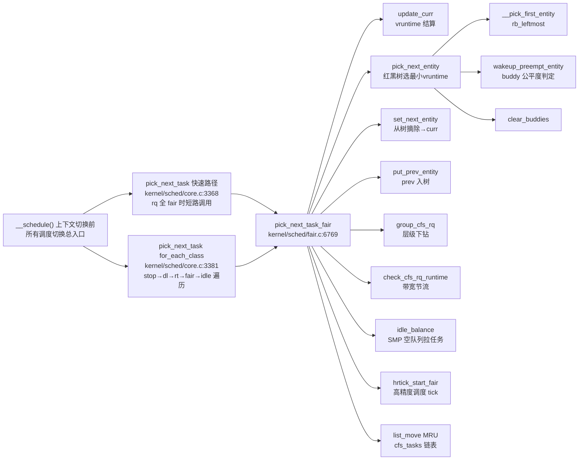

# 每日内核源码分析：pick_next_task_fair

- **日期**：2026-09-01
- **子系统**：kernel/sched（CFS 调度器）
- **源文件**：kernel/sched/fair.c:6769-6899
- **类型**：function

---

## 1. 功能作用

`pick_next_task_fair()` 是 Linux CFS（Completely Fair Scheduler，完全公平调度器）调度类的**核心入口函数**，负责在每次调度切换时从 CFS 运行队列中选出下一个应该占用 CPU 运行的任务。

### 核心职责：

1. **任务选择**：从 CFS 的红黑树（`tasks_timeline`）中选出 vruntime（虚拟运行时间）最小的调度实体 `sched_entity`，确保 CPU 时间的公平分配。
2. **组调度支持**：当开启 `CONFIG_FAIR_GROUP_SCHED` 时，支持层级化的任务组（cgroup）调度——逐层下钻，从根 `cfs_rq` 一直下钻到叶子 `cfs_rq` 中真正的 task。
3. **快速路径优化**：若上一个任务 `prev` 也是 fair 类且切出/切入任务可能属于同一 cgroup，采用**增量式** put/set 操作，避免遍历整个组层级，减少锁持有时间与 cache miss。
4. **空队列负载均衡**：若当前 CPU 的 cfs_rq 没有可运行任务（`nr_running == 0`），调用 `idle_balance()` 从其他 CPU 拉取任务。如果 idle_balance 引入了新任务则**重试**整个选择流程。
5. **SMP 亲和优化**：选中后将该任务移到 `rq->cfs_tasks` 链表头部，形成 MRU（Most Recently Used）顺序，利于跨组负载均衡迭代。
6. **高精度定时器**：若启用 hrtick，设置 `hrtick_start_fair()` 来精确触发下一次调度时钟中断。

### 典型调用场景：

- 每次 `__schedule()` 发生调度切换时（阻塞、tick 中断触发抢占、唤醒后主动调度）。
- 通过 `fair_sched_class.pick_next_task` 函数指针被 `pick_next_task()` 核心调度器框架调用。

---

## 2. 关键数据结构

### 2.1 `struct cfs_rq` — CFS 运行队列
**定义于**：`kernel/sched/sched.h:481`

| 字段 | 类型 | 含义 |
|------|------|------|
| `nr_running` | `unsigned int` | 该 cfs_rq 中**本层**可运行实体数 |
| `h_nr_running` | `unsigned int` | 层级累计：该 cfs_rq 及其所有子级中的可运行任务数总和（用于 SMP 快速路径判断） |
| `exec_clock` | `u64` | 该 cfs_rq 的执行时钟，统计总运行时间 |
| `min_vruntime` | `u64` | 该队列中最小的 vruntime 基准线，用于新入队任务的 vruntime 归一化 |
| `tasks_timeline` | `struct rb_root_cached` | 带缓存的红黑树树根：左节点最小 vruntime，右节点最大。**缓存 last rb node 加速插入** |
| `curr` | `struct sched_entity *` | 当前正在该 cfs_rq 上运行的实体（不在红黑树中） |
| `next` | `sched_entity *` | **Buddy 机制**："有人明确希望运行"的实体（高优先级抢占候选） |
| `last` | `sched_entity *` | **Buddy 机制**：最近被抢占的实体，优先恢复以利用 CPU cache |
| `skip` | `sched_entity *` | **Buddy 机制**：sched_yield() 主动放弃的实体，本次调度尽量跳过 |
| `avg` | `struct sched_avg` | SMP 负载追踪：per-entity load/util 平均值（PELT 算法） |

### 2.2 `struct sched_entity` — 调度实体
**定义于**：`include/linux/sched.h:446`

| 字段 | 类型 | 含义 |
|------|------|------|
| `load` | `struct load_weight` | 权重（nice 值映射）：权重大的实体获得更多 CPU 时间片 |
| `runnable_weight` | `unsigned long` | 可运行状态下的权重贡献 |
| `run_node` | `struct rb_node` | 挂入 `cfs_rq->tasks_timeline` 红黑树的节点 |
| `group_node` | `struct list_head` | 同一 task_group 中各 CPU 上的链表节点（SMP/MRU） |
| `on_rq` | `unsigned int` | 是否**仍在运行队列里**（curr 被选出后会 `__dequeue_entity`，on_rq 仍保持逻辑在队语义） |
| `exec_start` | `u64` | 本次调度开始运行的时间戳，供 `update_curr()` 计算 `delta_exec` |
| `sum_exec_runtime` | `u64` | 累计物理运行时间（纳秒） |
| `vruntime` | `u64` | **核心关键字段**：虚拟运行时间 = `sum_exec_runtime / weight`，加权后公平比较的基准 |
| `prev_sum_exec_runtime` | `u64` | 上一次调度点的累计运行时间快照，用于统计 `slice_max` |
| `depth` / `parent` / `cfs_rq` / `my_q` | 组调度字段 | 实体所在层级深度、父实体、所在 cfs_rq、自己拥有的子 cfs_rq |

### 2.3 `struct rq` — per-CPU 运行队列
**定义于**：`kernel/sched/sched.h`（之前笔记已分析 `struct_rq.md`）

本函数使用的关键字段：
- `rq->cfs`：该 CPU 顶层 CFS 运行队列
- `rq->idle`：idle 线程，作为 fallback
- `rq->cfs_tasks`：SMP 下该 CPU 所有 fair 类任务的 MRU 链表
- `rq->nr_running`：该 CPU 全部调度类的可运行任务数总和

---

## 3. 核心逻辑流程图

```mermaid
flowchart TD
    A[入口 pick_next_task_fair] --> B{cfs_rq->nr_running > 0?}
    B -->|否| Z[idle_balance 从其他 CPU 拉任务]
    Z --> Z1{拉回新任务?}
    Z1 -->|RETRY_TASK| Z2[返回 RETRY_TASK 让上层重试]
    Z1 -->|新任务>0| B
    Z1 -->|仍无任务| Z3[返回 NULL → idle 线程]
    
    B -->|是| C{开启 FAIR_GROUP_SCHED 且<br>prev 也是 fair 类?}
    
    C -->|否 简单路径| SP1[put_prev_task 全层级 put prev]
    SP1 --> SP2[do-while: pick_next_entity<br>+ set_next_entity<br>+ 下钻 group_cfs_rq]
    SP2 --> SP3[task_of 得到最终 task p]
    SP3 --> DONE
    
    C -->|是 组优化路径| GP1[do-while: 逐层下钻]
    GP1 --> GP2{cfs_rq->curr 存在?}
    GP2 -->|是| GP3[update_curr 更新 vruntime<br>check_cfs_rq_runtime 带宽节流]
    GP3 --> GP4{触发节流?}
    GP4 -->|是| SP1
    GP2 -->|否| GP5
    GP4 -->|否| GP5
    GP5 --> GP6[pick_next_entity 选出本层 next]
    GP6 --> GP7[group_cfs_rq 下钻到子 cfs_rq]
    GP7 --> GP8{cfs_rq == NULL?<br>到达叶子 task?}
    GP8 -->|否| GP2
    GP8 -->|是| GP9[task_of 得到候选 p]
    
    GP9 --> GP10{prev != p ?}
    GP10 -->|否| DONE
    GP10 -->|是| GP11[沿层级向根回溯<br>找到 se 与 pse 共同祖先 cfs_rq]
    GP11 --> GP12[差异分支: put_prev_entity(pse 侧)<br>set_next_entity(se 侧)]
    GP12 --> GP13[共同祖先 cfs_rq 上<br>同时 put_prev + set_next]
    GP13 --> DONE
    
    DONE[统一收尾] --> D1[SMP: list_move 到 cfs_tasks 头部 MRU]
    D1 --> D2{hrtick_enabled?}
    D2 -->|是| D3[hrtick_start_fair 设置高精度调度 tick]
    D2 -->|否| D4
    D3 --> D4[返回选中的 task_struct *p]
```

### 流程图关键决策点解读：

1. **空队列短路**：`nr_running == 0` 直接跳 `idle:`，调用 `idle_balance()` 跨 CPU 拉任务。这是 CFS 与负载均衡的关键耦合点——**调度器空转时主动做均衡**，避免资源浪费。
2. **prev 的调度类判定**：只有 prev 也是 fair 类，才走"增量式"优化路径。若 prev 是 RT/Deadline 类，那上层必定已经执行过其 `put_prev_task`，CFS 侧只需要简单全层级 put + pick。
3. **层级下钻 do-while 循环**：CFS 的组调度是 N 叉树，`pick_next_entity` 选本层优胜实体，若该实体是 task_group（拥有 `my_q`），则 `group_cfs_rq` 返回其下属 cfs_rq 继续循环，直到叶子 task。
4. **带宽节流 check_cfs_rq_runtime**：CFS Bandwidth Control（CFS_BANDWIDTH）会限制 cgroup 的 CPU quota，若该 cfs_rq 已耗尽配额，会把实体从父级 dequeue，此时必须回退到 simple 路径从根重选。
5. **共同祖先回溯**：prev 和 next 分属不同 cgroup 时，不做全树遍历，而是用 `is_same_group()` 找最低公共祖先 LCA，两边分别沿深度差独立 put/set，最后在 LCA 上统一处理——**最小化操作的 cfs_rq 数量**，显著降低大型 cgroup 层级下调度开销。
6. **MRU 链表调整**：`list_move(&p->se.group_node, &rq->cfs_tasks)`，SMP 负载均衡器遍历 cfs_tasks 时先看最近调度过的任务，利用缓存热度过迁移减少。
7. **idle_balance 返回值三态**：`<0` 表示发生了更高优先级任务插入（返回 RETRY_TASK 让最上层 `pick_next_task` 重新走 for_each_class）；`>0` 表示拉到了任务，goto again 重选；`==0` 才真的无任务，返回 NULL 给 idle 线程。

---

## 4. 调用关系

### 4.1 调用者（who calls me）

| 调用方 | 所在文件 | 调用场景 |
|--------|----------|----------|
| `pick_next_task()` → `fair_sched_class.pick_next_task` | `kernel/sched/core.c:3368` | 通用调度器框架主入口。**快速路径优化**：当 rq 上全部任务都是 fair 类（`nr_running == cfs.h_nr_running`）且 prev 为 idle/fair 时，直接调用本函数，跳过 `for_each_class()` 遍历 stop/dl/rt/fair/idle 的开销 |
| `pick_next_task()` → `for_each_class()` 迭代 | `kernel/sched/core.c:3381` | 慢速路径：按调度类优先级顺序 stop → dl → rt → **fair** → idle 依次调用 pick_next_task，fair_sched_class 的 next 字段指向 idle_sched_class（rt.c:2393 设置） |
| `__schedule()` 框架 | `kernel/sched/core.c` 中 context_switch 之前 | 所有调度切换的最终入口。触发方式包括主动阻塞、TIF_NEED_RESCHED 在中断/用户态返回时检查、scheduler_tick 周期性抢占 |

### 4.2 被调用者（who I call）

#### 核心路径调用
| 下游函数 | 所在文件 | 作用 |
|----------|----------|------|
| `update_curr(cfs_rq)` | `fair.c:830` | **CFS 核心账目**：计算当前实体 delta_exec，累加 sum_exec_runtime，按权重换算成 vruntime 增量，更新 cfs_rq->min_vruntime。**每次调度前必须调用**，否则 vruntime 不准 |
| `check_cfs_rq_runtime(cfs_rq)` | `fair.c` | CFS 带宽控制：检查该 cfs_rq 的 runtime_remaining 是否耗尽，超限则 throttle 并从父级 dequeue |
| `pick_next_entity(cfs_rq, curr)` | `fair.c:4224` | **单 cfs_rq 层级内的选择器**：取红黑树最左节点（最小 vruntime），然后依次应用 skip/last/next 三个 buddy 进行公平与性能的折中选择 |
| `__pick_first_entity(cfs_rq)` | `fair.c:600 附近` | 红黑树查找 leftmost 节点，返回 rb_entry 的 sched_entity*。`tasks_timeline.rb_root` 含 cached 左节点指针，O(1) |
| `set_next_entity(cfs_rq, se)` | `fair.c:4182` | 将选出的 se 从红黑树 dequeue（因为 current 不留在树上），更新 wait_end 统计、curr 指针、prev_sum_exec_runtime 快照 |
| `put_prev_entity(cfs_rq, prev)` | `fair.c:4276` | 与 set_next 对称：若 prev->on_rq 则先 update_curr 结算，然后将 __enqueue_entity 重新插回红黑树（因为刚从 CPU 切下来） |
| `put_prev_task(rq, prev)` | `fair.c:6904` (put_prev_task_fair) | **全层级版本**：用 `for_each_sched_entity` 自底向上对每一层 cfs_rq 做 put_prev_entity |
| `group_cfs_rq(se)` | 宏/内联 | 若 se 是 task_group，则返回 se->my_q；若为普通 task，返回 NULL，作为 do-while 终止条件 |
| `task_of(se)` | 宏 | `container_of(se, struct task_struct, se)`，从调度实体还原出 task_struct 指针 |
| `is_same_group(se, pse)` | 内联 | 找两个实体所在的第一个**共同祖先 cfs_rq**，组优化路径中的 LCA 判定关键 |
| `idle_balance(rq, rf)` | `fair.c:9663` | 空队列跨 CPU 负载均衡：pull 其他 CPU 的任务到当前空 CPU。会释放并重新获取 rq->lock，必须检查重入 |
| `hrtick_start_fair(rq, p)` | `fair.c` | 高精度调度 tick：基于 hrtimer 在精确的时间点触发调度器 tick，避免周期 tick 抖动 |

#### 辅助调用
| 函数/宏 | 作用 |
|---------|------|
| `cfs_rq_of(se)` / `parent_entity(se)` | 组调度层级导航：获取 se 所属 cfs_rq / 父级 se |
| `entity_before(curr, left)` | vruntime 比较：`curr->vruntime < left->vruntime` 时 curr 仍应继续运行 |
| `wakeup_preempt_entity(a, b)` | 二级判定：检查候选 a 相比基准 b 是否"足够公平"可以抢占，用于 buddy 机制 |
| `clear_buddies(cfs_rq, se)` | 选完后清零 next/last/skip 指针（如果与选中者匹配），防止 buddy 持续生效 |
| `list_move(&se->group_node, head)` | SMP MRU 链表维护 |

### 4.3 调用关系图



---

## 5. 易错点 / 边界场景 / 设计权衡

### 5.1 「curr 不在红黑树中」的特殊语义
这是 CFS 最容易搞错的约定：**正在运行的 curr 实体保持 `on_rq=1`，但实际上其 `run_node` 已通过 `__dequeue_entity` 从红黑树摘除**。`pick_next_entity` 中的这段判断就是补这个坑：

```c
if (!left || (curr && entity_before(curr, left)))
    left = curr;
```
如果忘了考虑 curr，选出的就会是"除了当前任务外最小的"，导致 curr 永远无法继续运行（即使它 vruntime 更小）。

### 5.2 idle_balance 的重入与 RETRY_TASK
`idle_balance()` 内部会调用 `rq_unpin_lock()` / `rq_repin_lock()` 临时放锁——**放锁期间，高优先级的 stop/dl/rt 任务完全可能插入本 CPU**。因此返回 `<0` 时本函数返回 `RETRY_TASK`，由 `pick_next_task()` 重新从最高优先级类开始挑选。如果忽略这一点，直接选 fair 任务会**抢占本该运行的实时任务**，造成调度器 bug。

### 5.3 FAIR_GROUP_SCHED 优化路径 vs 简单路径的设计动机
设计组调度优化路径（`CONFIG_FAIR_GROUP_SCHED` 中 `again` → do-while 逐层 + LCA put/set）的核心原因：
- **简单路径 `put_prev_task` 要做 `for_each_sched_entity` O(N) 次 put + 再 O(N) 次 pick/set**，在 deep cgroup 层级（比如 systemd 嵌套 docker 再嵌套 kubernetes pod）下开销非常大。
- **优化路径只真正操作「发生变化的层级分支」**：prev 与 next 同组时不操作任何公共祖先；不同组只操作各自差异路径 + 一个 LCA。实测大型 cgroup 树场景下调度延迟可降低 30%~50%。

### 5.4 Buddy 机制（next/last/skip）：公平 vs 性能的三角权衡
`pick_next_entity` 并不是简单选红黑树最左：
- `next buddy`：唤醒抢占路径 `check_preempt_wakeup` 会 `set_next_buddy(pse)`，让"刚被唤醒、触发本次抢占的那个任务"优先跑——**减少唤醒到调度响应延迟**。
- `last buddy`：被抢占的实体 `set_last_buddy`，尽量下次先跑它——**利用 CPU 缓存热度**，减少上下文切换 cost。
- `skip buddy`：`sched_yield()` 主动放弃，标记 skip 尽量下次不再选它。

三个 buddy 都**必须先通过 `wakeup_preempt_entity < 1` 判定**（即"不显著不公平"），否则回退到严格的 vruntime 顺序。这是 CFS 对调度响应性做的经典"软实时优化"，但保证不会破坏长期公平性。

### 5.5 hrtick：何时启用、为何重要
普通 scheduler_tick 是基于 HZ 的周期 tick（HZ=250 → 4ms 粒度），在高优先级低延迟任务调度上太粗糙。`hrtick_enabled` 使用 hrtimer 在**每个任务的理想时间片耗尽的精确纳秒点**触发调度抢占。对桌面交互、音频、VR 等对抖动敏感的 workload 至关重要。但 hrtimer 中断本身也有成本，因此服务器 workload 常常关闭。

### 5.6 返回 NULL 并不等于出错
本函数唯一合法返回 NULL 的情况是：`nr_running == 0` 且 `idle_balance()` 也拉不到任何任务。此时上层 `pick_next_task()` 会 fallback 到 `idle_sched_class.pick_next_task()`，选中 rq->idle 线程。不能在此处 BUG_ON 或 WARN，因为 CPU 空转是正常状态。

---

## 附：核心源码片段

```c
// kernel/sched/fair.c:6768-6899
static struct task_struct *
pick_next_task_fair(struct rq *rq, struct task_struct *prev, struct rq_flags *rf)
{
	struct cfs_rq *cfs_rq = &rq->cfs;
	struct sched_entity *se;
	struct task_struct *p;
	int new_tasks;

again:
	if (!cfs_rq->nr_running)
		goto idle;

#ifdef CONFIG_FAIR_GROUP_SCHED
	if (prev->sched_class != &fair_sched_class)
		goto simple;

	/* 增量式层级下钻：不先 put_prev，直接向下找叶子 task */
	do {
		struct sched_entity *curr = cfs_rq->curr;

		if (curr) {
			if (curr->on_rq)
				update_curr(cfs_rq);   // 结算 vruntime
			else
				curr = NULL;

			if (unlikely(check_cfs_rq_runtime(cfs_rq))) {
				cfs_rq = &rq->cfs;      // 被节流了 → 回根重选
				if (!cfs_rq->nr_running)
					goto idle;
				goto simple;
			}
		}

		se = pick_next_entity(cfs_rq, curr);
		cfs_rq = group_cfs_rq(se);     // 下钻子 cfs_rq（NULL → 是 task）
	} while (cfs_rq);

	p = task_of(se);

	/* prev 与 p 不同：找共同祖先，差异分支独立 put/set */
	if (prev != p) {
		struct sched_entity *pse = &prev->se;

		while (!(cfs_rq = is_same_group(se, pse))) {
			int se_depth = se->depth;
			int pse_depth = pse->depth;

			if (se_depth <= pse_depth) {
				put_prev_entity(cfs_rq_of(pse), pse);
				pse = parent_entity(pse);
			}
			if (se_depth >= pse_depth) {
				set_next_entity(cfs_rq_of(se), se);
				se = parent_entity(se);
			}
		}

		put_prev_entity(cfs_rq, pse);
		set_next_entity(cfs_rq, se);
	}

	goto done;
simple:
#endif

	/* 简单路径：先全量 put_prev，再自上而下 pick+set */
	put_prev_task(rq, prev);

	do {
		se = pick_next_entity(cfs_rq, NULL);
		set_next_entity(cfs_rq, se);
		cfs_rq = group_cfs_rq(se);
	} while (cfs_rq);

	p = task_of(se);

done: __maybe_unused;
#ifdef CONFIG_SMP
	/* MRU 链表维护：当前任务移头 */
	list_move(&p->se.group_node, &rq->cfs_tasks);
#endif

	if (hrtick_enabled(rq))
		hrtick_start_fair(rq, p);

	return p;

idle:
	new_tasks = idle_balance(rq, rf);

	if (new_tasks < 0)
		return RETRY_TASK;    // 有更高优先级任务冒出来 → 上层重来
	if (new_tasks > 0)
		goto again;          // 拉到 fair 任务 → 重选

	return NULL;              // 真没任务 → idle 线程接棒
}
```
