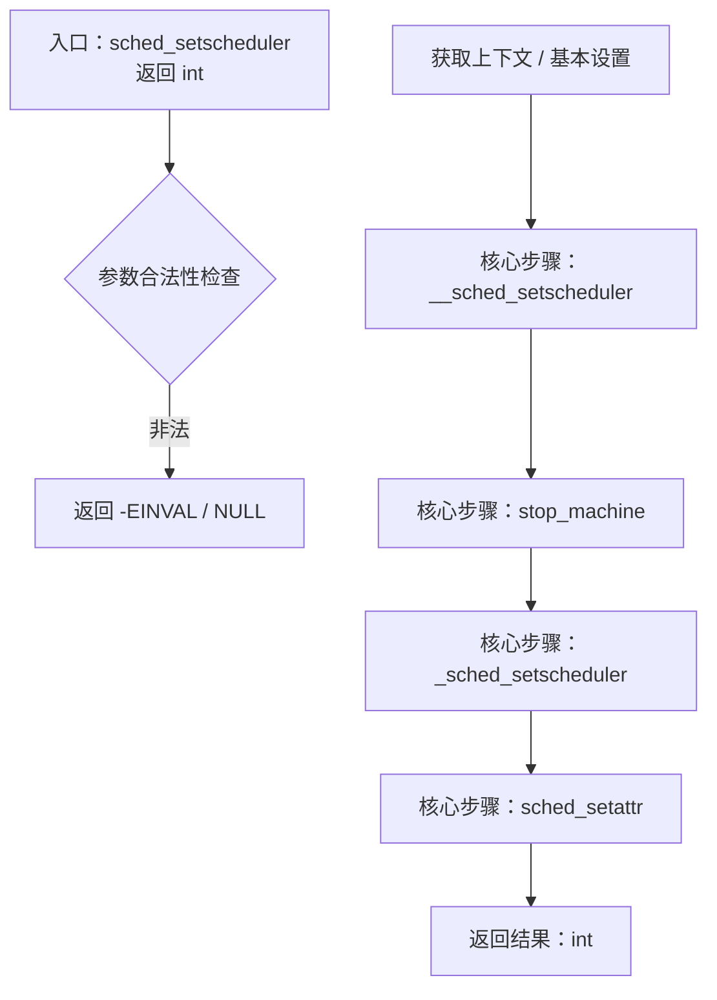
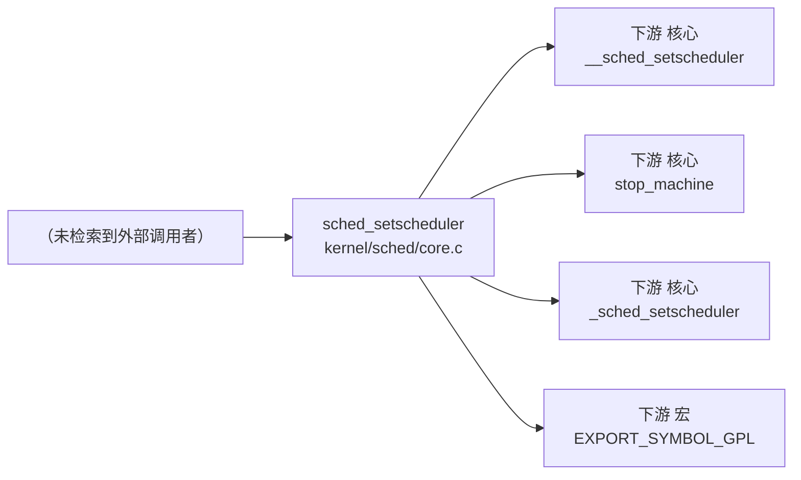

# 每日内核源码分析：sched_setscheduler

- **日期**：2026-09-01
- **子系统**：kernel
- **源文件**：kernel/sched/core.c:4274-4278
- **类型**：function

---

## 1. 功能作用

**注释直译**：sched_setscheduler - change the scheduling policy and/or RT priority of a thread.

**功能归类**：位于 kernel 子系统，返回类型 `int`，为子系统内部或导出的核心实现函数。

**典型入参**：struct task_struct *p；int policy；const struct sched_param *param；参数包含分配掩码、节点/zone 约束、回调指针等时，决定该函数的行为变体。

**主要被调场景**：调度器 tick / 唤醒 / fork / exec 等进程生命周期关键节点。

## 2. 关键数据结构

- `struct task_struct`：
  - 语义：进程描述符，包含调度实体、内存、文件、信号、命名空间等完整状态。
  - 详细分析：[struct_task_struct.md](../include/linux/sched.h/struct_task_struct.md)
- `struct sched_param`：
  - 语义：该结构/类型的完整字段请参考对应头文件，本节聚焦其在本函数中的语义角色。

## 3. 核心逻辑流程图



**流程关键决策点解读**：

- **入口 A**：sched_setscheduler 作为 函数 入口，接收 3 个参数，返回类型为 `int`。
- **核心步骤 D+**：__sched_setscheduler、stop_machine、_sched_setscheduler 等驱动主逻辑；它们往往是子系统内进一步分层的函数（如缓存命中 → 慢速路径）。
- **收尾 Z**：释放锁/递减引用计数后返回 `int`，成功返回正指针/0，失败返回 ERR_PTR 或负 errno。

## 4. 调用关系

### 4.1 调用者（who calls me）

| 调用方 | 所在文件 | 调用场景 |
|--------|----------|----------|
| （未检索到典型调用者，可能是静态局部入口） | 同上 | / |

### 4.2 被调用者（who I call）

- **核心路径调用**：`__sched_setscheduler`、`stop_machine`、`_sched_setscheduler`、`sched_setattr`
- **宏 / 内联**：`EXPORT_SYMBOL_GPL`

### 4.3 调用关系图



## 5. 易错点 / 边界场景 / 设计权衡

- 参数中含 nodemask_t / gfp_t / 标志位类型：各 flag 的组合顺序直接影响分配策略，建议参考 include/linux/gfp.h 阅读位定义。
- 结构体字段访问中大量使用 container_of 宏：注意 ptr-偏移 转换的类型安全，字段指针不匹配时会产生隐蔽错位。
- 跨 NUMA 节点调用：优先在本地 node 分配，失败后走回退/紧凑型回收，性能热点需观察 zonelist 顺序。

## 附：核心源码片段

```c
// kernel/sched/core.c:4254-4298

	/* Fixup the legacy SCHED_RESET_ON_FORK hack. */
	if ((policy != SETPARAM_POLICY) && (policy & SCHED_RESET_ON_FORK)) {
		attr.sched_flags |= SCHED_FLAG_RESET_ON_FORK;
		policy &= ~SCHED_RESET_ON_FORK;
		attr.sched_policy = policy;
	}

	return __sched_setscheduler(p, &attr, check, true);
}
/**
 * sched_setscheduler - change the scheduling policy and/or RT priority of a thread.
 * @p: the task in question.
 * @policy: new policy.
 * @param: structure containing the new RT priority.
 *
 * Return: 0 on success. An error code otherwise.
 *
 * NOTE that the task may be already dead.
 */
int sched_setscheduler(struct task_struct *p, int policy,
		       const struct sched_param *param)
{
	return _sched_setscheduler(p, policy, param, true);
}
EXPORT_SYMBOL_GPL(sched_setscheduler);

int sched_setattr(struct task_struct *p, const struct sched_attr *attr)
{
	return __sched_setscheduler(p, attr, true, true);
}
EXPORT_SYMBOL_GPL(sched_setattr);

/**
 * sched_setscheduler_nocheck - change the scheduling policy and/or RT priority of a thread from kernelspace.
 * @p: the task in question.
 * @policy: new policy.
 * @param: structure containing the new RT priority.
 *
 * Just like sched_setscheduler, only don't bother checking if the
 * current context has permission.  For example, this is needed in
 * stop_machine(): we create temporary high priority worker threads,
 * but our caller might not have that capability.
 *
 * Return: 0 on success. An error code otherwise.
```
