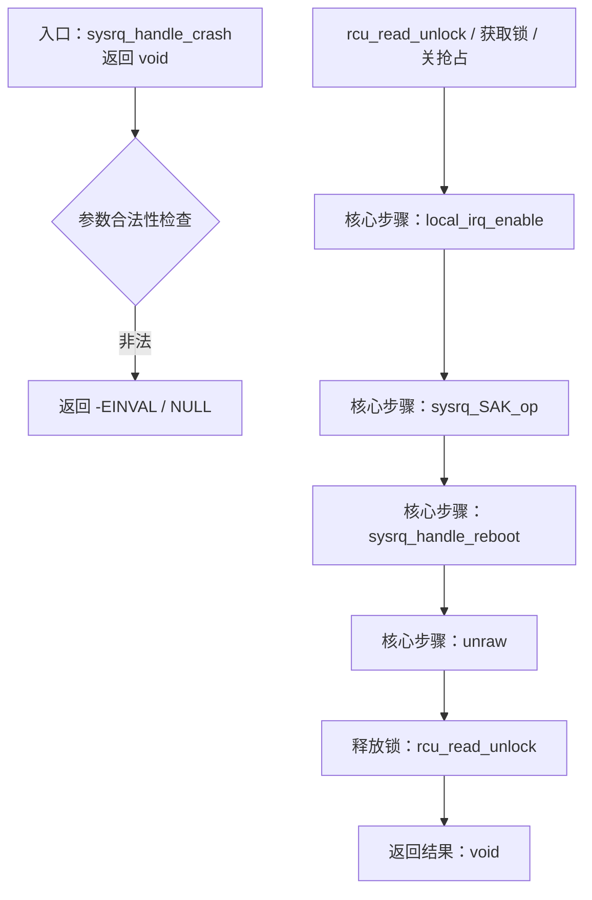
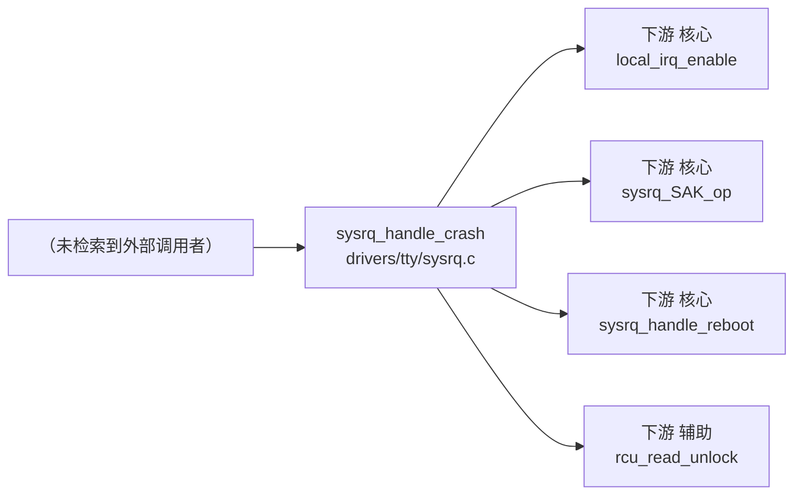

# 每日内核源码分析：sysrq_handle_crash

- **日期**：2026-09-02
- **子系统**：drivers
- **源文件**：drivers/tty/sysrq.c:135-148
- **类型**：function

---

## 1. 功能作用

**注释直译**：#endif  CONFIG_VT

**功能归类**：位于 drivers 子系统，返回类型 `void`，为子系统内部或导出的核心实现函数。

**典型入参**：int key；参数包含分配掩码、节点/zone 约束、回调指针等时，决定该函数的行为变体。

**主要被调场景**：由子系统内其他导出函数间接调用。

## 2. 关键数据结构

- `struct sysrq_key_op`：
  - 语义：该结构/类型的完整字段请参考对应头文件，本节聚焦其在本函数中的语义角色。

## 3. 核心逻辑流程图



**流程关键决策点解读**：

- **入口 A**：sysrq_handle_crash 作为 函数 入口，接收 1 个参数，返回类型为 `void`。
- **核心步骤 D+**：local_irq_enable、sysrq_SAK_op、sysrq_handle_reboot 等驱动主逻辑；它们往往是子系统内进一步分层的函数（如缓存命中 → 慢速路径）。
- **收尾 Z**：释放锁/递减引用计数后返回 `void`，成功返回正指针/0，失败返回 ERR_PTR 或负 errno。

## 4. 调用关系

### 4.1 调用者（who calls me）

| 调用方 | 所在文件 | 调用场景 |
|--------|----------|----------|
| （未检索到典型调用者，可能是静态局部入口） | 同上 | / |

### 4.2 被调用者（who I call）

- **核心路径调用**：`local_irq_enable`、`sysrq_SAK_op`、`sysrq_handle_reboot`、`unraw`、`reboot`、`emergency_restart`
- **辅助调用**：`rcu_read_unlock`

### 4.3 调用关系图



## 5. 易错点 / 边界场景 / 设计权衡

- 参数中含 nodemask_t / gfp_t / 标志位类型：各 flag 的组合顺序直接影响分配策略，建议参考 include/linux/gfp.h 阅读位定义。
- 结构体字段访问中大量使用 container_of 宏：注意 ptr-偏移 转换的类型安全，字段指针不匹配时会产生隐蔽错位。
- 跨 NUMA 节点调用：优先在本地 node 分配，失败后走回退/紧凑型回收，性能热点需观察 zonelist 顺序。

## 附：核心源码片段

```c
// drivers/tty/sysrq.c:115-168
#else
#define sysrq_SAK_op (*(struct sysrq_key_op *)NULL)
#endif

#ifdef CONFIG_VT
static void sysrq_handle_unraw(int key)
{
	vt_reset_unicode(fg_console);
}

static struct sysrq_key_op sysrq_unraw_op = {
	.handler	= sysrq_handle_unraw,
	.help_msg	= "unraw(r)",
	.action_msg	= "Keyboard mode set to system default",
	.enable_mask	= SYSRQ_ENABLE_KEYBOARD,
};
#else
#define sysrq_unraw_op (*(struct sysrq_key_op *)NULL)
#endif /* CONFIG_VT */

static void sysrq_handle_crash(int key)
{
	char *killer = NULL;

	/* we need to release the RCU read lock here,
	 * otherwise we get an annoying
	 * 'BUG: sleeping function called from invalid context'
	 * complaint from the kernel before the panic.
	 */
	rcu_read_unlock();
	panic_on_oops = 1;	/* force panic */
	wmb();
	*killer = 1;
}
static struct sysrq_key_op sysrq_crash_op = {
	.handler	= sysrq_handle_crash,
	.help_msg	= "crash(c)",
	.action_msg	= "Trigger a crash",
	.enable_mask	= SYSRQ_ENABLE_DUMP,
};

static void sysrq_handle_reboot(int key)
{
	lockdep_off();
	local_irq_enable();
	emergency_restart();
}
static struct sysrq_key_op sysrq_reboot_op = {
	.handler	= sysrq_handle_reboot,
	.help_msg	= "reboot(b)",
	.action_msg	= "Resetting",
	.enable_mask	= SYSRQ_ENABLE_BOOT,
};
```
