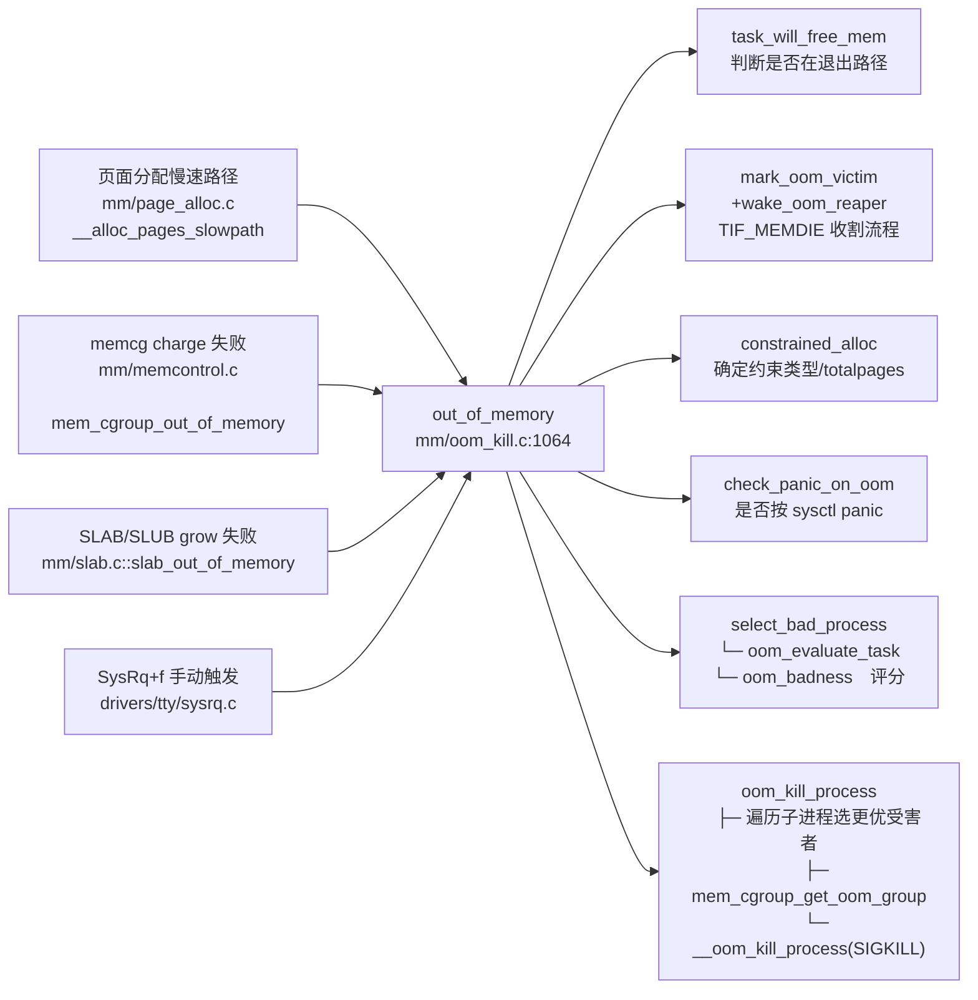

# 每日内核源码分析：out_of_memory

- **日期**：2026-09-03
- **子系统**：mm（内存管理 / OOM Killer）
- **源文件**：mm/oom_kill.c:1064-1135
- **类型**：function（全局导出核心入口）

---

## 1. 功能作用

`out_of_memory()` 是 Linux 内核 **OOM Killer（Out-Of-Memory Killer）** 的总入口函数。当物理内存（含 swap）严重不足、页面分配器（`__alloc_pages_slowpath`）经过直接回收（direct reclaim）、内存规整（compaction）、kswapd 唤醒等手段后仍无法满足分配请求时，便会走到这个"最后手段"——**选择并杀死一个或多个用户态进程，回收它们占用的内存，让系统得以继续运行**。

典型调用场景：

- **全局 OOM**：`mm/page_alloc.c::__alloc_pages_slowpath` 中分配失败且无法回收时调用（最常见路径）。
- **Memcg OOM**：`mm/memcontrol.c::mem_cgroup_out_of_memory` 当某 cgroup 内存使用触及上限时触发。
- **Slab 分配失败**：`mm/slab.c::slab_out_of_memory` / `mm/slub.c` 中 slab 对象分配穷尽时也会触发。
- **用户手动触发**：通过 SysRq 键 (`alt+sysrq+f`) 在 `order == -1` 标记下强制调用。

函数返回 `bool`：返回 `true` 表示本次调用选择了牺牲进程（或走了捷径），返回 `false` 表示 OOM Killer 被禁用或无法处理。

---

## 2. 关键数据结构

### 2.1 `struct oom_control`（include/linux/oom.h:22-45）

贯穿整个 OOM 流程的上下文控制块，封装本次触发的来源参数与选择结果：

| 字段 | 类型 | 含义 |
|------|------|------|
| `zonelist` | `struct zonelist *` | 本次分配请求的 zonelist，用于判断 cpuset 限制 |
| `nodemask` | `nodemask_t *` | NUMA mempolicy 的节点掩码 |
| `memcg` | `struct mem_cgroup *` | 为 NULL 表示**全局 OOM**；非 NULL 表示**某内存 cgroup 超限** |
| `gfp_mask` | `const gfp_t` | 原始分配掩码（`__GFP_FS`、`__GFP_DIRECT_RECLAIM` 等会影响策略） |
| `order` | `const int` | 分配阶数；**`-1` 表示 SysRq 手动触发**，此模式下行为更宽松 |
| `totalpages` | `unsigned long` | 由 `constrained_alloc` 回填：本次 OOM 计算的总可用页 |
| `chosen` | `struct task_struct *` | **输出字段**：最终选中的牺牲进程；`(void*)-1UL` 表示中止 |
| `chosen_points` | `unsigned long` | 选中进程的坏度评分（归一化为千分比输出） |

### 2.2 `enum oom_constraint`（mm/oom_kill.c:260 附近）

约束类型，决定 `totalpages` 的计算域和 panic 策略：

```c
enum oom_constraint {
    CONSTRAINT_NONE,          // 全局无约束，totalpages = RAM + swap
    CONSTRAINT_CPUSET,        // cpuset 限定节点集
    CONSTRAINT_MEMORY_POLICY, // mbind 内存策略限定节点
    CONSTRAINT_MEMCG,         // mem_cgroup 超限，totalpages = 该 cgroup 上限
};
```

### 2.3 关键线程标志 / mm 标志

- **`TIF_MEMDIE`**（`mark_oom_victim` 设置）：标记线程为 OOM 牺牲者，获得使用内存保留池（memory reserves）的特权，确保它能顺利走到 `exit_mm`。
- **`MMF_OOM_VICTIM`**：mm_struct 级别的 OOM 受害标记（绑定到 signal->oom_mm 生命周期）。
- **`MMF_OOM_SKIP`**：该 mm 已被/正在被 oom_reaper 处理，跳过再次计算。
- **`oom_score_adj`**（`signal_struct` 字段，范围 -1000 ~ +1000）：用户态可调的 OOM 偏置；`OOM_SCORE_ADJ_MIN (-1000)` 表示**绝对不可杀**。
- **`oom_flag_origin`**（`set_current_oom_origin` 设置）：谁触发 OOM 就优先杀谁的标记，用于 ChromeOS 等场景。

### 2.4 全局 sysctl 开关

- `sysctl_panic_on_oom`：0=不 panic；1=仅全局 OOM 时 panic；2=任何 OOM 都 panic。
- `sysctl_oom_kill_allocating_task`：非 0 时直接杀掉**触发分配的 current**，绕过评分算法。
- `sysctl_oom_dump_tasks`：是否在 OOM 时 dump 所有进程内存状态。

---

## 3. 核心逻辑流程图

```mermaid
flowchart TD
  A[入口 out_of_memory oc] --> B{oom_killer_disabled?}
  B -->|是| Z0[return false]
  B -->|否| C{非 memcg OOM?<br>调用 blocking_notifier<br>第三方回收回调}
  C -->|回调 freed>0| Z1[return true 已回收]
  C -->|否| D{current 是将死进程?<br>task_will_free_mem}
  D -->|是| E[mark_oom_victim<br>wake_oom_reaper<br>给保留池权限 + 启动回收线程]
  E --> Z2[return true]
  D -->|否| F{gfp_mask 不含 __GFP_FS<br>且非 memcg OOM?<br>IO-less reclaim 补偿}
  F -->|是| Z3[return true 不杀]
  F -->|否| G[constrained_alloc 计算<br>约束类型 + totalpages<br>非 POLICY 时清 nodemask]
  G --> H[check_panic_on_oom<br>按 sysctl 决定是否 panic]
  H --> I{oom_kill_allocating_task<br>sysctl 开启?}
  I -->|是 且 current 可杀| J[chosen=current<br>oom_kill_process]
  J --> Z4[return true]
  I -->|否| K[select_bad_process<br>遍历所有进程<br>调用 oom_badness 评分<br>取 points 最高者]
  K --> L{没找到可杀进程?<br>!oc->chosen}
  L -->|是| M[dump_header + warn]
  M --> N{非 SysRq<br>且非 memcg?}
  N -->|是| O[panic(deadlock on memory)]
  N -->|否| Z5[return]
  L -->|否| P{chosen 正常?<br>!= (void*)-1}
  P -->|是| Q[oom_kill_process<br>发送 SIGKILL<br>必要时子进程替换 / memcg 整组杀]
  Q --> Z6[return true]
  P -->|否| Z7[return false]
```

### 关键决策点解读

1. **notifier 链优先**：给外部模块（如 Hypervisor balloon、zswap）最后一次"软回收"机会，避免误杀进程。
2. **将死进程不杀第二遍**：若 current 已处于 SIGNAL_GROUP_EXIT / PF_EXITING，直接给它 TIF_MEMDIE + 唤醒 oom_reaper，让它快速完成退出流程。
3. **`__GFP_FS` 屏蔽策略**：不带 `__GFP_FS` 的分配（如 GFP_NOFS、GFP_ATOMIC 降级）即便失败也不会触发实际杀进程，因为这类分配者通常持有文件系统锁，杀进程可能导致更大的死锁风险。这里 OOM killer 仅"假装成功"。
4. **约束归一化**：`constrained_alloc` 将 memcg / cpuset / mempolicy 三种场景统一映射到 `totalpages`，后续评分算法无需分支。
5. **panic_on_oom 分叉**：在评分算法前先检查是否需要直接 panic，避免计算无用。
6. **双路径选牺牲者**：
   - 路径 A：`sysctl_oom_kill_allocating_task` → 直接杀分配触发者（容器场景常用，便于溯源）。
   - 路径 B：`select_bad_process` → 全系统扫描 + `oom_badness` 评分取最大（传统模式）。
7. **无杀able进程保护**：若所有进程都 `oom_score_adj=-1000` 或内核线程，说明系统真的死锁，在全局 OOM 场景直接 `panic()` 而不是在分配器中无限循环。
8. **oom_kill_process 的二次优化**：在实际发信号前还会检查是否应替换为子进程中分数更高者（牺牲子进程保留父进程的工作上下文），以及是否触发 memcg 整组 kill。

---

## 4. 调用关系

### 4.1 调用者（who calls me）

| 调用方 | 所在文件 | 调用场景 |
|--------|----------|----------|
| `__alloc_pages_slowpath` | `mm/page_alloc.c:3553` | 页面分配慢速路径：回收+规整+kswapd 都失败后的最后手段 |
| `mem_cgroup_out_of_memory` | `mm/memcontrol.c:1400-1418` | 内存 cgroup 写 page counter 超限触发（memcg OOM） |
| `try_charge` / `mem_cgroup_try_charge` | `mm/memcontrol.c:1744,1802` | cgroup charge 失败降级路径 |
| `slab_out_of_memory` | `mm/slab.c:1362,1414` | SLAB 分配器 grow 失败时兜底调用 |
| `slab_out_of_memory` (slub) | `mm/slub.c:2399,2615` | SLUB 版本相同语义 |
| `mem_cgroup_oom`（内核线程） | `mm/memcontrol.c:5616` | memcg OOM 处理内核线程 |
| 声明（外部） | `include/linux/oom.h:105` | `extern bool out_of_memory(struct oom_control *oc)` |

### 4.2 被调用者（who I call）

#### 核心路径调用

| 下游函数 | 位置 | 作用 |
|----------|------|------|
| `blocking_notifier_call_chain(oom_notify_list...)` | oom_kill.c + notifier.h | 触发第三方 OOM 回收回调（balloon、热插拔等） |
| `task_will_free_mem(current)` | oom_kill.c:788 | 判断 current 是否已在退出路径（SIGNAL_GROUP_EXIT / PF_EXITING） |
| `mark_oom_victim(current)` | oom_kill.c:675 | 设置 `TIF_MEMDIE`、绑定 `signal->oom_mm`、解冻任务、递增 `oom_victims` |
| `wake_oom_reaper(current)` | oom_kill.c:637 | 唤醒 `oom_reaper` 内核线程异步收割 mm |
| `constrained_alloc(oc)` | oom_kill.c:260 | 计算 OOM 约束类型、填充 `oc->totalpages` |
| `check_panic_on_oom(oc, constraint)` | oom_kill.c:1019 | 根据 `sysctl_panic_on_oom` 决定是否 panic |
| `select_bad_process(oc)` | oom_kill.c:372 | 遍历所有进程（或 memcg 内所有进程）调用 `oom_evaluate_task` 选最高分 |
| `oom_kill_process(oc, message)` | oom_kill.c:928 | 最终发送 SIGKILL（含子进程选择 / memcg group kill） |

#### 辅助调用 / 宏

- `is_memcg_oom(oc)`：内联，判断 `oc->memcg != NULL`。
- `is_sysrq_oom(oc)`：内联，判断 `oc->order == -1`。
- `oom_unkillable_task(p, memcg, nodemask)`：内核线程、init(1) 等不可杀进程检查。
- `get_task_struct / put_task_struct`：引用计数保护 chosen 进程。
- `__ratelimit`：`DEFAULT_RATELIMIT_INTERVAL`（5s）节流防止 OOM 日志风暴。

### 4.3 调用关系图（Mermaid）



---

## 5. 易错点 / 边界场景 / 设计权衡

### 5.1 为什么 `__GFP_FS` 为 0 时只"假装成功"？

不带 `__GFP_FS` 的分配（如 `GFP_NOIO`、`GFP_NOFS`）通常发生在**块层 / 文件系统写路径**中，调用者可能已经持有 `s_lock`、inode 锁、journal 锁等。如果此时真的杀进程，进程退出时要回收 inode / 关闭文件 / 写回脏页，**反而会重入同一个锁**造成死锁。所以 OOM Killer 在这里 `return true` 但不实际杀，让调用者重试——通常上层调用者在若干次重试后会退化为 `GFP_NOMEMALLOC` 或使用保留池。

### 5.2 `oom_lock` 互斥锁的作用

文件顶部 `DEFINE_MUTEX(oom_lock)`。注释明确说它用于**串行化所有上下文的 OOM Killer 调用**。否则当两个 CPU 同时触发全局 OOM 时，可能各自扫描并杀掉两个无辜进程，造成过度杀伤。注意此锁也被 `oom_killer_disable()` 依赖以稳定 `oom_killer_disabled` 状态。

### 5.3 为什么 `task_will_free_mem` 不直接让该进程 "被选中"？

这里走了**快速路径**：`mark_oom_victim` + `wake_oom_reaper` 但不进入 `oom_kill_process`。原因是：
- 进程已经在退出，不需要再给它发 SIGKILL；
- 只需要授予 TIF_MEMDIE（保留池使用权）+ 让 oom_reaper 异步把页表清空即可；
- 避免把一个正在正常退出的进程计入 dump_header 的 "Kill process" 日志，减少误判。

### 5.4 `oc->chosen = (void *)-1UL` 的语义

在 `oom_evaluate_task` 中，如果扫描时发现**已有一个 TIF_MEMDIE 受害者在处理中**（且未被 MMF_OOM_SKIP），会把 `oc->chosen` 设为 `-1UL` 作为 **"中止扫描"哨位值**。后续 `out_of_memory` 底部 `oc->chosen != (void *)-1UL` 判定会确保不再次调用 `oom_kill_process`，避免"重复杀"。这是和 `oom_lock` 配合的第二道并发保护。

### 5.5 评分归一化与"保底返回 1"设计

`select_bad_process` 最后会把 `chosen_points *= 1000 / totalpages` 转成千分比展示；而 `oom_badness` 最后一行 `return points > 0 ? points : 1` 确保**任何合法候选进程的分数都不会是 0**（0 代表 unkillable，由 `oom_unkillable_task` 或 `oom_score_adj=-1000` 路径返回）。这样即使一个进程 RSS 很小且 adj 为负，在极端情况下仍能被选中，避免"所有候选都是 0 分"陷入无限循环。

### 5.6 Memcg OOM vs Global OOM 的语义差异

- **Memcg**：`is_memcg_oom(oc)` 为真时，`notifier_call_chain` 被跳过（第三方回调是全局语义），`__GFP_FS` 判断也被绕过（cgroup 内需要严格 OOM 语义）；kill 前还会通过 `mem_cgroup_get_oom_group` 决定是否整 memcg 杀而不是单进程。
- **Global**：无 killable 进程时会 `panic("System is deadlocked on memory")`；memcg 不会 panic（因为只是某个容器死掉）。

---

## 附：核心源码片段

```c
// mm/oom_kill.c:1064-1135
/**
 * out_of_memory - kill the "best" process when we run out of memory
 * @oc: pointer to struct oom_control
 *
 * If we run out of memory, we have the choice between either
 * killing a random task (bad), letting the system crash (worse)
 * OR try to be smart about which process to kill. Note that we
 * don't have to be perfect here, we just have to be good.
 */
bool out_of_memory(struct oom_control *oc)
{
	unsigned long freed = 0;
	enum oom_constraint constraint = CONSTRAINT_NONE;

	if (oom_killer_disabled)
		return false;

	if (!is_memcg_oom(oc)) {
		blocking_notifier_call_chain(&oom_notify_list, 0, &freed);
		if (freed > 0)
			/* Got some memory back in the last second. */
			return true;
	}

	/*
	 * If current has a pending SIGKILL or is exiting, then automatically
	 * select it.  The goal is to allow it to allocate so that it may
	 * quickly exit and free its memory.
	 */
	if (task_will_free_mem(current)) {
		mark_oom_victim(current);
		wake_oom_reaper(current);
		return true;
	}

	/*
	 * The OOM killer does not compensate for IO-less reclaim.
	 * pagefault_out_of_memory lost its gfp context so we have to
	 * make sure exclude 0 mask - all other users should have at least
	 * ___GFP_DIRECT_RECLAIM to get here. But mem_cgroup_oom() has to
	 * invoke the OOM killer even if it is a GFP_NOFS allocation.
	 */
	if (oc->gfp_mask && !(oc->gfp_mask & __GFP_FS) && !is_memcg_oom(oc))
		return true;

	/*
	 * Check if there were limitations on the allocation (only relevant for
	 * NUMA and memcg) that may require different handling.
	 */
	constraint = constrained_alloc(oc);
	if (constraint != CONSTRAINT_MEMORY_POLICY)
		oc->nodemask = NULL;
	check_panic_on_oom(oc, constraint);

	if (!is_memcg_oom(oc) && sysctl_oom_kill_allocating_task &&
	    current->mm && !oom_unkillable_task(current, NULL, oc->nodemask) &&
	    current->signal->oom_score_adj != OOM_SCORE_ADJ_MIN) {
		get_task_struct(current);
		oc->chosen = current;
		oom_kill_process(oc, "Out of memory (oom_kill_allocating_task)");
		return true;
	}

	select_bad_process(oc);
	/* Found nothing?!?! */
	if (!oc->chosen) {
		dump_header(oc, NULL);
		pr_warn("Out of memory and no killable processes...\n");
		/*
		 * If we got here due to an actual allocation at the
		 * system level, we cannot survive this and will enter
		 * an endless loop in the allocator. Bail out now.
		 */
		if (!is_sysrq_oom(oc) && !is_memcg_oom(oc))
			panic("System is deadlocked on memory\n");
	}
	if (oc->chosen && oc->chosen != (void *)-1UL)
		oom_kill_process(oc, !is_memcg_oom(oc) ? "Out of memory" :
				 "Memory cgroup out of memory");
	return !!oc->chosen;
}
```
