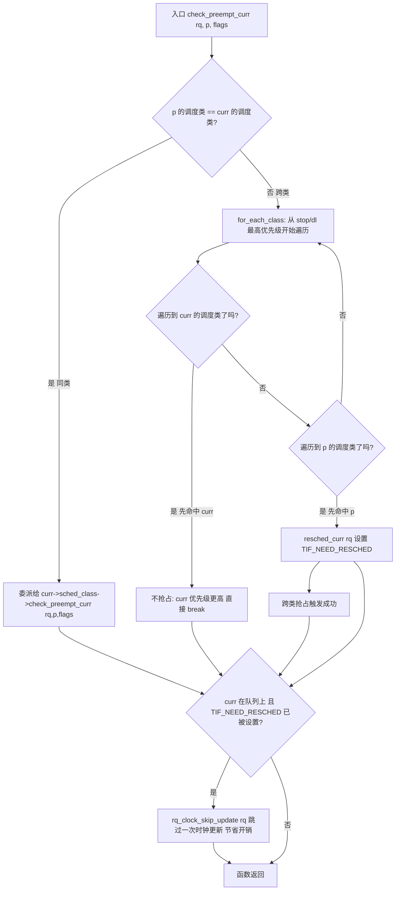
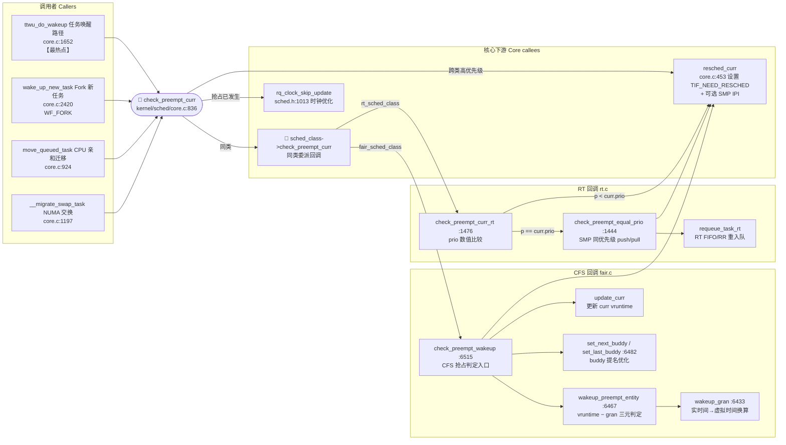

# 每日内核源码分析：check_preempt_curr

- **日期**：2026-09-04
- **子系统**：kernel/sched（进程调度）
- **源文件**：kernel/sched/core.c:836-859（Linux v4.19）
- **类型**：function

---

## 1. 功能作用

`check_preempt_curr` 是 Linux 调度器的**抢占检查统一入口函数**。每当一个新任务（`struct task_struct *p`）被放入某个 CPU 的运行队列（runqueue，`struct rq *rq`）时，内核都会调用本函数判断：**是否需要抢占当前正在该 CPU 上运行的任务（`rq->curr`）**。

### 解决的核心问题

调度器有五大调度类（scheduling class），它们按照严格的优先级顺序构成单向链表：

```
stop_sched_class → dl_sched_class → rt_sched_class → fair_sched_class → idle_sched_class
（优先级：高──────────────────────────────────────────────────────────────低）
```

- **stop**：最高优先级，用于 CPU 热插拔、migration 等紧急停机操作
- **dl**（Deadline）：SCHED_DEADLINE 实时调度，按绝对截止时间调度
- **rt**（Realtime）：SCHED_FIFO / SCHED_RR 实时调度，基于静态优先级
- **fair**（CFS）：SCHED_NORMAL / SCHED_BATCH，完全公平调度器，绝大多数用户进程
- **idle**：最低优先级，空闲进程（swapper）

当新任务入队时，存在两种场景：
1. **同调度类场景**：新任务与当前任务属于同一类 → 委托给该类自己的 `check_preempt_curr` 回调（CFS 比较虚拟运行时 vruntime，RT 比较静态优先级）。
2. **跨调度类场景**：两者不同类 → 利用 `for_each_class` 沿优先级链表从高到低遍历，**谁先被命中谁优先级更高**。如果新任务先被命中，则直接设置 `TIF_NEED_RESCHED` 标志触发抢占。

### 典型使用场景（何时被调用）

- **任务唤醒路径**（最常见）：`try_to_wake_up → ttwu_do_wakeup`，唤醒一个睡眠中的任务时立即检查能否抢占当前 CPU。
- **进程 Fork 路径**：`wake_up_new_task`，新进程首次入队，用 `WF_FORK` 标志区分。
- **CPU 亲和性迁移**：`move_queued_task`（如 `set_cpus_allowed_ptr` 或 CPU 下线），任务被移到新 CPU 后检查。
- **NUMA 负载均衡迁移**：`__migrate_swap_task`，NUMA balancing 将任务迁移到新 NUMA 节点的 CPU 后检查。

---

## 2. 关键数据结构

### 2.1 `struct rq` — 每 CPU 运行队列（`kernel/sched/sched.h`）

每颗 CPU 拥有一个独立的 `struct rq`，是调度器最核心的数据结构。本函数使用到的关键字段：

| 字段 | 类型 | 含义 |
|------|------|------|
| `rq->curr` | `struct task_struct *` | 当前正在该 CPU 上运行的任务（正在占用时间片） |
| `rq->clock` / `rq->clock_task` | `u64` | 运行队列时钟（单调递增，ns 级别）；`rq_clock_skip_update` 操作的对象 |
| `rq->cfs` | `struct cfs_rq` | 内嵌的 CFS 子队列（fair 类使用） |
| `rq->rt` | `struct rt_rq` | 内嵌的 RT 子队列 |
| `rq->idle` | `struct task_struct *` | 该 CPU 的 idle/swapper 进程（PID=0） |
| `rq->rd` | `struct root_domain *` | 所属的根调度域（SMP/负载均衡用） |

引用头文件：`kernel/sched/sched.h`

### 2.2 `struct task_struct` — 进程描述符（`include/linux/sched.h`）

本函数依赖的关键字段：

| 字段 | 类型 | 含义 |
|------|------|------|
| `p->sched_class` | `const struct sched_class *` | 该任务所属的调度类指针（决定了调度策略行为） |
| `p->se` | `struct sched_entity` | CFS 调度实体（包含 `vruntime` 虚拟运行时） |
| `p->rt` | `struct sched_rt_entity` | RT 调度实体（`rt_priority`、`run_list` 等） |
| `p->dl` | `struct sched_dl_entity` | Deadline 调度实体（`runtime`、`deadline`、`period`） |
| `p->policy` | `unsigned int` | 调度策略：`SCHED_NORMAL`(0) / `SCHED_FIFO`(1) / `SCHED_RR`(2) / `SCHED_BATCH`(3) / `SCHED_IDLE`(5) / `SCHED_DEADLINE`(6) |
| `p->prio` | `int` | 动态优先级（值越小优先级越高）：0-99 为实时，100-139 为 nice-20~nice+19 |
| `p->on_rq` | `unsigned int` | 是否在运行队列上：`TASK_ON_RQ_QUEUED`(1) / `TASK_ON_RQ_MIGRATING`(2) / 0(不在队列) |
| `p->flags` | `unsigned int` | 任务标志，如 `PF_WQ_WORKER`、`PF_KTHREAD` 等 |
| `thread_info::flags` | `unsigned long` | 线程标志，含 `TIF_NEED_RESCHED`（是否需要重新调度的核心标志） |

### 2.3 `struct sched_class` — 调度类操作表（`kernel/sched/sched.h:1504-1566`）

**调度器模块化设计的核心抽象**。每个调度类实现一套完整的"策略函数表"，通过 `next` 指针串联成**优先级有序链表**。本函数核心交互字段：

```c
struct sched_class {
    const struct sched_class *next;  // 指向次高优先级类
                                      // 顺序：stop → dl → rt → fair → idle

    void (*check_preempt_curr)(struct rq *rq, struct task_struct *p, int flags);
    // ↑ 本函数核心回调：同类场景下，委派给具体调度类判断是否抢占

    void (*enqueue_task)(...);   // 入队
    void (*dequeue_task)(...);   // 出队
    struct task_struct *(*pick_next_task)(...);  // 选下一个运行
    void (*task_tick)(...);      // 周期 tick 驱动（时间片检查）
    ...
};
```

**五个全局调度类实例**（链接顺序即优先级）：

```
&stop_sched_class → &dl_sched_class → &rt_sched_class → &fair_sched_class → &idle_sched_class → NULL
```

`for_each_class(class)` 宏从 `sched_class_highest`（stop 或 dl，取决于 CONFIG_SMP）开始沿 `next` 遍历，顺序即为**优先级从高到低**。

### 2.4 `struct sched_entity` — CFS 调度实体（`include/linux/sched.h`）

CFS 完全公平调度器的核心记账单位。`wakeup_preempt_entity` 抢占判断依赖：

| 字段 | 类型 | 含义 |
|------|------|------|
| `vruntime` | `u64` | **虚拟运行时**（virtual runtime），CFS 判断公平性的唯一依据；增长速度随任务 nice 值加权；值越小说明越"饥饿"越应先运行 |
| `load` | `struct load_weight` | 调度实体的权重（基于 nice 值映射） |
| `on_rq` | `int` | 该实体是否在 CFS 运行队列上 |
| `my_q` | `struct cfs_rq *` | 若为 group 调度，指向其子 cfs_rq |

### 2.5 关键标志与枚举

- `TIF_NEED_RESCHED`：线程信息标志，指示"此任务需要被调度出去"；由 `set_tsk_need_resched` 设置、`test_tsk_need_resched` 检查。是**抢占生效的唯一开关**。
- `TASK_ON_RQ_QUEUED` / `TASK_ON_RQ_MIGRATING`：`on_rq` 的状态值（分别为 1 和 2）。迁移期间任务临时处于 MIGRATING 状态。
- `WF_SYNC` / `WF_FORK` / `WF_MIGRATED`：wakeup flags，传递唤醒语义，影响 NEXT_BUDDY 标记和调度统计。

---

## 3. 核心逻辑流程图



### 流程图关键点逐条解读

1. **同类 vs 跨类的分支（节点 B）**：这是本函数最核心的设计区分。同类判断交由具体调度类自己实现（CFS 看 vruntime、RT 看 prio），跨类则用"遍历优先级链表谁先出现谁更高"的通用规则。两层设计实现了**策略与机制的分离**。

2. **同类委派（节点 C）**：直接调用 `rq->curr->sched_class->check_preempt_curr`，注意回调取的是 **curr** 的类而不是 p 的类。这是因为 curr 的类在运行队列上决定了当前的策略语义。实际行为：
   - CFS 类 → `check_preempt_wakeup`（fair.c:6515）：复杂，比较 vruntime 差值 vs wakeup_gran，考虑 buddy 优化。
   - RT 类 → `check_preempt_curr_rt`（rt.c:1476）：简单的 `p->prio < curr->prio` 即抢占。
   - DL 类 → deadline 优先级比较。

3. **跨类遍历（节点 D→F）**：`for_each_class` 从**最高优先级**类（stop 或 dl）开始沿 `next` 向下遍历。如果**先遇到 p 的类**，说明 p 的调度类比 curr 更高级（例如新入队的是 RT 任务而 curr 是普通 CFS），立即触发抢占。如果**先遇到 curr 的类**，则 curr 更高，无需处理。这种遍历实现非常简洁优雅，支持任意扩展新调度类（只需正确插入链表顺序）。

4. **resched_curr 抢占生效（节点 G）**：设置 TIF_NEED_RESCHED 标志是抢占的"软触发"。实际的抢占动作发生在下一处 `preempt_schedule_irq`（中断返回路径）或 `schedule()` 显式调用点。对于 SMP 跨 CPU 场景，`resched_curr` 会通过 `smp_send_reschedule` 发送 IPI 中断通知目标 CPU。

5. **时钟跳过优化（节点 H→I）**：如果函数执行完毕后 `TIF_NEED_RESCHED` 已经设置（无论来自同类回调的内部设置，还是跨类分支的 `resched_curr`），并且 curr 确实仍在队列上，就调用 `rq_clock_skip_update(rq)`。这是因为**紧接着就会发生一次 `schedule()`**，而 `schedule()` 内部会无条件更新 rq clock，此处再更新一次完全是冗余的"背对背"时钟更新，跳过可以节省 `sched_clock()` 的读取开销（尤其是虚拟化环境中读取 TSC/arch timer 成本高的场景）。

6. **边界场景隐含保护**：
   - 如果 curr 是 idle 进程（`rq->idle`），在 CFS 回调里会被无条件抢占（SCHED_IDLE 策略豁免除外）。
   - 如果 p == curr（自抢占），在 CFS 的回调开头 `if (unlikely(se == pse)) return` 会直接返回。
   - 如果 CFS 组被节流（`throttled_hierarchy`），CFS 回调也会提前返回，避免错误提名 buddy。

---

## 4. 调用关系

### 4.1 调用者（who calls me）

| 调用方函数 | 所在文件:行号 | 调用场景 |
|-----------|--------------|----------|
| `move_queued_task` | `kernel/sched/core.c:924` | **CPU 亲和性迁移**：任务因 `set_cpus_allowed_ptr` 修改允许 CPU 集合、或因 CPU 热插拔下线，被从源 rq 迁移到目标 rq。入队完成后，调用 `check_preempt_curr(rq, p, 0)`（flags=0，无特殊标记）判断新 CPU 的 curr 是否该被新迁移来的任务抢占。 |
| `__migrate_swap_task` | `kernel/sched/core.c:1197` | **NUMA 负载均衡任务交换**：NUMA balancing 检测到任务跨节点访问内存，在 `migrate_swap` 路径上将任务与目标节点上的另一个任务互换 CPU。在目标 dst_rq 激活后以 flags=0 调用，属于 NUMA hinting fault 场景下的调度触发。 |
| `ttwu_do_wakeup` | `kernel/sched/core.c:1652` | **常规任务唤醒（最热点路径）**：完整的 `try_to_wake_up` 唤醒流程末端。被唤醒的任务入队后，立即用 `wake_flags`（可能含 `WF_SYNC` 同步唤醒、`WF_MIGRATED` 跨 CPU 迁移等标志）调用本函数，是**抢占发生最频繁的调用点**，也是 CFS `check_preempt_wakeup` 中 buddy 优化的主要路径。 |
| `wake_up_new_task` | `kernel/sched/core.c:2420` | **新进程 Fork 首次启动**：`do_fork → _do_fork → copy_process → wake_up_new_task` 路径中完成子进程初始化、选择目标 CPU、激活任务后调用，使用 `WF_FORK` 标志标记该唤醒是 fork 场景。区别于普通唤醒，CFS 在该场景下不设置 `NEXT_BUDDY`（避免刚 fork 的子进程获得不合理的调度偏置），并会执行 `post_init_entity_util_avg` 初始化 EAS 利用率均值。 |

> 注：`check_class_changed`（core.c:823-834）是紧邻本函数的兄弟函数，在任务调度类或优先级变化时调用 `switched_from/switched_to/prio_changed` 回调，但它**不直接调用本函数**。

### 4.2 被调用者（who I call）

#### 核心路径调用

| 被调用函数 / 回调 | 所在文件 | 作用 |
|------------------|---------|------|
| `sched_class->check_preempt_curr` （同类委派） | 多态，见下 | 本函数的**核心语义实现**。同类场景下将判断权完全交给调度类。 |
| &nbsp;&nbsp;├─ `check_preempt_wakeup` | `kernel/sched/fair.c:6515-6596` | CFS 抢占判定：idle 特例 → 策略过滤 → `update_curr` → `wakeup_preempt_entity` vruntime/gran 比较 → 提名 NEXT_BUDDY / LAST_BUDDY |
| &nbsp;&nbsp;├─ `check_preempt_curr_rt` | `kernel/sched/rt.c:1476-1497` | RT 抢占判定：`p->prio < curr->prio` 直接抢占；相等优先级 + SMP 场景下调用 `check_preempt_equal_prio` 判断是否应触发 push/迁移 |
| &nbsp;&nbsp;├─ deadline 对应回调 | `kernel/sched/deadline.c` | Deadline 调度类的截止时间相对先后判定 |
| &nbsp;&nbsp;└─ idle / stop 对应回调 | `kernel/sched/idle.c` 等 | 特殊调度类的简单处理 |
| `resched_curr(rq)` | `kernel/sched/core.c:453-475` | **跨类抢占的唯一执行动作**。设置 `TIF_NEED_RESCHED` 和 `PREEMPT_NEED_RESCHED`，SMP 场景下若目标 CPU 非当前 CPU，还会通过 `smp_send_reschedule` 发送 RESCHEDULE IPI 或使用 polling 机制（`set_nr_and_not_polling`）唤醒目标 CPU 的 idle 状态。 |
| `rq_clock_skip_update(rq)` | `kernel/sched/sched.h:1013` | 性能微优化：通过设置 `rq->skip_clock_update` 标志位，跳过下一次 update_rq_clock，避免"抢占判定 → 立即 schedule"之间的冗余时钟读取。 |

#### 辅助调用（由调度类回调内部间接触发）

| 函数 | 文件 | 作用 |
|------|------|------|
| `wakeup_preempt_entity` | `kernel/sched/fair.c:6467-6480` | CFS 的**抢占判定数学核心**：计算 `vdiff = curr.vruntime - se.vruntime`，与 `wakeup_gran(se)`（唤醒粒度，随任务权重缩放）比较：`vdiff <= 0` 返回 -1（不抢占）；`vdiff > gran` 返回 1（抢占）；中间区间返回 0（留给 tick 处理）。 |
| `wakeup_gran` | `kernel/sched/fair.c:6433-6451` | 将 `sysctl_sched_wakeup_granularity` 实时间隔换算为任务 se 权重下的**虚拟运行时间隔**。关键设计：**对"较轻"的任务（小 weight=低 nice）施加更大的惩罚**，使其更难抢占或更容易被抢占，这对 buddy 机制中的优先级不对称非常重要。 |
| `update_curr` | `kernel/sched/fair.c` | 更新 curr 的 `sum_exec_runtime` 和 `vruntime`。在比较 vruntime 之前必须先更新，否则 vruntime 是过期的旧快照，判定会失真。 |
| `set_next_buddy` / `set_last_buddy` | `kernel/sched/fair.c:6482-6510` | 给 cfs_rq 提名 `next`/`last` buddy。`pick_next_entity` 时优先考虑 `next`（被抢占后应该运行的）和 `last`（被抢占后下次易切回的），减少红黑树的搜索开销。 |
| `calc_delta_fair` | `kernel/sched/fair.c` | 实际时间 → 虚拟时间的权重换算公式（`delta_exec * NICE_0_LOAD / se->load.weight`）。 |
| `test_tsk_need_resched` | `include/linux/sched.h` / `asm/thread_info.h` | 检查 `TIF_NEED_RESCHED` 标志。本函数和各类回调都频繁用它做"提前中断"优化，避免重复执行抢占逻辑。 |
| `check_preempt_equal_prio` | `kernel/sched/rt.c:1444-1469` | RT 调度下同优先级 SMP 场景的特殊处理：若 curr 可迁移、p 不可迁移，则重新入队 RT 任务 + resched 触发 push/pull 平衡。 |
| `requeue_task_rt` | `kernel/sched/rt.c` | RT 调度类的重新入队（移到同优先级队列尾部），配合 `check_preempt_equal_prio` 使用。 |

#### 宏 / 内联（影响性能或语义的关键展开点）

| 宏 / 内联 | 定义位置 | 语义要点 |
|----------|---------|---------|
| `for_each_class(class)` | `kernel/sched/sched.h:1583-1584` | 展开为 `for (class = sched_class_highest; class; class = class->next)`。**SMP 下起点是 `stop_sched_class`，UP 下起点是 `dl_sched_class`**（stop 仅在 SMP 的 migration stopper 需要时出现）。若移植代码忽略此差异，可能导致抢占判定顺序错乱。 |
| `sched_feat(X)` | `kernel/sched/sched.h` / `feat.h` | 调度特性静态键（sched feature）。`NEXT_BUDDY`、`LAST_BUDDY`、`WAKEUP_PREEMPTION` 都是可通过 `/sys/kernel/debug/sched_features` 动态开关的特性位，关闭会直接影响本函数驱动的抢占行为。 |
| `set_tsk_need_resched(tsk)` + `set_preempt_need_resched()` | `asm/thread_info.h` / `linux/preempt.h` | 实际展开为 `set_tsk_thread_flag(tsk, TIF_NEED_RESCHED)` + 本地抢占计数的 `PREEMPT_NEED_RESCHED` bit。设置两者的好处是：**抢占调度点既可以通过用户态返回/中断返回检查 thread_info flag，也可以在内核态的 `preempt_enable()` 快速路径中只检查本地 per-cpu 抢占 bit**，无需 dereference task_struct，大幅降低调度开销。 |
| `smp_send_reschedule(cpu)` | `arch/*/include/asm/smp.h` | 架构相关的 RESCHEDULE IPI 发送。在 ARM64 上通过 GIC 发 SG中断，在 x86 上发 APIC IPI；是跨 CPU 抢占的"硬件触发机制"。 |
| `entity_is_task(se)` | `kernel/sched/sched.h` | 判断 `sched_entity` 是 task-level 还是 group-level（cgroup 调度），影响 buddy 提名范围（组调度下需要 `for_each_sched_entity` 向上遍历每层 cfs_rq 设置 buddy）。 |
| `throttled_hierarchy(cfs_rq)` | `kernel/sched/fair.c` | CFS group 调度的带宽控制节流检查，被节流组即使 vruntime 很小也不能运行，提前避免错误提名 NEXT_BUDDY。 |

### 4.3 调用关系图（Mermaid）



---

## 5. 易错点 / 边界场景 / 设计权衡

### 5.1 「同类委派」取的是 curr 的类回调，而非 p 的类回调

源码中 `rq->curr->sched_class->check_preempt_curr(...)` 用的是 **curr** 的 `sched_class`。这乍看反直觉——"判断 p 能否抢占 curr，为什么不调 p 的类回调？"

**设计原因**：check_preempt_curr 回调里会访问当前 CPU 上正运行任务所在队列的状态（如 cfs_rq 的 last/next buddy、rt_rq 的优先级位图），这些上下文是**属于 curr 所在的 rq curr 槽位**的。从 curr 的类切入可以保证：回调内部读取的是 rq 上当前已执行过 update_curr/已有缓存的"热"状态。跨类场景不进入此分支（由通用链表遍历处理），因此不会出现"用错类"的情况。

但这意味着：**实现新调度类时，check_preempt_curr 回调必须能处理"p 可能与 curr 同类或异类"吗？答案是不会。**因为 check_preempt_curr 框架代码已保证进入回调时两者同类。

### 5.2 TIF_NEED_RESCHED ≠ 立即抢占，只是"登记"

很多初学者误以为 `resched_curr` 调完后 curr 立即被换下 CPU。实际上这只是**软标记**，真正的 context switch 发生在：
- 中断返回 / 异常返回 / 系统调用返回用户态前的 `preempt_schedule_irq` / `retint_user`
- 内核态显式调用 `schedule()` 或 `preempt_enable()` 末尾（`preempt_schedule`）
- idle 循环中显式检测 NEED_RESCHED 标志

这带来一个边界：**如果 curr 在关中断或关抢占的临界区里，即使标志已设置，抢占也要延迟到临界区退出点才会发生**。这也是 `check_preempt_curr` 被调用时必须持有 `rq->lock`（关抢占 + 关本地中断）的原因——保证 curr 状态和 rq 状态在抢占判定期间是稳定一致的。

### 5.3 SMP vs UP 下 for_each_class 起点不同导致的跨版本陷阱

`sched_class_highest` 宏定义：
```c
#ifdef CONFIG_SMP
#define sched_class_highest (&stop_sched_class)
#else
#define sched_class_highest (&dl_sched_class)
#endif
```

**迁移提示**：如果你的代码在 SMP 内核中运行，stop_sched_class 的 `next` 才是 dl_sched_class；在 UP 内核中遍历从 dl 开始。如果有人写出"手动索引 class 优先级数组"的代码而不是用 for_each_class，在 SMP/UP 切换时就会出现优先级判断错误。

### 5.4 CFS wakeup_gran 中"对 lighter task 惩罚"的不直观设计

`wakeup_gran` 使用 **p/se（被唤醒的新任务）** 的权重来换算虚拟粒度，而不是 curr 的权重：

```c
gran = calc_delta_fair(sysctl_sched_wakeup_granularity, se);  // se = p's entity
```

注释明确写了：**刻意用 se 而非 curr，从而对 lighter（低权重/high nice）任务施加更大惩罚**：
- 如果 se < curr（新任务更轻，权重更小）：`NICE_0_LOAD / se.load.weight` 更大 → gran 变大 → 更难触发 `vdiff > gran` → 轻任务更难抢占成功。
- 如果 se > curr（新任务更重，权重更大）：gran 变小 → 重任务更容易抢占。

**为什么这样设计？**因为 buddy 机制（NEXT_BUDDY 提名）本身已经给了被唤醒任务一个"跳过红黑树最小节点直接被 pick"的巨大优势。如果 wakeup_gran 再用 curr 的权重，低权重（nice 值高）的轻任务会因为 gran 过小而频繁打断高权重（nice 值低，重要）任务的运行，破坏优先级语义的预期。这个不对称的粒度缩放是维护"nice 优先级预期行为"的关键细节。

### 5.5 resched_curr 的 SMP IPI polling 优化

`resched_curr` 在跨 CPU 场景下并不总是发送 IPI：
```c
if (set_nr_and_not_polling(curr))
    smp_send_reschedule(cpu);
else
    trace_sched_wake_idle_without_ipi(cpu);  // 不发 IPI
```

如果目标 CPU 是 idle 状态且**正在 polling（idle 轮询 need_resched）**，则只更新标志位，目标 CPU 的 idle 循环自己会看到标志并进入 schedule。原因：发送 IPI 会打破 CPU 的低功耗 idle 状态并引入中断开销，对于 polling idle 来说是得不偿失的能耗浪费。

**这个优化和 check_preempt_curr 的关联**：大量任务唤醒场景中 curr CPU 处于 idle（典型的 server workload：单线程周期性计算 sleep/wakeup），此时若每次 wakeup 都发 IPI，能耗/尾延迟会很严重。

### 5.6 失败路径 / 资源回滚顺序

本函数本身不分配任何资源，调用前已持有 `rq->lock`，返回后 rq 仍保持锁定（由调用者负责释放）。需要注意的是：
- `resched_curr` 调用之前**必须已经持有 rq->lock**，内部 `lockdep_assert_held(&rq->lock)` 做了检查。
- SMP 场景下的调用者（如 move_queued_task）在解锁-锁新 rq 的过程中如果破坏了锁顺序，会触发 lockdep 告警。正确顺序由 `rq_lock / rq_unlock` 宏保证，不能用裸的 `spin_lock`。

### 5.7 rq_clock_skip_update 优化的前置条件

末尾的时钟跳过优化要求 `task_on_rq_queued(rq->curr)`，为什么？

因为 curr 可能已经**被 dequeue 但还在 CPU 上运行**（例如 `deactivate_task` 已调用但 context_switch 尚未完成的窗口），此时 curr 的 `on_rq == 0`，后续 schedule() 中对 curr 的时钟处理路径不同，不应该跳过 rq clock 更新。跳过只在 curr 确实还在队列上（典型唤醒抢占正常路径）时才安全。

---

## 附：核心源码片段

```c
// kernel/sched/core.c:836-859  (Linux v4.19)

void check_preempt_curr(struct rq *rq, struct task_struct *p, int flags)
{
	const struct sched_class *class;

	if (p->sched_class == rq->curr->sched_class) {
		/* 同调度类：委派给具体调度类自己的抢占判定回调
		 *   fair → check_preempt_wakeup (fair.c:6515)
		 *   rt   → check_preempt_curr_rt (rt.c:1476)
		 *   dl   → deadline 相应回调
		 */
		rq->curr->sched_class->check_preempt_curr(rq, p, flags);
	} else {
		/* 跨调度类：沿优先级链表遍历，谁先被命中谁优先级高 */
		for_each_class(class) {
			if (class == rq->curr->sched_class)
				break;                              /* curr 先命中 → curr 优先级更高，不抢占 */
			if (class == p->sched_class) {
				resched_curr(rq);                    /* p 先命中 → p 优先级更高，触发抢占 */
				break;
			}
		}
	}

	/*
	 * 队列事件已发生，马上会进入 schedule()。
	 * 此处节省一次背对背的 rq clock 更新：
	 * 如果 curr 仍在队列上 且 NEED_RESCHED 已设置，
	 * 就让 schedule() 内的 update_rq_clock() 去更新，
	 * 避免冗余的 sched_clock() 读取开销。
	 */
	if (task_on_rq_queued(rq->curr) && test_tsk_need_resched(rq->curr))
		rq_clock_skip_update(rq);
}
```

```c
// kernel/sched/core.c:453-475  resched_curr — 抢占触发的最终执行函数

void resched_curr(struct rq *rq)
{
	struct task_struct *curr = rq->curr;
	int cpu;

	lockdep_assert_held(&rq->lock);

	if (test_tsk_need_resched(curr))
		return;

	cpu = cpu_of(rq);

	if (cpu == smp_processor_id()) {
		set_tsk_need_resched(curr);          /* 设置 TIF_NEED_RESCHED 标志 */
		set_preempt_need_resched();          /* 设置本地 per-cpu PREEMPT bit（快速路径） */
		return;
	}

	if (set_nr_and_not_polling(curr))        /* 跨 CPU：idle polling 时不发 IPI 节能 */
		smp_send_reschedule(cpu);            /* 发 RESCHEDULE IPI 中断给目标 CPU */
	else
		trace_sched_wake_idle_without_ipi(cpu);
}
```

```c
// kernel/sched/fair.c:6467-6480  wakeup_preempt_entity — CFS vruntime 抢占判定数学核心

static int wakeup_preempt_entity(struct sched_entity *curr, struct sched_entity *se)
{
	s64 gran, vdiff = curr->vruntime - se->vruntime;

	if (vdiff <= 0)
		return -1;              /* curr 虚拟运行时更小或相等 → curr 更饿，不抢占 */

	gran = wakeup_gran(se);    /* 将 sysctl_sched_wakeup_granularity 按 se 权重换算为虚拟时间 */
	if (vdiff > gran)
		return 1;               /* se 比 curr 领先超过一个粒度 → 立即抢占 */

	return 0;                   /* 差距不大，留给 tick 周期检查处理 */
}
```

```c
// kernel/sched/fair.c:6515-6596  check_preempt_wakeup — CFS 同类抢占判定完整逻辑（节选）

static void check_preempt_wakeup(struct rq *rq, struct task_struct *p, int wake_flags)
{
	struct task_struct *curr = rq->curr;
	struct sched_entity *se = &curr->se, *pse = &p->se;
	struct cfs_rq *cfs_rq = task_cfs_rq(curr);
	int scale = cfs_rq->nr_running >= sched_nr_latency;
	int next_buddy_marked = 0;

	if (unlikely(se == pse))
		return;                                        /* 自抢占：直接跳过 */
	if (unlikely(throttled_hierarchy(cfs_rq_of(pse))))
		return;                                        /* p 所在 CFS 组被带宽节流：无法运行 */

	if (sched_feat(NEXT_BUDDY) && scale && !(wake_flags & WF_FORK)) {
		set_next_buddy(pse);  next_buddy_marked = 1;   /* 提名 p 为 pick_next 的首选 buddy */
	}
	if (test_tsk_need_resched(curr))
		return;                                        /* 已设 NEED_RESCHED：跳过冗余计算 */

	/* Idle curr 被非 idle 任务无条件抢占 */
	if (unlikely(curr->policy == SCHED_IDLE) && likely(p->policy != SCHED_IDLE))
		goto preempt;

	/* BATCH 策略 或 WAKEUP_PREEMPTION 特性关闭时不触发唤醒抢占 */
	if (unlikely(p->policy != SCHED_NORMAL) || !sched_feat(WAKEUP_PREEMPTION))
		return;

	find_matching_se(&se, &pse);                       /* 组调度：找到共同的 cfs_rq 层级 */
	update_curr(cfs_rq_of(se));                         /* 先更新 curr vruntime 到当前时刻 */
	if (wakeup_preempt_entity(se, pse) == 1) {          /* 核心 vruntime 判定 */
		if (!next_buddy_marked)
			set_next_buddy(pse);
		goto preempt;
	}
	return;

preempt:
	resched_curr(rq);                                     /* 触发抢占 */
	if (unlikely(!se->on_rq || curr == rq->idle))
		return;
	if (sched_feat(LAST_BUDDY) && scale && entity_is_task(se))
		set_last_buddy(se);                               /* 提名 curr 为 LAST buddy（切回更容易） */
}
```

```c
// kernel/sched/rt.c:1476-1497  check_preempt_curr_rt — RT 同类抢占判定

static void check_preempt_curr_rt(struct rq *rq, struct task_struct *p, int flags)
{
	if (p->prio < rq->curr->prio) {
		resched_curr(rq);      /* 简单的静态优先级比较：数值越小优先级越高 */
		return;
	}
#ifdef CONFIG_SMP
	/* SMP 下同优先级场景：push/pull 平衡式处理，避免 CPU 堆积同优先级 RT 任务 */
	if (p->prio == rq->curr->prio && !test_tsk_need_resched(rq->curr))
		check_preempt_equal_prio(rq, p);
#endif
}
```
