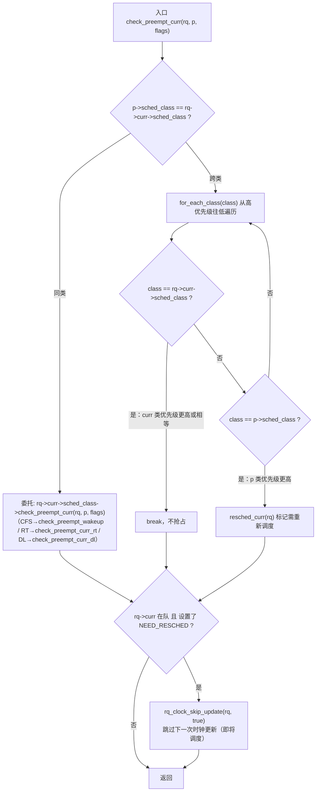
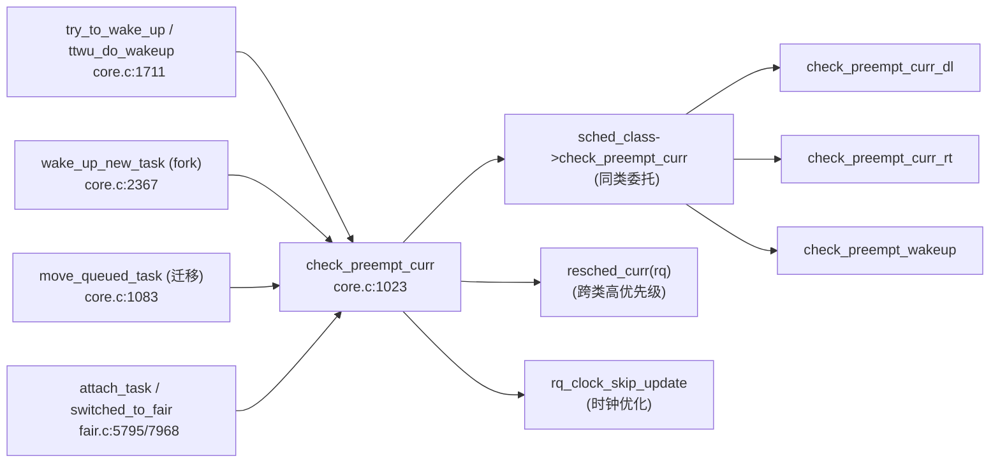

# 每日内核源码分析：check_preempt_curr

- **日期**：2026-09-05
- **子系统**：kernel/sched（进程调度）
- **源文件**：kernel/sched/core.c:1023-1046
- **类型**：function（全局函数，调度类抢占决策总入口）
- **内核版本**：Linux 4.3

---

## 1. 功能作用

`check_preempt_curr` 是 Linux 调度器中**「抢占决策的总入口」**。每当一个任务（`p`）被放入某个 CPU 的运行队列（runqueue）时，调度器都需要回答一个核心问题：

> 这个新入队的任务 `p`，是否应该抢占当前正在该 CPU 上运行的任务 `rq->curr`？

该函数正是这一决策的统一分发点。它本身不实现具体的抢占算法，而是根据「新任务 `p`」与「当前任务 `rq->curr`」所属的**调度类（sched_class）**是否相同，走两条截然不同的路径：

- **同类**：委托给该调度类自己的 `check_preempt_curr` 回调（例如 CFS 的 `check_preempt_wakeup`、RT 的 `check_preempt_curr_rt`、Deadline 的 `check_preempt_curr_dl`），由各类按自身策略判断。
- **跨类**：利用调度类链表按优先级从高到低遍历的特性，用一个非常巧妙的「先遇到谁就 break」的循环，判断 `p` 的类是否比 `curr` 的类优先级更高——若是则直接标记 `resched_curr` 触发抢占。

典型调用场景：
- 任务被唤醒（`try_to_wake_up` → `ttwu_do_wakeup`）
- fork 出新任务首次入队（`wake_up_new_task`）
- 任务在 CPU 间迁移后入队（`move_queued_task`、`migrate_swap_stop`）
- 任务切换调度类或优先级改变后重新入队（`attach_task`、`prio_changed`、`switched_to`）

---

## 2. 关键数据结构

### 2.1 `struct rq`（运行队列）
- 所在文件：`kernel/sched/sched.h`
- 关键字段：
  - `curr`：当前正在运行的 `task_struct`
  - `clock`、`clock_skip_update`：rq 时钟及跳过更新标志
  - `lock`：保护整个 runqueue 的自旋锁（`raw_spinlock_t`）
- 每个 CPU 一个 `rq`，通过 `cpu_rq(cpu)` 获取。

### 2.2 `struct task_struct`
- 关键字段：
  - `sched_class`：该任务所属的调度类指针
  - `prio`：动态优先级
  - `policy`：调度策略（`SCHED_NORMAL`/`SCHED_FIFO`/`SCHED_RR`/`SCHED_DEADLINE`/`SCHED_IDLE` 等）
  - `on_rq`：是否在 runqueue 上（`TASK_ON_RQ_QUEUED` / `TASK_ON_RQ_MIGRATING` / `0`）
  - `flags` 中的 `TIF_NEED_RESCHED`：需重新调度标志

### 2.3 `struct sched_class`（调度类）
- 所在文件：`kernel/sched/sched.h`
- 关键字段：
  - `void (*check_preempt_curr)(struct rq *rq, struct task_struct *p, int flags)`：本类的抢占判断回调
  - `const struct sched_class *next`：指向下一个（更低优先级）调度类
- 内核中调度类按优先级从高到低通过 `next` 指针串成单链表：

  ```
  stop_sched_class → dl_sched_class → rt_sched_class → fair_sched_class → idle_sched_class
  (最高)                                                              (最低)
  ```
- `sched_class_highest` 宏定义为 `&stop_sched_class`，`for_each_class` 从最高优先级开始遍历。

### 2.4 `flags` 参数（wake_flags）
- `WF_FORK`：来自 fork 路径（`wake_up_new_task`），CFS 的 `check_preempt_wakeup` 会据此跳过 `next_buddy` 设置。
- `WF_SYNC`、`WF_EXCLUSIVE` 等：唤醒语义标志，影响同类内的抢占决策。

---

## 3. 核心逻辑流程图



### 关键决策点解读

1. **同类委托**：同一调度类内部的抢占策略差异巨大（CFS 比较虚拟运行时间 vruntime、RT 比较静态优先级、DL 比较绝对截止时间），无法用统一逻辑表达，因此直接下放给各类自己的回调。

2. **跨类比较的「先遇先 break」技巧**：调度类链表严格按优先级从高到低排列。循环中若先遇到 `p->sched_class`，说明遍历还没走到 `curr` 的类就已经碰到了 `p`，即 `p` 的类比 `curr` 的类优先级高——抢占。反之若先遇到 `curr` 的类，则 `curr` 优先级不低于 `p`，不抢占。该逻辑用 O(类数量) 次比较完成跨类优先级判定，无需为每种类两两编码。

3. **`resched_curr` 的语义**：它并不立即切换任务，只是设置 `TIF_NEED_RESCHED` 标志并（跨核时）发送 reschedule IPI。真正的上下文切换发生在下一个 `schedule()` 调用点（通常是中断返回、系统调用返回或显式 `cond_resched`）。

4. **时钟跳过优化**：如果当前任务已被标记需要重新调度，说明马上会发生一次 `schedule()`，而 `schedule()` 内部会更新 rq 时钟，因此这里提前跳过一次时钟更新，避免连续两次 `update_rq_clock`。

---

## 4. 调用关系

### 4.1 调用者（who calls check_preempt_curr）

| 调用方 | 所在文件 | 调用场景 |
|--------|----------|----------|
| `ttwu_do_wakeup` | `kernel/sched/core.c:1711` | `try_to_wake_up` 唤醒任务后，判断是否抢占当前任务（最常见路径） |
| `wake_up_new_task` | `kernel/sched/core.c:2367` | fork 出新任务首次激活入队，携带 `WF_FORK` 标志 |
| `move_queued_task` | `kernel/sched/core.c:1083` | 任务跨 CPU 迁移，放入目标 rq 后判断抢占 |
| `migrate_swap_stop` | `kernel/sched/core.c:1314` | 任务交换（负载均衡 push/pull）后判断抢占 |
| `attach_task` | `kernel/sched/fair.c:5795` | CFS 组调度中任务 attach 到 cfs_rq 后判断抢占 |
| `prio_changed_fair` 区域 | `kernel/sched/fair.c:7887` | 任务优先级降低且非当前运行时，判断能否抢占 |
| `switched_to_fair` 区域 | `kernel/sched/fair.c:7968` | 任务从 RT 切换到 CFS 类后，判断能否抢占当前任务 |

### 4.2 被调用者（who check_preempt_curr calls）

- **核心路径调用**：
  - `rq->curr->sched_class->check_preempt_curr(rq, p, flags)` —— 同类时委托给具体调度类的抢占判断回调。
  - `resched_curr(rq)` —— 跨类且 `p` 优先级更高时，标记当前任务需重新调度。

- **辅助调用 / 宏**：
  - `for_each_class(class)` —— 从 `stop_sched_class` 开始沿 `next` 遍历所有调度类。
  - `task_on_rq_queued(rq->curr)` —— 判断当前任务是否在运行队列上。
  - `test_tsk_need_resched(rq->curr)` —— 测试 `TIF_NEED_RESCHED` 标志。
  - `rq_clock_skip_update(rq, true)` —— 设置 `rq->clock_skip_update`，跳过下一次时钟更新。

### 4.3 调度类回调实现（同类委托的下游）

| 调度类 | 回调实现 | 所在文件 |
|--------|----------|----------|
| `stop_sched_class` | `check_preempt_curr_stop` | `kernel/sched/stop_task.c:21` |
| `dl_sched_class` | `check_preempt_curr_dl` | `kernel/sched/deadline.c:328 / 1114` |
| `rt_sched_class` | `check_preempt_curr_rt` | `kernel/sched/rt.c:1414` |
| `fair_sched_class` | `check_preempt_wakeup` | `kernel/sched/fair.c:5049` |
| `idle_sched_class` | `check_preempt_curr_idle` | `kernel/sched/idle_task.c:21` |

### 4.4 调用关系图



---

## 5. 易错点 / 边界场景 / 设计权衡

1. **跨类比较的「相等」语义**：当 `p` 与 `curr` 属于同一类时走委托路径，跨类循环里不会出现 `class == p->sched_class` 且 `class == curr->sched_class` 同时成立的情况（因为第一分支已处理同类）。因此跨类循环只会命中其中之一，逻辑无歧义。

2. **`stop_sched_class` 的特殊地位**：`stop_sched_class` 是最高优先级类，用于 CPU 热插拔、任务迁移等内核-stop 场景。任何非 stop 类任务都不可能抢占 stop 任务；而 stop 任务唤醒时，跨类循环会立即命中 `p->sched_class == stop_sched_class`（即链表头），直接 `resched_curr`。

3. **`resched_curr` 与锁**：`check_preempt_curr` 的所有调用者都持有 `rq->lock`，`resched_curr` 内部 `lockdep_assert_held(&rq->lock)` 正是这一约定的校验。若在未持锁情况下调用会触发 lockdep 告警。

4. **SMP 跨核抢占的 IPI**：当 `p` 所在 rq 的 CPU 不是当前 CPU 时，`resched_curr` 会调用 `smp_send_reschedule(cpu)` 向目标 CPU 发送 reschedule IPI，使其在中断处理路径中触发 `schedule()`。这是 SMP 下「远程抢占」的实现方式。

5. **时钟跳过优化的前提**：`rq_clock_skip_update` 仅在 `rq->curr` 仍在队列上且已标记 `NEED_RESCHED` 时才生效。若当前任务已经被 dequeue（例如正在退出），则不跳过，以保持时钟准确。

6. **设计权衡——为什么不直接比较优先级数值？**：不同调度类的优先级空间不同（CFS 没有传统意义的 prio、RT 的 prio 越小越高、DL 用截止时间），无法用统一数值比较。调度类链表的顺序本身就编码了「类间优先级」，因此用链表遍历顺序代替数值比较，是一种干净的多态设计。

---

## 附：核心源码片段

```c
// kernel/sched/core.c:1023-1046  (Linux 4.3)

void check_preempt_curr(struct rq *rq, struct task_struct *p, int flags)
{
	const struct sched_class *class;

	if (p->sched_class == rq->curr->sched_class) {
		/* 同类：交给该调度类自己的抢占策略 */
		rq->curr->sched_class->check_preempt_curr(rq, p, flags);
	} else {
		/* 跨类：按调度类优先级从高到低遍历 */
		for_each_class(class) {
			if (class == rq->curr->sched_class)
				break;			/* curr 类优先级更高，不抢占 */
			if (class == p->sched_class) {
				resched_curr(rq);	/* p 类优先级更高，标记抢占 */
				break;
			}
		}
	}

	/*
	 * 即将发生调度，跳过下一次 rq 时钟更新，
	 * 避免连续两次 update_rq_clock 的开销。
	 */
	if (task_on_rq_queued(rq->curr) && test_tsk_need_resched(rq->curr))
		rq_clock_skip_update(rq, true);
}
```
