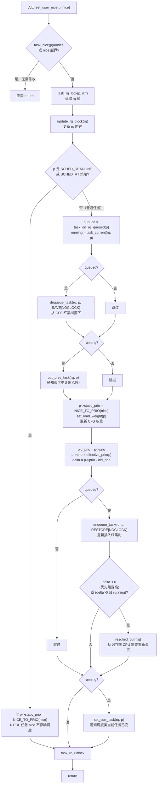
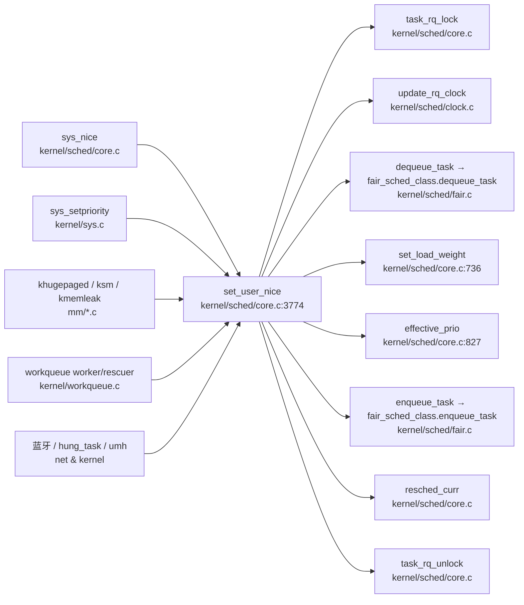

# 每日内核源码分析：set_user_nice

- **日期**：2026-09-06
- **子系统**：kernel/sched（进程调度）
- **源文件**：kernel/sched/core.c:3774-3827
- **类型**：function（EXPORT_SYMBOL 导出）
- **内核版本**：Linux 4.14.0

---

## 1. 功能作用

`set_user_nice()` 是 Linux 调度器中设置任务「动态优先级（nice 值）」的核心入口。它将用户态可见的 nice 值（范围 -20~19，越小优先级越高）转换为内核内部的 `static_prio`，并据此更新 CFS 调度类所需的负载权重 `load_weight`，从而影响任务在红黑树中的调度次序。

它是 `nice()` / `setpriority()` 两个系统调用的后端实现，同时也被大量内核线程自行调用以降低自身优先级，例如：
- 内存规整线程 `khugepaged`、KSM 内核线程；
- workqueue 的 worker 线程和 rescuer 线程；
- 蓝牙协议线程、hung_task、usermodehelper 等。

典型调用场景：用户通过 `renice` 命令或 `setpriority(PRIO_PROCESS, pid, nice)` 调整进程优先级时，最终会经由 `sys_setpriority` → `set_user_nice` 完成实际修改。

---

## 2. 关键数据结构

### 2.1 任务优先级相关字段（`struct task_struct`）

| 字段 | 含义 |
|------|------|
| `p->static_prio` | 静态优先级，由 nice 值决定，`NICE_TO_PRIO(nice) = nice + DEFAULT_PRIO` |
| `p->prio` | 当前有效优先级，可能受 PI（优先级继承）提升而高于 static_prio |
| `p->normal_prio` | 「正常优先级」，= static_prio（普通任务）或由调度类计算 |
| `p->policy` | 调度策略：`SCHED_NORMAL` / `SCHED_FIFO` / `SCHED_RR` / `SCHED_DEADLINE` / `SCHED_IDLE` |
| `p->se.load` | CFS 实体的负载权重（`struct load_weight`），决定红黑树中分得的时间片比例 |

### 2.2 优先级常量（`include/linux/sched/prio.h`）

```
MIN_NICE   = -20
MAX_NICE   =  19
NICE_WIDTH =  40
MAX_RT_PRIO = 100          (MAX_USER_RT_PRIO)
DEFAULT_PRIO = MAX_RT_PRIO + NICE_WIDTH/2 = 120
NICE_TO_PRIO(nice) = nice + DEFAULT_PRIO   // 静态优先级 = nice + 120
```

因此普通任务的 `static_prio` 范围是 **100 ~ 139**（nice -20 → 100，nice 19 → 139）。

### 2.3 `struct load_weight`（CFS 负载权重）

```c
struct load_weight {
    unsigned long weight;       // 权重值，来自 sched_prio_to_weight[prio]
    u32 inv_weight;             // weight 的倒数（2^32 / weight），用于快速除法
};
```

`set_load_weight()` 根据 `static_prio - MAX_RT_PRIO`（即 0~39）查表 `sched_prio_to_weight[]` 得到权重。nice=-20 对应最大权重 88761，nice=19 对应最小权重 15，nice=0 对应 1024。

### 2.4 `struct rq` 与 `struct rq_flags`

- `struct rq *rq`：任务所在 CPU 的运行队列，修改任务调度状态前必须持锁。
- `struct rq_flags rf`：保存锁标志（如是否关中断），`task_rq_lock` 填充，`task_rq_unlock` 恢复。

---

## 3. 核心逻辑流程图



### 关键决策点说明

1. **越界与幂等检查**：nice 值必须在 `[MIN_NICE, MAX_NICE]` 内；若与当前 nice 相同则直接返回，避免无意义的锁操作。
2. **RT/DL 任务的特殊处理**：实时（FIFO/RR）和截止时间（DEADLINE）任务的调度优先级由 `sched_setscheduler` 设定，nice 值仅记录到 `static_prio`，待其切回普通策略时才生效——因此走快速路径 `goto out_unlock`。
3. **dequeue → 修改 → enqueue 的「摘链-重插」模式**：CFS 用红黑树按 `vruntime` 排序，权重变化虽不直接改变 vruntime，但必须摘下再重插，以便调度类基于新权重重新计算；`DEQUEUE_SAVE | ENQUEUE_RESTORE` 保证 vruntime 不丢失。
4. **`DEQUEUE_NOCLOCK / ENQUEUE_NOCLOCK`**：函数开头已调用 `update_rq_clock(rq)`，内部 dequeue/enqueue 不再重复更新时钟，减少开销。
5. **`resched_curr` 的触发条件**：
   - `delta < 0`：新优先级数值更小 = 优先级更高，当前 CPU 上的任务可能需要被抢占；
   - `delta > 0 && running`：正在运行的任务优先级降低了，也应触发重新调度让更高优先级任务运行。
6. **`set_curr_task`**：若任务正在运行，权重/优先级变化需通知调度类（CFS 的 `set_curr_task_fair` 会更新 `min_vruntime` 等）。

---

## 4. 调用关系

### 4.1 调用者（who calls me）

| 调用方 | 所在文件 | 调用场景 |
|--------|----------|----------|
| `sys_nice` | `kernel/sched/core.c:3872` | `nice()` 系统调用，修改当前进程 nice |
| `set_one_prio` → `sys_setpriority` | `kernel/sys.c:178` | `setpriority()` 系统调用，按 PID/PGID/UID 改优先级 |
| `khugepaged` | `mm/khugepaged.c:1852` | 透明大页扫描线程，设为 MAX_NICE(19) 最低优先级 |
| `ksm_scan_thread` | `mm/ksm.c:2326` | KSM 合并线程，设 nice=5 |
| `kmemleak` 扫描线程 | `mm/kmemleak.c:1623` | 内存泄漏检测线程，设 nice=10 |
| `worker_attach_to_pool` | `kernel/workqueue.c:1784` | workqueue worker 继承 pool 的 nice 属性 |
| `rescuer_thread` | `kernel/workqueue.c:2300` | workqueue 救援线程，设 RESCUER_NICE_LEVEL |
| `watchdog`/`hung_task` 等内核线程 | `kernel/hung_task.c:241` | 恢复 nice=0 |
| `__call_usermodehelper` | `kernel/umh.c:77` | 用户态辅助进程，设 nice=0 |
| 蓝牙内核线程 | `net/bluetooth/bnep/core.c:488` | 蓝牙 BNEP 线程设 nice=-15（高优先级） |

### 4.2 被调用者（who I call）

**核心路径调用：**
- `task_rq_lock(p, &rf)` — 锁定任务所在 rq，返回 rq 指针并保存中断状态。
- `update_rq_clock(rq)` — 更新运行队列的 `clock` / `clock_task` 时间戳。
- `dequeue_task(rq, p, flags)` — 调用 `p->sched_class->dequeue_task` 将任务从调度类队列摘下。
- `put_prev_task(rq, p)` — 通知调度类当前任务即将被换下。
- `set_load_weight(p)` — 根据 `static_prio` 查表更新 `p->se.load.weight` 与 `inv_weight`。
- `effective_prio(p)` — 计算有效优先级（普通任务返回 normal_prio，RT 任务保持提升后的 prio）。
- `enqueue_task(rq, p, flags)` — 重插入调度类队列。
- `resched_curr(rq)` — 标记 `rq->curr` 的 `TIF_NEED_RESCHED`，触发重新调度。
- `set_curr_task(rq, p)` — 通知调度类当前任务属性变化。
- `task_rq_unlock(rq, p, &rf)` — 释放 rq 锁并恢复中断状态。

**宏 / 内联：**
- `NICE_TO_PRIO(nice)` — `nice + DEFAULT_PRIO`，静态优先级换算。
- `task_nice(p)` — `PRIO_TO_NICE(p->static_prio)`，反向换算。
- `task_has_dl_policy(p)` / `task_has_rt_policy(p)` — 判断调度策略。
- `task_on_rq_queued(p)` / `task_current(rq, p)` — 任务状态判断。

### 4.3 调用关系图（Mermaid）



---

## 5. 易错点 / 边界场景 / 设计权衡

1. **RT/DL 任务「改了 nice 却没效果」**：很多人误以为对实时任务调 nice 会改变其调度顺序，实际上 `set_user_nice` 对 `SCHED_FIFO/RR/DEADLINE` 任务只更新 `static_prio`，并不触动调度队列；必须等任务切回 `SCHED_NORMAL` 才会体现。这是设计有意为之——RT 优先级由 `sched_setscheduler` 独立管理。

2. **「摘链-重插」而不是原地修改**：CFS 的红黑树节点键是 `vruntime`，权重本身不是树的排序键，但 CFS 的 `dequeue_entity`/`enqueue_entity` 会处理 `cfs_rq->load` 的增减、`curr` 切换、`min_vruntime` 更新等。若不重插，`cfs_rq` 的总负载权重会与实际不一致，导致时间片分配错误。

3. **`DEQUEUE_SAVE | ENQUEUE_RESTORE` 的语义**：`DEQUEUE_SAVE` 让 dequeue 时保存当前 vruntime/exec_start 等状态，`ENQUEUE_RESTORE` 让 enqueue 时恢复而非重新初始化，避免任务在「摘下-修改-重插」期间丢失已累积的运行时间，防止优先级变更意外「刷新」任务的虚拟时间。

4. **`resched_curr` 的对称条件**：注意 `delta = p->prio - old_prio`。内核优先级数值越小优先级越高，所以：
   - `delta < 0` → 优先级升高 → 需要抢占当前 CPU；
   - `delta > 0 && running` → 正在运行的任务自己降了优先级 → 应让更高优先级者运行。
   非 running 的任务降优先级（`delta > 0 && !running`）不需要 resched，因为它本来就没在运行。

5. **锁的粒度与 `task_rq_lock`**：`set_user_nice` 全程持 `rq->lock`（自旋锁），这是因为要原子地完成「摘链-改权重-重插-可选 resched」。该锁会关中断（由 `rq_flags` 保存），因此临界区内不能睡眠、不能调用可能阻塞的函数。

6. **`update_rq_clock` 的位置**：在持锁后、dequeue 前调用一次，随后所有 dequeue/enqueue 都用 `NOCLOCK` 标志跳过时钟更新——既保证调度实体时间统计准确，又避免重复更新带来的开销。

---

## 附：核心源码片段

```c
// kernel/sched/core.c:3774-3827  (Linux 4.14.0)
void set_user_nice(struct task_struct *p, long nice)
{
    bool queued, running;
    int old_prio, delta;
    struct rq_flags rf;
    struct rq *rq;

    if (task_nice(p) == nice || nice < MIN_NICE || nice > MAX_NICE)
        return;
    /*
     * We have to be careful, if called from sys_setpriority(),
     * the task might be in the middle of scheduling on another CPU.
     */
    rq = task_rq_lock(p, &rf);
    update_rq_clock(rq);

    /*
     * The RT priorities are set via sched_setscheduler(), but we still
     * allow the 'normal' nice value to be set - but as expected
     * it wont have any effect on scheduling until the task is
     * SCHED_DEADLINE, SCHED_FIFO or SCHED_RR:
     */
    if (task_has_dl_policy(p) || task_has_rt_policy(p)) {
        p->static_prio = NICE_TO_PRIO(nice);
        goto out_unlock;
    }
    queued = task_on_rq_queued(p);
    running = task_current(rq, p);
    if (queued)
        dequeue_task(rq, p, DEQUEUE_SAVE | DEQUEUE_NOCLOCK);
    if (running)
        put_prev_task(rq, p);

    p->static_prio = NICE_TO_PRIO(nice);
    set_load_weight(p);
    old_prio = p->prio;
    p->prio = effective_prio(p);
    delta = p->prio - old_prio;

    if (queued) {
        enqueue_task(rq, p, ENQUEUE_RESTORE | ENQUEUE_NOCLOCK);
        /*
         * If the task increased its priority or is running and
         * lowered its priority, then reschedule its CPU:
         */
        if (delta < 0 || (delta > 0 && task_running(rq, p)))
            resched_curr(rq);
    }
    if (running)
        set_curr_task(rq, p);
out_unlock:
    task_rq_unlock(rq, p, &rf);
}
EXPORT_SYMBOL(set_user_nice);
```
