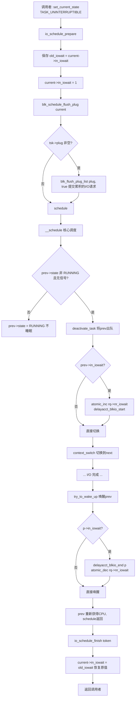
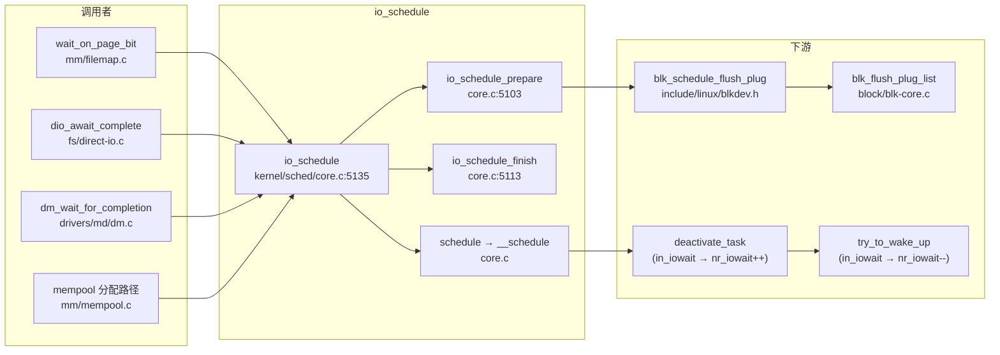

# 每日内核源码分析：io_schedule

- **日期**：2026-09-07
- **子系统**：kernel/sched（调度器核心）
- **源文件**：kernel/sched/core.c:5135-5143
- **类型**：function（导出符号 EXPORT_SYMBOL）
- **内核版本**：Linux 4.19.0

---

## 1. 功能作用

`io_schedule()` 是 Linux 调度器提供的一个**辅助睡眠原语**，用于进程即将因等待块设备 I/O 而主动让出 CPU 的场景。

它解决的核心问题是：**让调度器和进程计账子系统准确识别"处于 I/O 等待状态"的任务**。普通的 `schedule()` 只是让当前任务睡眠，但调度器并不知道它是在等 I/O；而 `io_schedule()` 在睡眠前后设置/清除 `current->in_iowait` 标志，使得：

- 该任务被出队时，其所在 runqueue 的 `nr_iowait` 计数 +1，唤醒时 -1；
- 块 I/O 延迟计账（delay accounting）在睡眠开始时启动、唤醒时结束；
- `/proc/stat` 中的 iowait 时间统计、负载均衡中对不可中断睡眠任务的负载计算都能正确反映 I/O 等待。

典型使用场景：文件系统等待页面锁/回写位（`mm/filemap.c` 的 `wait_on_page_bit`）、块设备驱动等待请求完成（`drivers/md/dm.c`）、直接 I/O 路径（`fs/direct-io.c`）、内存池（`mm/mempool.c`）等。共有 **40 处**直接调用点，分布在 mm/、fs/、drivers/ 中。

---

## 2. 关键数据结构

### `struct task_struct` 中的相关字段（include/linux/sched.h）

| 字段 | 类型 | 含义 |
|------|------|------|
| `in_iowait` | `unsigned :1`（位域） | 标记当前任务是否处于 I/O 等待状态。仅由 `current` 自身修改，无需锁保护。 |
| `state` | `volatile long` | 任务状态。`io_schedule` 要求调用者已将 state 设为 `TASK_(UN)INTERRUPTIBLE`。 |
| `plug` | `struct blk_plug *` | 块层 plug 结构指针，睡眠前需刷新其中累积的请求。 |
| `sched_contributes_to_load` | `unsigned` | 唤醒时由 `task_contributes_to_load()` 计算，TASK_UNINTERRUPTIBLE 且非 frozen/NOLOAD 的任务计入负载。 |

> `task_contributes_to_load(task)` 宏（sched.h:110）判断条件：`state & TASK_UNINTERRUPTIBLE` 且非 `PF_FROZEN` 且非 `TASK_NOLOAD`。处于 D 状态的 I/O 等待任务通常计入负载。

### `struct rq` 中的 `nr_iowait`（kernel/sched/sched.h:835）

```c
atomic_t nr_iowait;  /* 该 runqueue 上处于 iowait 的任务数 */
```

- 入队（deactivate）时若 `prev->in_iowait` 为真则 `atomic_inc`；
- 唤醒（try_to_wake_up）时若 `p->in_iowait` 为真则 `atomic_dec`；
- 全局读取函数：`nr_iowait()` 遍历所有 CPU 的 `nr_iowait` 求和；`nr_iowait_cpu(cpu)` 读单 CPU。

### `struct blk_plug`（include/linux/blkdev.h:1318）

块层的"插头"结构，用于将多个 I/O 请求批量合并后再提交给设备，以降低 request_queue 锁竞争。字段：
- `list`：传统 block 请求链表；
- `mq_list`：blk-mq 请求链表；
- `cb_list`：unplug 回调链表（device-mapper 等使用）。

### delay accounting 相关

`delayacct_blkio_start()` / `delayacct_blkio_end(p)`（include/linux/delayacct.h）：
- 在任务因 I/O 睡眠时启动块 I/O 延迟统计，唤醒时结束；
- 数据记入 `task_struct.delayacct`，可通过 taskstats 接口读取。

---

## 3. 核心逻辑流程图

`io_schedule()` 本身只有 6 行，但它与 `__schedule()`、`try_to_wake_up()` 共同构成完整的 I/O 等待生命周期：



**关键决策点说明：**

1. **为什么先 flush plug 再 schedule？** 如果任务的 `plug` 链表中还有未提交的 I/O 请求，带着请求睡眠会导致这些请求无人提交、可能死等。因此睡眠前必须先把 plug 中的请求刷到设备队列。
2. **`in_iowait` 必须在 `schedule()` 之前设置**：因为 `__schedule()` 在 `deactivate_task` 时检查 `prev->in_iowait` 来决定是否递增 `nr_iowait`。若先 schedule 再设置，就来不及了。
3. **唤醒时在 `try_to_wake_up` 中递减 `nr_iowait`**：保证从睡眠到唤醒期间 `nr_iowait` 计数准确，用于 iowait 统计和负载均衡。
4. **`token` 机制实现嵌套安全**：`io_schedule_prepare` 返回旧值，`io_schedule_finish` 恢复旧值。若任务在已经处于 iowait 时再次调用 `io_schedule`，不会错误地清除标志。
5. **`signal_pending_state` 短路**：若睡眠前收到致命信号，`__schedule` 会把状态改回 `TASK_RUNNING` 并不出队，此时 `nr_iowait` 不会递增——避免错误计账。

---

## 4. 调用关系

### 4.1 调用者（who calls io_schedule）

内核 4.19 中 `io_schedule()` 共有 **40 处**直接调用点，以下列出代表性调用方：

| 调用方 | 所在文件 | 调用场景 |
|--------|----------|----------|
| `wait_on_page_bit` | mm/filemap.c:1100 | 等待页面某 bit（如 PG_locked / PG_writeback）清零，最常见的页 I/O 等待 |
| `dio_await_complete` | fs/direct-io.c:522 | 直接 I/O 等待异步 bio 完成 |
| `dm_wait_for_completion` | drivers/md/dm.c:2401 | Device Mapper 等待目标设备请求完成 |
| `mempool_alloc` 路径 | mm/mempool.c | 内存池分配失败时等待元素回池 |
| `xfs_buf_hold` / `xfs_ilock` | fs/xfs/xfs_buf.c, fs/xfs/xfs_inode.c | XFS 等待缓冲区锁 / inode 锁 |
| `wait_on_bit` | kernel/sched/wait_bit.c | 通用位等待，间接调用 io_schedule_timeout |
| `drbd` / `dm-bufio` / `dm-integrity` | drivers/block/drbd/, drivers/md/ | 块层驱动等待 I/O |

此外 `io_schedule_timeout()` 有 9 处调用，用于带超时的 I/O 等待。

### 4.2 被调用者（who io_schedule calls）

```c
void io_schedule(void)
{
    int token;
    token = io_schedule_prepare();   // 设置 in_iowait + flush plug
    schedule();                      // 核心调度器，让出 CPU
    io_schedule_finish(token);       // 恢复 in_iowait
}
```

- **核心路径调用**：
  - `io_schedule_prepare()`（core.c:5103）：保存旧 `in_iowait`，置 1，调用 `blk_schedule_flush_plug(current)`。
  - `schedule()`（core.c）：`__schedule` 的封装，执行真正的上下文切换。
  - `io_schedule_finish(int token)`（core.c:5113）：`current->in_iowait = token`。
- **辅助调用**：
  - `blk_schedule_flush_plug(tsk)` → `blk_flush_plug_list(plug, true)`：提交块层 plug 中累积的请求。
- **间接（在 schedule 内部）**：
  - `deactivate_task()` → 检查 `prev->in_iowait` → `atomic_inc(&rq->nr_iowait)` + `delayacct_blkio_start()`。
  - 唤醒路径 `try_to_wake_up()` → `delayacct_blkio_end(p)` + `atomic_dec(&rq->nr_iowait)`。

### 4.3 调用关系图



---

## 5. 易错点 / 边界场景 / 设计权衡

1. **必须先 set_current_state 再调用 io_schedule**：`io_schedule` 本身不修改 `current->state`。若调用者忘记把状态设为 `TASK_UNINTERRUPTIBLE`/`TASK_INTERRUPTIBLE`，`schedule()` 发现 state 为 RUNNING 会立即返回，任务根本不会睡眠，导致 busy loop。这是驱动开发中最常见的 bug。

2. **`in_iowait` 是严格的 `current` 私有字段**：注释明确写着 "Unserialized, strictly 'current'"，只能由任务自身修改。唤醒路径只能读 `p->in_iowait` 来递减 `nr_iowait`，不能写。这避免了跨 CPU 写同一任务字段的缓存一致性开销。

3. **token 恢复机制防嵌套**：若一个已经在 iowait 的任务（如被 wait_bit 间接嵌套）再次走 io_schedule 路径，`prepare` 返回旧值 1，`finish` 恢复为 1，不会错误清零。这保证了 `nr_iowait` 的递增/递减配对只发生在外层。

4. **flush plug 的 `from_schedule=true` 参数**：`blk_schedule_flush_plug` 调用 `blk_flush_plug_list(plug, true)`，第二个参数 `from_schedule` 为真表示"因调度而冲刷"，此时不会重新 plug（普通 `blk_finish_plug` 用 false）。

5. **iowait 不等于 D 状态**：`in_iowait` 是独立于 `state` 的标志。一个任务可以是 `TASK_UNINTERRUPTIBLE` 但 `in_iowait=0`（如等待非 I/O 资源的 mutex），此时不计入 `nr_iowait`；反之 `io_schedule` 保证 iowait 计账准确。

6. **与 `schedule_timeout` 的关系**：`io_schedule_timeout(timeout)` 是带超时的版本，内部用 `schedule_timeout` 替代 `schedule`，其余 prepare/finish 逻辑相同。`io_schedule()` 本质上是 `io_schedule_timeout(MAX_SCHEDULE_TIMEOUT)` 的特例（但实现上分别写，省去超时参数传递）。

---

## 附：核心源码片段

```c
// kernel/sched/core.c:5103-5143  (Linux 4.19.0)

int io_schedule_prepare(void)
{
    int old_iowait = current->in_iowait;

    current->in_iowait = 1;
    blk_schedule_flush_plug(current);

    return old_iowait;
}

void io_schedule_finish(int token)
{
    current->in_iowait = token;
}

/*
 * This task is about to go to sleep on IO. Increment rq->nr_iowait so
 * that process accounting knows that this is a task in IO wait state.
 */
long __sched io_schedule_timeout(long timeout)
{
    int token;
    long ret;

    token = io_schedule_prepare();
    ret = schedule_timeout(timeout);
    io_schedule_finish(token);

    return ret;
}
EXPORT_SYMBOL(io_schedule_timeout);

void io_schedule(void)
{
    int token;

    token = io_schedule_prepare();
    schedule();
    io_schedule_finish(token);
}
EXPORT_SYMBOL(io_schedule);
```

```c
// __schedule 中 in_iowait → nr_iowait 递增  (kernel/sched/core.c:3426)
if (prev->in_iowait) {
    atomic_inc(&rq->nr_iowait);
    delayacct_blkio_start();
}

// try_to_wake_up 中 in_iowait → nr_iowait 递减  (kernel/sched/core.c:2031)
if (p->in_iowait) {
    delayacct_blkio_end(p);
    atomic_dec(&task_rq(p)->nr_iowait);
}
```
