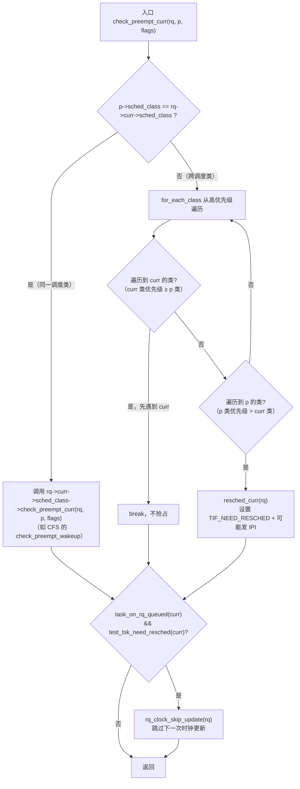
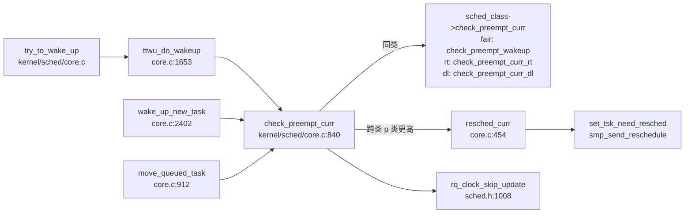

# 每日内核源码分析：check_preempt_curr

- **日期**：2026-09-08
- **子系统**：kernel/sched（进程调度）
- **源文件**：kernel/sched/core.c:840-863
- **类型**：function
- **内核版本**：Linux 4.19.325

---

## 1. 功能作用

`check_preempt_curr` 是 Linux 调度器"唤醒抢占（wakeup preemption）"机制的总入口。当一个任务 `p` 被加入到某个 CPU 的运行队列 `rq` 之后（无论是被唤醒、fork 产生，还是从其他 CPU 迁移过来），内核都会调用本函数来判断：**这个新就绪的任务 `p` 是否应该抢占当前正在该 CPU 上运行的任务 `rq->curr`**。

核心解决的问题：
- 调度器需要在任务状态变化（进入 runnable）的第一时间做出"是否抢占"的决策，而不是被动等待下一个调度 tick。
- 如果应该抢占，则设置当前任务的 `TIF_NEED_RESCHED` 标志，使内核在下一个可抢占点（preemption point）触发 `__schedule()` 切换到更高优先级的任务。
- 该函数是**调度类（sched_class）多态抢占判断**的统一分发器：同类比较交给具体调度类的 `check_preempt_curr` 方法；跨类比较则依据调度类的全局优先级链表快速裁决。

典型调用场景：
1. `try_to_wake_up()` → `ttwu_do_wakeup()` 唤醒一个睡眠任务时。
2. `wake_up_new_task()` 新进程 fork 完成后首次入队时（带 `WF_FORK` 标志）。
3. 任务在 CPU 间迁移（`move_queued_task`、push/pull balance）后入队到目标 rq 时。

---

## 2. 关键数据结构

### 2.1 `struct rq`（运行队列，kernel/sched/sched.h）

每 CPU 一个的运行队列，是调度器的核心数据结构。本函数用到的关键字段：

| 字段 | 含义 |
|------|------|
| `rq->curr` | 当前正在该 CPU 上运行的 `task_struct` |
| `rq->lock` | 保护运行队列的 `raw_spinlock`，调用本函数时必须持有 |
| `rq->clock_update_flags` | 时钟更新标志位，`rq_clock_skip_update` 会设置 `RQCF_REQ_SKIP` 以跳过下一次时钟更新 |
| `rq->idle` | 该 CPU 的 idle 任务 |

### 2.2 `struct sched_class`（调度类操作表，kernel/sched/sched.h:1506）

调度器以"调度类"实现多态，每个类（stop/dl/rt/fair/idle）提供一个 `struct sched_class` 实例，通过 `next` 指针串成**按优先级从高到低**的链表：

```
stop_sched_class → dl_sched_class → rt_sched_class → fair_sched_class → idle_sched_class
```

与本函数相关的方法：

```c
void (*check_preempt_curr)(struct rq *rq, struct task_struct *p, int flags);
```

各调度类的具体实现：
- `fair_sched_class.check_preempt_curr = check_preempt_wakeup`（CFS，基于 vruntime 比较）
- `rt_sched_class.check_preempt_curr = check_preempt_curr_rt`（实时，基于优先级）
- `dl_sched_class.check_preempt_curr = check_preempt_curr_dl`（deadline，基于截止时间）
- `stop_sched_class.check_preempt_curr = check_preempt_curr_stop`
- `idle_sched_class.check_preempt_curr = check_preempt_curr_idle`

### 2.3 `struct task_struct` 关键字段

| 字段 | 含义 |
|------|------|
| `p->sched_class` | 任务所属的调度类指针 |
| `p->prio` | 调度优先级 |
| `p->policy` | 调度策略（SCHED_NORMAL / SCHED_RR / SCHED_FIFO / SCHED_DEADLINE / SCHED_IDLE / SCHED_BATCH） |
| `p->se` | CFS 调度实体 `sched_entity`（CFS 类用其 vruntime 做抢占比较） |

### 2.4 关键宏与内联

- `for_each_class(class)`：从最高优先级类 `sched_class_highest` 开始沿 `next` 遍历所有调度类。
- `task_on_rq_queued(rq->curr)`：判断当前任务是否仍在运行队列上（`on_rq == TASK_ON_RQ_QUEUED`）。
- `test_tsk_need_resched(curr)`：测试 `TIF_NEED_RESCHED` 标志。
- `rq_clock_skip_update(rq)`：设置 `RQCF_REQ_SKIP`，跳过下一次 `update_rq_clock`，因为即将调度，避免连续两次无意义的时钟更新。

---

## 3. 核心逻辑流程图



### 关键决策点解读

1. **同类 vs 跨类分流**：同一调度类内部的抢占策略由该类自行决定（CFS 看 vruntime、RT 看静态优先级、DL 看 deadline）；不同类之间则只需比较类的全局优先级。
2. **跨类裁决的方向**：`for_each_class` 从最高优先级（stop）向最低（idle）遍历。若先遇到 `p` 的类，说明 `p` 的类比 `curr` 的类优先级高，应当抢占；若先遇到 `curr` 的类，则 `curr` 优先级不低于 `p`，不抢占。
3. **resched_curr 的作用**：仅设置 `TIF_NEED_RESCHED` 标志，**不立即切换**。若目标 CPU 不是当前 CPU，还会通过 `smp_send_reschedule` 发 IPI 触发远程 CPU 的重新调度。
4. **时钟跳过优化**：一旦 `curr` 已经被标记需要重新调度，说明马上会进入 `__schedule()`，届时会统一更新 rq 时钟；因此这里跳过一次 `update_rq_clock`，避免"先更新时钟、紧接着调度时又更新"的连续开销。

---

## 4. 调用关系

### 4.1 调用者（who calls me）

| 调用方 | 所在文件 | 调用场景 |
|--------|----------|----------|
| `ttwu_do_wakeup` | `kernel/sched/core.c:1656` | `try_to_wake_up` 主唤醒路径，任务从睡眠转为 runnable |
| `wake_up_new_task` | `kernel/sched/core.c:2429` | fork 完成后新任务首次入队（flags = `WF_FORK`） |
| `move_queued_task` | `kernel/sched/core.c:928` | 任务迁移到目标 CPU 后重新入队 |
| `__migrate_task` 路径 | `kernel/sched/core.c:1201` | `set_cpus_allowed` / CPU 离线导致的迁移 |
| `attach_tasks` 等 | `kernel/sched/fair.c:7449,9911,10049` | CFS 组调度任务重新挂载后检查抢占 |

### 4.2 被调用者（who I call）

- **核心路径调用**：
  - `rq->curr->sched_class->check_preempt_curr(rq, p, flags)` —— 同类抢占判断（最常见为 `check_preempt_wakeup`）。
  - `resched_curr(rq)` —— 设置 `TIF_NEED_RESCHED`，必要时发送 reschedule IPI。
- **辅助调用**：
  - `rq_clock_skip_update(rq)` —— 跳过下一次 rq 时钟更新。
  - `task_on_rq_queued(rq->curr)` / `test_tsk_need_resched(rq->curr)` —— 标志位判断内联。

### 4.3 CFS 同类抢占 `check_preempt_wakeup` 要点

当 `p` 与 `curr` 同属 fair 类时，由 `check_preempt_wakeup`（kernel/sched/fair.c:6685）完成精细判断：
1. 若 `curr` 是 `SCHED_IDLE` 而 `p` 不是 → 直接抢占。
2. 若 `p` 不是 `SCHED_NORMAL`（如 SCHED_BATCH）或未开启 `WAKEUP_PREEMPTION` → 不抢占（由 tick 驱动）。
3. 调用 `wakeup_preempt_entity(se, pse)` 比较 `curr` 与 `p` 的 vruntime：若 `p` 的 vruntime 更小（更应该运行）且超过 `sysctl_sched_wakeup_granularity` 阈值 → 抢占。
4. 抢占时设置 `next_buddy`（让 `pick_next_task_fair` 优先选 `p`）；被抢占者设置 `last_buddy`（下次尽量回到它）。

### 4.4 调用关系图



---

## 5. 易错点 / 边界场景 / 设计权衡

1. **抢占是"延迟"而非"立即"**：`check_preempt_curr` 只设置 `TIF_NEED_RESCHED`，真正的上下文切换发生在下一个抢占点（内核态返回用户态、中断返回、`cond_resched` 等）。理解这一点对分析"为什么唤醒了高优先级任务但它没立刻运行"至关重要。

2. **调用者必须持有 `rq->lock`**：`resched_curr` 内部有 `lockdep_assert_held(&rq->lock)`。所有调用点（`ttwu_do_wakeup`、`wake_up_new_task`、`move_queued_task`）都在持有 rq 锁的情况下调用。

3. **跨 CPU 抢占需要 IPI**：当 `rq` 属于其他 CPU 时，`resched_curr` 会调用 `smp_send_reschedule(cpu)` 发送处理器间中断，迫使目标 CPU 进入调度路径。这是 SMP 下唤醒抢占能及时生效的关键。

4. **`WF_FORK` 标志的影响**：fork 唤醒新任务时传入 `WF_FORK`，CFS 的 `check_preempt_wakeup` 中会跳过 `set_next_buddy`（避免新 fork 的任务不公正地抢占父进程）。

5. **时钟跳过优化的前提**：`rq_clock_skip_update` 只在 `task_on_rq_queued(curr) && test_tsk_need_resched(curr)` 时执行。若 `curr` 已经不在队列上（如正在被 dequeue），则不能跳过，否则后续 `pick_next_task` 读取的时钟会过期。

6. **跨类裁决不调用子类方法**：不同调度类之间的抢占完全由类的全局优先级决定，不会调用 `curr` 或 `p` 的类方法。这保证了 DL 永远能抢占 RT，RT 永远能抢占 CFS，避免了跨类语义歧义。

7. **与 `scheduler_tick` 的互补**：`check_preempt_curr` 处理"事件驱动"的抢占（任务变为 runnable 的瞬间）；而 `scheduler_tick` 处理"时间片驱动"的抢占（周期性检查当前任务是否耗尽时间片）。两者共同构成完整的抢占机制。

---

## 附：核心源码片段

```c
// kernel/sched/core.c:840-863
void check_preempt_curr(struct rq *rq, struct task_struct *p, int flags)
{
	const struct sched_class *class;

	if (p->sched_class == rq->curr->sched_class) {
		/* 同一调度类：交给该类的抢占判断方法 */
		rq->curr->sched_class->check_preempt_curr(rq, p, flags);
	} else {
		/* 跨调度类：按类优先级链表裁决 */
		for_each_class(class) {
			if (class == rq->curr->sched_class)
				break;          /* curr 类优先级 ≥ p 类，不抢占 */
			if (class == p->sched_class) {
				resched_curr(rq);  /* p 类优先级更高，标记需重新调度 */
				break;
			}
		}
	}

	/*
	 * 队列事件已发生且即将调度，跳过一次无意义的连续时钟更新。
	 */
	if (task_on_rq_queued(rq->curr) && test_tsk_need_resched(rq->curr))
		rq_clock_skip_update(rq);
}
```
