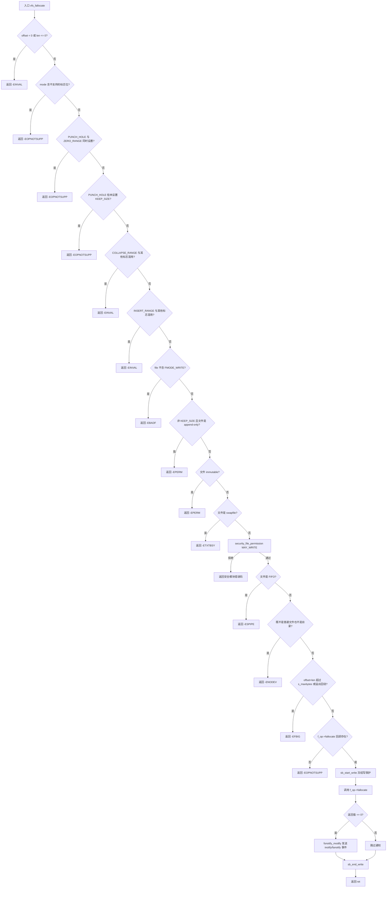
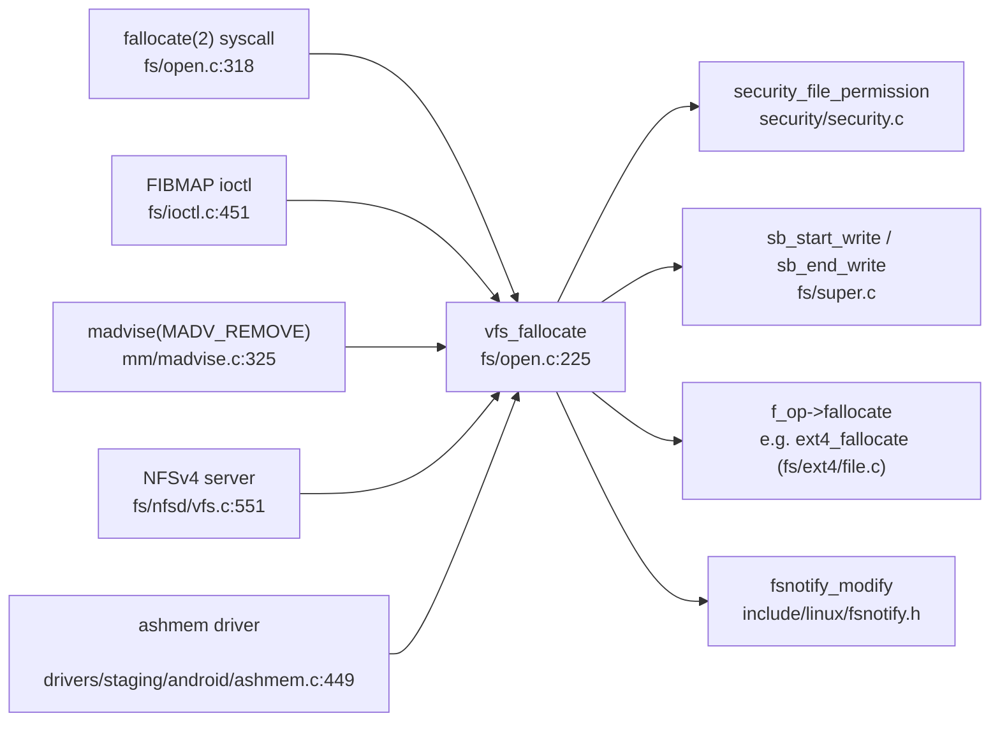

# 每日内核源码分析：vfs_fallocate

- **日期**：2026-09-09
- **子系统**：fs（虚拟文件系统 VFS）
- **源文件**：fs/open.c:225-315
- **类型**：function
- **内核版本**：Linux 4.1.6

---

## 1. 功能作用

`vfs_fallocate` 是 VFS 层处理 **fallocate（文件空间预分配 / 打洞 / 清零 / 折叠 / 插入范围）** 操作的统一入口函数。

它对来自用户态的 `fallocate(2)` 系统调用以及内核内部其他子系统（如 `madvise(MADV_REMOVE)`、`FIBMAP` ioctl、NFSv4 服务端、Android ashmem）发起的 fallocate 请求做**集中式参数校验与权限检查**，然后通过 `file->f_op->fallocate` 回调把具体实现下沉到具体文件系统（如 ext4 的 `ext4_fallocate`、XFS 的 `xfs_file_fallocate`）。

典型使用场景：
- 数据库 / 虚拟机镜像预先分配磁盘空间，避免运行时碎片化与 ENOSPC。
- `PUNCH_HOLE` 释放文件中间某段的物理块（稀疏文件打洞）。
- `ZERO_RANGE` 将一段范围清零而不改变文件大小。
- `COLLAPSE_RANGE` / `INSERT_RANGE` 在文件中间物理移除或插入一段数据（用于去重、压缩等）。

---

## 2. 关键数据结构

### 2.1 函数签名

```c
int vfs_fallocate(struct file *file, int mode, loff_t offset, loff_t len)
```

| 参数 | 类型 | 含义 |
|------|------|------|
| `file` | `struct file *` | 已打开的文件对象 |
| `mode` | `int` | fallocate 操作模式，由 `FALLOC_FL_*` 标志组合而成 |
| `offset` | `loff_t` | 操作起始字节偏移（必须 >= 0） |
| `len` | `loff_t` | 操作长度（必须 > 0） |

返回值：`0` 成功；负数为 errno（`-EINVAL` / `-EOPNOTSUPP` / `-EBADF` / `-EPERM` / `-ETXTBSY` / `-ESPIPE` / `-ENODEV` / `-EFBIG` 等）。

### 2.2 `struct file`（include/linux/fs.h）

- `f_mode`：文件访问模式，含 `FMODE_WRITE` 位，用于校验是否可写。
- `f_op`：`struct file_operations *`，其中的 `.fallocate` 回调由具体文件系统提供。
- `f_inode`：通过内联 `file_inode(file)` 取得对应的 `struct inode`。

### 2.3 `struct inode`

- `i_flags`：inode 标志位，通过 `IS_APPEND` / `IS_IMMUTABLE` / `IS_SWAPFILE` 宏判断文件属性。
  - `S_APPEND`：仅追加文件（chattr +a）。
  - `S_IMMUTABLE`：不可变文件（chattr +i）。
  - `S_SWAPFILE`：正作为交换区使用的文件。
- `i_mode`：文件类型与权限，通过 `S_ISREG` / `S_ISDIR` / `S_ISFIFO` 判断文件类型。
- `i_sb`：指向所属 `struct super_block`。

### 2.4 `struct super_block`

- `s_maxbytes`：该文件系统支持的最大文件大小，用于 `offset + len` 越界检查。

### 2.5 `FALLOC_FL_*` 模式标志（include/uapi/linux/falloc.h）

| 标志 | 值 | 语义 |
|------|----|------|
| `FALLOC_FL_KEEP_SIZE` | 0x01 | 不扩展 i_size（预分配但不改变文件大小） |
| `FALLOC_FL_PUNCH_HOLE` | 0x02 | 释放范围内的物理块（打洞），必须与 KEEP_SIZE 同用 |
| `FALLOC_FL_NO_HIDE_STALE` | 0x04 | 保留位，不使用 |
| `FALLOC_FL_COLLAPSE_RANGE` | 0x08 | 折叠范围，必须单独使用 |
| `FALLOC_FL_ZERO_RANGE` | 0x10 | 将范围清零，与 PUNCH_HOLE 互斥 |
| `FALLOC_FL_INSERT_RANGE` | 0x20 | 插入范围，必须单独使用 |

`FALLOC_FL_SUPPORTED_MASK` 为内核支持的标志全集，任何超出该集合的位都会导致 `-EOPNOTSUPP`。

---

## 3. 核心逻辑流程图



**关键决策点说明：**

1. **标志互斥校验**（D/G/F）：`PUNCH_HOLE` 与 `ZERO_RANGE` 语义冲突；`COLLAPSE_RANGE` 和 `INSERT_RANGE` 涉及文件偏移重排，必须独占使用，避免组合后语义不明。
2. **`PUNCH_HOLE` 必须带 `KEEP_SIZE`**（E）：打洞操作不应缩减文件大小，否则相当于截断，需走 truncate 路径。
3. **追加文件的特殊处理**（I）：append-only 文件只能做"纯预分配"（带 `KEEP_SIZE`），不能扩展 `i_size`，否则违反追加语义。
4. **swapfile 保护**（K）：活动交换区的物理块布局不能被改变，否则会破坏 swap，返回 `-ETXTBSY`。
5. **安全模块二次校验**（L）：文件打开后安全策略可能变化，这里用 `security_file_permission(file, MAY_WRITE)` 重新确认写权限。
6. **`s_maxbytes` 越界检查**（O）：`offset + len` 不能超过文件系统支持的最大文件大小，同时检测整数溢出回绕（`(offset + len) < 0`）。
7. **冻结写保护**（Q/V）：`sb_start_write` / `sb_end_write` 对 superblock 加写访问计数，防止文件系统在操作期间被冻结（`S_FREEZE`）或卸载。

---

## 4. 调用关系

### 4.1 调用者（who calls me）

| 调用方 | 所在文件 | 调用场景 |
|--------|----------|----------|
| `SYSCALL_DEFINE4(fallocate)` | `fs/open.c:324` | `fallocate(2)` 系统调用主入口 |
| `ioctl_preallocate` | `fs/ioctl.c:451` | `FIBMAP` ioctl 预分配路径（32 位兼容走 `compat_ioctl_preallocate`） |
| `madvise` (MADV_REMOVE 分支) | `mm/madvise.c:325` | `madvise(2)` 的 `MADV_REMOVE`，释放文件映射范围内的物理页 |
| `nfsd4_vfs_fallocate` | `fs/nfsd/vfs.c:551` | NFSv4 服务端处理 `ALLOCATE` / `DEALLOCATE` 操作 |
| `ashmem_ioctl` | `drivers/staging/android/ashmem.c:449` | Android ashmem 驱动的 `ASHMEM_PIN` 等操作 |

### 4.2 被调用者（who I call）

- **核心路径调用**：
  - `file->f_op->fallocate(file, mode, offset, len)`：文件系统具体实现，如 `ext4_fallocate`（`fs/ext4/file.c`）、`xfs_file_fallocate`（`fs/xfs/xfs_file.c`）。
- **辅助调用**：
  - `file_inode(file)`：内联，取 `file->f_inode`。
  - `security_file_permission(file, MAY_WRITE)`：LSM 安全模块写权限校验。
  - `sb_start_write(sb)` / `sb_end_write(sb)`：superblock 写访问冻结保护（`SB_FREEZE_WRITE` 级别）。
  - `fsnotify_modify(file)`：发送 inotify / fanotify 文件修改事件。
- **宏 / 内联**：
  - `IS_APPEND` / `IS_IMMUTABLE` / `IS_SWAPFILE`：inode 标志判断。
  - `S_ISREG` / `S_ISDIR` / `S_ISFIFO`：文件类型判断。
  - `FALLOC_FL_SUPPORTED_MASK`、`FALLOC_FL_*`：模式标志。

### 4.3 调用关系图（Mermaid）



---

## 5. 易错点 / 边界场景 / 设计权衡

1. **`offset + len` 溢出检查**：`loff_t` 是有符号 64 位，`offset + len` 可能溢出回绕为负数。代码用 `(offset + len) < 0` 同时检测溢出，并用 `> inode->i_sb->s_maxbytes` 检测超过文件系统上限，两个条件任一成立即返回 `-EFBIG`。

2. **`PUNCH_HOLE` 与 `ZERO_RANGE` 互斥**：前者释放物理块（读回零），后者保留物理块但内容清零。同时设置语义矛盾，内核直接拒绝，避免文件系统实现出现歧义。

3. **`COLLAPSE_RANGE` / `INSERT_RANGE` 必须独占**：这两个操作会改变文件后续数据的物理偏移（折叠会移除一段并把后面数据前移；插入会在中间插入空洞并把后面数据后移），与其他标志组合后行为未定义，故强制独占。

4. **append-only 文件只允许 `KEEP_SIZE`**：`IS_APPEND` 文件本应只能追加写入；若 fallocate 不带 `KEEP_SIZE`，可能通过预分配改变 `i_size`，破坏追加语义，因此返回 `-EPERM`。

5. **swapfile 返回 `-ETXTBSY` 而非 `-EPERM`**：活动交换区正在被内核使用，错误码 `ETXTBSY`（"文本文件忙"）准确表达"资源被占用"。

6. **`fsnotify_modify` 始终在成功时触发**：即便 `FALLOC_FL_KEEP_SIZE` 没有改变文件大小，只要 fallocate 成功就发送修改事件，简化事件逻辑（注释明确说明这一设计取舍）。

7. **`sb_start_write` 而非 `inode_lock`**：这里用 superblock 冻结级别保护而非 inode 互斥锁，是因为具体文件系统的 `f_op->fallocate` 内部会自行管理 `i_mutex`/`i_rwsem`，VFS 层只需要保证文件系统不会在操作中被 freeze/remount-ro。

8. **`security_file_permission` 二次校验的必要性**：文件以写权限打开后，LSM 策略（如 SELinux）可能动态变化，因此在执行实际修改前重新校验 `MAY_WRITE`，防止权限提升。

---

## 附：核心源码片段

```c
// fs/open.c:225-315
int vfs_fallocate(struct file *file, int mode, loff_t offset, loff_t len)
{
	struct inode *inode = file_inode(file);
	long ret;

	if (offset < 0 || len <= 0)
		return -EINVAL;

	/* Return error if mode is not supported */
	if (mode & ~FALLOC_FL_SUPPORTED_MASK)
		return -EOPNOTSUPP;

	/* Punch hole and zero range are mutually exclusive */
	if ((mode & (FALLOC_FL_PUNCH_HOLE | FALLOC_FL_ZERO_RANGE)) ==
	    (FALLOC_FL_PUNCH_HOLE | FALLOC_FL_ZERO_RANGE))
		return -EOPNOTSUPP;

	/* Punch hole must have keep size set */
	if ((mode & FALLOC_FL_PUNCH_HOLE) &&
	    !(mode & FALLOC_FL_KEEP_SIZE))
		return -EOPNOTSUPP;

	/* Collapse range should only be used exclusively. */
	if ((mode & FALLOC_FL_COLLAPSE_RANGE) &&
	    (mode & ~FALLOC_FL_COLLAPSE_RANGE))
		return -EINVAL;

	/* Insert range should only be used exclusively. */
	if ((mode & FALLOC_FL_INSERT_RANGE) &&
	    (mode & ~FALLOC_FL_INSERT_RANGE))
		return -EINVAL;

	if (!(file->f_mode & FMODE_WRITE))
		return -EBADF;

	/*
	 * We can only allow pure fallocate on append only files
	 */
	if ((mode & ~FALLOC_FL_KEEP_SIZE) && IS_APPEND(inode))
		return -EPERM;

	if (IS_IMMUTABLE(inode))
		return -EPERM;

	/*
	 * We cannot allow any fallocate operation on an active swapfile
	 */
	if (IS_SWAPFILE(inode))
		return -ETXTBSY;

	/*
	 * Revalidate the write permissions, in case security policy has
	 * changed since the files were opened.
	 */
	ret = security_file_permission(file, MAY_WRITE);
	if (ret)
		return ret;

	if (S_ISFIFO(inode->i_mode))
		return -ESPIPE;

	/*
	 * Let individual file system decide if it supports preallocation
	 * for directories or not.
	 */
	if (!S_ISREG(inode->i_mode) && !S_ISDIR(inode->i_mode))
		return -ENODEV;

	/* Check for wrap through zero too */
	if (((offset + len) > inode->i_sb->s_maxbytes) || ((offset + len) < 0))
		return -EFBIG;

	if (!file->f_op->fallocate)
		return -EOPNOTSUPP;

	sb_start_write(inode->i_sb);
	ret = file->f_op->fallocate(file, mode, offset, len);

	/*
	 * Create inotify and fanotify events.
	 *
	 * To keep the logic simple always create events if fallocate succeeds.
	 * This implies that events are even created if the file size remains
	 * unchanged, e.g. when using flag FALLOC_FL_KEEP_SIZE.
	 */
	if (ret == 0)
		fsnotify_modify(file);

	sb_end_write(inode->i_sb);
	return ret;
}
EXPORT_SYMBOL_GPL(vfs_fallocate);
```
