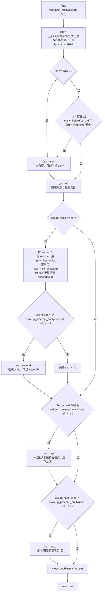
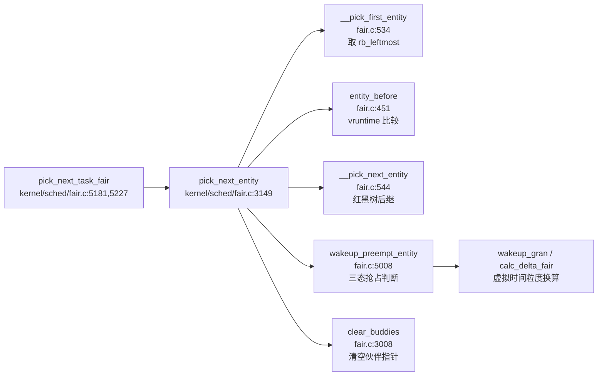

# 每日内核源码分析：pick_next_entity

- **日期**：2026-09-10
- **子系统**：kernel/sched（CFS 调度器）
- **源文件**：kernel/sched/fair.c:3148-3197
- **类型**：function
- **内核版本**：Linux 4.3

---

## 1. 功能作用

`pick_next_entity` 是 **CFS（Completely Fair Scheduler，完全公平调度器）** 的核心挑选函数。每当调度器需要为某个 CPU 选择下一个运行的任务时，都会经由 `pick_next_task_fair` 调用到它。

CFS 的核心思想是"完全公平"：每个可运行实体（`sched_entity`）都维护一个虚拟运行时间 `vruntime`，谁的 `vruntime` 最小，谁就最"该"运行。所有实体按 `vruntime` 有序地挂在一棵红黑树（`tasks_timeline`）上。`pick_next_entity` 的职责就是：

1. 从红黑树中取出最左节点（`vruntime` 最小者）作为候选；
2. 兼顾当前正在运行的实体 `curr`（它不在树中，被单独摘出）；
3. 在不破坏公平性的前提下，优先照顾三个"伙伴"（buddy）指针——`next`（有人强烈希望它运行）、`last`（被抢占的任务，缓存友好）、`skip`（本次想跳过的任务）；
4. 返回最终选中的调度实体。

典型使用场景：每次发生调度（`schedule()` → `__schedule()` → 各调度类的 `pick_next_task`）时，CFS 类的 `pick_next_task_fair` 会层层下钻到叶子 `cfs_rq`，调用 `pick_next_entity` 选出真正要运行的任务。

---

## 2. 关键数据结构

### `struct cfs_rq`（CFS 运行队列，定义于 `kernel/sched/sched.h`）

```c
struct cfs_rq {
    struct load_weight load;
    unsigned int nr_running, h_nr_running;
    u64 exec_clock;
    u64 min_vruntime;            /* 该 cfs_rq 的最小虚拟时间基准 */
    struct rb_root tasks_timeline;/* 红黑树根，所有可运行实体按 vruntime 排序 */
    struct rb_node *rb_leftmost;  /* 最左节点缓存（最常访问，避免每次遍历） */
    struct sched_entity *curr, *next, *last, *skip; /* 4 个关键指针 */
    ...
};
```

四个 sched_entity 指针的语义：

| 指针 | 含义 | 设置者 |
|------|------|--------|
| `curr` | 当前正在该 cfs_rq 上运行的实体（不在红黑树中） | `set_next_entity` |
| `next` | "下一个"伙伴——唤醒路径中有人希望它立刻运行 | `set_next_buddy` |
| `last` | "上一个"伙伴——被抢占的任务，恢复它可获得缓存局部性 | `set_last_buddy` |
| `skip` | "跳过"伙伴——本次不希望调度它 | `set_skip_buddy` |

### `struct sched_entity`（调度实体）

关键字段：

- `vruntime`：虚拟运行时间，CFS 排序的唯一依据；
- `run_node`：挂入 `cfs_rq->tasks_timeline` 的红黑树节点；
- `on_rq`：是否仍在运行队列中（运行中的实体 `on_rq=1` 但已从树中摘除）；
- `load.weight`：权重，决定 `vruntime` 增长速率（权重大 → 增长慢 → 更易被选中）。

### 红黑树支撑结构

- `struct rb_root` / `struct rb_node`：内核通用红黑树（`include/linux/rbtree.h`）；
- `rb_entry(node, type, member)`：从红黑树节点反查宿主结构。

### 全局参数

- `sysctl_sched_wakeup_granularity`：唤醒抢占粒度（纳秒），用于判断一个实体是否"足够领先"到可以抢占。

---

## 3. 核心逻辑流程图



**关键决策点说明：**

1. **最左节点优先**：CFS 的公平性体现在永远选 `vruntime` 最小者。`rb_leftmost` 缓存把这个操作从 O(log n) 降到 O(1)。
2. **curr 必须纳入比较**：当前运行实体 `curr` 不在红黑树里（`set_next_entity` 时被摘除），但它仍在消耗 CPU 时间，`vruntime` 在增长。如果它的 `vruntime` 反而比树中最左节点还小，说明它还没"轮到"被抢占，应当继续运行它。
3. **skip 伙伴的跳过逻辑**：若理想候选恰好是 `skip`，尝试找"第二选择" `second`。只有当 `second` 不会带来明显不公（`wakeup_preempt_entity < 1`，即 second 的 vruntime 不比 left 大太多）时才替换。
4. **last 与 next 的优先级**：注释明确按顺序——先 `last`（缓存局部性）后 `next`（有人希望运行）。`next` 优先级最高，会覆盖 `last` 的选择。
5. **`wakeup_preempt_entity` 的三态返回值**：`-1` 表示 `se` 落后于 `curr`（不应抢占）、`0` 表示相差在粒度内（持平）、`1` 表示 `se` 领先超过粒度（应抢占）。这里用 `< 1` 表示"只要不明显落后即可"，是一种宽松比较。
6. **`clear_buddies` 收尾**：选中 `se` 后，把 `se` 对应的 `last/next/skip` 指针清空，避免下次循环误用。

---

## 4. 调用关系

### 4.1 调用者（who calls me）

| 调用方 | 所在文件 | 调用场景 |
|--------|----------|----------|
| `pick_next_task_fair` | `kernel/sched/fair.c:5181` | 组调度快速路径：传入 `curr`，在不整体 put/set 整棵 cgroup 树的前提下逐层挑选 |
| `pick_next_task_fair` | `kernel/sched/fair.c:5227` | 简单路径（非公平类前一任务 / 无组调度优化）：传入 `NULL`，每层直接取最左 |

> `pick_next_task_fair` 本身由 `fair_sched_class.pick_next_task` 注册，在 `__schedule` → `pick_next_task` 中被调用，是 CFS 类对外的挑选入口。

### 4.2 被调用者（who I call）

**核心路径调用：**

- `__pick_first_entity(cfs_rq)`：返回 `cfs_rq->rb_leftmost` 对应的 `sched_entity`，即树中 vruntime 最小者（O(1)）。
- `entity_before(a, b)`：`(s64)(a->vruntime - b->vruntime) < 0`，判断 a 是否比 b 更"该"运行。
- `__pick_next_entity(se)`：调用 `rb_next` 取红黑树中序后继，用于找 skip 的"第二选择"。
- `wakeup_preempt_entity(curr, se)`：比较 `curr` 与 `se` 的 vruntime 差距是否超过 `wakeup_gran`，返回 -1/0/1。
- `clear_buddies(cfs_rq, se)`：若 `se` 是 `last/next/skip` 之一，调用对应的 `__clear_buddies_*` 清零。

**辅助调用（间接）：**

- `wakeup_gran(curr, se)` → `calc_delta_fair(gran, se)`：将实时唤醒粒度换算为 `se` 权重下的虚拟时间粒度，"惩罚"轻量任务。

### 4.3 调用关系图（Mermaid）



---

## 5. 易错点 / 边界场景 / 设计权衡

1. **curr 不在红黑树中**：这是 CFS 的一个关键设计——正在运行的实体会被 `set_next_entity` 从 `tasks_timeline` 中摘除（`__dequeue_entity`），只保留在 `cfs_rq->curr`。因此 `__pick_first_entity` 只能看到树中等待的实体，必须额外比较 `curr`，否则会错误地抢占一个 vruntime 仍最小的当前任务。

2. **`wakeup_preempt_entity` 返回值的语义陷阱**：返回 `-1`（se 落后）、`0`（持平，在粒度内）、`1`（se 领先超粒度）。`pick_next_entity` 中用的是 `< 1`，即"只要不是显著领先就允许替换为 buddy"。这与 `check_preempt_wakeup` 中用 `== 1` 判断"是否应当抢占"恰好相反，阅读时需注意上下文。

3. **三个 buddy 的覆盖顺序**：`skip → last → next` 依次判断，后者覆盖前者。也就是说 `next` 优先级最高。这对应注释中的优先级：公平性 > next（有人想跑）> last（缓存）> skip（跳过）。但 `next` 和 `last` 都要通过 `wakeup_preempt_entity(..., left) < 1` 的公平性闸门，保证不会为了照顾 buddy 而让一个 vruntime 大很多的实体插队。

4. **`rb_leftmost` 缓存的维护成本**：`__pick_first_entity` 之所以 O(1)，全靠 `rb_leftmost` 缓存。但该缓存必须在 `__enqueue_entity`（插入时若为最左则更新）和 `__dequeue_entity`（删除的恰是最左则用 `rb_next` 更新）中精确维护。一旦不同步，CFS 的"最左即最小"不变式就会被破坏。

5. **`entity_before` 用 `s64` 强转比较**：`vruntime` 是 `u64`，直接相减可能溢出。用 `(s64)(a->vruntime - b->vruntime) < 0` 是内核中处理无符号循环计数的惯用手法——只要两者差距不超过 2^63，结果就正确。这与 jiffies 比较的 `time_before` 宏原理一致。

6. **skip 伙伴的 second 选择分支**：当 `se == curr` 时，`second` 取 `__pick_first_entity`（树中最左）；否则取 `__pick_next_entity(se)`（se 在树中的后继）。这个分支区别是因为 `curr` 不在树中，不能对它调用 `rb_next`。

---

## 附：核心源码片段

```c
// kernel/sched/fair.c:3148-3197  (Linux 4.3)

/*
 * Pick the next process, keeping these things in mind, in this order:
 * 1) keep things fair between processes/task groups
 * 2) pick the "next" process, since someone really wants that to run
 * 3) pick the "last" process, for cache locality
 * 4) do not run the "skip" process, if something else is available
 */
static struct sched_entity *
pick_next_entity(struct cfs_rq *cfs_rq, struct sched_entity *curr)
{
	struct sched_entity *left = __pick_first_entity(cfs_rq);
	struct sched_entity *se;

	/*
	 * If curr is set we have to see if its left of the leftmost entity
	 * still in the tree, provided there was anything in the tree at all.
	 */
	if (!left || (curr && entity_before(curr, left)))
		left = curr;

	se = left; /* ideally we run the leftmost entity */

	/*
	 * Avoid running the skip buddy, if running something else can
	 * be done without getting too unfair.
	 */
	if (cfs_rq->skip == se) {
		struct sched_entity *second;

		if (se == curr) {
			second = __pick_first_entity(cfs_rq);
		} else {
			second = __pick_next_entity(se);
			if (!second || (curr && entity_before(curr, second)))
				second = curr;
		}

		if (second && wakeup_preempt_entity(second, left) < 1)
			se = second;
	}

	/*
	 * Prefer last buddy, try to return the CPU to a preempted task.
	 */
	if (cfs_rq->last && wakeup_preempt_entity(cfs_rq->last, left) < 1)
		se = cfs_rq->last;

	/*
	 * Someone really wants this to run. If it's not unfair, run it.
	 */
	if (cfs_rq->next && wakeup_preempt_entity(cfs_rq->next, left) < 1)
		se = cfs_rq->next;

	clear_buddies(cfs_rq, se);

	return se;
}
```
