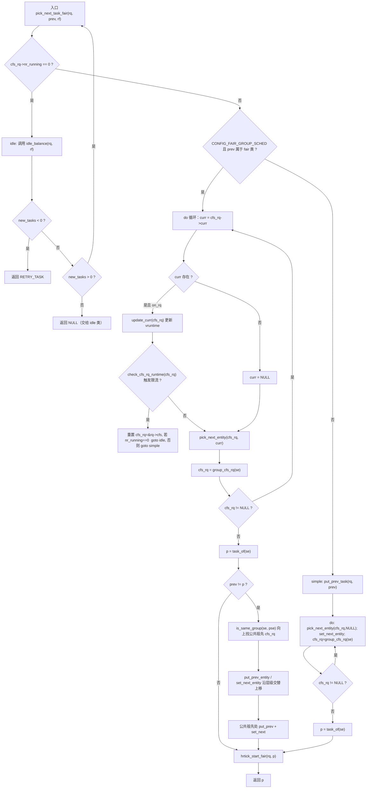
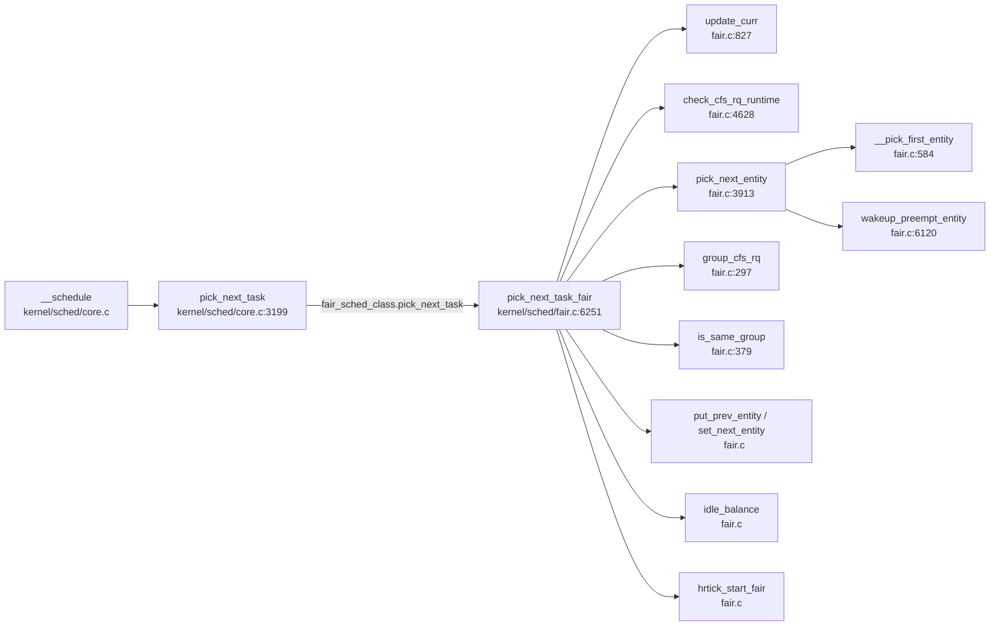

# 每日内核源码分析：pick_next_task_fair

- **日期**：2026-09-11
- **子系统**：kernel/sched（CFS 调度器）
- **源文件**：kernel/sched/fair.c:6250-6374
- **类型**：function
- **内核版本**：Linux 4.14.0

---

## 1. 功能作用

`pick_next_task_fair` 是 **CFS（Completely Fair Scheduler，完全公平调度器）选取下一个可运行任务**的核心入口函数。它注册在 `fair_sched_class` 调度类的 `.pick_next_task` 回调上，由通用调度器 `pick_next_task()`（定义于 `kernel/sched/core.c`）在每次发生调度切换时调用。

其核心职责是：

1. 从 CFS 运行队列（`cfs_rq`）的红黑树 `tasks_timeline` 中选出 **vruntime 最小**（最需要运行）的调度实体 `sched_entity`；
2. 处理 **组调度（CONFIG_FAIR_GROUP_SCHED）** 下的层级 cfs_rq 嵌套选择；
3. 处理 **CFS 带宽限流（cgroup bandwidth control）**，当某个 cgroup 的 runtime 耗尽时触发节流；
4. 当 CFS 队列无任务可运行时，调用 `idle_balance()` 尝试从其他 CPU 迁移任务，或返回 `NULL` 让调度器回退到 idle 类。

**典型调用场景**：每次 `schedule()` → `__schedule()` → `pick_next_task()` 发生上下文切换时，若当前或上一个任务属于 fair 类，就会进入本函数。这是 Linux 普通进程（SCHED_NORMAL / SCHED_BATCH / SCHED_IDLE）获得 CPU 的必经之路。

---

## 2. 关键数据结构

### 2.1 `struct cfs_rq`（CFS 运行队列）— 定义于 `kernel/sched/sched.h:420`

CFS 调度器的核心运行队列，每个 CPU 一个，组调度下每个 task group 也有自己的 cfs_rq。

| 字段 | 含义 |
|------|------|
| `nr_running` | 当前 cfs_rq 上可运行实体数量 |
| `h_nr_running` | 层级化（hierarchical）可运行数量，用于判断是否所有任务都在 fair 类 |
| `exec_clock` | cfs_rq 的执行时钟（虚拟时间基准） |
| `min_vruntime` | 队列中最小 vruntime，所有新入队实体以此为基准放置 |
| `tasks_timeline` | 以 vruntime 为键的红黑树（`rb_root_cached`，缓存最左节点） |
| `curr` | 当前正在运行的调度实体 |
| `next` / `last` / `skip` | 三个 buddy 指针，用于缓存亲和性优化：`next` 表示被唤醒后期望运行的任务，`last` 表示被抢占的任务（cache locality），`skip` 表示应当跳过的任务 |
| `runtime_enabled` / `runtime_remaining` | CFS 带宽控制：是否启用限流及剩余运行时间 |

### 2.2 `struct sched_entity`（调度实体）— 定义于 `include/linux/sched.h:377`

CFS 调度的基本单位，可以是一个 task，也可以是一个 task group。

| 字段 | 含义 |
|------|------|
| `load` | 权重（`struct load_weight`），决定该实体分配到的 CPU 时间比例 |
| `run_node` | 挂入 `cfs_rq->tasks_timeline` 红黑树的节点 |
| `on_rq` | 是否已在运行队列上 |
| `exec_start` | 本次运行开始的真实时间戳 |
| `sum_exec_runtime` | 累计真实运行时间 |
| `vruntime` | **虚拟运行时间**，CFS 调度的核心排序键 |
| `prev_sum_exec_runtime` | 上次切换时的累计运行时间，用于计算 slice |
| `depth` / `parent` / `cfs_rq` / `my_q` | 组调度下的层级关系：`my_q` 是该实体（组）拥有的子 cfs_rq |

### 2.3 `struct rq`（每 CPU 运行队列）— 定义于 `kernel/sched/sched.h`

- `rq->cfs`：该 CPU 的根 cfs_rq；
- `rq->nr_running`：该 CPU 上所有调度类可运行任务总数；
- `rq->idle`：idle 任务指针。

### 2.4 `struct sched_class`（调度类）— `fair_sched_class` 定义于 `kernel/sched/fair.c:9520`

```c
const struct sched_class fair_sched_class = {
    .next           = &idle_sched_class,
    .enqueue_task   = enqueue_task_fair,
    .dequeue_task   = dequeue_task_fair,
    .check_preempt_curr = check_preempt_wakeup,
    .pick_next_task = pick_next_task_fair,   // <-- 本函数
    .put_prev_task  = put_prev_task_fair,
    ...
};
```

---

## 3. 核心逻辑流程图



**关键决策点说明**：

1. **空队列快速路径**：`nr_running == 0` 时直接进入 idle 负载均衡，避免无意义遍历。
2. **组调度优化路径**：当 `prev` 也属于 fair 类时，不调用完整的 `put_prev_task`，而是通过 `is_same_group` 找到 `se` 和 `prev->se` 的公共祖先 cfs_rq，只对变化的层级做 `put_prev_entity` / `set_next_entity`，减少红黑树操作。
3. **`check_cfs_rq_runtime` 限流**：在组调度路径中，每选到一层 cfs_rq 都检查其 runtime 是否耗尽；若耗尽则 `throttle_cfs_rq` 将该组踢出，并重新从根 cfs_rq 选择。
4. **`pick_next_entity` 的 buddy 策略**：在最左 vruntime 实体基础上，优先考虑 `next`（被唤醒者）、`last`（被抢占者，cache 友好），跳过 `skip`。
5. **`idle_balance` 的 RETRY 语义**：`idle_balance` 可能释放并重新获取 `rq->lock`，期间高优先级任务可能入队，因此返回负值需返回 `RETRY_TASK` 让 `__schedule` 重新遍历调度类。
6. **`hrtick_start_fair`**：若启用高精度定时器，为选中任务启动一个 hrtimer，在其时间片耗尽时触发抢占。

---

## 4. 调用关系

### 4.1 调用者（who calls me）

`pick_next_task_fair` 通过 `fair_sched_class.pick_next_task` 回调被调用，直接调用者是通用调度器的 `pick_next_task()`。

| 调用方 | 所在文件 | 调用场景 |
|--------|----------|----------|
| `pick_next_task` | `kernel/sched/core.c:3227` | 通用调度入口，遍历 `sched_class` 链表调用各类的 `pick_next_task` |
| `pick_next_task`（快速路径） | `kernel/sched/core.c:3211` | 当 `prev` 属于 idle/fair 类且所有任务都在 fair 类时，直接调用 `fair_sched_class.pick_next_task` |
| `__schedule` | `kernel/sched/core.c` | 主调度函数，调用 `pick_next_task` 选出下一个任务后做 `context_switch` |

### 4.2 被调用者（who I call）

**核心路径调用**：

| 函数 | 作用 |
|------|------|
| `update_curr(cfs_rq)` | 更新当前实体的 vruntime（按权重缩放真实运行时间） |
| `check_cfs_rq_runtime(cfs_rq)` | 检查并触发 CFS 带宽限流 |
| `pick_next_entity(cfs_rq, curr)` | 从红黑树选出下一实体，含 buddy 优化 |
| `group_cfs_rq(se)` | 返回组实体拥有的子 cfs_rq（组调度层级下钻） |
| `task_of(se)` | 由 sched_entity 反查 task_struct |
| `is_same_group(se, pse)` | 寻找两个实体的公共祖先 cfs_rq |
| `put_prev_entity(cfs_rq, se)` | 将前一实体重新入队并更新统计 |
| `set_next_entity(cfs_rq, se)` | 将选中实体设为 curr 并出队 |
| `idle_balance(rq, rf)` | CPU 空闲时从其他 rq 迁移任务 |
| `hrtick_start_fair(rq, p)` | 启动高精度定时器以在时间片到期时抢占 |

**辅助调用**：
- `put_prev_task(rq, prev)`（simple 路径）：调用 prev 所属调度类的 `put_prev_task`。

**宏 / 内联**：
- `cfs_bandwidth_used()`、`cfs_rq_throttled()`、`entity_before()`、`hrtick_enabled()`。

### 4.3 调用关系图（Mermaid）



---

## 5. 易错点 / 边界场景 / 设计权衡

1. **`curr` 不在红黑树中**：`set_next_entity` 会将 curr 从 `tasks_timeline` 中 `__dequeue_entity`，但不修改 `on_rq`。因此 `pick_next_entity(cfs_rq, curr)` 需要显式把 `curr` 纳入候选（若其 vruntime 比最左节点还小），否则刚运行的任务会被不公平地跳过。

2. **`RETRY_TASK` 而非指针**：`pick_next_task_fair` 可能返回 `RETRY_TASK`（`(struct task_struct *)-1`），调用者 `pick_next_task` 遇到此值会 `goto again` 重新遍历所有调度类。这是因为 `idle_balance` 释放了 `rq->lock`，期间可能有 RT/DL 任务入队，必须重新选择。

3. **组调度路径的「半切换」优化**：当 `prev` 也属于 fair 类时，不执行完整的 `put_prev_task_fair`（它会对整棵 cfs_rq 树做 put），而是找到 `se` 与 `prev->se` 的公共祖先，仅对差异层级做 put/set。这大幅减少了层级 cgroup 场景下的锁与树操作开销。

4. **`check_cfs_rq_runtime` 的位置**：在组调度路径中，限流检查在 `pick_next_entity` 之前完成。若某层 cfs_rq 被限流，`throttle_cfs_rq` 会将其从父 cfs_rq 出队，导致 `nr_running` 变化，因此需要重置 `cfs_rq = &rq->cfs` 并重走 simple 路径。

5. **`min_vruntime` 与 `pick_next_entity` 的关系**：`pick_next_entity` 不直接用 `min_vruntime`，而是取红黑树最左节点（`__pick_first_entity`，即 vruntime 最小者）。`min_vruntime` 主要用于 `place_entity` 时给新唤醒/创建的实体设置初始 vruntime，防止其「立即」被选中。

6. **`skip` buddy 的公平性边界**：`skip` 表示应当跳过的实体（如刚被迁移走的任务）。但只有当 `wakeup_preempt_entity(second, left) < 1`（即 second 不会比 left 不公平太多）时才跳过，否则仍运行 skip，保证公平性不被破坏。

7. **`hrtick_start_fair` 的条件**：仅在 `hrtick_enabled(rq)` 时启动高精度定时器。未启用 hrtick 时，依赖 `scheduler_tick` 的周期性 tick 来检查时间片是否耗尽，精度较低但开销更小。

---

## 附：核心源码片段

```c
// kernel/sched/fair.c:6250-6374
static struct task_struct *
pick_next_task_fair(struct rq *rq, struct task_struct *prev, struct rq_flags *rf)
{
	struct cfs_rq *cfs_rq = &rq->cfs;
	struct sched_entity *se;
	struct task_struct *p;
	int new_tasks;

again:
	if (!cfs_rq->nr_running)
		goto idle;

#ifdef CONFIG_FAIR_GROUP_SCHED
	if (prev->sched_class != &fair_sched_class)
		goto simple;

	do {
		struct sched_entity *curr = cfs_rq->curr;

		if (curr) {
			if (curr->on_rq)
				update_curr(cfs_rq);
			else
				curr = NULL;

			if (unlikely(check_cfs_rq_runtime(cfs_rq))) {
				cfs_rq = &rq->cfs;
				if (!cfs_rq->nr_running)
					goto idle;
				goto simple;
			}
		}

		se = pick_next_entity(cfs_rq, curr);
		cfs_rq = group_cfs_rq(se);
	} while (cfs_rq);

	p = task_of(se);

	if (prev != p) {
		struct sched_entity *pse = &prev->se;

		while (!(cfs_rq = is_same_group(se, pse))) {
			int se_depth = se->depth;
			int pse_depth = pse->depth;

			if (se_depth <= pse_depth) {
				put_prev_entity(cfs_rq_of(pse), pse);
				pse = parent_entity(pse);
			}
			if (se_depth >= pse_depth) {
				set_next_entity(cfs_rq_of(se), se);
				se = parent_entity(se);
			}
		}

		put_prev_entity(cfs_rq, pse);
		set_next_entity(cfs_rq, se);
	}

	if (hrtick_enabled(rq))
		hrtick_start_fair(rq, p);

	return p;
simple:
#endif

	put_prev_task(rq, prev);

	do {
		se = pick_next_entity(cfs_rq, NULL);
		set_next_entity(cfs_rq, se);
		cfs_rq = group_cfs_rq(se);
	} while (cfs_rq);

	p = task_of(se);

	if (hrtick_enabled(rq))
		hrtick_start_fair(rq, p);

	return p;

idle:
	new_tasks = idle_balance(rq, rf);

	if (new_tasks < 0)
		return RETRY_TASK;

	if (new_tasks > 0)
		goto again;

	return NULL;
}
```
