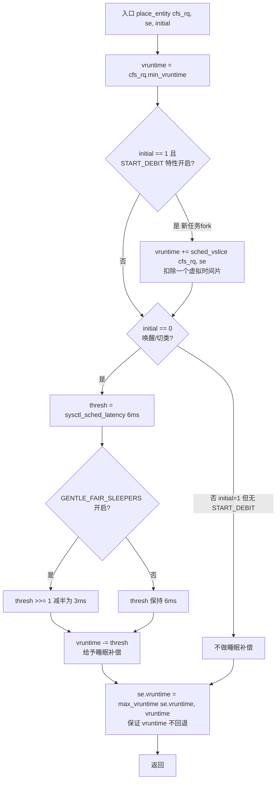
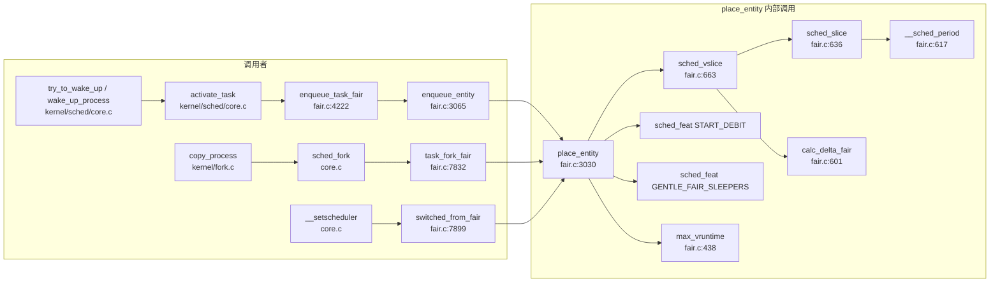

# 每日内核源码分析：place_entity

- **日期**：2026-09-12
- **子系统**：kernel/sched（CFS 完全公平调度器）
- **源文件**：kernel/sched/fair.c:3030-3060
- **类型**：function（static）
- **内核版本**：Linux 4.1.6

---

## 1. 功能作用

`place_entity` 是 CFS（Completely Fair Scheduler，完全公平调度器）中**决定一个调度实体（sched_entity）在入队时其虚拟运行时间（vruntime）初始位置**的核心函数。

CFS 的核心思想是：用 `vruntime`（虚拟运行时间）来度量每个任务已获得的 CPU 服务量，总是选择 `vruntime` 最小的任务运行。`vruntime` 越小，说明该任务获得的 CPU 时间越少，越应该被优先调度。所有就绪实体按 `vruntime` 挂在一棵红黑树（`cfs_rq->tasks_timeline`）上，最左侧节点即下一个被调度的实体。

`place_entity` 的职责就是：在一个实体被插入红黑树**之前**，为其计算一个合理的 `vruntime` 初值，使得：

1. **新创建的任务**（fork）不会一上来就抢占正在运行的任务，而是被"赊账"（debit）一个时间片，放到当前调度周期的末尾，避免饿死已有任务。
2. **刚从睡眠中唤醒的任务**（wakeup）能获得一定的"睡眠补偿"——因为它在睡眠期间没有消耗 CPU，其 `vruntime` 已经落后于运行中的任务，但若直接入队会因为 `vruntime` 过小而长时间霸占 CPU，所以需要用一个阈值（`sysctl_sched_latency`）截断这种补偿，防止"睡眠者福利"失控。
3. **从 fair 类切走的任务**（switched_from_fair）在切回前被规范化 `vruntime`，防止其把在其他调度类中度过的时间当作"睡眠"来套取无限补偿。

最终通过 `max_vruntime(se->vruntime, vruntime)` 保证实体的 `vruntime` 不会被**回退**（即不会因为入队而"获得"额外的服务时间），这是 CFS 公平性的底线。

---

## 2. 关键数据结构

### 2.1 `struct sched_entity`（include/linux/sched.h:1179）

CFS 的调度实体，既可以是一个任务，也可以是一个调度组（组调度）。`place_entity` 直接操作的核心字段：

| 字段 | 类型 | 含义 |
|------|------|------|
| `vruntime` | `u64` | **虚拟运行时间**，CFS 排序的唯一键。值越小越先被调度。 |
| `load` | `struct load_weight` | 实体的权重（由 nice 值决定），`weight` 越大，`calc_delta_fair` 折算的 `vruntime` 增长越慢。 |
| `on_rq` | `unsigned int` | 实体是否已在运行队列上，影响 `sched_slice` 中对总权重的计算。 |

> `vruntime` 的增长速率与实体权重成反比：`vruntime += delta_exec * NICE_0_LOAD / se->load.weight`，即权重越高（nice 越低），虚拟时间走得越慢，越容易被选中。

### 2.2 `struct cfs_rq`（kernel/sched/sched.h:340 附近）

CFS 的运行队列，每个 CPU 一个（组调度时每组每层一个）。关键字段：

| 字段 | 类型 | 含义 |
|------|------|------|
| `min_vruntime` | `u64` | 该队列中所有实体 `vruntime` 的最小值（单调递增，只增不减）。`place_entity` 以此为基准计算新实体的初始 `vruntime`。 |
| `tasks_timeline` | `struct rb_root` | 按 `vruntime` 排序的红黑树，实体入队即插入此树。 |
| `nr_running` | `unsigned long` | 队列上就绪实体数，参与 `__sched_period` 的周期拉伸计算。 |
| `load` | `struct load_weight` | 队列上所有实体权重之和，用于按权重分配时间片。 |

> `min_vruntime` 是 CFS 的"时间基准线"。它单调递增，使得所有实体的 `vruntime` 都围绕它上下浮动，防止 vruntime 无限增长导致 64 位溢出（虽然实际很难溢出，但保持局部性）。

### 2.3 关键全局变量与调优参数

| 名称 | 默认值 | 作用 |
|------|--------|------|
| `sysctl_sched_latency` | 6,000,000 ns（6 ms） | 一个调度周期的目标长度；同时也是睡眠补偿的截断阈值。 |
| `sched_feat(START_DEBIT)` | true | 新任务入队时是否扣除一个虚拟时间片（防止新任务抢占）。 |
| `sched_feat(GENTLE_FAIR_SLEEPERS)` | true | 是否将睡眠补偿阈值减半，使睡眠者的优势更温和。 |
| `NICE_0_LOAD` | 1024 | nice 值为 0 的任务的权重基准。 |

---

## 3. 核心逻辑流程图



### 关键决策点解读

1. **基准选择**：`vruntime` 初始值取 `cfs_rq->min_vruntime`，保证新实体从队列的"最公平基准线"起步，而不是从 0 开始（否则会瞬间抢占所有人）。

2. **START_DEBIT 分支（initial=1，新 fork 任务）**：新任务还没跑过任何 CPU，理论上 `vruntime` 应为 0，但这会让它立即成为红黑树最左节点并抢占当前任务。`START_DEBIT` 特性给它加上一个 `sched_vslice`（按其权重折算的虚拟时间片），相当于让它"排队到当前周期末尾"，保护正在运行的任务不被新 fork 的任务频繁打断。

3. **睡眠补偿分支（initial=0，唤醒/切类）**：唤醒的任务在睡眠期间 `vruntime` 没有增长，已经比运行中的任务小。为了让它能较快被调度（响应性），从基准 `vruntime` 中减去一个阈值 `thresh`，相当于给它一个"睡眠奖励"。但这个奖励被 `sysctl_sched_latency` 封顶，避免长时间睡眠的任务一唤醒就独占 CPU。

4. **GENTLE_FAIR_SLEEPERS**：将 `thresh` 减半（6ms→3ms），使睡眠者的优势更温和，防止大量睡眠者同时唤醒时把 `vruntime` 分布（spread）撕裂。

5. **`max_vruntime` 兜底**：`se->vruntime = max_vruntime(se->vruntime, vruntime)` 保证最终值**不小于**实体原有的 `vruntime`。这是 CFS 的铁律——一个实体不能因为重新入队而获得"负的服务时间"，否则会破坏公平性。典型场景：唤醒时实体原 `vruntime` 可能已经大于 `min_vruntime - thresh`，此时保持原值。

---

## 4. 调用关系

### 4.1 调用者（who calls me）

`place_entity` 被三个上游场景调用，对应任务生命周期的三个关键节点：

| 调用方 | 所在文件:行 | 调用场景 | initial |
|--------|-------------|----------|---------|
| `enqueue_entity` | kernel/sched/fair.c:3083 | 任务被唤醒入队（`ENQUEUE_WAKEUP` 标志） | 0 |
| `task_fork_fair` | kernel/sched/fair.c:7861 | `fork` 创建新任务时，设置子任务初始 `vruntime` | 1 |
| `switched_from_fair` | kernel/sched/fair.c:7918 | 任务离开 fair 调度类时规范化 `vruntime`，防止套取无限睡眠补偿 | 0 |

进一步的上游调用链：

- `enqueue_entity` ← `enqueue_task_fair`（fair_sched_class 的 `.enqueue_task` 回调，line 8224）← `activate_task`（core.c）← `try_to_wake_up`、`wake_up_process` 等唤醒路径。
- `task_fork_fair` ← `sched_fork`（core.c）← `copy_process`（fork.c）。
- `switched_from_fair` ← `__setscheduler`（core.c）当任务调度策略从 CFS 改为 RT/DEADLINE 时。

### 4.2 被调用者（who I call）

| 类别 | 函数/宏 | 位置 | 作用 |
|------|---------|------|------|
| **核心路径** | `sched_vslice(cfs_rq, se)` | fair.c:663 | 计算实体的虚拟时间片 = `calc_delta_fair(sched_slice(...), se)` |
| **核心路径** | `sched_slice(cfs_rq, se)` | fair.c:636 | 按权重比例从调度周期中切出实体的墙钟时间片 `s = p * w/rw` |
| **核心路径** | `__sched_period(nr_running)` | fair.c:617 | 计算调度周期 `p`，任务过多时拉伸为 `min_granularity * nr` |
| **核心路径** | `calc_delta_fair(delta, se)` | fair.c:601 | 将墙钟时间按权重折算为虚拟时间 `vruntime` 增量 |
| **特性开关** | `sched_feat(START_DEBIT)` | sched.h:988 | 静态分支判断是否启用新任务赊账 |
| **特性开关** | `sched_feat(GENTLE_FAIR_SLEEPERS)` | sched.h:988 | 静态分支判断是否启用温和睡眠者 |
| **工具函数** | `max_vruntime(a, b)` | fair.c:438 | 安全比较两个 `u64 vruntime` 取大值（处理 64 位环绕） |

### 4.3 调用关系图



---

## 5. 易错点 / 边界场景 / 设计权衡

1. **`initial` 参数语义易混淆**：`initial=1` 并不表示"第一次调用"，而是表示**新创建的实体**（fork 场景）。`initial=0` 表示**已存在的实体重新入队**（唤醒、切类）。两者走完全不同的补偿策略——新任务要"赊账"（`+vslice`），唤醒任务要"奖励"（`-thresh`）。

2. **`min_vruntime` 单调递增是关键前提**：`place_entity` 以 `min_vruntime` 为基准，依赖 `update_min_vruntime` 保证它只增不减。如果 `min_vruntime` 会下降，那么以它为基准的 `vruntime` 计算就会让实体"穿越到过去"，破坏公平性。

3. **`max_vruntime` 的 64 位环绕处理**：`vruntime` 是 `u64`，直接用 `>` 比较会因环绕而出错。`max_vruntime` 内部用 `(s64)(vruntime - max_vruntime) > 0` 来判断，利用有符号减法正确处理环绕。这也是 CFS 中所有 `vruntime` 比较的通用技巧（`entity_before` 同理）。

4. **`START_DEBIT` 与 `sysctl_sched_child_runs_first` 的交互**：`task_fork_fair` 中 `place_entity(cfs_rq, se, 1)` 后，如果开启了 `child_runs_first`，会用 `swap(curr->vruntime, se->vruntime)` 把子任务换到前面并 `resched_curr`。这意味着 `START_DEBIT` 的赊账效果会被 `child_runs_first` 覆盖——用户可以选择让子进程先跑。

5. **睡眠补偿的截断是一种权衡**：完全不补偿会导致 I/O 密集型任务（频繁睡眠）响应迟缓；完全补偿（不截断）会导致长时间睡眠的任务一唤醒就 `vruntime` 极小，长时间霸占 CPU。CFS 选择用 `sysctl_sched_latency`（默认 6ms）封顶，`GENTLE_FAIR_SLEEPERS` 再减半到 3ms，在响应性和公平性之间取折中。

6. **`sched_vslice` 与组调度**：`sched_slice` 内部用 `for_each_sched_entity(se)` 向上遍历实体层级，逐层按权重折算时间片。这意味着组调度下，一个任务的"赊账量"取决于它在所有祖先组中的权重比例，而非仅自身权重。

7. **`se->vruntime` 可能为 0 的边界**：刚 fork 的任务 `se->vruntime` 从父任务继承（`task_fork_fair` 中 `se->vruntime = curr->vruntime`），不会是 0。但如果是 `switched_from_fair` 场景且任务此前从未在 fair 类运行过，`vruntime` 可能较小，`max_vruntime` 会用计算出的基准值覆盖它，避免异常小值。

---

## 附：核心源码片段

```c
// kernel/sched/fair.c:3030-3060  (Linux 4.1.6)

static void
place_entity(struct cfs_rq *cfs_rq, struct sched_entity *se, int initial)
{
	u64 vruntime = cfs_rq->min_vruntime;

	/*
	 * The 'current' period is already promised to the current tasks,
	 * however the extra weight of the new task will slow them down a
	 * little, place the new task so that it fits in the slot that
	 * stays open at the end.
	 */
	if (initial && sched_feat(START_DEBIT))
		vruntime += sched_vslice(cfs_rq, se);

	/* sleeps up to a single latency don't count. */
	if (!initial) {
		unsigned long thresh = sysctl_sched_latency;

		/*
		 * Halve their sleep time's effect, to allow
		 * for a gentler effect of sleepers:
		 */
		if (sched_feat(GENTLE_FAIR_SLEEPERS))
			thresh >>= 1;

		vruntime -= thresh;
	}

	/* ensure we never gain time by being placed backwards. */
	se->vruntime = max_vruntime(se->vruntime, vruntime);
}
```
