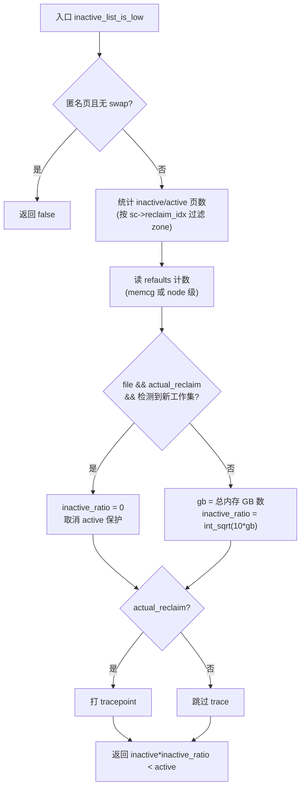

# 每日内核源码分析：inactive_list_is_low

- **日期**：2026-09-13
- **子系统**：mm（内存回收 / page reclaim）
- **源文件**：mm/vmscan.c:2202-2251
- **类型**：function（static bool，5 处调用点）
- **内核版本**：v4.19

> 完整分析见子目录归档：[mm/vmscan.c/inactive_list_is_low.md](../../../mm/vmscan.c/inactive_list_is_low.md)

## 摘要

`inactive_list_is_low()` 是 mm/vmscan.c 的核心"门函数"：判断给定 LRU（anon/file）的 inactive 链表是否过小、是否需要从 active 链表降级补充。它通过 `inactive_ratio = int_sqrt(10 * gb)` 让大内存机器维持更小的 inactive 比例，并通过对比 `lruvec->refaults` 与实时 `WORKINGSET_ACTIVATE` 计数，在工作集切换时把 `inactive_ratio` 临时置 0，加速清退陈旧工作集。被 5 个回收路径调用（`shrink_list`、`get_scan_count`×2、`shrink_node_memcg`、`age_active_anon`），是 active→inactive 降级时机与 anon/file 扫描配额决策的双重门槛。

## 核心逻辑流程图

## 累计学习进度

| 子系统 | 已分析函数数 |
|--------|------------|
| mm/ | ~250+ |
| kernel/sched/ | 12 |
| fs/ | ~120+ |
| kernel/ | ~60+ |
| **今日新增** | mm/vmscan.c::inactive_list_is_low |
