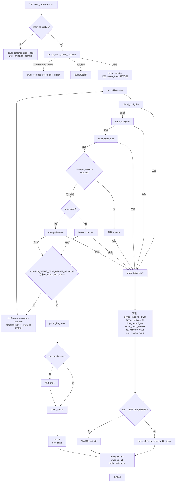
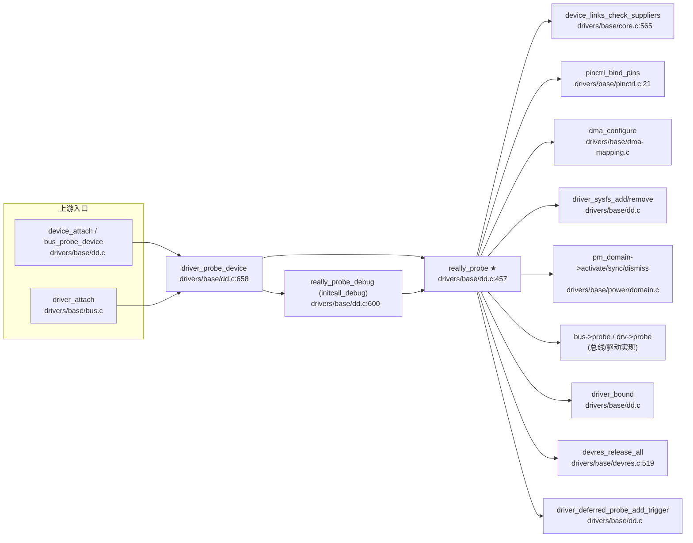

# 每日内核源码分析：really_probe

- **日期**：2026-09-14
- **子系统**：drivers（驱动模型核心 / 设备-驱动绑定）
- **源文件**：drivers/base/dd.c:457-615
- **类型**：function（static，驱动探测绑定核心实现）
- **内核版本**：Linux 4.19.325（github gregkh/linux linux-4.19.y）

---

## 1. 功能作用

`really_probe` 是 Linux 设备驱动模型中**真正执行「设备-驱动绑定（probe）」**的核心函数。当总线匹配（`bus->match`）确认某个 `struct device_driver` 可以管理某个 `struct device` 之后，驱动核心会调用 `driver_probe_device()`，而后者在完成运行时电源管理（runtime PM）的 get/barrier 包装后，最终落到 `really_probe` 完成实际的绑定工作。

它解决的核心问题是：**在调用驱动自己的 `probe` 回调之前，把设备所依赖的所有「基础设施」按正确顺序准备好（pinctrl 引脚、DMA 映射、sysfs 属性、电源域），并在 probe 失败时按相反顺序完整回滚**。

典型使用场景 / 被调用时机：

- 设备注册时（`device_add` → `bus_probe_device` → `driver_probe_device` → `really_probe`），尝试为新设备寻找并绑定驱动。
- 驱动注册时（`driver_register` → `driver_attach` → `bus_for_each_dev` → `__driver_attach` → `driver_probe_device` → `really_probe`），为新驱动寻找可管理的设备。
- 异步探测（`__device_attach_async_helper`）路径同样经由 `driver_probe_device` 进入。
- 延迟探测（`-EPROBE_DEFER`）重试时，由 `deferred_probe_work` 工作队列再次触发。

返回值语义：`1` 表示绑定成功（`driver_bound` 已执行）；`0` 表示 probe 失败但被核心忽略（允许下一个驱动尝试）；负值（如 `-EPROBE_DEFER`）表示需要延迟探测。

---

## 2. 关键数据结构

| 结构 | 关键字段 / 语义 | 所在头文件 |
|------|-----------------|-----------|
| `struct device` | `dev->driver`（当前绑定的驱动，probe 前设为 `drv`，失败时回滚为 `NULL`）；`dev->bus`（所属总线）；`dev->pm_domain`（电源域，提供 `activate`/`sync`/`dismiss` 回调）；`dev->devres_head`（设备资源链表，probe 前必须为空）；`dev->p->knode_driver`（挂入驱动设备链表的节点） | `include/linux/device.h` |
| `struct device_driver` | `drv->probe` / `drv->remove`（驱动提供的探测/移除回调）；`drv->bus`（所属总线）；`drv->probe_type`（`enum probe_type`，决定同步/异步探测策略）；`drv->suppress_bind_attrs`（是否禁用 sysfs bind/unbind，影响 `test_remove`）；`drv->owner`（模块所有者） | `include/linux/device.h:277` |
| `struct bus_type` | `bus->probe` / `bus->remove`（总线级 probe/remove，优先级高于 driver 级）；`bus->match`（匹配函数，在进入 really_probe 之前已由 `driver_match_device` 调用）；`bus->p->bus_notifier`（总线通知链，绑定/解绑时发通知） | `include/linux/device.h:118` |
| `enum probe_type` | `PROBE_DEFAULT_STRATEGY` / `PROBE_PREFER_ASYNCHRONOUS` / `PROBE_FORCE_SYNCHRONOUS`，由 `driver_allows_async_probing` 在更上层决定是否异步，但 `really_probe` 本身总是同步执行 | `include/linux/device.h:235` |
| 全局状态 | `defer_all_probes`（全局强制延迟探测标志）；`deferred_trigger_count`（原子计数，用于判断延迟探测触发是否过期）；`probe_count`（原子计数，正在进行的 probe 数，`driver_probe_done` / `wait_for_device_probe` 据此判断是否全部完成）；`probe_waitqueue`（等待队列） | `drivers/base/dd.c` |

> 说明：`really_probe` 的入参只有 `struct device *dev` 和 `struct device_driver *drv`，但它依赖 `dev->bus`、`dev->pm_domain`、`dev->devres_head` 等多个内嵌结构共同完成状态机推进。

---

## 3. 核心逻辑流程图



### 关键决策点解读

1. **`defer_all_probes` 全局短路**：由 `device_defer_all_probes_enable()` 设置，用于在某些早期阶段（如 IRQ 域未就绪）强制所有 probe 延迟，避免资源未准备好时失败。
2. **供应商链路检查 `device_links_check_suppliers`**：设备可能依赖 supplier 设备（如 regulator、clock、phy），若 supplier 尚未就绪则返回 `-EPROBE_DEFER`，本设备进入延迟队列。
3. **`devres_head` 非空检查**：正常情况下 probe 前资源链表应为空；若非空说明上次 probe 残留，直接 `-EBUSY` 避免资源泄漏。
4. **probe 回调优先级：`bus->probe` 优先于 `drv->probe`**：总线（如 platform、pci）可以统一实现 probe 入口，再分发到具体驱动；若总线未提供则使用驱动自带的 `drv->probe`。
5. **`test_remove` 调试回路**：开启 `CONFIG_DEBUG_TEST_DRIVER_REMOVE` 时，probe 成功后立即调用 `remove` 并释放全部资源，然后 `goto re_probe` 重新探测一次，用于验证驱动的 remove 路径能否正确清理资源（避免「只能加载不能卸载」的 bug）。
6. **失败回滚的「逆序」原则**：成功路径依次执行 pinctrl→dma→sysfs→pm_domain→probe；失败路径按相反顺序清理（device_links_no_driver → devres_release_all → dma_deconfigure → driver_sysfs_remove → pm_runtime_reinit），保证任何中间步骤失败都不会留下半初始化状态。

---

## 4. 调用关系

### 4.1 调用者（who calls me）

`really_probe` 是 `static` 函数，仅在 `drivers/base/dd.c` 内部被两处调用：

| 调用方 | 所在文件 | 调用场景 |
|--------|----------|----------|
| `driver_probe_device` | `drivers/base/dd.c:676` | 公开的探测入口，完成 runtime PM get/barrier 后调用 really_probe，是设备-驱动绑定的主路径 |
| `really_probe_debug` | `drivers/base/dd.c:607` | 当 `initcall_debug` 开启时的包装，用 `ktime_get` 计时并打印 probe 耗时，再调用 really_probe |

而上层调用 `driver_probe_device` 的入口（即 really_probe 的间接调用者）有：

| 间接调用方 | 所在文件 | 场景 |
|-----------|----------|------|
| `__device_attach_driver` | `drivers/base/dd.c:768` | `device_attach` 遍历总线上的驱动，匹配成功后调用 |
| `bus_probe_device` | `drivers/base/dd.c:926` | 设备被添加到总线时，尝试绑定已有驱动 |
| `driver_attach` → `__driver_attach` | `drivers/base/bus.c:222` | 驱动注册时，遍历总线上的设备尝试绑定 |

### 4.2 被调用者（who I call）

**核心路径调用：**

| 函数 | 所在文件 | 作用 |
|------|----------|------|
| `device_links_check_suppliers` | `drivers/base/core.c:565` | 检查设备依赖的 supplier 是否就绪，未就绪返回 `-EPROBE_DEFER` |
| `pinctrl_bind_pins` | `drivers/base/pinctrl.c:21` | 在 probe 前绑定引脚控制（pinctrl）状态 |
| `dma_configure` | `drivers/base/dma-mapping.c` | 配置设备的 DMA 能力（掩码、一致性等） |
| `driver_sysfs_add` / `driver_sysfs_remove` | `drivers/base/dd.c:373 / :405` | 创建/移除驱动与设备关联的 sysfs 属性 |
| `dev->pm_domain->activate` / `->sync` / `->dismiss` | （平台相关，如 `drivers/base/power/domain.c`） | 电源域的激活/同步/撤销回调 |
| `dev->bus->probe` 或 `drv->probe` | 各总线/驱动实现 | 真正的驱动探测回调，由驱动开发者实现 |
| `driver_bound` | `drivers/base/dd.c` | 绑定成功：将设备加入驱动的 klist、发 `BUS_NOTIFY_BOUND_DRIVER` 通知、触发 `KOBJ_BIND` uevent |
| `pinctrl_init_done` | `drivers/base/pinctrl.c` | 通知 pinctrl 子系统 probe 完成 |

**辅助 / 清理调用：**

| 函数 | 作用 |
|------|------|
| `devres_release_all` | 释放设备在 probe 中分配的所有 devres 资源 |
| `dma_deconfigure` | 撤销 `dma_configure` 的配置 |
| `device_links_no_driver` | 通知设备链路子系统该设备暂无驱动 |
| `device_links_driver_bound` | 通知设备链路子系统该设备已绑定驱动 |
| `pm_runtime_reinit` | 重置运行时电源管理状态 |
| `driver_deferred_probe_add_trigger` | 将设备加入延迟探测队列并触发重试 |
| `blocking_notifier_call_chain` | 发送 `BUS_NOTIFY_DRIVER_NOT_BOUND` / `BUS_NOTIFY_BOUND_DRIVER` 总线通知 |
| `atomic_inc/dec(&probe_count)` + `wake_up_all(&probe_waitqueue)` | 维护全局 probe 计数，供 `wait_for_device_probe` 同步 |

### 4.3 调用关系图（Mermaid）



---

## 5. 易错点 / 边界场景 / 设计权衡

1. **`dev->driver = drv` 的设置时机很微妙**：在调用 `pinctrl_bind_pins` / `dma_configure` 之前就把 `dev->driver` 指向 `drv`，因为这些子系统的回调内部可能需要通过 `dev->driver` 访问驱动信息；而 probe 失败时必须在清理末尾把 `dev->driver = NULL`，否则会留下「设备已绑定但 probe 失败」的不一致状态。

2. **`-EPROBE_DEFER` 的特殊语义**：probe 回调返回 `-EPROBE_DEFER` 时，`really_probe` 不会打印警告（区别于其他错误），而是调用 `driver_deferred_probe_add_trigger` 把设备加入延迟队列，等待依赖就绪后由 `deferred_probe_work` 重试。这是驱动模型中「按需重试」的核心机制，驱动开发者只需返回 `-EPROBE_DEFER` 即可，无需自行实现重试。

3. **失败时 `ret = 0` 的设计**：`probe_failed` 路径末尾除 `-EPROBE_DEFER` 外都把 `ret` 置为 `0` 返回。这是故意的——`driver_probe_device` 的调用者（如 `__device_attach_driver`）把返回值 `0` 当作「未匹配成功，继续尝试下一个驱动」，避免一个驱动 probe 失败就中断整个匹配流程。注释明确写道 *"Ignore errors returned by ->probe so that the next driver can try its luck."*

4. **`test_remove` 调试回路的 goto 重入**：`CONFIG_DEBUG_TEST_DRIVER_REMOVE` 开启时，probe 成功后会执行 remove + 释放全部资源，然后 `goto re_probe` 重新走一遍 probe。这要求驱动的 `remove` 必须能完全释放 `probe` 分配的所有资源，否则第二次 probe 会因资源残留失败。该机制专门用于发现驱动「卸载不干净」的 bug。

5. **`probe_count` 与 `wait_for_device_probe` 的同步**：`really_probe` 入口 `atomic_inc(&probe_count)`，出口 `done` 标签 `atomic_dec` + `wake_up_all`。`wait_for_device_probe()` 通过 `wait_event(probe_waitqueue, atomic_read(&probe_count) == 0)` 等待所有 probe 完成。这是引导阶段确保所有设备探测结束的同步点。

6. **锁的假设**：`really_probe` 要求调用者持有 `dev` 的锁（`device_lock`），对 USB 接口设备还要求持有 `parent` 的锁（见 `driver_probe_device` 注释）。函数内部不再加全局锁，而是依赖 pinctrl/dma/devres 等子系统各自的锁保护。

---

## 附：核心源码片段

```c
// drivers/base/dd.c:457-615  (Linux 4.19.325)
static int really_probe(struct device *dev, struct device_driver *drv)
{
        int ret = -EPROBE_DEFER;
        int local_trigger_count = atomic_read(&deferred_trigger_count);
        bool test_remove = IS_ENABLED(CONFIG_DEBUG_TEST_DRIVER_REMOVE) &&
                           !drv->suppress_bind_attrs;

        if (defer_all_probes) {
                dev_dbg(dev, "Driver %s force probe deferral\n", drv->name);
                driver_deferred_probe_add(dev);
                return ret;
        }

        ret = device_links_check_suppliers(dev);
        if (ret == -EPROBE_DEFER)
                driver_deferred_probe_add_trigger(dev, local_trigger_count);
        if (ret)
                return ret;

        atomic_inc(&probe_count);
        pr_debug("bus: '%s': %s: probing driver %s with device %s\n",
                 drv->bus->name, __func__, drv->name, dev_name(dev));
        if (!list_empty(&dev->devres_head)) {
                dev_crit(dev, "Resources present before probing\n");
                ret = -EBUSY;
                goto done;
        }

re_probe:
        dev->driver = drv;

        ret = pinctrl_bind_pins(dev);
        if (ret)
                goto pinctrl_bind_failed;

        ret = dma_configure(dev);
        if (ret)
                goto probe_failed;

        if (driver_sysfs_add(dev)) {
                goto probe_failed;
        }

        if (dev->pm_domain && dev->pm_domain->activate) {
                ret = dev->pm_domain->activate(dev);
                if (ret)
                        goto probe_failed;
        }

        if (dev->bus->probe) {
                ret = dev->bus->probe(dev);
                if (ret)
                        goto probe_failed;
        } else if (drv->probe) {
                ret = drv->probe(dev);
                if (ret)
                        goto probe_failed;
        }

        if (test_remove) {
                test_remove = false;
                if (dev->bus->remove)
                        dev->bus->remove(dev);
                else if (drv->remove)
                        drv->remove(dev);
                devres_release_all(dev);
                driver_sysfs_remove(dev);
                dev->driver = NULL;
                dev_set_drvdata(dev, NULL);
                if (dev->pm_domain && dev->pm_domain->dismiss)
                        dev->pm_domain->dismiss(dev);
                pm_runtime_reinit(dev);
                goto re_probe;
        }

        pinctrl_init_done(dev);
        if (dev->pm_domain && dev->pm_domain->sync)
                dev->pm_domain->sync(dev);

        driver_bound(dev);
        ret = 1;
        goto done;

probe_failed:
        if (dev->bus)
                blocking_notifier_call_chain(&dev->bus->p->bus_notifier,
                                             BUS_NOTIFY_DRIVER_NOT_BOUND, dev);
pinctrl_bind_failed:
        device_links_no_driver(dev);
        devres_release_all(dev);
        dma_deconfigure(dev);
        driver_sysfs_remove(dev);
        dev->driver = NULL;
        dev_set_drvdata(dev, NULL);
        if (dev->pm_domain && dev->pm_domain->dismiss)
                dev->pm_domain->dismiss(dev);
        pm_runtime_reinit(dev);
        dev_pm_set_driver_flags(dev, 0);

        switch (ret) {
        case -EPROBE_DEFER:
                driver_deferred_probe_add_trigger(dev, local_trigger_count);
                break;
        case -ENODEV:
        case -ENXIO:
                break;
        default:
                printk(KERN_WARNING "%s: probe of %s failed with error %d\n",
                       drv->name, dev_name(dev), ret);
        }
        ret = 0;
done:
        atomic_dec(&probe_count);
        wake_up_all(&probe_waitqueue);
        return ret;
}
```
