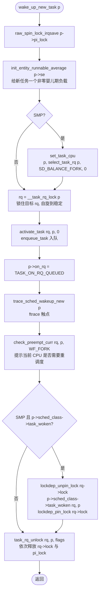

# 每日内核源码分析：wake_up_new_task

- **日期**：2026-09-15
- **子系统**：kernel/sched（进程调度核心）
- **源文件**：kernel/sched/core.c:2365-2406（注释起点）/ 函数体 2372-2406
- **类型**：function（全局导出函数 `EXPORT_SYMBOL` 风格的核心入口）
- **内核版本**：Linux 4.4（commit afd2ff9b）

---

## 1. 功能作用

`wake_up_new_task()` 是 Linux 调度子系统里专门为「**新创建进程首次投入运行**」准备的入口，与通用的 `try_to_wake_up()` / `wake_up_process()` 并列但职责不同：

- `try_to_wake_up()` 处理的是「已存在但睡眠中的任务」被唤醒；
- `wake_up_new_task()` 处理的是「`fork()` / `clone()` 刚刚构造完毕、还从未跑过的子进程」第一次进入运行队列。

它在 `kernel/fork.c:_do_fork()` 完成子进程 `task_struct` 的复制、寄存器状态、内存描述符等准备之后被调用（kernel/fork.c:1746），把子进程从「构造完成但未入队」状态推进到「入队 + 让当前 CPU 考虑是否让位给它」状态。具体做三件事：

1. **新进程的调度统计初始化**：调用 `init_entity_runnable_average(&p->se)` 给 CFS 调度实体的 `sched_avg` 一个非零初始负载，避免新任务在「婴儿期」负载被严重低估、被错误地排到队尾；
2. **SMP 上的 fork 域负载均衡**：调用 `select_task_rq(p, ..., SD_BALANCE_FORK, ...)` 选择一个合适的 CPU，并通过 `set_task_cpu()` 把子进程绑定过去——之所以放在这里而不是更早，是因为在 `fork` 路径里 `cpus_allowed` 可能还会被改变，且原选中的 CPU 在热插拔下可能已经消失；
3. **入队 + 抢占检查 + 唤醒回调**：拿到目标 rq 锁后调用 `activate_task()` 把子进程入队，置 `p->on_rq = TASK_ON_RQ_QUEUED`，再通过 `check_preempt_curr(..., WF_FORK)` 提示当前 CPU 是否需要重新调度，最后调用调度类的 `task_woken` 回调（SMP 下）做收尾（典型如 fair 类会做负载均衡触发、idle balancing 等）。

**典型调用场景**：fork() / clone() / kernel_thread() 路径，子进程构造完毕后由 `_do_fork()` 调用一次，使其进入可运行状态。

---

## 2. 关键数据结构

### 2.1 `struct task_struct`（include/linux/sched.h）

`p` 即被唤醒的子进程，本函数读写其若干关键字段：

- `p->pi_lock`（raw_spinlock_t，line 1594）：**优先级继承锁**。所有改变任务 CPU/状态的核心路径都要先持有它，主要用来配合优先级继承协议保护 RT 任务的优先级反转。本函数用 `raw_spin_lock_irqsave` 进入临界区并关 IRQ。
- `p->se`（struct sched_entity，line 1399）：**CFS 调度实体**。子进程作为 CFS 任务时的承载体，包含 `load.weight`、`avg`（sched_avg）、`nr_migrations`、`on_rq` 等子字段。本函数对其 `avg` 做「婴儿期负载」初始化，并在 `set_task_cpu` 内累计 `nr_migrations`。
- `p->sched_class`（const struct sched_class *，line 1398）：**调度类指针**，决定子进程属于 stop/dl/rt/fair/idle 中的哪一类，本函数通过它调用 `task_woken` 等回调。
- `p->on_rq`（int，line 1394）：**任务在 rq 上的状态**。本函数置为 `TASK_ON_RQ_QUEUED(1)`，是 `__task_rq_lock` 的稳定性判断依据之一（与 `TASK_ON_RQ_MIGRATING(2)` 区分）。
- `p->nr_cpus_allowed`（int，line 1416）：允许运行的 CPU 数量，`select_task_rq` 据此决定是否调用调度类的 `select_task_rq` 回调。

### 2.2 `struct rq`（kernel/sched/sched.h）

每个 CPU 一个的 runqueue，`__task_rq_lock` 返回的就是它：

- `rq->lock`：runqueue 自身的 raw_spinlock_t。**与 `p->pi_lock` 配合形成两段锁**：本函数先持 `pi_lock` 选 CPU、再持 `rq->lock` 入队。
- `rq->nr_running`、`rq->nr_uninterruptible`、`rq->cfs / rt / dl`：不同调度类的子队列。
- `rq->curr`：当前正在该 CPU 上跑的任务，`check_preempt_curr` 内部要拿它与 `p` 比较。

### 2.3 `struct sched_class`（kernel/sched/sched.h:1172）

调度类抽象，本函数会回调其中两个钩子：
- `task_woken(struct rq *this_rq, struct task_struct *task)`：任务被唤醒后做调度类相关的善后（SMP 下才存在）；
- `check_preempt_curr(...)` 在本函数被显式调用，但本质也是路由到 `rq->curr->sched_class->check_preempt_curr`。

### 2.4 关键宏与常量

- `WF_FORK = 0x02`（kernel/sched/sched.h:1101）：唤醒标志位，意为「这是 fork 后的子进程唤醒」，会被传给 `check_preempt_curr`，让 CFS/RT 等类知道这是一个全新的、没有历史负载的任务。
- `SD_BALANCE_FORK`：sched_domain 标志，告诉 `select_task_rq` 这是 fork 域的负载均衡，应优先把子进程放到空闲/轻载 CPU。
- `TASK_ON_RQ_QUEUED(1)` / `TASK_ON_RQ_MIGRATING(2)`（sched.h）：`p->on_rq` 的取值，区分「在队列里」与「正在跨 CPU 迁移中」（后者会让 `__task_rq_lock` 自旋等待）。

---

## 3. 核心逻辑流程图



### 关键决策点解读

1. **持锁顺序**：先 `pi_lock`（带 IRQ save）再 `rq->lock`，这是 sched 子系统贯穿的「**pi_lock → rq->lock**」顺序，禁止反向，否则会与 `task_rq_lock`、`migrate_task` 等路径死锁。
2. **CPU 选择放在 pi_lock 临界区内**：因为 `cpus_allowed` 与 `task_cpu()` 的读改写必须串行化；同时注释明示「fork balancing, do it here and not earlier」——更早选 CPU 的话，fork 路径后续可能改动 `cpus_allowed`，或目标 CPU 已经热插拔下线，需要重选。
3. **`__task_rq_lock` 而非 `task_rq_lock`**：本函数**已经持有了 `pi_lock`**，所以用不重入 `pi_lock` 的 `__task_rq_lock`；同时该函数会自旋到「`task_rq(p)` 稳定 + 任务不在 `MIGRATING` 中」为止，规避迁移窗口。
4. **`activate_task` ≠ `enqueue_task`**：`activate_task` 多做了一步 `rq->nr_uninterruptible--`（如果该任务曾计入不可中断睡眠计数），再委托 `enqueue_task` 把任务挂入对应调度类子队列。
5. **`p->on_rq` 写入时机**：必须在 `activate_task` 后、`task_rq_unlock` 前置为 `TASK_ON_RQ_QUEUED`，让 `task_on_rq_queued()` 立刻返回真，供后续路径（如 `try_to_wake_up_local`）正确判断状态。
6. **`check_preempt_curr` 的二选一**：若 `p` 与 `rq->curr` 同类，调用 `rq->curr->sched_class->check_preempt_curr` 做策略判断；若不同类，则遍历 `for_each_class` 找到 `p` 的类是否高于 `curr` 的类，若是就 `resched_curr(rq)` 直接标记 `TIF_NEED_RESCHED`。
7. **`task_woken` 钩子的「松锁」设计**：调度类回调可能要 `try_to_wake_up` 别的任务或做更复杂的负载操作，会再次申请锁，所以内核用 `lockdep_unpin_lock / lockdep_pin_lock` 解开 lockdep 的「同一锁不可重入」断言，避免误报——这是 v4.x 引入 `pin/unpin` 机制的关键用途。
8. **资源释放顺序**：`task_rq_unlock` 先放 `rq->lock` 再放 `pi_lock`，与获取顺序严格相反；同时 `pi_lock` 是 `irqrestore` 版本，恢复 fork 路径进入时的 IRQ 状态。

---

## 4. 调用关系

### 4.1 调用者（who calls me）

在 Linux 4.4 全量源码树中，`wake_up_new_task` 仅有 **1 个核心调用点**（其它命中都是声明/注释/字符串）：

| 调用方 | 所在文件 | 调用场景 |
|--------|----------|----------|
| `_do_fork` | kernel/fork.c:1746 | `fork()/clone()/vfork()/kernel_thread()` 总入口；`copy_process()` 成功构造 `task_struct`、寄存器状态、`task_active_pid_ns` 等准备好后，调用本函数让子进程「第一次上 CPU」 |

> 注：`_do_fork` 自身又被 `sys_fork/vfork/clone/clone_with_stack`、`kernel_thread` 等多处调用，因此本函数事实上承接了所有「内核创建新任务」的路径，影响面非常广。

### 4.2 被调用者（who I call）

按执行顺序列出，分类如下：

**核心路径调用（决定语义）**
- `raw_spin_lock_irqsave(&p->pi_lock, flags)` —— 关 IRQ 并加优先级继承锁；
- `init_entity_runnable_average(&p->se)` —— fair.c:672，给 CFS 调度实体的 `sched_avg` 初始化非零值（`load_avg = scale_load_down(weight)`、`util_avg = scale_load_down(SCHED_LOAD_SCALE)`），保证婴儿期不被低估；
- `select_task_rq(p, task_cpu(p), SD_BALANCE_FORK, 0)` —— core.c:1623，按 sched_domain 选目标 CPU，进一步委托给 `p->sched_class->select_task_rq`；若选出的 CPU 不在 `cpus_allowed` 或不在线，回退到 `select_fallback_rq`；
- `set_task_cpu(p, new_cpu)` —— core.c:1267，调用 `p->sched_class->migrate_task_rq`（如 CFS 会清掉老 cfs_rq 的负载）、累计 `se.nr_migrations++`、最终 `__set_task_cpu`；
- `__task_rq_lock(p)` —— sched.h:1431，自旋到稳定地拿到目标 rq 的 `rq->lock`；
- `activate_task(rq, p, 0)` —— core.c:846，`nr_uninterruptible--` 后调用 `enqueue_task` 把任务挂入对应子队列；
- `check_preempt_curr(rq, p, WF_FORK)` —— core.c:1025，路由到调度类的 `check_preempt_curr` 或直接 `resched_curr`，决定是否设置 `TIF_NEED_RESCHED`；
- `p->sched_class->task_woken(rq, p)` —— 调度类回调，例如 `fair_sched_class.task_woken = task_woken_fair`（fair.c）会触发空闲拉取与负载均衡触发；RT 类的 `task_woken` 会尝试把任务推到其它 CPU。

**辅助调用（trace / debug）**
- `trace_sched_wakeup_new(p)` —— events.c 中的 tracepoint 触点，`perf record -e sched:sched_wakeup_new` 即可观测；
- `lockdep_unpin_lock / lockdep_pin_lock(&rq->lock)` —— 在 `task_woken` 回调期间松开 lockdep 的「同锁不可重入」断言；
- `task_rq_unlock(rq, p, &flags)` —— sched.h:1501，依次释放 `rq->lock` 与 `pi_lock`（IRQ restore）。

**宏 / 内联**
- `task_cpu(p)` / `__set_task_cpu` / `task_on_rq_queued` / `task_on_rq_migrating` / `rq_clock_skip_update`（在 `check_preempt_curr` 内）等大量内联与宏。

### 4.3 调用关系图（Mermaid）

```mermaid
flowchart LR
  DO_FORK["_do_fork<br/>kernel/fork.c:1746"] --> TARGET["wake_up_new_task<br/>kernel/sched/core.c:2372"]
  TARGET --> PILOCK["raw_spin_lock_irqsave<br/>&p->pi_lock"]
  TARGET --> INITAVG["init_entity_runnable_average<br/>kernel/sched/fair.c:672"]
  TARGET --> SEL["select_task_rq<br/>core.c:1623<br/>→ sched_class->select_task_rq"]
  TARGET --> SETCPU["set_task_cpu<br/>core.c:1267<br/>→ migrate_task_rq / __set_task_cpu"]
  TARGET --> RQLOCK["__task_rq_lock<br/>kernel/sched/sched.h:1431"]
  TARGET --> ACT["activate_task<br/>core.c:846<br/>→ enqueue_task"]
  TARGET --> CPC["check_preempt_curr<br/>core.c:1025<br/>→ sched_class->check_preempt_curr / resched_curr"]
  TARGET -> WOKEN["sched_class->task_woken<br/>(fair: task_woken_fair / rt: task_woken_rt)"]
  TARGET -> UNLOCK["task_rq_unlock<br/>sched.h:1501"]
```

---

## 5. 易错点 / 边界场景 / 设计权衡

1. **「为什么不直接复用 `try_to_wake_up()`？」**
   `try_to_wake_up` 处理「睡眠→唤醒」需要做 `state` 检查、`task_cond_resched`、`ttwu_queue` 跨 CPU 排队等大量逻辑；新任务从未睡眠过，状态是 `TASK_RUNNING` 且还未在任何队列上，复用会触发一堆无意义的状态机分支。`wake_up_new_task` 因此独立出来，仅做「**初始化负载 + 选 CPU + 入队 + 抢占提示**」四件最小必要的事。

2. **`pi_lock` 必须先于 `rq->lock` 拿到，且 IRQ 关闭**
   这是 sched 子系统的全局不变量。`raw_spin_lock_irqsave(&p->pi_lock, ...)` 既关 IRQ 又防优先级继承协议下的死锁；若颠倒顺序，与 `task_rq_lock`、`try_to_wake_up` 路径会产生 AB-BA 死锁。

3. **`init_entity_runnable_average` 的 1023 是「几乎完整一个 1024us 周期」**
   注释明示 `period_contrib` 必须 `< 1024`，给 1023 意味着下一次 enqueue 时几乎立刻触发一次完整更新，避免新任务的 `sched_avg` 长时间停在被 enqueue 前的「空窗」状态。

4. **CPU 选择时机：必须拖到本函数内**
   注释明确给出两条理由——(a) `cpus_allowed` 在 fork 路径上还可能改；(b) 任何「更早选出的 CPU」可能在 hotplug 下消失。所以 `SD_BALANCE_FORK` 的负载均衡只能放在 `wake_up_new_task` 内、`activate_task` 前。

5. **`__task_rq_lock` 自旋等迁移窗口**
   `set_task_cpu` 不会真正迁移一个不在队列上的新任务，但 `__task_rq_lock` 仍然防御性地处理了 `TASK_ON_RQ_MIGRATING`：如果读到 `p` 在迁移中，会 `cpu_relax()` 自旋，等迁移方把状态翻成 `QUEUED` 再继续——避免读到不一致的 `task_rq(p)`。

6. **`lockdep_unpin_lock` 不是真的解锁**
   `task_woken` 回调内部可能再获取 `rq->lock`（例如 `task_woken_fair` 触发 `idle_balance` 之类的间接路径），如果不开 pin/unpin，lockdep 会误报「同进程重入同一锁」。这里只是松开了 lockdep 的断言计数，**没有真正 `raw_spin_unlock`**，原子上下文仍然保持。

7. **`on_rq` 的赋值顺序**
   必须先 `activate_task` 把任务挂上 `rq->cfs/rt/dl` 子队列，再写 `p->on_rq = TASK_ON_RQ_QUEUED`。颠倒会让 `try_to_wake_up_local` 等并发路径看到一个「在队列上但 `on_rq=0`」的不一致状态。

---

## 附：核心源码片段

```c
// kernel/sched/core.c:2365-2406  (Linux 4.4)
/*
 * wake_up_new_task - wake up a newly created task for the first time.
 *
 * This function will do some initial scheduler statistics housekeeping
 * that must be done for every newly created context, then puts the task
 * on the runqueue and wakes it.
 */
void wake_up_new_task(struct task_struct *p)
{
	unsigned long flags;
	struct rq *rq;

	raw_spin_lock_irqsave(&p->pi_lock, flags);
	/* Initialize new task's runnable average */
	init_entity_runnable_average(&p->se);
#ifdef CONFIG_SMP
	/*
	 * Fork balancing, do it here and not earlier because:
	 *  - cpus_allowed can change in the fork path
	 *  - any previously selected cpu might disappear through hotplug
	 */
	set_task_cpu(p, select_task_rq(p, task_cpu(p), SD_BALANCE_FORK, 0));
#endif

	rq = __task_rq_lock(p);
	activate_task(rq, p, 0);
	p->on_rq = TASK_ON_RQ_QUEUED;
	trace_sched_wakeup_new(p);
	check_preempt_curr(rq, p, WF_FORK);
#ifdef CONFIG_SMP
	if (p->sched_class->task_woken) {
		/*
		 * Nothing relies on rq->lock after this, so its fine to
		 * drop it.
		 */
		lockdep_unpin_lock(&rq->lock);
		p->sched_class->task_woken(rq, p);
		lockdep_pin_lock(&rq->lock);
	}
#endif
	task_rq_unlock(rq, p, &flags);
}
```

```c
// kernel/sched/sched.h:1101  唤醒标志位
#define WF_SYNC         0x01    /* waker goes to sleep after wakeup */
#define WF_FORK         0x02    /* child wakeup after fork */
#define WF_MIGRATED     0x4     /* internal use, task got migrated */
```

```c
// kernel/sched/core.c:846  activate_task
void activate_task(struct rq *rq, struct task_struct *p, int flags)
{
	if (task_contributes_to_load(p))
		rq->nr_uninterruptible--;

	enqueue_task(rq, p, flags);
}
```

```c
// kernel/sched/fair.c:672  init_entity_runnable_average
void init_entity_runnable_average(struct sched_entity *se)
{
	struct sched_avg *sa = &se->avg;

	sa->last_update_time = 0;
	sa->period_contrib = 1023;
	sa->load_avg = scale_load_down(se->load.weight);
	sa->load_sum = sa->load_avg * LOAD_AVG_MAX;
	sa->util_avg = scale_load_down(SCHED_LOAD_SCALE);
	sa->util_sum = sa->util_avg * LOAD_AVG_MAX;
}
```
