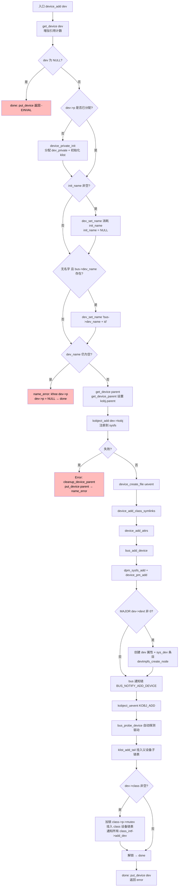
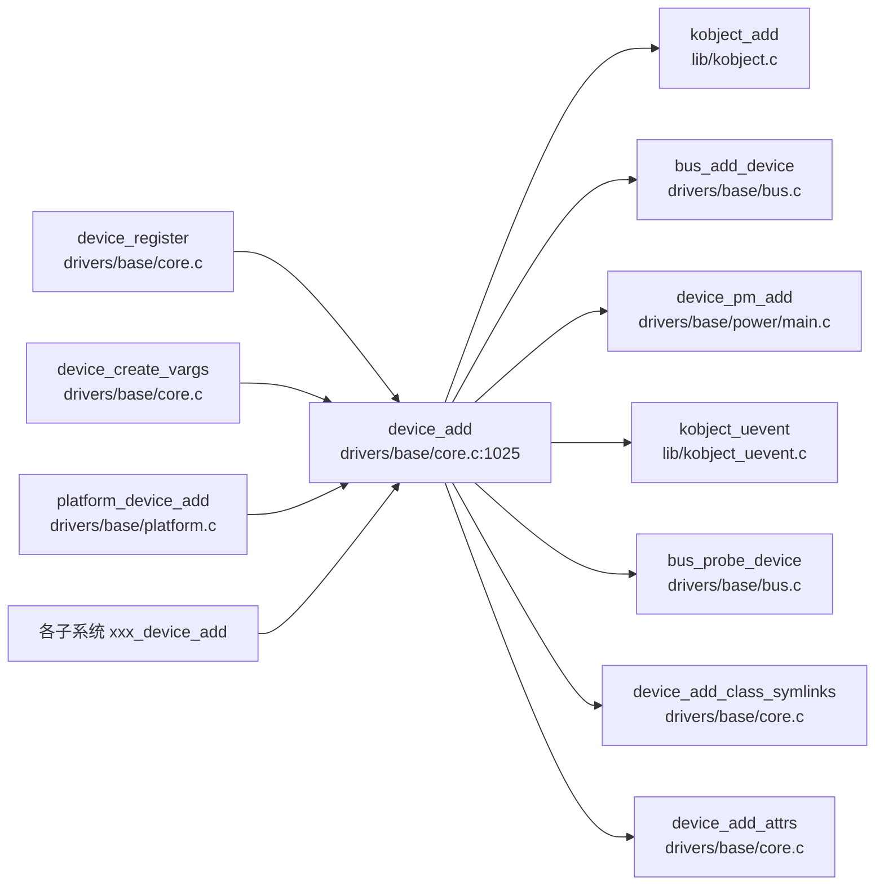

# 每日内核源码分析：device_add

- **日期**：2026-09-17
- **子系统**：drivers/base（设备驱动模型核心）
- **源文件**：drivers/base/core.c:1025-1165
- **类型**：function（EXPORT_SYMBOL_GPL 导出）
- **内核版本**：Linux 4.4

---

## 1. 功能作用

`device_add` 是 Linux 设备驱动模型（driver model）中**最核心的注册函数**，负责将一个已经通过 `device_initialize()` 初始化好的 `struct device` 加入到内核的设备层次结构中。

它是 `device_register()` 的第二阶段（`device_register = device_initialize + device_add`）。当驱动子系统需要在设备正式加入 sysfs 之前先持有并操作该设备时，会拆分调用：先 `device_initialize`，再 `device_add`。

**核心职责（执行顺序）：**
1. 确保设备私有数据 `dev->p` 已分配并初始化；
2. 确定设备名称（`init_name` → `bus->dev_name` + `id`）；
3. 通过 `kobject_add` 将设备纳入 kobject 层次（即 sysfs 目录树）；
4. 创建 `uevent` 属性文件、class 符号链接、设备属性组；
5. 调用 `bus_add_device` 将设备挂到所属总线的设备链表和 sysfs；
6. 加入电源管理（PM）子系统；
7. 若有 `dev_t`（字符/块设备号），创建 `dev` 属性和 `/sys/dev` 条目、`devtmpfs` 节点；
8. 发送 `KOBJ_ADD` uevent（用户态 udev 据此创建设备节点）；
9. `bus_probe_device` 自动探测匹配的驱动；
10. 将设备挂入父设备的子链表和所属 `class` 的设备链表，并通知 class 接口。

**典型调用场景**：几乎所有设备注册路径最终都会走到 `device_add`，例如 `device_register()`、`device_create()`、`platform_device_add()`、各类总线的 `xxx_device_add()`。

---

## 2. 关键数据结构

### `struct device`（include/linux/device.h:764）

设备驱动模型的核心对象，每个被内核管理的设备都对应一个实例。关键字段：

| 字段 | 含义 |
|------|------|
| `struct device *parent` | 父设备，构成设备树层次 |
| `struct device_private *p` | 驱动核心私有数据（klist 链表节点等） |
| `struct kobject kobj` | 内嵌的内核对象，对应 sysfs 中的目录 |
| `const char *init_name` | 初始名称，在 `device_add` 中被消耗并置 NULL |
| `struct bus_type *bus` | 设备所属总线 |
| `struct device_driver *driver` | 绑定的驱动（probe 成功后设置） |
| `struct class *class` | 设备所属的类（/sys/class 下的入口） |
| `dev_t devt` | 设备号（若为 char/block 设备），决定是否创建 `dev` 属性 |
| `u32 id` | 设备实例编号，用于总线自动命名 |
| `void (*release)(struct device *)` | 引用计数归零时的释放回调，**必须设置** |

### `struct device_private`（drivers/base/base.h:71）

驱动核心内部使用、外部不应触碰的私有结构，承载设备在各种链表中的节点：

```c
struct device_private {
    struct klist      klist_children;   // 该设备的所有子设备
    struct klist_node knode_parent;     // 在父设备 klist_children 中的节点
    struct klist_node knode_driver;     // 在驱动 klist_devices 中的节点
    struct klist_node knode_bus;        // 在总线 klist_devices 中的节点
    struct list_head  deferred_probe;   // 延迟探测链表节点
    struct device    *device;           // 回指所属 device
};
```

### `struct bus_type`（include/linux/device.h:105）

总线类型描述符。`device_add` 通过 `dev->bus` 将设备挂入总线：

- `dev_name`：总线为设备自动命名的前缀（配合 `dev->id`）；
- `dev_groups`：总线为每个设备附加的 sysfs 属性组；
- `match`/`probe`：驱动匹配与探测回调（在 `bus_probe_device` 中使用）；
- `p->klist_devices`：总线维护的所有设备链表。

### 其他关键结构

- `struct kobject`：内核对象模型基础，`device_add` 通过 `kobject_add` 将 `dev->kobj` 注册到 sysfs；
- `struct class`：设备类，`device_add` 将设备加入 `class->p->klist_devices` 并触发 `class_intf->add_dev` 回调；
- `struct class_interface`：class 接口，在设备加入时收到 `add_dev` 通知。

---

## 3. 核心逻辑流程图



**关键决策点说明：**

1. **名称确定三段式**：优先用 `init_name`；其次用 `bus->dev_name` + `dev->id` 自动枚举；都没有则返回 `-EINVAL`。名称是设备在 sysfs 中的唯一标识，不能为空。
2. **`kobject_add` 是分界点**：此前失败只需释放 `dev->p`；此后失败必须按严格反序回滚（删除属性、符号链接、sysfs 条目等）。
3. **`devt` 判断**：只有真正的字符/块设备（`MAJOR(devt) != 0`）才需要 `dev` 属性和 devtmpfs 节点，平台设备等没有设备号则跳过。
4. **uevent 与探测顺序**：先 `bus_notifier` 通知，再发 `KOBJ_ADD` uevent，最后 `bus_probe_device`——保证用户态和内核态都能看到设备已就绪。
5. **错误回滚的严格反序**：`SysEntryError → DevAttrError → DPMError → BusError → AttrsError → SymlinkError → attrError → Error`，每一层只清理自己成功建立的资源，最后回到 `name_error` 释放 `dev->p`。

---

## 4. 调用关系

### 4.1 调用者（who calls me）

`device_add` 是 `EXPORT_SYMBOL_GPL` 导出函数，调用点遍布驱动核心与各子系统。主要入口：

| 调用方 | 所在文件 | 调用场景 |
|--------|----------|----------|
| `device_register` | `drivers/base/core.c:1186` | 最常用注册接口：`device_initialize + device_add` |
| `device_create_vargs` | `drivers/base/core.c:1709` | `device_create`/`device_create_with_groups` 内部，动态创建设备 |
| `platform_device_add` | `drivers/base/platform.c` | platform 总线设备注册 |
| `cpu_device_create`/`cpu_device_register` | `drivers/base/cpu.c` | CPU 设备注册 |
| 各总线 `xxx_device_add` | `drivers/xxx/...` | 如 mdio、i2c、spi、usb 等子系统的设备注册路径 |

### 4.2 被调用者（who I call）

**核心路径调用（驱动主逻辑）：**
- `get_device` / `put_device`：引用计数管理
- `device_private_init`：分配并初始化 `dev->p`
- `dev_set_name` / `dev_name`：设备命名
- `get_device_parent`：确定 sysfs 中的父 kobject
- `kobject_add` / `kobject_del`：将设备加入/移出 sysfs 层次
- `device_create_file` / `device_remove_file`：创建/删除属性文件
- `device_add_class_symlinks` / `device_remove_class_symlinks`：class 符号链接
- `device_add_attrs` / `device_remove_attrs`：class/type/device 三组属性
- `bus_add_device` / `bus_remove_device`：挂入总线设备链表与 sysfs
- `dpm_sysfs_add` / `device_pm_add`：电源管理 sysfs 条目与 PM 链表
- `kobject_uevent`：向用户态发送 KOBJ_ADD/KOBJ_REMOVE 事件
- `bus_probe_device`：触发驱动自动匹配与探测
- `klist_add_tail`：挂入父设备子链表、class 设备链表

**辅助调用：**
- `platform_notify`：平台钩子（可选）
- `devtmpfs_create_node`：在 devtmpfs 中创建设备节点
- `blocking_notifier_call_chain`：总线通知链
- `mutex_lock`/`mutex_unlock`：保护 `class->p`

### 4.3 调用关系图



---

## 5. 易错点 / 边界场景 / 设计权衡

1. **永远不要在 `device_add` 之后直接 `kfree(dev)`**
   即使返回错误，也必须用 `put_device()` 释放引用。因为 `get_device(dev)` 已在入口增加了引用计数，直接释放会导致 kobject 引用计数错乱。函数注释明确强调了这一点。

2. **`init_name` 是一次性消耗品**
   `device_add` 会将 `init_name` 拷贝到 kobject 名字后把 `dev->init_name = NULL`。这意味着 `dev_name()` 在 kobject 未命名前回退到 `init_name`，命名后则使用 kobject 名字——调用者不应在 `device_add` 之后再依赖 `init_name`。

3. **错误回滚顺序必须严格反序**
   标签顺序 `SysEntryError → DevAttrError → DPMError → BusError → AttrsError → SymlinkError → attrError → Error` 与建立顺序完全相反。漏写或顺序错误会导致 sysfs 残留、链表脱链或 UAF。这是驱动核心最容易出 bug 的地方。

4. **`dev->p` 的生命周期与 `device_add` 强绑定**
   如果 `device_private_init` 已执行但后续名称检查失败（`name_error`），会 `kfree(dev->p)` 并置 NULL。这意味着调用者若想重试 `device_add`，必须重新走 `device_private_init`——实际上设计上不支持重试，应分配新的 `struct device`。

5. **`bus_probe_device` 可能导致驱动探测在 `device_add` 返回前就开始**
   若总线启用 `drivers_autoprobe`，`bus_probe_device` 会同步调用 `device_initial_probe`，驱动的 `probe` 回调可能在 `device_add` 还没返回时就执行。驱动编写者需注意此时设备的 sysfs 条目已创建但 `device_add` 的收尾（class 链表）尚未完成。

6. **没有 `release` 回调会导致内核报警**
   虽然 `device_add` 本身不检查 `dev->release`，但当引用计数归零调用 `kobject` 的释放路径时，若 `release` 为 NULL 会触发 `WARNING`。因此所有调用者必须在 `device_add` 前设置 `release`。

---

## 附：核心源码片段

```c
// drivers/base/core.c:1025-1165 (Linux 4.4)
int device_add(struct device *dev)
{
	struct device *parent = NULL;
	struct kobject *kobj;
	struct class_interface *class_intf;
	int error = -EINVAL;

	dev = get_device(dev);
	if (!dev)
		goto done;

	if (!dev->p) {
		error = device_private_init(dev);
		if (error)
			goto done;
	}

	if (dev->init_name) {
		dev_set_name(dev, "%s", dev->init_name);
		dev->init_name = NULL;
	}

	if (!dev_name(dev) && dev->bus && dev->bus->dev_name)
		dev_set_name(dev, "%s%u", dev->bus->dev_name, dev->id);

	if (!dev_name(dev)) {
		error = -EINVAL;
		goto name_error;
	}

	parent = get_device(dev->parent);
	kobj = get_device_parent(dev, parent);
	if (kobj)
		dev->kobj.parent = kobj;

	if (parent && (dev_to_node(dev) == NUMA_NO_NODE))
		set_dev_node(dev, dev_to_node(parent));

	/* first, register with generic layer. */
	error = kobject_add(&dev->kobj, dev->kobj.parent, NULL);
	if (error)
		goto Error;

	if (platform_notify)
		platform_notify(dev);

	error = device_create_file(dev, &dev_attr_uevent);
	if (error)
		goto attrError;

	error = device_add_class_symlinks(dev);
	if (error)
		goto SymlinkError;
	error = device_add_attrs(dev);
	if (error)
		goto AttrsError;
	error = bus_add_device(dev);
	if (error)
		goto BusError;
	error = dpm_sysfs_add(dev);
	if (error)
		goto DPMError;
	device_pm_add(dev);

	if (MAJOR(dev->devt)) {
		error = device_create_file(dev, &dev_attr_dev);
		if (error)
			goto DevAttrError;

		error = device_create_sys_dev_entry(dev);
		if (error)
			goto SysEntryError;

		devtmpfs_create_node(dev);
	}

	if (dev->bus)
		blocking_notifier_call_chain(&dev->bus->p->bus_notifier,
					     BUS_NOTIFY_ADD_DEVICE, dev);

	kobject_uevent(&dev->kobj, KOBJ_ADD);
	bus_probe_device(dev);
	if (parent)
		klist_add_tail(&dev->p->knode_parent,
			       &parent->p->klist_children);

	if (dev->class) {
		mutex_lock(&dev->class->p->mutex);
		klist_add_tail(&dev->knode_class,
			       &dev->class->p->klist_devices);

		list_for_each_entry(class_intf,
				    &dev->class->p->interfaces, node)
			if (class_intf->add_dev)
				class_intf->add_dev(dev, class_intf);
		mutex_unlock(&dev->class->p->mutex);
	}
done:
	put_device(dev);
	return error;
 SysEntryError:
	if (MAJOR(dev->devt))
		device_remove_file(dev, &dev_attr_dev);
 DevAttrError:
	device_pm_remove(dev);
	dpm_sysfs_remove(dev);
 DPMError:
	bus_remove_device(dev);
 BusError:
	device_remove_attrs(dev);
 AttrsError:
	device_remove_class_symlinks(dev);
 SymlinkError:
	device_remove_file(dev, &dev_attr_uevent);
 attrError:
	kobject_uevent(&dev->kobj, KOBJ_REMOVE);
	kobject_del(&dev->kobj);
 Error:
	cleanup_device_parent(dev);
	put_device(parent);
name_error:
	kfree(dev->p);
	dev->p = NULL;
	goto done;
}
EXPORT_SYMBOL_GPL(device_add);
```
