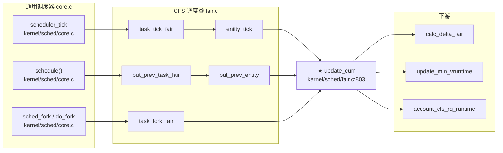

# 每日内核源码分析：update_curr

- **日期**：2026-09-18
- **子系统**：kernel/sched
- **源文件**：kernel/sched/fair.c:803-836
- **类型**：function（static）
- **内核版本**：Linux v4.20

---

## 1. 功能作用

`update_curr` 是 Linux 完全公平调度器（CFS, Completely Fair Scheduler）中**最核心、最高频调用**的函数之一。它的职责是：**更新当前正在运行的调度实体（sched_entity）的运行时统计信息**，尤其是将「真实物理运行时间」转换为「虚拟运行时间（vruntime）」。

CFS 的核心思想是：每个可运行实体在一棵红黑树（`tasks_timeline`）中按 `vruntime` 排序，调度器总是选择 `vruntime` 最小的实体运行。而 `update_curr` 正是负责让当前运行实体的 `vruntime` 随时间推进的关键函数——没有它，CFS 的「公平性」就无从谈起。

**何时被调用**：凡是 CFS 需要重新计算当前任务已运行时间的场景，都会调用它：

- 每个时钟节拍（HZ 频率）的 `scheduler_tick` → `task_tick_fair` → `entity_tick` 路径；
- 主调度器 `schedule()` 切换任务前的 `put_prev_task_fair` → `put_prev_entity` 路径（把当前任务的运行时间结算清楚再放回树里）；
- 任务入队/出队（`enqueue_entity` / `dequeue_entity`）；
- fork 新任务时（`task_fork_fair`）；
- 让出 CPU（`yield_task_fair`）；
- 调整权重（`reweight_entity`）等。

可以说，**只要 CFS 的当前任务还在运行，它的 `vruntime` 就靠 `update_curr` 驱动前进**。

---

## 2. 关键数据结构

### 2.1 `struct cfs_rq` — CFS 运行队列（kernel/sched/sched.h:482）

每个 CPU 的就绪队列 `struct rq` 内嵌一个 `cfs_rq`（组调度时每个 task_group 在每个 CPU 上也有一个）。关键字段：

| 字段 | 类型 | 含义 |
|------|------|------|
| `curr` | `struct sched_entity *` | 当前正在该 cfs_rq 上运行的实体，无则为 NULL |
| `min_vruntime` | `u64` | 该队列中所有实体的最小 vruntime，用于新任务入队时的归一化基准 |
| `exec_clock` | `u64` | 该 cfs_rq 累计执行的真实时钟（统计用） |
| `tasks_timeline` | `struct rb_root_cached` | 按 vruntime 排序的红黑树（带最左节点缓存，加速取最小值） |
| `nr_running` | `unsigned int` | 当前队列上可运行实体数 |
| `load` | `struct load_weight` | 队列的总负荷权重 |
| `runtime_remaining` | `s64` | CFS 带宽控制：该组剩余可用运行时间（CONFIG_CFS_BANDWIDTH） |

### 2.2 `struct sched_entity` — 可调度实体（include/linux/sched.h）

CFS 的基本调度单位，既可以是普通任务，也可以是组调度实体。关键字段：

| 字段 | 类型 | 含义 |
|------|------|------|
| `exec_start` | `u64` | 本次开始运行的时刻（rq 时钟），用于计算 delta_exec |
| `sum_exec_runtime` | `u64` | 该实体累计真实运行时间 |
| `vruntime` | `u64` | **虚拟运行时间**，CFS 排序的核心键值 |
| `load` | `struct load_weight` | 该实体的负荷权重（由 nice 值决定，NICE_0_LOAD=1024） |
| `on_rq` | `int` | 是否在运行队列树中 |
| `run_node` | `struct rb_node` | 红黑树节点 |

### 2.3 `struct load_weight` — 负荷权重

```c
struct load_weight {
    unsigned long weight;      // 权重值，nice 0 => 1024
    u32 inv_weight;            // weight 的倒数定点表示，用于加速除法
};
```

权重是 CFS 「按权重分配 CPU」 的关键：`vruntime` 增量 = `真实时间 * NICE_0_LOAD / 权重`。权重越大（nice 越小），vruntime 增长越慢，获得的 CPU 时间越多。

### 2.4 `rq_clock_task(rq)` — 运行队列时钟

返回该 CPU runqueue 的单调递增时钟（纳秒级），排除了被硬中断占用的时间等，是 CFS 计算运行时间的基准。`rq_of(cfs_rq)` 从 cfs_rq 反向取得所属的 `struct rq`。

---

## 3. 核心逻辑流程图

```mermaid
flowchart TD
    A[入口 update_curr(cfs_rq)] --> B["取 curr = cfs_rq->curr<br/>取 now = rq_clock_task(rq_of(cfs_rq))"]
    B --> C{curr == NULL ?}
    C -->|是| Z[直接返回]
    C -->|否| D["delta_exec = now - curr->exec_start"]
    D --> E{delta_exec <= 0 ?}
    E -->|是| Z
    E -->|否| F["curr->exec_start = now"]
    F --> G["更新统计:<br/>exec_max / sum_exec_runtime / cfs_rq->exec_clock"]
    G --> H["★ curr->vruntime += calc_delta_fair(delta_exec, curr)<br/>真实时间→虚拟时间（按权重缩放）"]
    H --> I["update_min_vruntime(cfs_rq)<br/>推进 cfs_rq 的 min_vruntime"]
    I --> J{entity_is_task(curr) ?}
    J -->|是| K["trace_sched_stat_runtime<br/>cgroup_account_cputime<br/>account_group_exec_runtime"]
    J -->|否| L[跳过任务级统计]
    K --> M["account_cfs_rq_runtime(cfs_rq, delta_exec)<br/>CFS 带宽配额扣减/节流检查"]
    L --> M
    M --> N[返回]
```

### 关键决策点解读

1. **`curr == NULL` 早退**：cfs_rq 上没有当前运行实体（例如 idle 状态或组被限流），无需更新，直接返回。
2. **`delta_exec <= 0` 早退**：时钟异常或刚被更新过（`exec_start` 已等于 now），避免负值污染 vruntime。这里用 `(s64)delta_exec <= 0` 把无符号差值转为有符号比较，是处理 64 位时间回绕的常见手法。
3. **`calc_delta_fair` 是公平性的核心**：若实体权重不是 NICE_0_LOAD（1024），就把真实 delta 按 `NICE_0_LOAD/weight` 缩放。高权重任务 vruntime 涨得慢，低权重任务涨得快，从而实现「按权重公平分享 CPU」。
4. **`update_min_vruntime`**：取 `curr->vruntime` 与红黑树最左节点 vruntime 的较小者，再与原 `min_vruntime` 取 max——**保证 min_vruntime 单调递增，绝不回退**。这是新任务 `place_entity` 时设置初始 vruntime 的基准，防止休眠后唤醒的任务「占便宜」。
5. **`account_cfs_rq_runtime`**：对启用了 CFS 带宽控制（cgroup CPU quota）的组，扣减剩余运行时间；若耗尽则标记该 cfs_rq 为「节流（throttled）」，阻止其继续运行，直到下一个周期补充配额。

---

## 4. 调用关系

### 4.1 调用者（who calls me）

`update_curr` 是 `static` 函数，仅在 fair.c 内部被调用。其上游入口均为 CFS 调度类（`fair_sched_class`）的钩子，由 core.c 通用调度器回调：

| 调用方（导出钩子） | 中间调用 | 所在文件 | 调用场景 |
|--------------------|----------|----------|----------|
| `task_tick_fair` | → `entity_tick` | fair.c:9774 | 时钟节拍周期性更新（scheduler_tick 路径） |
| `put_prev_task_fair` | → `put_prev_entity` | fair.c:6776 | 主调度器切换任务前结算当前任务运行时间 |
| `task_fork_fair` | 直接 | fair.c:9795 | fork 新任务时初始化调度实体 |
| `yield_task_fair` | 直接 | fair.c:6792 | 任务主动让出 CPU |
| `enqueue_task_fair` / `dequeue_task_fair` | → `enqueue_entity` / `dequeue_entity` | fair.c | 任务入队/出队时先更新当前实体时间 |
| `reweight_entity` | 直接 | fair.c:2781 | 动态调整负荷权重（如改 nice 值） |
| `check_cfs_rq_runtime` | 直接 | fair.c:4143 | 带宽控制检查 |

### 4.2 被调用者（who I call）

- **核心路径调用**：
  - `rq_of(cfs_rq)`：从 cfs_rq 取所属 rq（内联）。
  - `rq_clock_task(rq)`：取 rq 单调时钟。
  - `calc_delta_fair(delta_exec, curr)`：真实时间→虚拟时间（权重缩放）。
  - `update_min_vruntime(cfs_rq)`：推进 cfs_rq 最小 vruntime。
- **任务级统计调用**（仅 `entity_is_task(curr)` 时）：
  - `trace_sched_stat_runtime(...)`：调度统计 tracepoint。
  - `cgroup_account_cputime(...)`：cgroup CPU 时间统计。
  - `account_group_exec_runtime(...)`：组调度运行时间统计。
- **带宽控制调用**：
  - `account_cfs_rq_runtime(cfs_rq, delta_exec)`：CFS 配额扣减。
- **辅助宏**：
  - `schedstat_set` / `schedstat_add`：仅在 `CONFIG_SCHEDSTATS` 开启时生效的统计宏，开销可控。

### 4.3 调用关系图（Mermaid）



---

## 5. 易错点 / 边界场景 / 设计权衡

1. **`(s64)delta_exec <= 0` 的符号转换**：`now` 和 `exec_start` 都是 `u64`，相减后仍是 `u64`。直接判断 `delta_exec <= 0` 对无符号数等价于 `== 0`，无法捕捉「now 略小于 exec_start」的时钟抖动。转为 `s64` 后能正确处理轻微回绕/不同步，避免把一个极小的差值当成超大正数加到 vruntime 上。

2. **`min_vruntime` 只能单调递增**：`update_min_vruntime` 最后一行 `max_vruntime(cfs_rq->min_vruntime, vruntime)` 是关键设计。若允许回退，刚唤醒的休眠任务会以一个很小的 vruntime 入队，导致它「垄断」CPU（因为 CFS 总选 vruntime 最小者）。单调递增保证了公平性基准不会倒退。

3. **`calc_delta_fair` 对 NICE_0_LOAD 的快速路径**：权重恰为 1024 时（nice=0 的绝大多数任务），直接返回原 delta，省去 `__calc_delta` 的定点乘除。这是一个非常典型的热路径优化——CFS 中 update_curr 调用极频繁，每省一次除法都有意义。

4. **`exec_start = now` 必须在计算 delta 之后**：先算 `delta_exec = now - exec_start`，再把 `exec_start` 推进到 now。顺序颠倒会导致 delta 恒为 0，vruntime 不再增长，当前任务永远不被抢占。

5. **`account_cfs_rq_runtime` 与节流**：对启用了 `cpu.cfs_quota_us` 的 cgroup，该函数扣减 `runtime_remaining`。当配额耗尽，cfs_rq 被标记 throttled，其 `curr` 会被强制设为 NULL，后续 `update_curr` 命中 `curr == NULL` 早退——这正是带宽控制与 update_curr 的协作点。

6. **组调度下的多层调用**：在 `CONFIG_FAIR_GROUP_SCHED` 下，`for_each_sched_entity(se)` 宏会沿层级向上遍历，`update_curr` 会被作用于每一层 cfs_rq 的当前实体，保证组及其子实体的 vruntime 同步推进。

---

## 附：核心源码片段

```c
// kernel/sched/fair.c:803-836  (Linux v4.20)
/*
 * Update the current task's runtime statistics.
 */
static void update_curr(struct cfs_rq *cfs_rq)
{
    struct sched_entity *curr = cfs_rq->curr;
    u64 now = rq_clock_task(rq_of(cfs_rq));
    u64 delta_exec;

    if (unlikely(!curr))
        return;

    delta_exec = now - curr->exec_start;
    if (unlikely((s64)delta_exec <= 0))
        return;

    curr->exec_start = now;

    schedstat_set(curr->statistics.exec_max,
                  max(delta_exec, curr->statistics.exec_max));

    curr->sum_exec_runtime += delta_exec;
    schedstat_add(cfs_rq->exec_clock, delta_exec);

    curr->vruntime += calc_delta_fair(delta_exec, curr);
    update_min_vruntime(cfs_rq);

    if (entity_is_task(curr)) {
        struct task_struct *curtask = task_of(curr);

        trace_sched_stat_runtime(curtask, delta_exec, curr->vruntime);
        cgroup_account_cputime(curtask, delta_exec);
        account_group_exec_runtime(curtask, delta_exec);
    }

    account_cfs_rq_runtime(cfs_rq, delta_exec);
}
```

```c
// 关键辅助：calc_delta_fair  (kernel/sched/fair.c:628)
/* delta /= w */
static inline u64 calc_delta_fair(u64 delta, struct sched_entity *se)
{
    if (unlikely(se->load.weight != NICE_0_LOAD))
        delta = __calc_delta(delta, NICE_0_LOAD, &se->load);
    return delta;
}
```

```c
// 关键辅助：update_min_vruntime  (kernel/sched/fair.c:496)
static void update_min_vruntime(struct cfs_rq *cfs_rq)
{
    struct sched_entity *curr = cfs_rq->curr;
    struct rb_node *leftmost = rb_first_cached(&cfs_rq->tasks_timeline);
    u64 vruntime = cfs_rq->min_vruntime;

    if (curr) {
        if (curr->on_rq)
            vruntime = curr->vruntime;
        else
            curr = NULL;
    }
    if (leftmost) {
        struct sched_entity *se = rb_entry(leftmost, struct sched_entity, run_node);
        if (!curr)
            vruntime = se->vruntime;
        else
            vruntime = min_vruntime(vruntime, se->vruntime);
    }
    /* ensure we never gain time by being placed backwards. */
    cfs_rq->min_vruntime = max_vruntime(cfs_rq->min_vruntime, vruntime);
}
```
