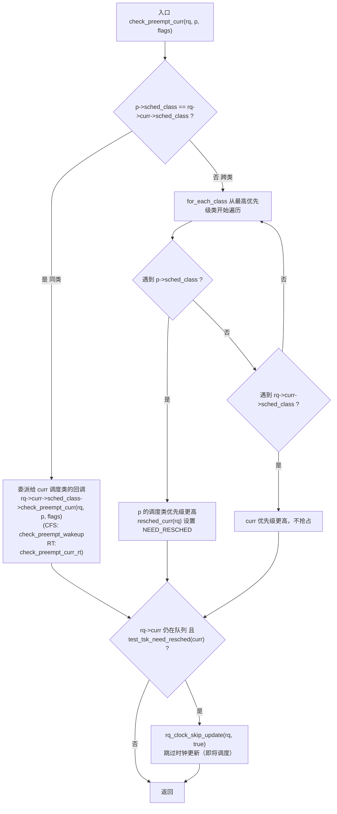
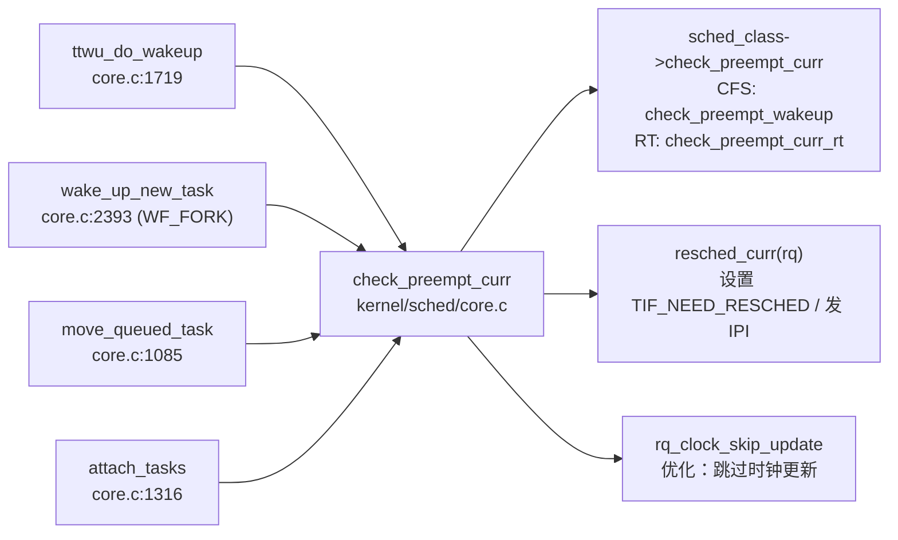

# 每日内核源码分析：check_preempt_curr

- **日期**：2026-09-19
- **子系统**：kernel/sched
- **源文件**：kernel/sched/core.c:1025-1048
- **类型**：function
- **内核版本**：Linux 4.4.0

---

## 1. 功能作用

`check_preempt_curr` 是 Linux 调度器中**唤醒抢占（wakeup-preemption）决策**的核心入口。每当一个任务 `p` 变为可运行状态（被唤醒、fork 后首次唤醒、或跨 CPU 迁移后入队），内核都会调用它，判断当前正在 CPU 上运行的任务 `rq->curr` 是否应该被 `p` 抢占。

它解决的核心问题是：**新就绪的任务是否比当前运行的任务更有资格占用 CPU？** 如果是，则设置 `TIF_NEED_RESCHED` 标志，触发一次调度；否则什么也不做，让当前任务继续运行。

典型调用场景：
- 普通唤醒路径 `ttwu_do_wakeup()`：任务从睡眠中被唤醒后。
- fork 唤醒路径 `wake_up_new_task()`：子进程创建后首次入队（带 `WF_FORK` 标志）。
- 负载均衡迁移路径 `move_queued_task()` / `set_task_cpu()` 后：任务被迁移到目标 CPU 的 runqueue 之后。

---

## 2. 关键数据结构

### `struct rq`（运行队列）

每个 CPU 一个，描述该 CPU 上的调度状态。核心字段：
- `curr`：当前正在运行的 `task_struct`。
- `idle`：该 CPU 的 idle 任务。
- `lock`：保护 runqueue 的自旋锁（调用本函数时必须持有）。
- `clock` / `clock_skip_update`：runqueue 时钟及跳过更新标志。

### `struct task_struct`（任务描述符）

- `sched_class`：该任务所属的调度类（stop / dl / rt / fair / idle）。
- `prio`：动态优先级（数值越小优先级越高，仅对 RT 类直接可比）。
- `policy`：调度策略（`SCHED_NORMAL`、`SCHED_RR`、`SCHED_FIFO`、`SCHED_BATCH`、`SCHED_IDLE`）。
- `se`：CFS 调度实体 `struct sched_entity`（含 `vruntime` 虚拟运行时间）。

### `struct sched_class`（调度类）

调度类通过 `next` 指针按**优先级从高到低**串联成链表：

```
stop_sched_class → dl_sched_class → rt_sched_class → fair_sched_class → idle_sched_class
```

关键字段：
- `check_preempt_curr`：本函数最终委派到的回调（CFS 为 `check_preempt_wakeup`，RT 为 `check_preempt_curr_rt`）。
- `next`：指向更低优先级的调度类，供 `for_each_class` 遍历。

### `struct sched_entity` / `struct cfs_rq`（CFS 实体与队列）

- `vruntime`：虚拟运行时间，CFS 用于公平性比较的核心。
- `cfs_rq->nr_running`：当前 CFS 队列上的可运行实体数，用于判断是否启用 `sched_nr_latency` 缩放。

### 标志 `WF_FORK`

```c
#define WF_FORK  0x02   /* child wakeup after fork */
```
表示本次唤醒来自 fork 后的子进程，CFS 据此跳过 `next_buddy` 标记（新进程没有历史负载信息）。

---

## 3. 核心逻辑流程图



### 关键决策点说明

1. **同类 vs 跨类**：同调度类的比较由该类自身策略决定（CFS 比 vruntime、RT 比静态优先级）；跨类则直接按调度类的全局优先级链判断。
2. **`for_each_class` 遍历顺序**：从 `stop_sched_class`（最高）开始，先遇到谁谁优先级高。若先遇到 `p->sched_class`，说明 `p` 类级别更高，立即抢占并 `break`。
3. **`resched_curr` 的本地/远程差异**：若目标 CPU 就是当前 CPU，直接设置 `TIF_NEED_RESCHED`；若是远程 CPU，则通过 `smp_send_reschedule` 发送 IPI。
4. **时钟跳过优化**：一旦决定要调度，后续 `rq->clock` 的更新就无意义（调度时会重新计算），因此设置 `skip` 标志避免一次无用的 `ktime_get`。
5. **同类委派不直接 `resched`**：CFS 的 `check_preempt_wakeup` 内部还会做 `next_buddy` / `last_buddy` 标记、节流层级判断等，最终才在 `preempt:` 标签调用 `resched_curr`。

---

## 4. 调用关系

### 4.1 调用者（who calls me）

| 调用方 | 所在文件 | 调用场景 |
|--------|----------|----------|
| `ttwu_do_wakeup` | kernel/sched/core.c:1719 | 普通唤醒路径，将 `p` 标记为 RUNNING 并尝试抢占当前任务，传入 `wake_flags` |
| `wake_up_new_task` | kernel/sched/core.c:2393 | fork 后子进程首次入队，传入 `WF_FORK` 标志 |
| `move_queued_task` | kernel/sched/core.c:1085 | SMP 任务迁移完成、入队目标 runqueue 后 |
| `attach_tasks` / 迁移相关 | kernel/sched/core.c:1316 | `deactivate_task` + `activate_task` 跨 CPU 后检查抢占 |
| `sched_class` 回调内部 | kernel/sched/fair.c:5860,7958,8044 | CFS 组调度 enqueue 后自调用 |

### 4.2 被调用者（who I call）

- **核心路径调用**：
  - `rq->curr->sched_class->check_preempt_curr`（同类委派，CFS→`check_preempt_wakeup`，RT→`check_preempt_curr_rt`）
  - `resched_curr(rq)`（跨类抢占时，设置 NEED_RESCHED 并可能发 IPI）
- **辅助调用**：
  - `task_on_rq_queued(rq->curr)`：判断 curr 是否仍在 runqueue 上
  - `test_tsk_need_resched(rq->curr)`：测试 NEED_RESCHED 标志
  - `rq_clock_skip_update(rq, true)`：跳过 runqueue 时钟更新
- **宏 / 内联**：
  - `for_each_class(class)`：展开为 `for (class = sched_class_highest; class; class = class->next)`

### 4.3 调用关系图（Mermaid）



---

## 5. 易错点 / 边界场景 / 设计权衡

1. **跨类比较不能直接比 `prio`**：`task_struct->prio` 只在同一调度类内有意义（尤其 CFS 的 `prio` 是 nice 值转换，RT 的 `prio` 是 0-99 静态优先级）。跨类必须通过 `for_each_class` 链表顺序判断，这是本函数最核心的设计。

2. **`resched_curr` 必须在持有 `rq->lock` 时调用**：函数开头有 `lockdep_assert_held(&rq->lock)`。若远程 CPU 路径用 `set_nr_and_not_polling` 原子设置标志后再发 IPI，保证与目标 CPU 的调度路径无竞态。

3. **CFS 的 `check_preempt_wakeup` 不总是抢占**：即使 `p` 是 SCHED_NORMAL，也只有 `WAKEUP_PREEMPTION` 特性开启且 `wakeup_preempt_entity` 返回 1（`p` 的 vruntime 更早）才抢占。`SCHED_BATCH` 任务永远不会通过唤醒抢占当前任务（只能靠 tick）。

4. **`next_buddy` / `last_buddy` 的微妙作用**：CFS 在决定抢占后，会把 `p` 设为 `next_buddy`（下次 pick_next 优先选它），把被抢占的 curr 设为 `last_buddy`（之后尽快回到它）。这降低了唤醒抢占带来的缓存抖动，但 `WF_FORK` 时不设 `next_buddy`。

5. **节流（throttle）层级提前返回**：CFS 中若 `p` 处于被节流的 cgroup 层级，直接返回不抢占，避免错误提名 buddy。

6. **时钟跳过的前提**：只有 `rq->curr` 仍在队列上（未被 dequeue）且 NEED_RESCHED 已置位时才跳过时钟更新。若 curr 已不在队列，说明即将切走，无需该优化。

---

## 附：核心源码片段

```c
// kernel/sched/core.c:1025-1048
void check_preempt_curr(struct rq *rq, struct task_struct *p, int flags)
{
	const struct sched_class *class;

	if (p->sched_class == rq->curr->sched_class) {
		rq->curr->sched_class->check_preempt_curr(rq, p, flags);
	} else {
		for_each_class(class) {
			if (class == rq->curr->sched_class)
				break;
			if (class == p->sched_class) {
				resched_curr(rq);
				break;
			}
		}
	}

	/*
	 * A queue event has occurred, and we're going to schedule.  In
	 * this case, we can save a useless back to back clock update.
	 */
	if (task_on_rq_queued(rq->curr) && test_tsk_need_resched(rq->curr))
		rq_clock_skip_update(rq, true);
}
```

参考链接：
- https://github.com/novelinux/linux-4.x.y/tree/master/kernel/sched/core.c
- https://github.com/novelinux/linux-4.x.y/tree/master/kernel/sched/sched.h/struct_sched_class.md
