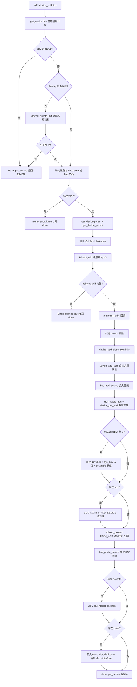
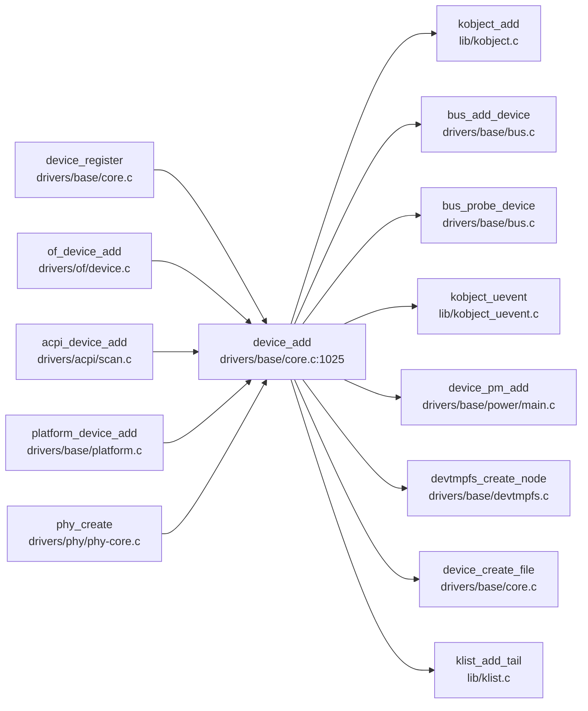

# 每日内核源码分析：device_add

- **日期**：2026-09-20
- **子系统**：drivers/base（设备驱动模型核心）
- **源文件**：drivers/base/core.c:1025-1165
- **内核版本**：Linux 4.4.0
- **类型**：function（全局导出，EXPORT_SYMBOL_GPL）

---

## 1. 功能作用

`device_add` 是 Linux 设备驱动模型（driver model）的**核心入口函数**，负责将一个 `struct device` 注册进内核的设备层级体系中。它是 `device_register()` 的第二步（第一步是 `device_initialize()`），也可以在已经单独调用过 `device_initialize()` 的前提下被独立调用。

它完成的关键事情包括：

1. **引用计数与私有数据初始化**：通过 `get_device` 增加设备引用计数，按需分配 `device_private` 结构。
2. **命名**：根据 `init_name` 或总线的 `dev_name` + `id` 生成设备在 sysfs 中的名字。
3. **kobject 层注册**：调用 `kobject_add` 把设备挂入 kobject 层级，从而在 sysfs 中创建设备目录。
4. **属性与符号链接**：创建 `uevent` 属性、class 符号链接、设备自定义属性组。
5. **总线 / 电源管理集成**：`bus_add_device` 把设备加入总线，`dpm_sysfs_add` + `device_pm_add` 接入电源管理（PM）列表。
6. **字符设备节点**：若 `devt` 有主设备号，创建 `dev` 属性、`/sys/dev` 入口以及 `devtmpfs` 设备节点。
7. **通知与探测**：发送 `BUS_NOTIFY_ADD_DEVICE` 通知、`kobject_uevent(KOBJ_ADD)` 给用户空间（udev），并通过 `bus_probe_device` 尝试为设备匹配并绑定驱动。
8. **层级挂接**：把设备加入父设备的 `klist_children` 链表，以及所属 class 的设备链表并通知 class interface。

典型调用场景：驱动子系统在枚举到新设备（如 platform、PCI、USB、I2C 等总线扫描）后，构造 `struct device` 并调用 `device_register` → `device_add` 完成注册。

---

## 2. 关键数据结构

### 2.1 `struct device`（include/linux/device.h:764）

设备模型的核心对象，描述一个物理或逻辑设备。与 `device_add` 强相关的字段：

| 字段 | 含义 |
|------|------|
| `parent` | 父设备指针，决定 sysfs 中的目录层级 |
| `p` | 指向 `struct device_private`，存放驱动核心内部状态（链表节点等），不暴露给驱动 |
| `kobj` | 内嵌的 `struct kobject`，负责 sysfs 表示与引用计数 |
| `init_name` | 初始名字，`device_add` 会把它转存到 kobject name 并置 NULL |
| `bus` | 设备所属总线 `struct bus_type` |
| `driver` | 已绑定的驱动（`bus_probe_device` 后可能被设置） |
| `class` | 设备所属 class |
| `devt` | `dev_t`，若主设备号非 0 则创建 `dev` 属性与 devtmpfs 节点 |
| `id` | 设备实例编号，配合 `bus->dev_name` 生成名字 |
| `numa_node` | NUMA 节点，缺省时从父设备继承 |
| `release` | 设备释放回调，**必须设置**，否则 `put_device` 时 WARN |

### 2.2 `struct device_private`（drivers/base/base.h:71）

驱动核心私有数据，`device_add` 中若 `dev->p` 为 NULL 则通过 `device_private_init` 分配：

```c
struct device_private {
    struct klist      klist_children;   /* 子设备链表头 */
    struct klist_node knode_parent;     /* 挂入父设备 klist_children 的节点 */
    struct klist_node knode_driver;     /* 挂入驱动设备链表的节点 */
    struct klist_node knode_bus;        /* 挂入总线设备链表的节点 */
    struct list_head  deferred_probe;   /* 延迟探测链表节点 */
    struct device    *device;           /* 回指所属 device */
};
```

设计要点：把"驱动核心需要、但驱动作者不该碰"的链表节点从 `struct device` 中剥离到 `device_private`，保持 `struct device` 的 ABI 稳定。

### 2.3 `struct kobject` / `struct kobj_type`

`device->kobj` 的 `ktype` 被设为 `device_ktype`，其 `release` 回调为 `device_release`，`sysfs_ops` 为 `dev_sysfs_ops`。`kobject_add` 会在 sysfs 中创建以设备名命名的目录。

### 2.4 关键属性

- `dev_attr_uevent`：`/sys/devices/.../uevent` 属性，供用户空间读取/触发 uevent。
- `dev_attr_dev`：`/sys/devices/.../dev` 属性，仅在 `MAJOR(dev->devt) != 0` 时创建，内容为 `major:minor`。
- `struct class_interface`：class 接口，`add_dev` 回调在设备加入 class 时被调用。

### 2.5 `struct bus_type` / `struct class`

- `dev->bus->p->bus_notifier`：总线通知链，`device_add` 发送 `BUS_NOTIFY_ADD_DEVICE`。
- `dev->bus->p->drivers_autoprobe`：若为真，`bus_probe_device` 会触发 `device_initial_probe` 自动匹配驱动。
- `dev->class->p->klist_devices` / `interfaces`：class 维护的设备链表与接口链表。

---

## 3. 核心逻辑流程图



关键决策点说明：

1. **`dev->p` 延迟初始化**：允许调用方先 `device_initialize` 再 `device_add`，也允许直接传未初始化的设备进来。
2. **名字必须在 `kobject_add` 之前确定**：`kobject_add` 第三个参数传 NULL，意味着名字已通过 `dev_set_name` 预先写入 kobject，这是为了兼容 `init_name` 机制。
3. **`kobject_add` 是真正的"出生点"**：一旦成功，sysfs 目录就存在，后续每一步失败都要按逆序回滚。
4. **uevent 时机**：`kobject_uevent(KOBJ_ADD)` 必须在 `dpm_sysfs_add` 之后、class 挂接之前发送，保证用户空间看到的属性完整。
5. **驱动探测 `bus_probe_device`**：在 uevent 之后、加入 parent/class 链表之前执行，这样驱动的 `probe` 回调能看到设备但设备尚未完全挂入子系统链表，减少竞态。
6. **错误回滚链**：`SysEntryError → DevAttrError → DPMError → BusError → AttrsError → SymlinkError → attrError → Error → name_error`，严格按注册逆序撤销，最后统一 `put_device(dev)`。

---

## 4. 调用关系

### 4.1 调用者（who calls me）

`device_add` 被各总线 / 子系统的注册路径调用。以下列举有代表性的调用点：

| 调用方 | 所在文件 | 调用场景 |
|--------|----------|----------|
| `device_register` | drivers/base/core.c:1189 | 通用设备注册（initialize + add 两步封装） |
| `ipack_device_add` | drivers/ipack/ipack.c:467 | IndustryPack 设备注册 |
| `phy_create` 路径 | drivers/phy/phy-core.c:726 | PHY 子系统注册 phy 设备 |
| `acpi_device_add` | drivers/acpi/scan.c:673 | ACPI 扫描到设备后注册 |
| `of_device_add` | drivers/of/device.c:70 | 设备树平台设备注册 |
| `fpga_mgr_create` | drivers/fpga/fpga-mgr.c:304 | FPGA 管理器设备注册 |
| `rc_register_device` | drivers/media/rc/rc-main.c:1384 | 远程控制器设备注册 |
| `pmu_dev_reserve` 路径 | kernel/events/core.c:7609 | perf PMU 设备注册 |

> 注：大量驱动通过 `platform_device_add`、`device_register` 等更高层封装间接调用 `device_add`。

### 4.2 被调用者（who I call）

#### 核心路径调用

| 函数 | 作用 |
|------|------|
| `get_device` / `put_device` | 设备引用计数加减（基于 kobject） |
| `device_private_init` | 分配并初始化 `device_private` |
| `dev_set_name` | 设置设备名（kobject name） |
| `get_device_parent` | 决定设备 kobject 的父节点（处理 class 等虚拟父） |
| `kobject_add` | 把 kobject 加入 sysfs 层级 |
| `device_create_file` | 创建设备属性（uevent、dev） |
| `device_add_class_symlinks` | 在 class 目录与设备目录间创建符号链接 |
| `device_add_attrs` | 注册设备 `groups` 自定义属性 |
| `bus_add_device` | 把设备加入总线的设备链表与 sysfs |
| `dpm_sysfs_add` | 在 sysfs 创建设备电源管理属性 |
| `device_pm_add` | 把设备加入全局 dpm_list（PM 核心链表） |
| `device_create_sys_dev_entry` | 在 `/sys/dev/{char,block}/` 创建 `major:minor` 符号链接 |
| `devtmpfs_create_node` | 在 devtmpfs 创建设备节点文件 |
| `blocking_notifier_call_chain` | 发送总线 `BUS_NOTIFY_ADD_DEVICE` 通知 |
| `kobject_uevent` | 向用户空间发送 `KOBJ_ADD` uevent |
| `bus_probe_device` | 触发驱动匹配与 probe |
| `klist_add_tail` | 把设备挂入父设备 / class 的 klist |

#### 辅助调用

- `pr_debug`：调试打印。
- `cleanup_device_parent`：错误路径清理 `get_device_parent` 申请的资源。
- `kfree`：`name_error` 路径释放 `dev->p`。

#### 宏 / 内联

- `MAJOR(dev->devt)`：从 `dev_t` 提取主设备号。
- `dev_to_node` / `set_dev_node`：NUMA 节点访问器（CONFIG_NUMA 下为字段，否则为常量）。
- `container_of`（经由 `to_device_private_parent` 等宏在回链时使用）。

### 4.3 调用关系图



---

## 5. 易错点 / 边界场景 / 设计权衡

1. **绝不能在 `device_add` 后直接 `kfree(dev)`**：即使 `device_add` 返回错误，也必须用 `put_device()` 释放引用。函数文档与注释反复强调这一点，因为 `device_private_init` 已分配 `dev->p`，且 `kobject_add` 可能已持有引用。直接 free 会导致 use-after-free。

2. **`dev->release` 必须设置**：`kobject` 的 release 回调（`device_release`）最终调用 `dev->release`。若 `release` 为 NULL，最后一个 `put_device` 会触发 `WARN`，因为无法释放设备内存。

3. **错误回滚的严格顺序**：每个 `goto XxxError` 标签只撤销"到该步为止"已经成功的操作。例如 `SymlinkError` 撤销 `uevent` 属性，`attrError` 额外发 `KOBJ_REMOVE` 并 `kobject_del`。若新增注册步骤时忘记在对应标签处回滚，会导致 sysfs 残留或链表泄漏。

4. **`init_name` 一次性使用**：`device_add` 把 `init_name` 拷贝到 kobject name 后立即置 NULL。之后 `dev_name()` 只从 kobject 取名字，避免静态设备名字被意外改写。

5. **`kobject_uevent(KOBJ_ADD)` 的时机敏感性**：必须在 `dpm_sysfs_add` 之后（用户空间读取 power 属性才不报错），又必须在 class 挂接之前（class 接口回调中可能需要 udev 还未处理完设备）。这个顺序是驱动模型中反复打磨的结果。

6. **`bus_probe_device` 可能同步执行驱动 `probe`**：若总线开启 `drivers_autoprobe`，`device_initial_probe` 会在此处同步调用驱动的 `probe`。若 probe 失败，设备仍然注册成功，只是未绑定驱动，后续可通过 `bind` 属性手动绑定或等待驱动加载时重试（延迟探测）。

7. **父设备 NUMA 节点继承**：当 `dev_to_node(dev) == NUMA_NO_NODE` 时从父设备继承，保证 NUMA 感知的内存分配能就近进行。

8. **`devt` 决定是否创建 `dev` 属性与 devtmpfs 节点**：仅 `MAJOR(dev->devt) != 0` 的设备才会出现在 `/dev` 下；纯 platform 设备（无字符/块号）不会有 devtmpfs 节点。

---

## 附：核心源码片段

```c
// drivers/base/core.c:1025-1165 (Linux 4.4.0)
int device_add(struct device *dev)
{
    struct device *parent = NULL;
    struct kobject *kobj;
    struct class_interface *class_intf;
    int error = -EINVAL;

    dev = get_device(dev);
    if (!dev)
        goto done;

    if (!dev->p) {
        error = device_private_init(dev);
        if (error)
            goto done;
    }

    if (dev->init_name) {
        dev_set_name(dev, "%s", dev->init_name);
        dev->init_name = NULL;
    }

    if (!dev_name(dev) && dev->bus && dev->bus->dev_name)
        dev_set_name(dev, "%s%u", dev->bus->dev_name, dev->id);

    if (!dev_name(dev)) {
        error = -EINVAL;
        goto name_error;
    }

    parent = get_device(dev->parent);
    kobj = get_device_parent(dev, parent);
    if (kobj)
        dev->kobj.parent = kobj;

    if (parent && (dev_to_node(dev) == NUMA_NO_NODE))
        set_dev_node(dev, dev_to_node(parent));

    error = kobject_add(&dev->kobj, dev->kobj.parent, NULL);
    if (error)
        goto Error;

    if (platform_notify)
        platform_notify(dev);

    error = device_create_file(dev, &dev_attr_uevent);
    if (error)
        goto attrError;

    error = device_add_class_symlinks(dev);
    if (error)
        goto SymlinkError;
    error = device_add_attrs(dev);
    if (error)
        goto AttrsError;
    error = bus_add_device(dev);
    if (error)
        goto BusError;
    error = dpm_sysfs_add(dev);
    if (error)
        goto DPMError;
    device_pm_add(dev);

    if (MAJOR(dev->devt)) {
        error = device_create_file(dev, &dev_attr_dev);
        if (error)
            goto DevAttrError;

        error = device_create_sys_dev_entry(dev);
        if (error)
            goto SysEntryError;

        devtmpfs_create_node(dev);
    }

    if (dev->bus)
        blocking_notifier_call_chain(&dev->bus->p->bus_notifier,
                                     BUS_NOTIFY_ADD_DEVICE, dev);

    kobject_uevent(&dev->kobj, KOBJ_ADD);
    bus_probe_device(dev);
    if (parent)
        klist_add_tail(&dev->p->knode_parent,
                       &parent->p->klist_children);

    if (dev->class) {
        mutex_lock(&dev->class->p->mutex);
        klist_add_tail(&dev->knode_class,
                       &dev->class->p->klist_devices);
        list_for_each_entry(class_intf,
                            &dev->class->p->interfaces, node)
            if (class_intf->add_dev)
                class_intf->add_dev(dev, class_intf);
        mutex_unlock(&dev->class->p->mutex);
    }
done:
    put_device(dev);
    return error;
 SysEntryError:
    if (MAJOR(dev->devt))
        device_remove_file(dev, &dev_attr_dev);
 DevAttrError:
    device_pm_remove(dev);
    dpm_sysfs_remove(dev);
 DPMError:
    bus_remove_device(dev);
 BusError:
    device_remove_attrs(dev);
 AttrsError:
    device_remove_class_symlinks(dev);
 SymlinkError:
    device_remove_file(dev, &dev_attr_uevent);
 attrError:
    kobject_uevent(&dev->kobj, KOBJ_REMOVE);
    kobject_del(&dev->kobj);
 Error:
    cleanup_device_parent(dev);
    put_device(parent);
name_error:
    kfree(dev->p);
    dev->p = NULL;
    goto done;
}
```
