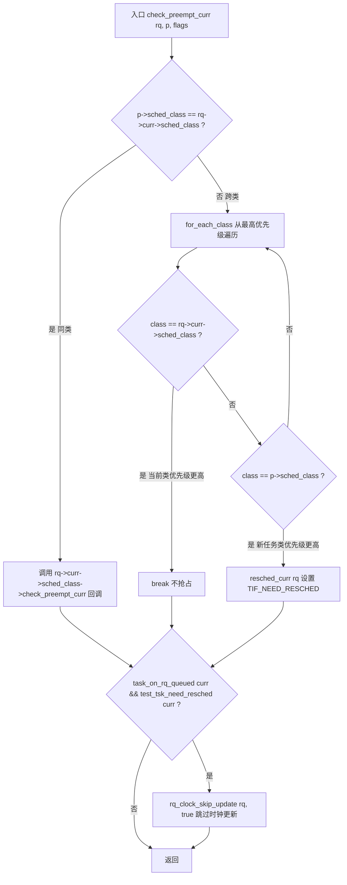
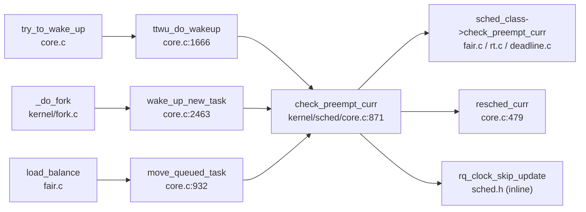

# 每日内核源码分析：check_preempt_curr

- **日期**：2026-09-20
- **子系统**：kernel/sched（进程调度）
- **源文件**：kernel/sched/core.c:871-894
- **类型**：function
- **内核版本**：Linux v4.14（基于 torvalds/linux 官方源码对照 novelinux/linux-4.x.y 分析仓库）

---

## 1. 功能作用

`check_preempt_curr` 是 Linux 调度器中**「唤醒抢占判定」的总入口函数**。每当一个任务被唤醒并重新加入运行队列（runqueue）时，内核都会调用它来判断：这个新唤醒的任务 `p` 是否应该抢占当前正在 CPU 上运行的任务 `rq->curr`。

它解决的核心问题是：**在多调度类（sched_class）共存的情况下，如何统一地做出抢占决策**。Linux 4.x 中存在 stop / deadline / rt / fair(CFS) / idle 五个调度类，优先级依次递减。`check_preempt_curr` 负责：

- **同类调度**：若新任务与当前任务属于同一调度类，则把具体比较逻辑下放给该调度类自己的 `check_preempt_curr` 回调（例如 CFS 的 `check_preempt_wakeup` 会比较虚拟运行时间 vruntime）。
- **跨类调度**：若两者调度类不同，则通过遍历调度类链表（从高优先级到低优先级），看谁的类先出现——先出现的优先级更高，从而决定是否设置重调度标志 `TIF_NEED_RESCHED`。
- **时钟优化**：若判定结果是「当前任务需要被调度走」，则跳过一次 runqueue 时钟更新，避免紧接而来的 `schedule()` 做无用的重复时钟更新。

**典型调用场景**：
1. `try_to_wake_up` → `ttwu_do_wakeup`：普通任务唤醒时（最常见路径）。
2. `wake_up_new_task`：`fork` 出新任务后首次唤醒（带 `WF_FORK` 标志）。
3. `move_queued_task` / 负载均衡迁移：任务跨 CPU 迁移到新 runqueue 后。

---

## 2. 关键数据结构

### `struct rq`（运行队列，per-CPU）

定义于 `kernel/sched/sched.h`。每个 CPU 拥有一个 `struct rq`，是该 CPU 上所有可运行任务的容器。

- `rq->curr`：当前正在该 CPU 上运行的 `task_struct`。
- `rq->clock` / `rq->clock_update_flags`：runqueue 时钟及更新控制位；`rq_clock_skip_update` 通过设置 `RQCF_REQ_SKIP` 位来延迟时钟更新。
- `rq->lock`：保护 runqueue 的自旋锁；`check_preempt_curr` 的所有调用者都持有该锁。

### `struct task_struct`（任务描述符）

- `p->sched_class`：指向该任务所属调度类的指针（`const struct sched_class *`）。
- `p->state`：任务状态；唤醒后置为 `TASK_RUNNING`。
- `p->on_rq`：任务是否在 runqueue 上（`TASK_ON_RQ_QUEUED` 表示已入队）。
- `p->thread_info.flags`（通过 `test_tsk_need_resched` / `set_tsk_need_resched` 访问）：包含 `TIF_NEED_RESCHED` 标志位。

### `struct sched_class`（调度类）

定义于 `kernel/sched/sched.h`，是一个含函数指针的结构体，各个调度类（stop/dl/rt/fair/idle）提供各自的实现。

- `next`：指向下一个（更低优先级）调度类，形成**单向链表**。
- `check_preempt_curr`：同类内部的抢占判定回调（本函数会调用它）。
- 其他关键回调：`enqueue_task`、`dequeue_task`、`pick_next_task`、`put_prev_task` 等。

### 调度类链表与 `for_each_class` 宏

```c
#define for_each_class(class) \
    for (class = sched_class_highest; class; class = class->next)
```

`sched_class_highest` 指向 `stop_sched_class`，链表顺序即优先级从高到低：

```
stop_sched_class → dl_sched_class → rt_sched_class → fair_sched_class → idle_sched_class
(最高)                                                              (最低)
```

### 关键标志

| 标志 | 含义 |
|------|------|
| `TIF_NEED_RESCHED` | 当前任务应被重新调度（由 `resched_curr` 设置） |
| `WF_FORK` | 唤醒标志，表示这是 fork 后首次唤醒新任务 |
| `RQCF_REQ_SKIP` | 请求跳过 runqueue 时钟更新 |

---

## 3. 核心逻辑流程图



**关键决策点解读**：

1. **同类 vs 跨类分流**：同调度类的比较策略差异巨大（CFS 比 vruntime、RT 比优先级、DL 比截止时间），无法用统一逻辑表达，因此通过函数指针下放给各调度类。跨类则只需比较调度类本身的优先级顺序。

2. **`for_each_class` 遍历方向**：从最高优先级 `stop` 开始往低走。先遇到的类优先级更高。若先遇到 `curr` 的类，说明 `curr` 优先级不低于 `p`，无需抢占；若先遇到 `p` 的类，说明 `p` 优先级更高，立即设置重调度标志并 `break`。

3. **`resched_curr` 是「请求」而非「立即切换」**：它只设置 `TIF_NEED_RESCHED` 标志，真正的上下文切换发生在下次 `preempt_enable()` / 中断返回 / 系统调用返回等「调度点」。这保证了在持有 `rq->lock` 的临界区内不会立即切换。

4. **时钟更新优化**：`rq->clock` 是调度类计算（如 CFS 的 vruntime）的基准。若已确定要调度，后续 `__schedule` 会更新时钟，此处再更新一次纯属浪费，故通过 `RQCF_REQ_SKIP` 跳过。

5. **`task_on_rq_queued(rq->curr)` 守卫**：只有当前任务确实在 runqueue 上时才需要考虑时钟跳过；若当前任务已出队（如正在退出），则不做此优化。

---

## 4. 调用关系

### 4.1 调用者（who calls me）

| 调用方 | 所在文件 | 调用场景 |
|--------|----------|----------|
| `ttwu_do_wakeup` | `kernel/sched/core.c:1666` | `try_to_wake_up` 的唤醒收尾：任务入队后判定是否抢占当前任务（最常见路径） |
| `wake_up_new_task` | `kernel/sched/core.c:2463` | `fork` 后新任务首次唤醒，带 `WF_FORK` 标志 |
| `move_queued_task` | `kernel/sched/core.c:932` | 任务跨 CPU 迁移完成，入新 runqueue 后判定抢占 |
| `migrate_swap_task`（迁移路径） | `kernel/sched/core.c:1211` | 负载均衡中任务在源/目的 runqueue 间迁移后判定 |

### 4.2 被调用者（who I call）

- **核心路径调用**：
  - `rq->curr->sched_class->check_preempt_curr(rq, p, flags)`：同类抢占判定回调。CFS 对应 `check_preempt_wakeup`（比较 vruntime 与 wakeup_gran），RT 对应 `check_preempt_curr_rt`，DL 对应 `check_preempt_curr_dl`。
  - `resched_curr(rq)`：设置当前任务的 `TIF_NEED_RESCHED` 与 `PREEMPT_NEED_RESCHED`，必要时通过 IPI 唤醒远程 CPU。
- **辅助 / 内联调用**：
  - `for_each_class(class)`：遍历调度类链表的宏。
  - `task_on_rq_queued(rq->curr)`：内联，判断 `curr->on_rq == TASK_ON_RQ_QUEUED`。
  - `test_tsk_need_resched(rq->curr)`：内联，测试 `TIF_NEED_RESCHED` 位。
  - `rq_clock_skip_update(rq, true)`：内联，设置 `rq->clock_update_flags |= RQCF_REQ_SKIP`。

### 4.3 调用关系图



---

## 5. 易错点 / 边界场景 / 设计权衡

1. **「同类下放、跨类比链表」的分层设计**：这是调度器可扩展性的关键。新增一个调度类只需实现 `sched_class` 并把自己链入 `next` 链表，`check_preempt_curr` 的跨类逻辑无需改动。但若链表顺序错误（例如把 fair 链到 rt 前面），会导致实时任务无法抢占 CFS 任务——这是严重 bug。

2. **`resched_curr` 不立即切换上下文**：很多初学者误以为设置 `TIF_NEED_RESCHED` 就会立刻抢占。实际上它只是「打标记」，真正切换在调度点发生。这样设计是因为调用 `check_preempt_curr` 时通常持有 `rq->lock`，不能睡眠也不能直接调度。

3. **`WF_FORK` 标志的语义**：`wake_up_new_task` 传入 `WF_FORK`，CFS 的 `check_preempt_wakeup` 会据此对新 fork 的任务给予一定的「新生优惠」（如允许其抢占父任务以提升交互响应），但这是各调度类内部的策略，`check_preempt_curr` 本身只负责透传 `flags`。

4. **时钟跳过优化的前提**：`rq_clock_skip_update` 的效果要到下一次 `update_rq_clock` 时才会体现。若在设置 `RQCF_REQ_SKIP` 后、`schedule` 前又有路径依赖 `rq->clock` 的精确值，可能读到旧值。不过内核保证调度主路径会在 `schedule()` 开头 `update_rq_clock(rq)`，因此安全。

5. **SMP 下的远程抢占**：若被唤醒任务 `p` 在另一个 CPU 的 runqueue 上且需要抢占该 CPU 的当前任务，`resched_curr` 会通过 `smp_send_reschedule` 发送 IPI 中断目标 CPU，使其在中断返回路径检查 `TIF_NEED_RESCHED` 并完成切换。`check_preempt_curr` 本身不区分本地/远程，统一交给 `resched_curr` 处理。

6. **同类回调可能返回「不抢占」**：即使 `p` 与 `curr` 同属 CFS，`check_preempt_wakeup` 也会因 `p->se.vruntime` 不小于 `curr->se.vruntime` 超过 `sysctl_sched_wakeup_granularity` 而选择不抢占，避免频繁切换带来的开销。这体现了「公平 vs 开销」的权衡。

---

## 附：核心源码片段

```c
// kernel/sched/core.c:871-894  (Linux v4.14)

void check_preempt_curr(struct rq *rq, struct task_struct *p, int flags)
{
	const struct sched_class *class;

	if (p->sched_class == rq->curr->sched_class) {
		/* 同类：交给该调度类自己的抢占判定回调 */
		rq->curr->sched_class->check_preempt_curr(rq, p, flags);
	} else {
		/* 跨类：按调度类优先级从高到低遍历 */
		for_each_class(class) {
			if (class == rq->curr->sched_class)
				break;	/* curr 优先级更高，不抢占 */
			if (class == p->sched_class) {
				resched_curr(rq);	/* p 优先级更高，标记需重调度 */
				break;
			}
		}
	}

	/*
	 * 队列事件发生且即将调度，跳过一次无用的连续时钟更新。
	 */
	if (task_on_rq_queued(rq->curr) && test_tsk_need_resched(rq->curr))
		rq_clock_skip_update(rq, true);
}
```

```c
// 关键辅助：for_each_class 宏  (kernel/sched/sched.h:1479)
#define for_each_class(class) \
	for (class = sched_class_highest; class; class = class->next)

// 调度类链表（优先级从高到低）  (kernel/sched/sched.h:1482-1486)
extern const struct sched_class stop_sched_class;
extern const struct sched_class dl_sched_class;
extern const struct sched_class rt_sched_class;
extern const struct sched_class fair_sched_class;
extern const struct sched_class idle_sched_class;
```
