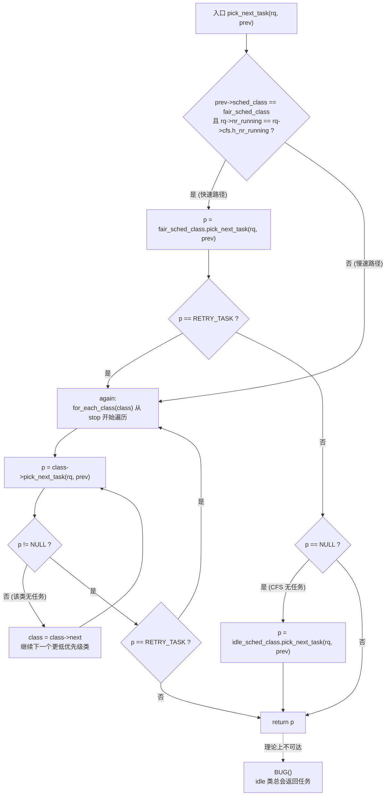
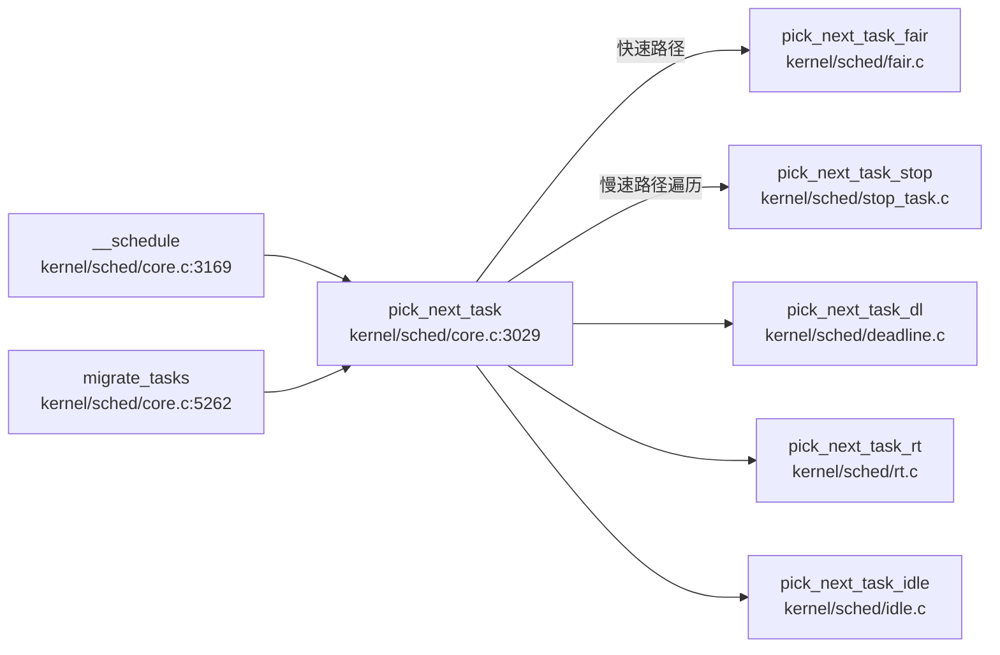

# 每日内核源码分析：pick_next_task

- **日期**：2026-09-22
- **子系统**：kernel/sched（进程调度）
- **源文件**：kernel/sched/core.c:3026-3063
- **类型**：function（static inline）
- **内核版本**：Linux 4.4

---

## 1. 功能作用

`pick_next_task` 是 Linux 调度器的**核心决策函数**，负责在给定 CPU 的运行队列（runqueue, `struct rq`）上选出下一个应该占用 CPU 运行的任务（`struct task_struct`）。

它的核心设计思想是**基于调度类（scheduling class）的优先级分层**：内核将调度策略抽象为 `struct sched_class`，并按优先级从高到低串成一条链表（`stop → dl → rt → fair → idle`）。`pick_next_task` 从最高优先级类开始依次询问"你有没有可运行的任务"，第一个返回非空任务的类即为选中者。

为了在**绝大多数只有 CFS 普通进程**的场景下避免遍历整条类链表的开销，函数实现了一条**快速路径（fast path）**：当当前任务属于公平调度类（CFS）且运行队列中所有可运行任务都在 CFS 中时，直接调用 `fair_sched_class.pick_next_task`，跳过其他调度类的检查。

**典型调用场景**：
- 主调度流程 `__schedule()` 在执行上下文切换前调用它选择下一个任务；
- CPU 热插拔离线时 `migrate_tasks()` 调用它逐个挑选需要迁移走的任务。

---

## 2. 关键数据结构

### 2.1 `struct sched_class`（kernel/sched/sched.h:1172）

调度类是一组函数指针的集合，每个调度策略实现一个该结构的实例，定义了该策略下的所有调度行为：

| 字段 | 含义 |
|------|------|
| `const struct sched_class *next` | 指向下一个（更低优先级）调度类，构成链表 |
| `enqueue_task` / `dequeue_task` | 将任务加入 / 移出运行队列 |
| `check_preempt_curr` | 检查新唤醒任务是否可抢占当前任务 |
| `pick_next_task` | **选出下一个运行的任务**（本函数的多态实现） |
| `put_prev_task` | 将当前任务放回运行队列 |
| `set_curr_task` / `task_tick` / `task_fork` | 任务切换、周期 tick、fork 时的回调 |

> 注释明确约定：`pick_next_task` 的实现者需要负责对 `prev` 任务调用 `put_prev_task`（或等效操作）。

### 2.2 五个调度类实例（按优先级从高到低）

| 调度类 | 优先级 | 对应策略 | 说明 |
|--------|--------|----------|------|
| `stop_sched_class` | 最高 | SCHED_STOP | 用于 stop_machine，可抢占一切 |
| `dl_sched_class` | 高 | SCHED_DEADLINE |  Earliest Deadline First 实时调度 |
| `rt_sched_class` | 中高 | SCHED_FIFO / SCHED_RR | 实时调度 |
| `fair_sched_class` | 中 | SCHED_NORMAL / SCHED_BATCH | 完全公平调度器（CFS），普通进程默认 |
| `idle_sched_class` | 最低 | SCHED_IDLE | 空闲线程，无其他任务时运行 |

链表头为 `sched_class_highest = &stop_sched_class`，`for_each_class` 宏沿 `next` 指针遍历。

### 2.3 `struct rq`（运行队列）

每个 CPU 一个，关键字段：
- `nr_running`：队列中可运行任务总数；
- `cfs.h_nr_running`：CFS 类中的可运行任务数（含组调度层级）；
- `curr`：当前正在运行的任务；
- `stop`：stop class 的任务指针。

### 2.4 `RETRY_TASK` 宏（sched.h:1170）

```c
#define RETRY_TASK  ((void *)-1UL)
```

这是 `pick_next_task` 多态实现的一个特殊返回值。当某个**低优先级**调度类的 `pick_next_task` 发现**更高优先级**的类上有可运行任务时，返回 `RETRY_TASK` 而非 NULL，通知调用者"应该重新从高优先级类开始遍历"，从而避免高优先级任务被饿死。

---

## 3. 核心逻辑流程图



### 关键决策点解读

1. **快速路径条件**：`prev->sched_class == fair_sched_class && rq->nr_running == rq->cfs.h_nr_running`。前者确保当前任务是 CFS 任务，后者确保队列中**没有** RT/DL/stop 任务——此时只需在 CFS 内选择。
2. **RETRY_TASK 重入**：无论快慢路径，一旦某个类的 `pick_next_task` 返回 `RETRY_TASK`，都跳回 `again` 重新从最高优先级类遍历。这保证了高优先级类的任务不会被低优先级类的选择所遮蔽。
3. **idle 兜底**：快速路径下若 CFS 选不出任务（理论上不会，因为条件保证了有任务），回退到 idle 类；慢速路径遍历到 idle 类时必然返回 idle 线程。
4. **BUG() 不可达**：`idle_sched_class` 的 `pick_next_task` 永远返回 idle 线程，因此 for 循环不可能"空转"结束，`BUG()` 仅作为防御性断言。

---

## 4. 调用关系

### 4.1 调用者（who calls me）

| 调用方 | 所在文件 | 调用场景 |
|--------|----------|----------|
| `__schedule` | `kernel/sched/core.c:3169` | 主调度函数，在切换上下文前选出 `next` 任务 |
| `migrate_tasks` | `kernel/sched/core.c:5262` | CPU 离线（hotplug）时，逐个挑选死队列上的任务迁移到其他 CPU |

### 4.2 被调用者（who I call）

`pick_next_task` 本身是一个**调度点（dispatch）函数**，它通过函数指针调用各调度类的实现：

- **核心路径调用**：
  - `fair_sched_class.pick_next_task` → `pick_next_task_fair`（`kernel/sched/fair.c`）—— CFS 选任务，含组调度
  - `idle_sched_class.pick_next_task` → `pick_next_task_idle`（`kernel/sched/idle.c`）—— 返回 idle 线程
  - `rt_sched_class.pick_next_task` → `pick_next_task_rt`（`kernel/sched/rt.c`）—— 实时调度选任务
  - `dl_sched_class.pick_next_task` → `pick_next_task_dl`（`kernel/sched/deadline.c`）—— Deadline 选任务
  - `stop_sched_class.pick_next_task` → `pick_next_task_stop`（`kernel/sched/stop_task.c`）—— stop 任务

- **辅助调用**：无显式锁操作（锁由调用者 `__schedule` 持有 `rq->lock`）。

- **宏 / 内联**：
  - `for_each_class(class)`：从 `stop_sched_class` 沿 `next` 遍历的 for 循环
  - `likely()` / `unlikely()`：分支预测提示，快速路径用 `likely` 标注

### 4.3 调用关系图（Mermaid）



---

## 5. 易错点 / 边界场景 / 设计权衡

1. **`static inline` 的热路径设计**：`pick_next_task` 被声明为 `static inline`，因为它处于调度器最热的路径上（每次上下文切换都调用），内联消除函数调用开销。代价是内核镜像体积增大。

2. **快速路径的不变量依赖**：`rq->nr_running == rq->cfs.h_nr_running` 是快速路径成立的关键。任何向 RT/DL/stop 类入队的操作都会打破该等式，迫使后续调度走慢速路径。`h_nr_running`（含组调度层级的 CFS 任务数）的维护必须与 `nr_running` 严格同步，否则会导致快速路径错误地跳过更高优先级任务。

3. **RETRY_TASK 而非 NULL 的语义区分**：普通"该类无任务"返回 `NULL`，表示继续往下一个（更低优先级）类找；而 `RETRY_TASK` 表示"发现更高优先级类有任务"，必须**从头**重新遍历。两者语义完全不同，混淆会导致调度错误。

4. **`pick_next_task` 与 `put_prev_task` 的契约**：注释明确要求 `pick_next_task` 的实现者负责对 `prev` 调用 `put_prev_task`。调用者（如 `__schedule`）不会再单独调用 `put_prev_task`。这是一个隐式契约，实现新调度类时必须遵守。

5. **`migrate_tasks` 中的特殊用法**：在 CPU 热拔插场景下，`pick_next_task` 被传入一个 `fake_task` 作为 `prev`，配合 `rq->stop = NULL` 来避免选到 stop 线程，从而把死队列上的普通任务逐个挑出迁移走。这是快速路径条件不满足时走慢速路径的典型场景。

6. **跨版本差异**：在 Linux 4.4 中快速路径检查 `prev->sched_class == class`；在后续版本（4.6+）中该条件和 `pick_next_task` 的签名略有调整（增加了返回 `struct rq*` 的能力以支持 IPI 推送），但"按调度类优先级遍历 + CFS 快速路径"的核心设计一直保留到现代内核。

---

## 附：核心源码片段

```c
// kernel/sched/core.c:3026-3063  (Linux 4.4)
/*
 * Pick up the highest-prio task:
 */
static inline struct task_struct *
pick_next_task(struct rq *rq, struct task_struct *prev)
{
        const struct sched_class *class = &fair_sched_class;
        struct task_struct *p;

        /*
         * Optimization: we know that if all tasks are in
         * the fair class we can call that function directly:
         */
        if (likely(prev->sched_class == class &&
                   rq->nr_running == rq->cfs.h_nr_running)) {
                p = fair_sched_class.pick_next_task(rq, prev);
                if (unlikely(p == RETRY_TASK))
                        goto again;

                /* assumes fair_sched_class->next == idle_sched_class */
                if (unlikely(!p))
                        p = idle_sched_class.pick_next_task(rq, prev);

                return p;
        }

again:
        for_each_class(class) {
                p = class->pick_next_task(rq, prev);
                if (p) {
                        if (unlikely(p == RETRY_TASK))
                                goto again;
                        return p;
                }
        }

        BUG(); /* the idle class will always have a runnable task */
}
```
