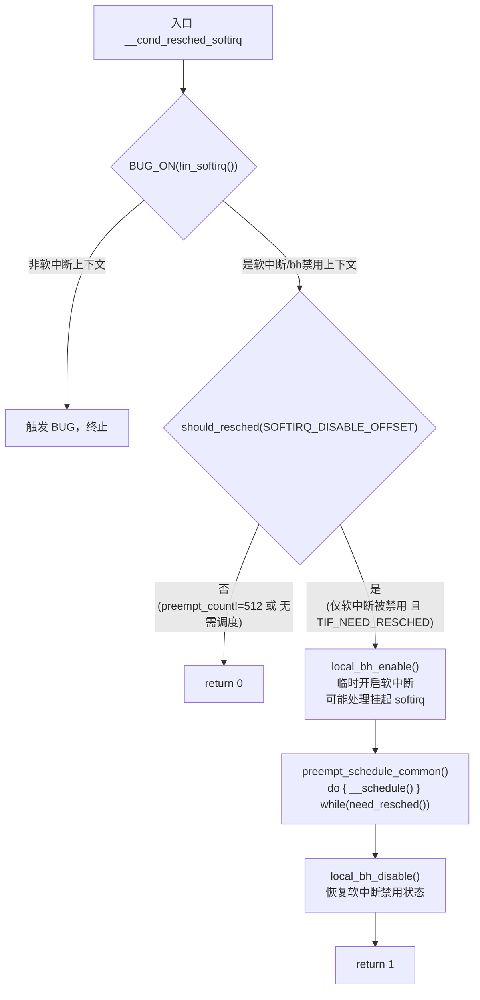
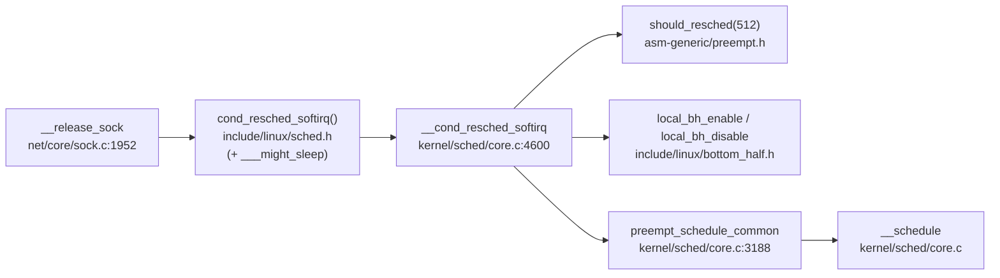

# 每日内核源码分析：__cond_resched_softirq

- **日期**：2026-09-23
- **子系统**：kernel/sched（进程调度 / 抢占点）
- **源文件**：kernel/sched/core.c:4600-4612
- **类型**：function（导出符号，由宏 `cond_resched_softirq()` 封装调用）
- **内核版本**：Linux 4.3.0

---

## 1. 功能作用

`__cond_resched_softirq` 是 `cond_resched` 家族中**专门用于「软中断已被禁用」上下文**的「自愿重新调度（voluntary preemption）」入口。

内核中并非所有路径都允许直接调用 `schedule()`：当代码运行在软中断上下文，或通过 `local_bh_disable()` 显式禁用了软中断时，`preempt_count` 处于非零状态，此时不能直接调度。本函数通过 **先临时开启软中断 → 调用调度器 → 再重新禁用软中断** 的三步操作，在保持调用者上下文语义的前提下安全地让出 CPU。

典型使用场景：
- 长时间循环处理软中断相关数据的代码路径（如网络栈在进程上下文中处理 socket backlog 队列）。
- 目的是**降低长软中断处理路径的调度延迟**，避免高优先级实时任务（`SCHED_FIFO`/`SCHED_RR`）被长时间饿死。

它不直接被外部调用，而是由 `include/linux/sched.h` 中的宏 `cond_resched_softirq()` 封装，宏内还会先调用 `___might_sleep(__FILE__, __LINE__, SOFTIRQ_DISABLE_OFFSET)` 做睡眠检查（配合 `CONFIG_DEBUG_ATOMIC_SLEEP`）。

---

## 2. 关键数据结构

### 2.1 `preempt_count`（抢占计数，per-cpu / `thread_info`）

`preempt_count` 是一个 32 位的计数器，编码了当前 CPU 的中断/抢占嵌套深度，布局定义在 `include/linux/preempt.h`：

| 字段 | 位数 | 位移 | 掩码/偏移 |
|------|------|------|-----------|
| PREEMPT | 8 | 0 | `PREEMPT_OFFSET = 1` |
| SOFTIRQ | 8 | 8 | `SOFTIRQ_OFFSET = 256` |
| HARDIRQ | 4 | 16 | `HARDIRQ_OFFSET = 4096` |
| NMI | 1 | 20 | `NMI_OFFSET` |
| PREEMPT_ACTIVE | 1 | 21 | 标记正在主动调度中 |
| PREEMPT_NEED_RESCHED | 1 | 31 | 快速路径抢占标志 |

**关键常量**：
- `SOFTIRQ_DISABLE_OFFSET = 2 * SOFTIRQ_OFFSET = 512`：`local_bh_disable()` 对 `preempt_count` 的增量（为什么是 2 倍？因为 `local_bh_disable` 同时要表示「软中断被禁用」且区分于「正在服务软中断」，后者只用 1 个 `SOFTIRQ_OFFSET`）。
- `PREEMPT_LOCK_OFFSET = PREEMPT_DISABLE_OFFSET`：持自旋锁时 `preempt_count` 的增量。

### 2.2 关键宏

```c
// include/linux/preempt.h
#define in_softirq()         (softirq_count())           // preempt_count & SOFTIRQ_MASK
#define softirq_count()      (preempt_count() & SOFTIRQ_MASK)
#define tif_need_resched()   test_thread_flag(TIF_NEED_RESCHED)

// include/asm-generic/preempt.h
static __always_inline bool should_resched(int preempt_offset)
{
        return unlikely(preempt_count() == preempt_offset &&
                        tif_need_resched());
}
```

- `in_softirq()`：判断当前是否处于软中断上下文或软中断被禁用（`softirq_count() != 0`）。
- `should_resched(offset)`：**双重判定**——`preempt_count` 必须**恰好等于** `offset`（说明除该层禁用外无其它锁/中断嵌套），且 `TIF_NEED_RESCHED` 标志已被调度器类置位。

### 2.3 `TIF_NEED_RESCHED`

`thread_info::flags` 中的标志位，由调度器类（如 CFS 的 `resched_task`、`check_preempt_tick`）在发现当前任务应被抢占时设置，是触发调度的「请求位」。

---

## 3. 核心逻辑流程图



**关键决策点解释**：

1. **`BUG_ON(!in_softirq())`**：硬性要求调用者必须处于软中断上下文或已禁用软中断。若在普通进程上下文误调用，`softirq_count()==0`，直接触发 BUG，防止语义错误。
2. **`should_resched(SOFTIRQ_DISABLE_OFFSET)` 的精确匹配**：`preempt_count == 512` 意味着当前唯一的「禁用层」就是软中断禁用——**没有持自旋锁、没有硬中断、没有额外的 `preempt_disable`**。只有这样，调度才是安全的（不会因持锁而死锁）。
3. **`local_bh_enable()` 先于调度**：调度器要求在「可抢占、非中断」上下文运行；同时开启 bh 是处理挂起软中断的常规时机，可顺带消化积压的软中断。
4. **`preempt_schedule_common()` 内部 do-while**：调度返回后再次检查 `need_resched()`，防止在 `__schedule()` 返回到本函数之间又产生了新的抢占请求而被遗漏。
5. **`local_bh_disable()` 收尾**：恢复调用者原有的软中断禁用状态，保证 `cond_resched_softirq()` 对调用者而言是「透明」的——返回时上下文与调用前一致。

---

## 4. 调用关系

### 4.1 调用者（who calls me）

本函数不被直接调用，而是通过宏 `cond_resched_softirq()` 间接调用。实际调用点：

| 调用方 | 所在文件 | 调用场景 |
|--------|----------|----------|
| `__release_sock` | `net/core/sock.c:1952` | 在进程上下文中处理 socket 的 backlog 接收队列，softirq 已被禁用；每处理完一个 skb 调用一次，允许更高优先级任务抢占。 |

> 注：`kernel/softirq.c:138` 的注释提到 `__do_softirq` 也采用类似「先开启 bh 再调度」的模式，但 `__do_softirq` 是直接操作 `preempt_count` 而非调用本函数。

### 4.2 被调用者（who I call）

- **核心路径调用**：
  - `should_resched(SOFTIRQ_DISABLE_OFFSET)` — `include/asm-generic/preempt.h`，判断是否需要且可以调度。
  - `local_bh_enable()` / `local_bh_disable()` — `include/linux/bottom_half.h`，临时开关软中断。
  - `preempt_schedule_common()` — `kernel/sched/core.c:3188`，循环调用 `__schedule()` 直至无需调度。
- **辅助调用**：
  - `BUG_ON()` — 调试断言。
  - `in_softirq()` — 宏，判断上下文。
- **宏 / 内联（封装层）**：
  - `cond_resched_softirq()` 宏（`include/linux/sched.h:2937`）内先调用 `___might_sleep()` 做原子睡眠检查，再调用本函数。

### 4.3 调用关系图（Mermaid）



---

## 5. 易错点 / 边界场景 / 设计权衡

1. **「精确匹配」的 `preempt_count` 判定**
   `should_resched(SOFTIRQ_DISABLE_OFFSET)` 用 `==` 而非 `>=`。这意味着如果调用者还持有自旋锁（`preempt_count = 512 + 1`），本函数会直接返回 0 不调度。这是**刻意设计**：持锁调度可能导致死锁（被调度出去的任务持有锁，新任务又等同一把锁）。需要在持锁时让步应使用 `cond_resched_lock()`。

2. **为什么必须先 `local_bh_enable()`**
   若保持软中断禁用去调用 `__schedule()`，`preempt_count` 仍为 512，调度器内部的 `should_resched` 判断和上下文切换会异常；且软中断的执行时机正是 `local_bh_enable`（当 softirq 计数归零时触发 `__do_softirq`）。先开 bh 既让调度合法化，也顺带消化了积压的软中断。

3. **`BUG_ON(!in_softirq())` 的语义陷阱**
   `in_softirq()` 返回的是 `softirq_count()`，即「正在服务软中断」**或**「软中断被禁用」二者之一为真。所以本函数不仅能在软中断服务路径用，也能在 `local_bh_disable()` 之后的进程上下文用——这正是 `__release_sock` 的场景。

4. **返回值语义**
   返回 `1` 表示确实发生了调度；返回 `0` 表示未调度。调用者可据此判断是否有任务被切换，但绝大多数调用点不检查返回值。

5. **`cond_resched` 三兄弟的分工**：

   | 函数 | 适用上下文 | `should_resched` offset | 调度前动作 |
   |------|-----------|------------------------|-----------|
   | `_cond_resched` | 普通进程上下文 | `0` | 无 |
   | `__cond_resched_lock` | 持有自旋锁 | `PREEMPT_LOCK_OFFSET` | `spin_unlock` → 调度 → `spin_lock` |
   | `__cond_resched_softirq` | 软中断被禁用 | `SOFTIRQ_DISABLE_OFFSET` | `local_bh_enable` → 调度 → `local_bh_disable` |

   三者本质相同：**临时移除当前持有的「禁用层」，让 `preempt_count` 归零，调度，再恢复**。

6. **与 `CONFIG_PREEMPT` 的关系**
   本函数在非抢占内核（`!CONFIG_PREEMPT`）下同样有效——它提供的是「显式抢占点」。即使内核不支持内核态抢占，调用 `cond_resched_softirq()` 仍会在该点执行一次调度，这对降低长循环延迟至关重要。

---

## 附：核心源码片段

```c
// kernel/sched/core.c:4600-4612  (Linux 4.3.0)

int __sched __cond_resched_softirq(void)
{
	BUG_ON(!in_softirq());

	if (should_resched(SOFTIRQ_DISABLE_OFFSET)) {
		local_bh_enable();
		preempt_schedule_common();
		local_bh_disable();
		return 1;
	}
	return 0;
}
EXPORT_SYMBOL(__cond_resched_softirq);
```

封装宏（`include/linux/sched.h:2933-2939`）：

```c
extern int __cond_resched_softirq(void);

#define cond_resched_softirq() ({                                       \
        ___might_sleep(__FILE__, __LINE__, SOFTIRQ_DISABLE_OFFSET);     \
        __cond_resched_softirq();                                       \
})
```

下游 `preempt_schedule_common`（`kernel/sched/core.c:3188`）：

```c
static void __sched notrace preempt_schedule_common(void)
{
	do {
		preempt_active_enter();
		__schedule();
		preempt_active_exit();
		/* 检查返回后是否又产生了抢占请求 */
	} while (need_resched());
}
```

`should_resched`（`include/asm-generic/preempt.h`）：

```c
static __always_inline bool should_resched(int preempt_offset)
{
	return unlikely(preempt_count() == preempt_offset &&
			tif_need_resched());
}
```
