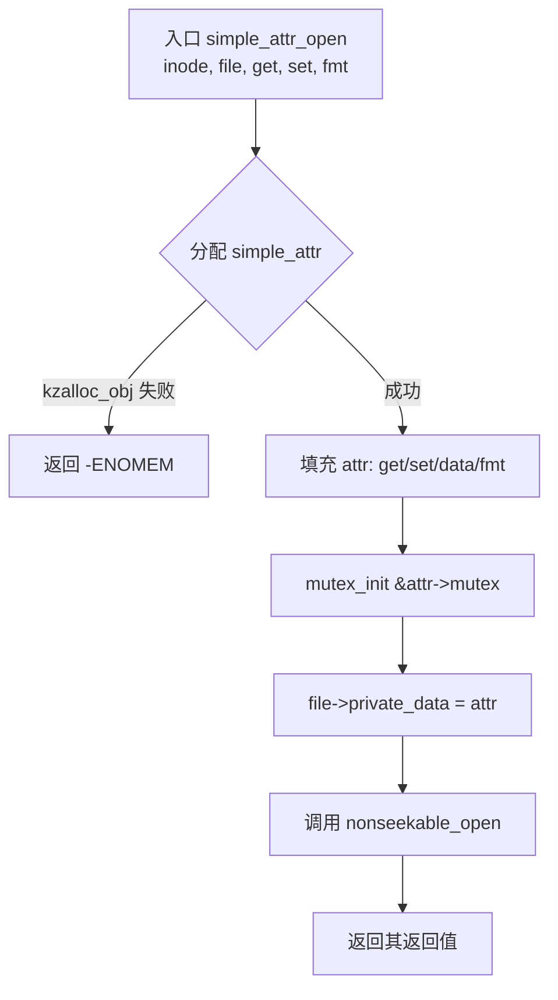
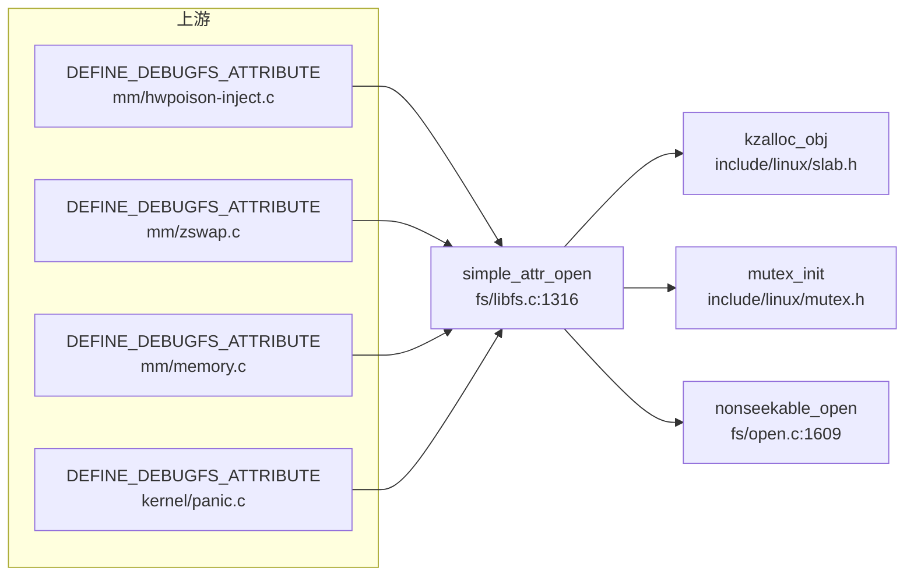

# 每日内核源码分析：simple_attr_open

- **日期**：2026-09-25
- **子系统**：fs
- **源文件**：fs/libfs.c:1316-1335
- **类型**：function

---

## 1. 功能作用

`simple_attr_open` 是内核“简单属性文件（simple attribute）”机制的打开回调。
它负责在 `open()` 路径上为一个 debugfs / sysfs 风格的属性文件分配并初始化私有上下文 `struct simple_attr`，把用户提供的 `get/set` 回调、格式串 `fmt` 以及创建者存放在 `inode->i_private` 中的私有数据绑定到一起，最后调用 `nonseekable_open()` 声明该文件不可 seek。

典型使用场景：驱动或子系统通过 `DEFINE_DEBUGFS_ATTRIBUTE()` 宏定义一组 `struct file_operations`，在对应的 `*_open()` 里直接调用 `simple_attr_open`，从而用几行代码得到一个可读可写的数值型 debugfs 节点。

## 2. 关键数据结构

- `struct simple_attr`（`fs/libfs.c:1304-1312`）
  - `int (*get)(void *, u64 *)`：读属性时调用的回调，负责把数值写回 `*u64`。
  - `int (*set)(void *, u64)`：写属性时调用的回调，接收解析后的数值。
  - `char get_buf[24]` / `char set_buf[24]`：分别缓存读出的字符串和待解析的用户输入；大小足够存放一个 `u64` 加 `\n\0`。
  - `void *data`：实际指向 `inode->i_private`，由创建文件的一方传入的私有上下文。
  - `const char *fmt`：`get` 输出时使用的 `printf` 格式串，例如 `"%llu\n"`。
  - `struct mutex mutex`：保护 `get_buf/set_buf` 及回调执行的串行化锁。

- `struct inode->i_private`
  - 创建 debugfs 文件时传入的 `void *` 数据；`simple_attr_open` 只是把它转存到 `attr->data`，本身不解释其含义。

- `struct file->private_data`
  - 打开成功后指向本次分配的 `struct simple_attr`，后续的 `read/write/release` 通过它访问上下文。

## 3. 核心逻辑流程图



关键决策点说明：

1. 内存分配只此一次，失败直接返回 `-ENOMEM`，没有已分配资源需要回滚。
2. `attr->data` 直接取自 `inode->i_private`——若创建者忘了设置 `i_private`，后续 `get/set` 会拿到空指针。
3. `mutex_init` 在文件打开阶段完成，`read`/`write` 路径用同一把锁做串行化。
4. 最后调用 `nonseekable_open`，使该文件不支持 `lseek`，符合属性文件“每次从头读/写”的语义。

## 4. 调用关系

### 4.1 调用者（who calls me）

`simple_attr_open` 本身不会被代码直接大量调用，而是通过 `include/linux/debugfs.h` 中的宏生成入口：

```c
#define DEFINE_DEBUGFS_ATTRIBUTE_XSIGNED(__fops, __get, __set, __fmt, __is_signed) \
static int __fops ## _open(struct inode *inode, struct file *file)	\
{									\
	__simple_attr_check_format(__fmt, 0ull);			\
	return simple_attr_open(inode, file, __get, __set, __fmt);	\
}									\
static const struct file_operations __fops = {			\
	.owner	 = THIS_MODULE,					\
	.open	 = __fops ## _open,				\
	.release = simple_attr_release,				\
	.read	 = debugfs_attr_read,				\
	.write	 = (__is_signed) ? debugfs_attr_write_signed : debugfs_attr_write,	\
}
```

因此所有使用 `DEFINE_DEBUGFS_ATTRIBUTE` / `DEFINE_DEBUGFS_ATTRIBUTE_SIGNED` 的模块都是上游调用方，例如：

| 调用方（生成的 *_open） | 所在文件 | 调用场景 |
|------------------------|----------|----------|
| `hwpoison_fops_open` / `unpoison_fops_open` | `mm/hwpoison-inject.c:152-153` | 创建 `/sys/kernel/debug/hwpoison` 读写节点 |
| `total_size_fops_open` 等 | `mm/zswap.c:1711-1725` | zswap 调试信息属性 |
| `fault_around_bytes_fops_open` | `mm/memory.c:5902` | `fault_around_bytes` 调试文件 |
| `cma_debugfs_fops_open` 等 | `mm/cma_debug.c:32-159` | CMA 调试属性 |
| `clear_warn_once_fops_open` | `kernel/panic.c:1179` | 清除 `warn_once` 状态 |
| `fei_retval_ops_open` | `kernel/fail_function.c:152` | 故障注入返回值设置 |

### 4.2 被调用者（who I call）

- **核心路径调用**
  - `kzalloc_obj(*attr)`（`include/linux/slab.h:1155`）：按 `struct simple_attr` 大小分配并清零内存。
  - `mutex_init(&attr->mutex)`：初始化保护属性缓冲区的互斥锁。
  - `nonseekable_open(inode, file)`（`fs/open.c:1609`）：设置文件不可定位并返回 0。

- **辅助 / 内联**
  - `inode->i_private` 取值：依赖创建者通过 `debugfs_create_file()` 等接口传入的私有指针。

### 4.3 调用关系图（Mermaid）



## 5. 易错点 / 边界场景 / 设计权衡

1. **`get` / `set` 可在 open 时为 NULL**：`simple_attr_open` 并不检查回调是否为 NULL；真正的权限控制在 `read`/`write` 路径里（`!attr->get` 返回 `-EACCES`）。因此只读节点可以把 `set` 传 NULL，只写节点可以把 `get` 传 NULL。
2. **`fmt` 与数据符号性必须匹配**：宏里通过 `__simple_attr_check_format(__fmt, 0ull)` 在编译期对格式串做基本检查，但运行时仍可能出现有符号/无符号与 `%lld/%llu` 不匹配的情况；`DEFINE_DEBUGFS_ATTRIBUTE_SIGNED` 专门用于有符号场景。
3. **`inode->i_private` 的生命周期**：`simple_attr_open` 只是记录指针，不引用计数也不拷贝数据；如果 `i_private` 指向的对象在文件关闭前被释放，后续读写会访问无效内存。
4. **缓冲区大小固定为 24 字节**：足够放下 64 位数值和换行符，但不适合大段文本；这正是“simple attribute”只用于单值属性的设计取舍。
5. **一次性分配、无回滚**：函数内只有 `kzalloc_obj` 一处可能失败，失败路径直接返回；其余操作只是赋值和初始化，不需要清理。
6. **不可 seek 的语义**：属性文件每次 `read` 都应重新调用 `get` 刷新数值，`nonseekable_open` 禁止了 `lseek`，避免用户依赖缓存位置造成 stale 数据。

---

## 附：核心源码片段

```c
// fs/libfs.c:1316-1335
int simple_attr_open(struct inode *inode, struct file *file,
		     int (*get)(void *, u64 *), int (*set)(void *, u64),
		     const char *fmt)
{
	struct simple_attr *attr;

	attr = kzalloc_obj(*attr);
	if (!attr)
		return -ENOMEM;

	attr->get = get;
	attr->set = set;
	attr->data = inode->i_private;
	attr->fmt = fmt;
	mutex_init(&attr->mutex);

	file->private_data = attr;

	return nonseekable_open(inode, file);
}
```
