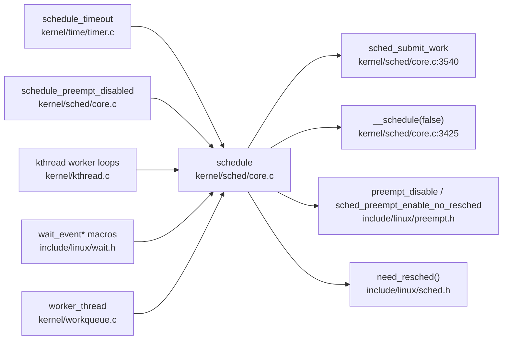

# 每日内核源码分析：schedule

- **日期**：2026-09-25
- **子系统**：kernel/sched
- **源文件**：kernel/sched/core.c:3552-3563
- **类型**：function

---

## 1. 功能作用

`schedule()` 是 Linux 调度器对内核其他模块公开的**自愿上下文切换入口**。当进程/线程需要主动放弃 CPU 进入睡眠时（如等待 IO、等待锁、等待事件），它会先把自身状态设置为非 `TASK_RUNNING`（例如 `TASK_INTERRUPTIBLE`、`TASK_UNINTERRUPTIBLE`），然后调用 `schedule()`。

该函数的职责可概括为：

1. 在真正进入调度器前，把当前 task 积累的 block I/O plug 刷下去，避免带着 plugged IO 睡眠导致死锁；
2. 关抢占、调用真正的调度核心 `__schedule(false)` 完成选下一个任务并切换；
3. 循环检查 `need_resched()`，直到没有重新调度标志再返回调用者；
4. 返回时，当前 task 已经被唤醒并重新获得 CPU。

典型使用场景：各种 `wait_event*` 宏、`schedule_timeout*` 系列、工作队列 worker 无事可做时的睡眠、mutex/semaphore 等锁的慢路径睡眠。

---

## 2. 关键数据结构

`schedule()` 本身非常薄，依赖的数据结构主要是当前任务和运行队列相关：

- `struct task_struct *tsk = current`：当前正在运行的任务描述符。
  - `tsk->state`：任务状态。`schedule()` 的搭档 `sched_submit_work()` 只在 `state != 0`（即不是 `TASK_RUNNING`）时才可能刷盘。
  - `tsk->flags`：包含 `PF_WQ_WORKER` 等标志，决定 `__schedule()` 内部是否需要通知 workqueue。
- `struct rq *rq` / `struct rq_flags rf`：实际调度器在 `__schedule()` 中使用，封装当前 CPU 的运行队列、锁状态、中断状态。
- `preempt_count`（per-task 抢占计数）：`schedule()` 在循环体内通过 `preempt_disable()` / `sched_preempt_enable_no_resched()` 控制抢占窗口。
- `TIF_NEED_RESCHED`（通过 `need_resched()` 读取）：标记是否有更高优先级任务就绪或显式请求重新调度。
- block layer plug：`struct blk_plug`（通过 `blk_needs_flush_plug(tsk)` 判断），用于批量提交 IO 请求。

> 关键头文件：`kernel/sched/sched.h`（`struct rq`、`struct task_struct` 调度相关字段）、`include/linux/preempt.h`、`include/linux/blkdev.h`。

---

## 3. 核心逻辑流程图

```mermaid
flowchart TD
    A[schedule<br/>kernel/sched/core.c:3552] --> B[sched_submit_work(current)]
    B --> C{current->state != 0?}
    C -->|否| D[跳过刷盘]
    C -->|是| E{tsk_is_pi_blocked?}
    E -->|是| D
    E -->|否| F{blk_needs_flush_plug?}
    F -->|是| G[blk_schedule_flush_plug]
    F -->|否| D
    G --> H[do-while 循环]
    D --> H
    H --> I[preempt_disable]
    I --> J[__schedule(false)]
    J --> K[sched_preempt_enable_no_resched]
    K --> L{need_resched()?}
    L -->|是| H
    L -->|否| M[返回调用者]
```

### 关键决策点说明

1. **刷盘前置**：`sched_submit_work()` 只在当前任务确实要睡眠（`state != 0`）且没有被 PI-futex 阻塞时才处理 blk plug。若 task 仍是 `TASK_RUNNING`，调用 `schedule()` 等价于主动让出一次 CPU，不需要刷盘。
2. **循环调度**：`__schedule()` 返回后，中断或内核路径可能已经设置了 `TIF_NEED_RESCHED`。`do { ... } while (need_resched())` 保证所有 pending 的重新调度请求在本次 `schedule()` 调用内处理完，避免回到用户态后立刻再次陷入调度。
3. **preempt_disable 位置**：`__schedule()` 要求在关抢占的环境下运行，但 `schedule()` 并不在函数入口一次性关闭抢占，而是在循环体内每次关闭再打开，这样循环重入时状态干净。
4. **`sched_preempt_enable_no_resched`**：打开抢占但**不**触发立即重调度，因为是否继续循环由显式的 `need_resched()` 判断决定。
5. **自愿调度标志**：传入 `__schedule(false)` 表示这是一次自愿睡眠（非抢占式切换），因此 `__schedule()` 内部会把 prev task 从 runqueue 上取下（如果 `prev->state` 非 0）。

---

## 4. 调用关系

### 4.1 调用者（who calls me）

`schedule()` 是内核中使用最广泛的睡眠入口之一，调用方数不胜数。以下列出几个典型场景：

| 调用方 | 所在文件 | 调用场景 |
|--------|----------|----------|
| `schedule_timeout` | `kernel/time/timer.c:1782/1806` | 带超时或 `MAX_SCHEDULE_TIMEOUT` 的睡眠 |
| `schedule_preempt_disabled` | `kernel/sched/core.c:3617` | 在已经关闭抢占的上下文中调用 `schedule()` |
| `kthread` 主循环 | `kernel/kthread.c:240,575` | 内核线程 idle/park 时让出 CPU |
| `wait_event*` 宏族 | `include/linux/wait.h:311,387,...` | 等待队列上的进程睡眠 |
| `worker_thread` | `kernel/workqueue.c:2317` | workqueue worker 无工作可执行时睡眠 |

### 4.2 被调用者（who I call）

- **核心路径调用**：
  - `sched_submit_work(tsk)`：睡眠前提交 block I/O plug。
  - `__schedule(false)`：真正的调度器核心，负责 pick_next_task、context_switch。
  - `need_resched()`：判断是否需要再次调度。
- **辅助调用**：
  - `preempt_disable()` / `sched_preempt_enable_no_resched()`：控制抢占窗口。
  - `blk_schedule_flush_plug(tsk)`：把当前 task 的 blk plug 刷到设备队列。
- **宏 / 内联**：
  - `tsk_is_pi_blocked(tsk)`：判断 task 是否因 PI-futex 阻塞。
  - `blk_needs_flush_plug(tsk)`：判断是否有未刷新的 plugged IO。
  - `current` / `get_current()`：获取当前任务指针。

### 4.3 调用关系图（Mermaid）



---

## 5. 易错点 / 边界场景 / 设计权衡

1. **必须先设置 task state，再调用 `schedule()`**。如果调用者忘了把 `current->state` 改为非 `TASK_RUNNING`，`sched_submit_work()` 会跳过刷盘，`__schedule()` 也会把当前 task 留在 runqueue 上，结果 `schedule()` 变成一次“主动让出”，可能立刻被再次选中执行，造成 busy loop。

2. **`schedule()` 与 `__schedule()` 的分层**。`__schedule()` 是内部函数，假设调用者已经处理好抢占；`schedule()` 是公共 API，封装了 IO plug 刷新、抢占关闭、`need_resched()` 循环。这种分层让快速路径（如抢占调度 `preempt_schedule()`）可以直接走 `__schedule()`，避免重复刷盘。

3. **do-while 的必要性**。`__schedule()` 返回后，`TIF_NEED_RESCHED` 可能由于中断处理程序唤醒了更高优先级任务而被设置。`schedule()` 不直接返回，而是再次进入循环处理，直到干净为止，防止“刚返回又调度”的抖动。

4. **原子上下文禁止调用**。`__might_sleep()` 等调试机制会检查 `schedule()` 调用点是否处于原子上下文（spinlock 内、硬中断中、关中断等）。在原子上下文中调用 `schedule()` 会导致死锁或oops。

5. **与 `schedule_idle()` / `schedule_preempt_disabled()` 的对比**：
   - `schedule_idle()` 专供 idle task，跳过 `sched_submit_work()` 且全程不关开抢占（idle 本身不开启抢占）。
   - `schedule_preempt_disabled()` 假设调用者已经 `preempt_disable()`，它先 `sched_preempt_enable_no_resched()` 再 `schedule()` 再 `preempt_disable()`，保证返回时抢占状态与进入时一致。

6. **blk plug 与死锁风险**。如果 task 在持有 plugged IO 的情况下睡眠，而这些 IO 又依赖该 task 后续动作才能推进，就会形成死锁。`sched_submit_work()` 在睡眠前强制 flush plug，是避免此类死锁的关键设计。

---

## 附：核心源码片段

```c
// kernel/sched/core.c:3540-3563
static inline void sched_submit_work(struct task_struct *tsk)
{
	if (!tsk->state || tsk_is_pi_blocked(tsk))
		return;
	/*
	 * If we are going to sleep and we have plugged IO queued,
	 * make sure to submit it to avoid deadlocks.
	 */
	if (blk_needs_flush_plug(tsk))
		blk_schedule_flush_plug(tsk);
}

asmlinkage __visible void __sched schedule(void)
{
	struct task_struct *tsk = current;

	sched_submit_work(tsk);
	do {
		preempt_disable();
		__schedule(false);
		sched_preempt_enable_no_resched();
	} while (need_resched());
}
EXPORT_SYMBOL(schedule);
```
