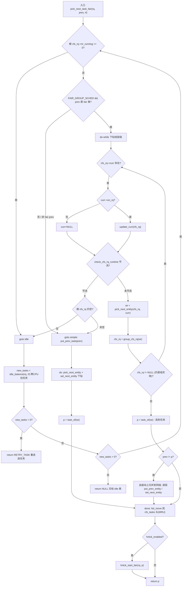
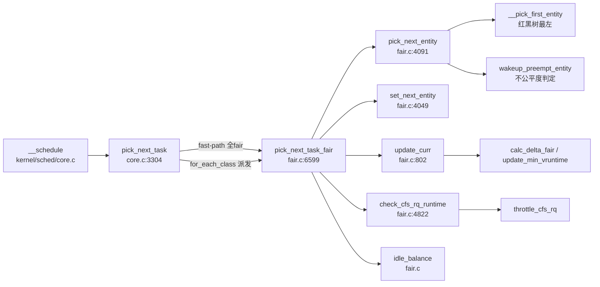

# 每日内核源码分析：pick_next_task_fair

- **日期**：2026-09-28
- **子系统**：kernel/sched（CFS 完全公平调度器）
- **源文件**：kernel/sched/fair.c:6598-6729
- **类型**：function（调度类入口函数）

---

## 1. 功能作用

`pick_next_task_fair` 是 **CFS（Completely Fair Scheduler）调度类的"选出下一个运行任务"入口**，注册在 `fair_sched_class.pick_next_task`（[fair.c:10131](file:///root/linux-4.19/kernel/sched/fair.c)）。每当主调度器 `__schedule()` 需要在某个 CPU 运行队列 `rq` 上挑出下一个占用 CPU 的任务时，最终都会调用到本函数（对于普通进程，这是 99% 的路径）。

它的核心职责可以概括为三点：

1. **公平地选出一个任务**：在 CFS 红黑树（按 `vruntime` 排序）中选出虚拟运行时间最小（最"亏欠" CPU 时间）的调度实体，体现"完全公平"的设计目标。
2. **处理任务组（cgroup）层级**：在开启 `CONFIG_FAIR_GROUP_SCHED` 时，调度实体是一棵树（任务 → 组实体 → 上层组 → 根）。本函数要自顶向下逐层 `pick_next_entity` 直到选到一个真正的任务实体（`group_cfs_rq()` 返回 NULL 表示该实体是叶子任务）。
3. **处理带宽限流（throttling）与空闲拉取（idle balance）**：当某个 cgroup 用尽配额被节流，或本队列无 CFS 任务可运行时，做相应处理（节流降级 / 跨 CPU 拉任务 / 返回 idle）。

调用时机：进程阻塞、`TIF_NEED_RESCHED` 置位（时钟中断 `scheduler_tick`、唤醒抢占等）后由 `__schedule()` 触发。返回值即下一个将切入 CPU 的 `task_struct *`（也可能返回 `NULL` 表示无任务交给 idle 类，或返回 `RETRY_TASK` 要求重新走一遍选任务流程）。

---

## 2. 关键数据结构

- **`struct cfs_rq`**（[kernel/sched/sched.h](file:///root/linux-4.19/kernel/sched/sched.h)）：CFS 运行队列，每个 `rq` 内嵌一个根 `cfs`，每个任务组实体另有自己的 `my_q`。关键字段：
  - `nr_running`：本层队列上的可运行实体数（含子组）。为 0 即转 idle 路径。
  - `curr`：当前正在该层 cfs_rq 上运行的调度实体（不在红黑树内，单独维护）。
  - `tasks_timeline` / 红黑树根：按 `vruntime` 排序的待运行实体集合，`__pick_first_entity` 取最左节点（最小 vruntime）。
  - `min_vruntime`：单调递增的最小虚拟时间基准，保证新加入实体 vruntime 不至于偏离过远。
  - `skip` / `next` / `last`：三个"伙伴"指针，分别表示"尽量跳过 / 优先运行 / 上次被抢占（缓存友好）"的实体，是 CFS 选择策略的微调手段。
  - `runtime_enabled` / `runtime_remaining` / `throttled`：CFS 带宽控制（cgroup cpu quota）相关。
- **`struct sched_entity`**（[include/linux/sched.h](file:///root/linux-4.19/include/linux/sched.h)，workspace 已分析 [struct_sched_entity.md](file:///workspace/include/linux/sched.h/struct_sched_entity.md)）：调度实体，任务与组共用此结构。关键字段：
  - `on_rq`：是否在运行队列上。
  - `cfs_rq`：本实体所排入的那个 cfs_rq；`my_q`：本实体"拥有"的子 cfs_rq（任务实体为 NULL，组实体非 NULL）—— `group_cfs_rq()` 正是用它来判断是否已到叶子层。
  - `parent` / `depth`：层级父指针与深度，用于跨层级归并。
  - `vruntime`：虚拟运行时间（选择依据）；`exec_start` / `sum_exec_runtime` / `prev_sum_exec_runtime`：实际执行时间记账（slice 统计）。
  - `load`：负载权重（影响 `calc_delta_fair` 把实际时间换算成虚拟时间）。
- **`struct rq`**（[kernel/sched/sched.h](file:///root/linux-4.19/kernel/sched/sched.h)，已分析 [struct_rq.md](file:///workspace/kernel/sched/sched.h/struct_rq.md)）：CPU 运行队列，内含根 `cfs`、`cfs_tasks` 链表（SMP 下把下一个要跑的任务前移以利缓存）、`curr`、`idle` 等。
- **`struct task_struct`**（[include/linux/sched.h](file:///root/linux-4.19/include/linux/sched.h)，已分析 [struct_task_struct.md](file:///workspace/include/linux/sched.h/struct_task_struct.md)）：每个任务内嵌 `se`（其调度实体）与 `sched_class`。
- **`fair_sched_class`**（[fair.c:10120 附近](file:///root/linux-4.19/kernel/sched/fair.c)）：`struct sched_class` 实例，`.pick_next_task = pick_next_task_fair`，是调度类多态分发的入口。

> 内联访问器（[fair.c:265-373](file:///root/linux-4.19/kernel/sched/fair.c)）：`cfs_rq_of(se)=se->cfs_rq`、`group_cfs_rq(grp)=grp->my_q`、`is_same_group(se,pse)`（同 cfs_rq 即同组）、`parent_entity(se)=se->parent`、`for_each_sched_entity(se)` 在组调度下为 `for(;se;se=se->parent)`。

---

## 3. 核心逻辑流程图



**关键决策点解读：**

1. **`nr_running == 0 → idle 路径**：CFS 队列空时调用 `idle_balance` 试图从其它繁忙 CPU 拉任务（new_tasks>0 则 `goto again` 重选）；拉不到（=0）返回 NULL，由 `pick_next_task` 的 fast-path 兜底转 `idle_sched_class`（core.c:3325）；拉取过程中释放过 rq 锁（new_tasks<0）则返回 `RETRY_TASK` 让上层重走整个选任务流程，因为期间可能有更高优先级任务入队。
2. **fast-path（prev 仍是 fair 类）**：因 `dequeue_task_fair` 里 `set_next_buddy`，下一个任务大概率与当前同 cgroup。于是**不调用 `put_prev_task`**，而是带着 `cfs_rq->curr` 直接下钻，只更新被选层级，"动最少的 cfs_rq"以保缓存。
3. **`update_curr` 必须先做**：因为没走 `put_prev_entity`，`cfs_rq->curr` 的 `vruntime` 还停在旧值，必须先 `update_curr` 把已运行时间折算进 vruntime，否则选择会失真；若 curr 已不在队列（`!on_rq`）则直接丢弃 `curr=NULL`。
4. **`check_cfs_rq_runtime` 节流降级**：cgroup 配额耗尽会 `throttle_cfs_rq`，把该组实体从父队列摘除，使 `nr_running` 真实反映可运行量。节流后回到根重新评估：空则 idle，否则走 `simple` 全量路径。
5. **`pick_next_entity` 是公平性的真正落点**：理想选最左（最小 vruntime），但依次考虑 `skip`（避免某任务）、`last`（缓存局部性，还 CPU 给被抢占者）、`next`（有任务急需运行）三个伙伴，前提是"不过分不公平"（`wakeup_preempt_entity(x, left) < 1`）。这是"公平优先、兼顾局部性"的精妙权衡。
6. **`prev != p` 时的层级归并**：沿 `depth` 把被选 `se` 与前一个 `pse` 上溯到**同一组**，逐层对 `pse` 调 `put_prev_entity`、对 `se` 调 `set_next_entity`，最后在公共组完成切换——只触碰发生变化的层级。
7. **`done` 收尾**：SMP 下 `list_move(&p->se.group_node, &rq->cfs_tasks)` 把选中任务移到 `cfs_tasks` 链头（MRU），便于负载均衡遍历；若开启 hrtick（精确粒度时钟）则 `hrtick_start_fair` 设定本任务时间片到期中断。

---

## 4. 调用关系

### 4.1 调用者（who calls me）

| 调用方 | 所在文件 | 调用场景 |
|--------|----------|----------|
| `pick_next_task()` | [kernel/sched/core.c:3304](file:///root/linux-4.19/kernel/sched/core.c) | 主调度器选任务总入口；fast-path 在所有任务属 fair 类时直接调 `fair_sched_class.pick_next_task`（core.c:3319），否则经 `for_each_class` 派发（core.c:3332） |
| `__schedule()` | [kernel/sched/core.c](file:///root/linux-4.19/kernel/sched/core.c) | 主调度函数；阻塞 / `TIF_NEED_RESCHED` 触发时调 `pick_next_task`（已分析 [__schedule.md](file:///workspace/kernel/sched/core.c/__schedule.md)） |
| `fair_sched_class` | [kernel/sched/fair.c:10131](file:///root/linux-4.19/kernel/sched/fair.c) | 调度类多态表项 `.pick_next_task = pick_next_task_fair`，被 `class->pick_next_task()` 间接调用 |

### 4.2 被调用者（who I call）

- **核心路径调用**：
  - `pick_next_entity(cfs_rq, curr)` —— 真正按公平 + 伙伴策略选出实体（红黑树最左 + skip/last/next 微调）。
  - `set_next_entity(cfs_rq, se)` —— 把选中实体从树中摘除（curr 不驻留树）、置 `cfs_rq->curr`、记录 slice 起点。
  - `put_prev_entity(cfs_rq, prev)` / `put_prev_task(rq, prev)` —— 归还上一个实体（重新入树、更新 vruntime）。
  - `update_curr(cfs_rq)` —— 折算 curr 已运行时间到 vruntime，是公平性的记账前提。
  - `check_cfs_rq_runtime(cfs_rq)` → `throttle_cfs_rq()` —— CFS 带宽限流。
  - `idle_balance(rq, rf)` —— 队列空时跨 CPU 拉任务。
- **层级访问内联**：`cfs_rq_of` / `group_cfs_rq` / `is_same_group` / `parent_entity` / `task_of` / `for_each_sched_entity`（均在 [fair.c:265-373](file:///root/linux-4.19/kernel/sched/fair.c)）。
- **辅助调用**：`list_move`（MRU 维护）、`hrtick_start_fair` / `hrtick_enabled`（精确时间片）、`__pick_first_entity` / `__pick_next_entity`（红黑树最左 / 后继节点）、`wakeup_preempt_entity`（抢占/不公平度判定，间接经 `pick_next_entity`）。

### 4.3 调用关系图



---

## 5. 易错点 / 边界场景 / 设计权衡

1. **fast-path 的成立条件易误判**：`prev->sched_class` 必须是 `idle` 或 `fair`，**且** `rq->nr_running == rq->cfs.h_nr_running`（即所有可运行任务都在 fair 类）才直接调 fair，否则必须走 `for_each_class` 让 stop/dl/rt 类先获得挑选机会——否则会剥夺高优先级类从别的 CPU 拉任务的机会（core.c:3310-3314 注释）。
2. **不调 `put_prev_entity` 的代价与补偿**：fast-path 为保缓存省去了 put，但代价是必须手工处理 `cfs_rq->curr`——`update_curr` 不能漏，且 curr 若 `!on_rq` 要清成 NULL，否则选择逻辑会基于过期的 curr。
3. **`RETRY_TASK` 的语义**：它不是任务指针而是一个哨兵值，`pick_next_task` 见之即 `goto again` 重选（core.c:3320/3334）。触发原因是 `idle_balance` 释放过 rq 锁，期间队列状态可能剧变，必须从头再选以保证正确性。
4. **节流后 nr_running 的"真实性"**：`throttle_cfs_rq` 会把组实体从父队列摘除，所以节流后再判 `cfs_rq->nr_running` 才准确——注释明确点出 `nr_running test will indeed be correct`（fair.c:6638-6642），这是依赖副作用的隐式约定，阅读时易被忽略。
5. **`pick_next_entity` 的伙伴优先级顺序**：left(理想) → 跳过 skip → 偏好 last(缓存) → 急需 next，每步都用 `wakeup_preempt_entity(x, left) < 1` 守门防止过度偏离公平。顺序不可随意调换，体现"公平为体、局部性为用"。
6. **`set_next_entity` 把 curr 移出红黑树**：当前运行实体不入树（`__dequeue_entity`），靠 `cfs_rq->curr` 单独跟踪，避免每次 tick 都改树结构；切出时再 `put_prev_entity` 入树并按已运行时间更新 vruntime。这是 CFS 性能与正确性的关键设计。
7. **SMP 的 `cfs_tasks` MRU 维护**：`list_move` 到链头使负载均衡扫描 `cfs_tasks` 时优先遇到最近活跃任务，减少 cache miss——一个看似无关紧要的链表移动，实为多核调度的缓存优化点。

---

## 附：核心源码片段

```c
// kernel/sched/fair.c:6598-6729  （已删除部分冗长注释）
static struct task_struct *
pick_next_task_fair(struct rq *rq, struct task_struct *prev, struct rq_flags *rf)
{
	struct cfs_rq *cfs_rq = &rq->cfs;
	struct sched_entity *se;
	struct task_struct *p;
	int new_tasks;

again:
	if (!cfs_rq->nr_running)
		goto idle;

#ifdef CONFIG_FAIR_GROUP_SCHED
	if (prev->sched_class != &fair_sched_class)
		goto simple;
	/* 因 dequeue_task_fair() 中的 set_next_buddy()，下一个任务大概率与当前同 cgroup，
	 * 故尽量只改动真正发生变化的 cgroup 层级，少碰 cfs_rq 以保缓存。 */
	do {
		struct sched_entity *curr = cfs_rq->curr;
		/* 未走 put_prev_entity，故需考虑 cfs_rq->curr：仍可运行则 update_curr
		 * 折算 vruntime，否则丢弃 curr=NULL。 */
		if (curr) {
			if (curr->on_rq)
				update_curr(cfs_rq);
			else
				curr = NULL;
			/* check_cfs_rq_runtime 会做 throttle 并把组实体从父队列摘除，
			 * 因此随后的 nr_running 判定才是准确的。 */
			if (unlikely(check_cfs_rq_runtime(cfs_rq))) {
				cfs_rq = &rq->cfs;
				if (!cfs_rq->nr_running)
					goto idle;
				goto simple;
			}
		}
		se = pick_next_entity(cfs_rq, curr);
		cfs_rq = group_cfs_rq(se);
	} while (cfs_rq);

	p = task_of(se);
	/* 选中任务与起始不同时，自底向上归并到同组，仅对变化层做 put/set */
	if (prev != p) {
		struct sched_entity *pse = &prev->se;
		while (!(cfs_rq = is_same_group(se, pse))) {
			int se_depth = se->depth;
			int pse_depth = pse->depth;
			if (se_depth <= pse_depth) {
				put_prev_entity(cfs_rq_of(pse), pse);
				pse = parent_entity(pse);
			}
			if (se_depth >= pse_depth) {
				set_next_entity(cfs_rq_of(se), se);
				se = parent_entity(se);
			}
		}
		put_prev_entity(cfs_rq, pse);
		set_next_entity(cfs_rq, se);
	}
	goto done;
simple:
#endif
	put_prev_task(rq, prev);
	do {
		se = pick_next_entity(cfs_rq, NULL);
		set_next_entity(cfs_rq, se);
		cfs_rq = group_cfs_rq(se);
	} while (cfs_rq);
	p = task_of(se);
done: __maybe_unused;
#ifdef CONFIG_SMP
	/* 把下一个运行任务移到 cfs_tasks 链头，构成 MRU，便于负载均衡遍历 */
	list_move(&p->se.group_node, &rq->cfs_tasks);
#endif
	if (hrtick_enabled(rq))
		hrtick_start_fair(rq, p);
	return p;
idle:
	new_tasks = idle_balance(rq, rf);
	/* idle_balance 释放/重获 rq->lock，期间可能有更高优先级任务出现，
	 * 必须重启 pick_next_entity 循环。 */
	if (new_tasks < 0)
		return RETRY_TASK;
	if (new_tasks > 0)
		goto again;
	return NULL;
}
```

```c
// kernel/sched/fair.c:4090-4139  pick_next_entity —— 公平选择的真正落点
static struct sched_entity *
pick_next_entity(struct cfs_rq *cfs_rq, struct sched_entity *curr)
{
	struct sched_entity *left = __pick_first_entity(cfs_rq);
	struct sched_entity *se;
	/* 若 curr 比 left 还靠前（vruntime 更小），优先把 CPU 还给 curr */
	if (!left || (curr && entity_before(curr, left)))
		left = curr;
	se = left; /* 理想情况下运行最左实体 */
	/* 尽量不运行 skip 伙伴，前提是不至于太不公平 */
	if (cfs_rq->skip == se) {
		struct sched_entity *second;
		if (se == curr) {
			second = __pick_first_entity(cfs_rq);
		} else {
			second = __pick_next_entity(se);
			if (!second || (curr && entity_before(curr, second)))
				second = curr;
		}
		if (second && wakeup_preempt_entity(second, left) < 1)
			se = second;
	}
	/* 偏好 last 伙伴：把 CPU 还给被抢占的任务（缓存局部性） */
	if (cfs_rq->last && wakeup_preempt_entity(cfs_rq->last, left) < 1)
		se = cfs_rq->last;
	/* next 伙伴：有任务迫切需要运行 */
	if (cfs_rq->next && wakeup_preempt_entity(cfs_rq->next, left) < 1)
		se = cfs_rq->next;
	clear_buddies(cfs_rq, se);
	return se;
}
```

```c
// kernel/sched/fair.c:4822-4839  check_cfs_rq_runtime —— CFS 带宽限流判定
static bool check_cfs_rq_runtime(struct cfs_rq *cfs_rq)
{
	if (!cfs_bandwidth_used())
		return false;
	if (likely(!cfs_rq->runtime_enabled || cfs_rq->runtime_remaining > 0))
		return false;
	/* 已被节流的实体若被强制设为运行态（如 set_curr_task），则直接返回 */
	if (cfs_rq_throttled(cfs_rq))
		return true;
	throttle_cfs_rq(cfs_rq);
	return true;
}
```
