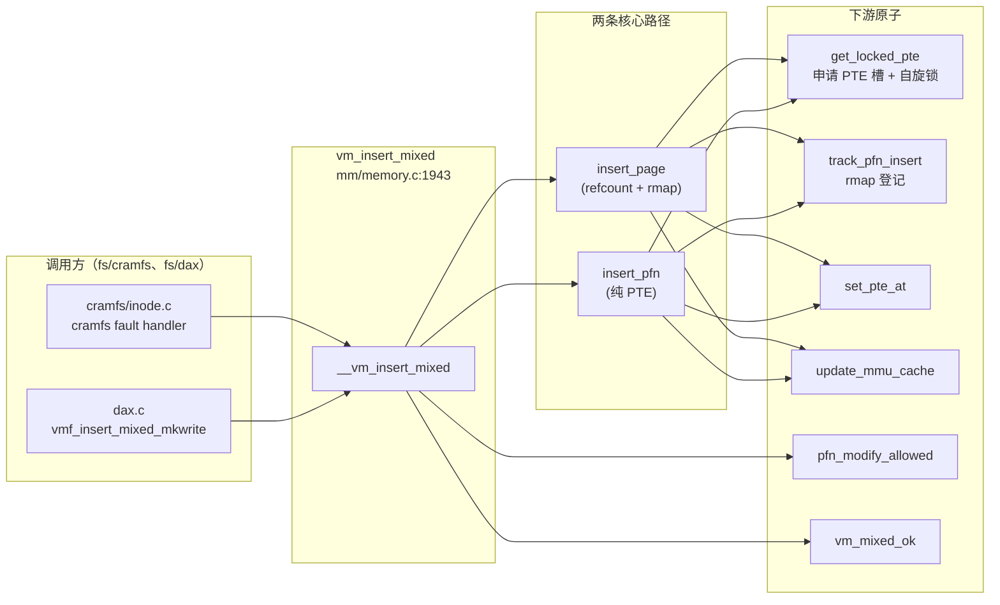

# 每日内核源码分析：vm_insert_mixed

- **日期**：2026-09-29
- **子系统**：mm
- **源文件**：mm/memory.c:1943-1949
- **类型**：function
- **内核版本**：Linux v4.19.0 (linux-stable)

---

## 1. 功能作用

`vm_insert_mixed` 是 Linux 内核内存管理子系统中一个底层、通用的 VMA（虚拟内存区域）页表映射接口。它的核心作用是：**将一个携带元数据的物理页框号（pfn_t）插入到指定用户 VMA 的某个虚拟地址处**，建立一条 PTE 映射。

与同家族的三个兄弟函数相比，`vm_insert_mixed` 位于最灵活的位置：

| 函数 | 输入类型 | 适用 VMA flag | 架构依赖 |
|------|----------|--------------|----------|
| `vm_insert_page` | `struct page *` | `VM_MIXEDMAP` | 通用 |
| `vm_insert_pfn` / `vm_insert_pfn_prot` | `unsigned long pfn` + `PFN_DEV` | `VM_PFNMAP` 或 `VM_MIXEDMAP` | pfn 必须非 valid（设备） |
| `vm_insert_mixed` | `pfn_t`（pfn + flags） | `VM_PFNMAP` 或 `VM_MIXEDMAP` | 按 `pfn_t` 语义动态选择路径 |
| `remap_pfn_range` | `pfn` + 范围 | `VM_PFNMAP` | 批量，强制 special pte |

`vm_insert_mixed` 的"mixed"二字源于它可以同时处理**系统内存页**（有 `struct page` 映射的 pfn_valid）和**设备内存 / 保留内存**（无 struct page、靠 pte_special 或 pte_devmap 标记）两类目标。这使得它成为 DAX、cramfs 等需要在同一个 VMA 里混合映射 page-backed 和 device-backed 内存场景的理想工具。

**典型调用时机**：
- 驱动 / 文件系统的 `vm_ops->fault` 或 `vm_ops->pfn_mkwrite` 处理函数中
- 必须在持有 `mm->mmap_sem` 读锁以上时调用
- 不处理已有 PTE（会返回 `-EBUSY`），因此适合 fault 处理器插入新页

## 2. 关键数据结构

### `pfn_t` —— 带 flags 的物理页框号（核心）

定义在 `include/linux/pfn_t.h`，它是 `vm_insert_mixed` 区别于其他兄弟的根本原因。

```c
typedef struct {
    u64 val;      // 低部存 pfn，高位存 flags
} pfn_t;
```

**flags 位域**（占据 64-bit 顶部若干位）：

| Flag | 含义 |
|------|------|
| `PFN_DEV` | pfn **不在系统 memmap 中**（设备内存），无对应的 `struct page` |
| `PFN_MAP` | pfn 有**驱动管理的动态 page 映射** |
| `PFN_SPECIAL` | 标记这是 special pte（架构通过 `CONFIG_ARCH_HAS_PTE_SPECIAL` 支持） |
| `PFN_SG_CHAIN` / `PFN_SG_LAST` | scatterlist 链中条目标记 |

**关键判定 helper**：

- `pfn_t_has_page(pfn)` —— 返回 true 当且仅当 `(PFN_MAP & PFN_DEV) == PFN_MAP` 或 `PFN_DEV == 0`。语义：如果 pfn 不带 DEV 标记，默认认为有 struct page。
- `pfn_t_valid(pfn)` —— `pfn_valid(pfn_t_to_pfn(pfn))`，底层物理 pfn 是否在系统地址空间内。
- `pfn_t_devmap(pfn)` —— `(PFN_DEV|PFN_MAP) == flags`，真正的 devmap（由 `__HAVE_ARCH_PTE_DEVMAP` 决定是否支持）。
- `pfn_t_special(pfn)` —— `(pfn & PFN_SPECIAL) != 0`，由 `CONFIG_ARCH_HAS_PTE_SPECIAL` 决定。

### `struct vm_area_struct` —— 虚拟内存区域（v4.19 核心字段）

```c
struct vm_area_struct {
    struct mm_struct *vm_mm;           // 所属地址空间
    unsigned long vm_start, vm_end;    // 虚拟地址范围
    pgprot_t vm_page_prot;             // 默认页保护位
    vm_flags_t vm_flags;               // VMA 行为标记
    const struct vm_operations_struct *vm_ops;
    // ... rmap、文件映射等
};
```

**与本函数直接相关的 flag 位**：

| Flag | 含义 |
|------|------|
| `VM_PFNMAP` | VMA 中的 PTE 直接由 pfn 组成，**不持有 struct page 引用** |
| `VM_MIXEDMAP` | VMA 允许**混合** pfn-backed 和 page-backed 条目 |
| `VM_IO` | 设备 I/O 映射 |
| `VM_PFNMAP | VM_MIXEDMAP` 同时置位 | **BUG_ON**，禁止 |

### `pte_t` —— 页表项

由架构定义（通常是 `unsigned long` 或更大），本函数通过以下 helper 构造：

- `pte_mkspecial(pte)` —— 标记为 special pte（不参与 LRU / rmap 常规处理）
- `pte_mkdevmap(pte)` —— 标记为设备映射 pte（由 devmap 架构特性支持）
- `pfn_t_pte(pfn, pgprot)` —— 将 pfn_t 转为 `pte_t`（实际就是 `pfn_pte(pfn_t_to_pfn(pfn), pgprot)`）

## 3. 核心逻辑流程图

```mermaid
flowchart TD
    A[入口<br/>vm_insert_mixed vma, addr, pfn] --> B[调用 __vm_insert_mixed<br/>mkwrite=false]
    B --> C{vm_mixed_ok?<br/>VMA flag 或 pfn 类型<br/>是否支持 mixed 插入}
    C -->|否| BUG_ON!
    C -->|是| D{addr ∈ [vma_start, vma_end)?}
    D -->|否| RET_EFAULT
    D -->|是| E[track_pfn_insert<br/>记录 pfn→vma 关联用于 rmap]
    E --> F{pfn_modify_allowed?<br/>pfn 可否被当前 pgprot 修改}
    F -->|否| RET_EACCES
    F -->|是| G{ARCH_HAS_PTE_SPECIAL<br/>pfn 是否非 devmap 且 valid?}
    G -->|YES 进入此分支<br/>即：无 pte_special 架构支持<br/>且 pfn 不带 DEV 标记<br/>且 pfn 在系统内存中| H[走 insert_page 路径<br/>1. get_page 引用<br/>2. inc_mm_counter<br/>3. page_add_file_rmap<br/>4. set_pte_at mk_pte]
    G -->|NO| I[走 insert_pfn 路径]
    I --> J[get_locked_pte 获取 PTE 槽位<br/>取不到→RET_ENOMEM]
    J --> K{*pte 是否为空?}
    K -->|否| L{是 mkwrite 模式?}
    L -->|是 且 pte_pfn 匹配| M[保留旧 entry]
    L -->|否 或 pfn 不匹配| RET_EBUSY
    K -->|是| N{pfn_t_devmap?}
    N -->|是| O[entry = pte_mkdevmap<br/>pfn_t_pte]
    N -->|否| P[entry = pte_mkspecial<br/>pfn_t_pte]
    M --> Q[set_pte_at + update_mmu_cache]
    O --> Q
    P --> Q
    H --> Q
    Q --> R[pte_unmap_unlock]
    R --> S[RET_0]
```

### 关键决策点解读

1. **`vm_mixed_ok` 兜底校验**（L1892-L1904）：`vm_insert_pfn` 严格要求 `VM_PFNMAP`/`VM_MIXEDMAP` flag 并且 BUG_ON 不匹配的组合，而 `vm_insert_mixed` 更宽松——只要 vma 有 `VM_MIXEDMAP`，或者 pfn 自身被标记为 `DEV`/`SPECIAL`，或者就是 `zero_pfn`，都放行。这保证了调用者即便 VMA 还没显式设置 mixed flag，也能被 pfn 的 flags 救回来。

2. **架构分支（L1928-L1938）——无 `pte_special` 必须 refcount page**：在不支持 `pte_special` 的架构上，无法仅靠 PTE bit 来标记"这不是普通 page"，内核就退化为：如果 pfn 在系统地址空间中（pfn_valid=true 且非 devmap），必须走 `insert_page` 持有 `struct page` 引用、调用 `page_add_file_rmap`，才能保证回收路径正确。

3. **`insert_pfn` 路径不走 `get_page` / `rmap`**：这是 pfn 插入和 page 插入最本质的差异。pfn 插入既不增加 page refcount，也不登记 rmap，纯粹是 PTE 层面的硬地址映射。对 `VM_PFNMAP` VMA，整个 VMA 都走这条路；对 `VM_MIXEDMAP` VMA，则由 pfn 的类型决定。

4. **`mkwrite` 语义**：`vmf_insert_mixed_mkwrite` 传入 `mkwrite=true`，意味着"这是 private 映射的写 fault，需要将已有的只读 PTE 升级为可写"。所以 `insert_pfn` 在 `mkwrite` 下遇到非空 PTE 不会直接 EBUSY——它会比对 pfn 是否一致，一致则在旧 entry 上叠加 `pte_mkyoung + maybe_mkwrite(pte_mkdirty())`，不一致才警告。

5. **`track_pfn_insert` 静默维护**：这个小函数会在 VMA 的 rmap 链表上登记这次插入，让 `munmap` / `zap_pte_range` 能找到 PTE 对应的 pfn 做清理。它不影响主流程，但对内存泄漏防护至关重要。

## 4. 调用关系

### 4.1 调用者（who calls me）

`vm_insert_mixed` 是 EXPORT_SYMBOL，面向驱动 / 文件系统开发者。v4.19 源码中直接调用：

| 调用方 | 所在文件 | 调用场景 |
|--------|----------|----------|
| `cramfs_get_unmapped_area` → `cramfs_phys_to_pfn` | `fs/cramfs/inode.c:423` | cramfs 的 `vm_operations_struct.fault` 中，按块设备的物理位置插入 pfn 映射 |
| `dax_insert_mapping`（间接经 `vmf_insert_mixed_mkwrite`） | `fs/dax.c:1466` | DAX 写 fault 路径，将 pmem 设备 pfn 以 mixed 模式插入 VMA |
| `__dax_pte_fault` | `fs/dax.c:1776` | DAX 主 fault 路径，private 映射写 fault 时调用 `vmf_insert_mixed_mkwrite` |

更广义的兄弟接口调用者（理解整体生态）：

| 接口 | 典型用户 |
|------|----------|
| `remap_pfn_range` | sound/core/pcm_native.c（ALSA PCM）、kernel/dma/coherent.c、fs/proc/vmcore.c、drivers/gpu/drm/i915/gvt/ |
| `vm_insert_page` | DRM GEM、virtio-balloon 等 page-backed 场景 |

### 4.2 被调用者（who I call）

**核心路径调用**：
- `__vm_insert_mixed()` —— 内部主逻辑
- `vm_mixed_ok()` —— VMA + pfn flag 合法性判定
- `insert_page()` —— `CONFIG_ARCH_HAS_PTE_SPECIAL=n` 时的 page-backed 路径
- `insert_pfn()` —— 通用 pfn-backed 路径
- `pfn_modify_allowed()` —— 安全检查：pfn 能否被当前 pgprot 权限修改（防止 RO→RW 越权）

**辅助调用**：
- `get_locked_pte(mm, addr, &ptl)` —— 申请 PTE 槽位 + 拿自旋锁
- `track_pfn_insert()` —— rmap 登记
- `set_pte_at()` + `update_mmu_cache()` —— 实际写页表 + 刷新硬件缓存
- `pte_unmap_unlock()` —— 释放锁 + 解除映射

**宏 / 内联**：
- `IS_ENABLED(CONFIG_ARCH_HAS_PTE_SPECIAL)` —— 编译期架构特性开关（x86_64 开，ARM32 关）
- `pfn_t_pte / pte_mkspecial / pte_mkdevmap` —— 架构相关 PTE 构造

### 4.3 调用关系图（Mermaid）



## 5. 易错点 / 边界场景 / 设计权衡

### 5.1 `VM_PFNMAP` 与 `VM_MIXEDMAP` 互斥又共存

`vm_insert_pfn_prot` 里有两条著名的 BUG_ON：

```c
BUG_ON(!(vma->vm_flags & (VM_PFNMAP|VM_MIXEDMAP)));
BUG_ON((vma->vm_flags & (VM_PFNMAP|VM_MIXEDMAP)) == (VM_PFNMAP|VM_MIXEDMAP));
```

**不能两个都置位，也不能一个都不置。** 但 `vm_insert_page` 反过来又会强制给 VMA OR 上 `VM_MIXEDMAP`。`vm_insert_mixed` 则更灵活，它不强制修改 vma flag，只在 `vm_mixed_ok` 层面验证 pfn 自身是否携带 DEV/SPECIAL/zero 等"自我证明"信息。

### 5.2 为什么要区分 `pfn_t_devmap` 和 `pfn_t_special`

这是设计哲学上的三分：
- **架构有 `pte_special`**：用一个 PTE bit 标记"这不是普通 page"，完全绕开 page refcount 和 rmap。
- **架构有 `pte_devmap`**（x86 PAT/PCID 扩展路径）：硬件可以按 devmap PTE 特殊缓存策略处理，效率更高。
- **架构两者都没有**（ARM32 等老架构）：必须回退到 `insert_page` + `get_page` + `rmap` 的完整生命周期管理。

`__vm_insert_mixed` 用 `IS_ENABLED(CONFIG_ARCH_HAS_PTE_SPECIAL)` 做编译期分支，零额外运行时开销。

### 5.3 `pfn_modify_allowed` 是安全底线

即便调用方是 root，内核也不允许把一个只读 VMA 的 pfn 改成可写。这个函数检查新 pgprot 的 RWX 是否严格弱于或等于原 VMA 权限。忘记调用它就会留下内核写入设备内存的漏洞。

### 5.4 `mkwrite` 模式为什么比对 `pte_pfn`

private 映射发生 COW 时，原 PTE 已经存在（只是只读），pfn 还是驱动最初给的那个——此时 `vmf_insert_mixed_mkwrite` 传入新 pfn 应该和旧的相等。如果不等，说明驱动传了个自相矛盾的 pfn，内核用 `WARN_ON_ONCE` 兜底但仍返回成功，避免 fault 死循环。

### 5.5 `vm_normal_page` 是读取侧的对称函数

理解 `vm_insert_mixed` 必须同时理解 `vm_normal_page(vma, addr, pte)`——它是 rmap、回收、迁移等所有"需要拿到 struct page 才能干活"的路径都依赖的 page 提取器。在 `VM_MIXEDMAP` VMA 上它会：
- 如果 pte 是 special → 返回 NULL（跳过）
- 如果 pte 是 devmap → 返回 NULL（跳过）
- 如果 pte 指向系统内存且 pte_none → 根据 `pfn` 查 `pfn_to_page`

插入侧和读取侧靠这套 flag + helper 约定达成完美对称。

---

## 附：核心源码片段

```c
// mm/memory.c:1906-1949
static int __vm_insert_mixed(struct vm_area_struct *vma, unsigned long addr,
			pfn_t pfn, bool mkwrite)
{
	pgprot_t pgprot = vma->vm_page_prot;

	BUG_ON(!vm_mixed_ok(vma, pfn));

	if (addr < vma->vm_start || addr >= vma->vm_end)
		return -EFAULT;

	track_pfn_insert(vma, &pgprot, pfn);

	if (!pfn_modify_allowed(pfn_t_to_pfn(pfn), pgprot))
		return -EACCES;

	/*
	 * If we don't have pte special, then we have to use the pfn_valid()
	 * based VM_MIXEDMAP scheme (see vm_normal_page), and thus we *must*
	 * refcount the page if pfn_valid is true (hence insert_page rather
	 * than insert_pfn).
	 */
	if (!IS_ENABLED(CONFIG_ARCH_HAS_PTE_SPECIAL) &&
	    !pfn_t_devmap(pfn) && pfn_t_valid(pfn)) {
		struct page *page;
		page = pfn_to_page(pfn_t_to_pfn(pfn));
		return insert_page(vma, addr, page, pgprot);
	}
	return insert_pfn(vma, addr, pfn, pgprot, mkwrite);
}

int vm_insert_mixed(struct vm_area_struct *vma, unsigned long addr,
			pfn_t pfn)
{
	return __vm_insert_mixed(vma, addr, pfn, false);
}
EXPORT_SYMBOL(vm_insert_mixed);
```

```c
// mm/memory.c:1770-1820 (insert_pfn 核心)
static int insert_pfn(struct vm_area_struct *vma, unsigned long addr,
			pfn_t pfn, pgprot_t prot, bool mkwrite)
{
	struct mm_struct *mm = vma->vm_mm;
	int retval;
	pte_t *pte, entry;
	spinlock_t *ptl;

	retval = -ENOMEM;
	pte = get_locked_pte(mm, addr, &ptl);
	if (!pte)
		goto out;
	retval = -EBUSY;
	if (!pte_none(*pte)) {
		if (mkwrite) {
			if (WARN_ON_ONCE(pte_pfn(*pte) != pfn_t_to_pfn(pfn)))
				goto out_unlock;
			entry = *pte;
			goto out_mkwrite;
		} else
			goto out_unlock;
	}

	if (pfn_t_devmap(pfn))
		entry = pte_mkdevmap(pfn_t_pte(pfn, prot));
	else
		entry = pte_mkspecial(pfn_t_pte(pfn, prot));

out_mkwrite:
	if (mkwrite) {
		entry = pte_mkyoung(entry);
		entry = maybe_mkwrite(pte_mkdirty(entry), vma);
	}

	set_pte_at(mm, addr, pte, entry);
	update_mmu_cache(vma, addr, pte);

	retval = 0;
out_unlock:
	pte_unmap_unlock(pte, ptl);
out:
	return retval;
}
```
