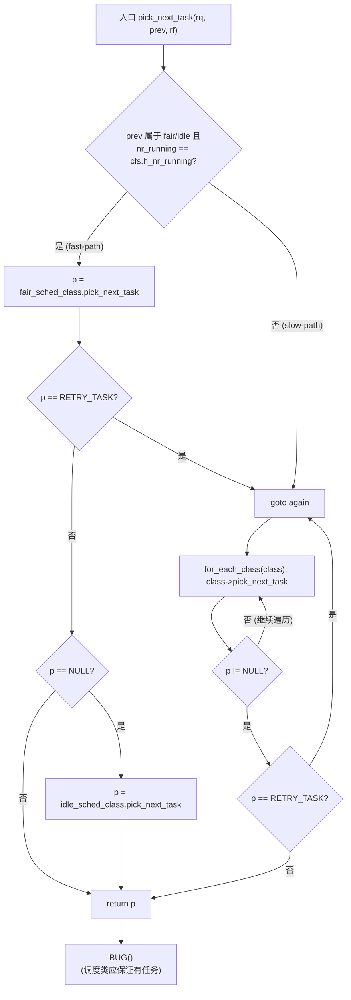
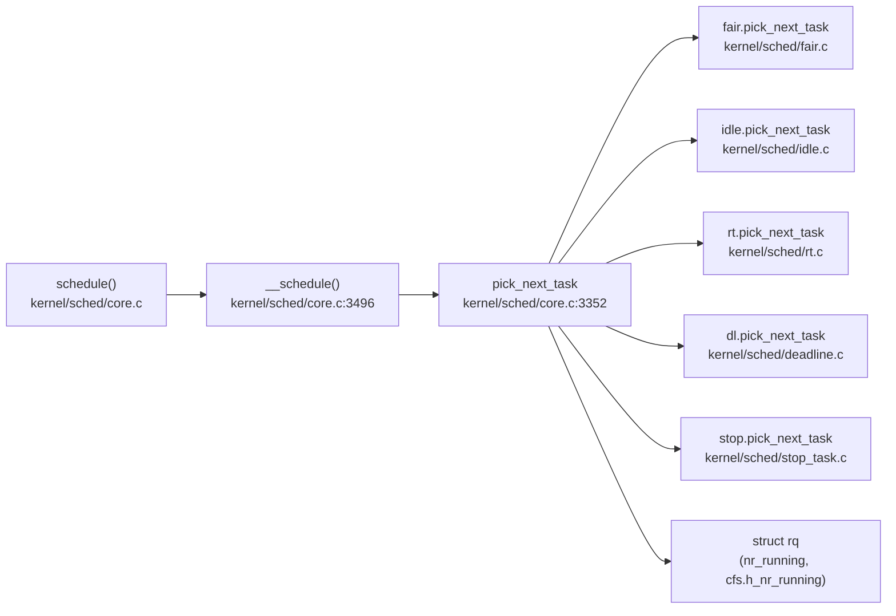

# 每日内核源码分析：pick_next_task

- **日期**：2026-09-30
- **子系统**：kernel/sched
- **源文件**：kernel/sched/core.c:3352-3391
- **类型**：function（static inline）

---

## 1. 功能作用

`pick_next_task` 是 Linux CFS/调度器子系统最核心的"挑选下一个运行任务"入口之一，由 `__schedule()` 直接调用，负责从当前 CPU 的运行队列 `rq` 中挑选出优先级最高的可运行任务，作为即将切换上下文的目标。

它的关键职责是：

1. **类间优先级裁决**：在多个调度类（`stop`、`dl`、`rt`、`fair`、`idle`）之间按照从高到低优先级裁决，调用对应 `sched_class->pick_next_task()`。
2. **快速路径优化**：如果运行队列上所有任务都属于 CFS（公平调度）类，且上一个任务 `prev` 也是 fair 或 idle 类，则直接走 fast-path 调用 `fair_sched_class.pick_next_task`，避免遍历链表带来的开销。这是绝大多数场景下的真实路径。
3. **返回 `RETRY_TASK` 协议**：当某个调度类在挑选过程中发现本 rq 上存在比自己优先级更高的可运行任务，它会返回 `RETRY_TASK`，触发重新从最高优先级类遍历，避免错失调度机会。

典型调用链：`schedule() -> __schedule() -> pick_next_task() -> class->pick_next_task() -> ... -> context_switch()`。

## 2. 关键数据结构

- **`struct rq`**（`kernel/sched/sched.h`）：每个 CPU 一个的运行队列，持有就绪任务链表、cfs/rt/dl 各子运行队列以及当前任务指针。本函数用到的关键字段：
    - `nr_running`：rq 上总的可运行任务数（包含所有调度类）。
    - `cfs.h_nr_running`：CFS 上的"可运行任务权重计数"（含被 throttle 的 group），用于判断是否纯 CFS 场景。
    - `curr`、`idle` 等。

- **`struct sched_class`**（`kernel/sched/sched.h`）：调度类抽象，定义了一组回调让多种调度策略（stop/deadline/rt/fair/idle）能插入到主调度流程。关键字段：
    - `pick_next_task`：类内挑选入口。
    - `next`：优先级次于本类的下一个调度类指针，用于遍历链。

- **`struct task_struct`**（`include/linux/sched.h`）：进程描述符；这里只用其 `sched_class` 指针判断上一个任务的所属类。

- **`struct rq_flags`**（`kernel/sched/sched.h`）：一组运行队列锁状态标志（如 `RF_NEED_BALANCE`），由调用者持有 rq 锁时传入；不同调度类可据此决定是否需要触发负载均衡。

- **关键宏**：
    - `RETRY_TASK = ((void *)-1UL)`：重试哨兵，触发重新遍历调度类。
    - `for_each_class(class)`：按 `stop -> dl -> rt -> fair -> idle` 顺序遍历所有调度类。
    - `idle_sched_class`、`fair_sched_class`：调度类全局实例。

## 3. 核心逻辑流程图



流程关键决策点说明：

1. **fast-path 判定**：比较 `rq->nr_running` 与 `rq->cfs.h_nr_running`，若相等意味着运行队列中没有任何非 fair 类任务可被调度，可直接走 fair 类，避免 `for_each_class` 遍历开销；同时要求 `prev` 也属于 fair/idle，避免低优先级类错失拉取高优先级工作的窗口。
2. **fast-path fallback 到 idle**：`fair_sched_class.pick_next_task` 返回 `NULL` 意味着 CFS 上无任务（例如 rq 上是 RT 占主导但 fast-path 不该进入这种场景，仅在边界情况下出现），此时按 `next == idle_sched_class` 的设计直接交给 idle。
3. **`RETRY_TASK` 重试协议**：避免某个调度类"看见"高优先级任务却没返回任务指针的情况，重新从最高优先级类遍历，防止优先级反转。
4. **`BUG()` 兜底**：理论上 `idle_sched_class` 永远能提供一个 idle 线程；若走到这里说明运行队列锁释放/迁移流程出错，是不变量破坏。

## 4. 调用关系

### 4.1 调用者（who calls me）

| 调用方 | 所在文件 | 调用场景 |
|--------|----------|----------|
| `__schedule()` | `kernel/sched/core.c:3496` | 主调度入口，决定下一个运行任务 |
| `__schedule()` 注释提及 | `kernel/sched/core.c:5648,5663` | 多核拉取负载场景 (`pull_dl_task`/`pull_rt_task`/`pull_task`) 中的局部重选 |

### 4.2 被调用者（who I call）

- **核心路径调用**：
  - `fair_sched_class.pick_next_task(rq, prev, rf)`：实际从 CFS 红黑树挑选最小 vruntime 任务；这是绝大多数场景。
  - `idle_sched_class.pick_next_task(rq, prev, rf)`：返回 idle 任务。
  - `stop_sched_class.pick_next_task`、`dl_sched_class.pick_next_task`、`rt_sched_class.pick_next_task`：slow-path 中按优先级遍历调用。
- **辅助调用/宏**：
  - `for_each_class(class)`：遍历所有调度类的内联宏。
  - `unlikely()` / `likely()`：分支预测提示。

### 4.3 调用关系图（Mermaid）



## 5. 易错点 / 边界场景 / 设计权衡

1. **`nr_running == cfs.h_nr_running` 的精确语义**：前者是"所有可运行任务数"，后者是 CFS 的"加权"可运行计数。两者相等并不一定表示真的只有 CFS 任务——例如在 throttled CFS group 全部被加权重的情况下，h_nr_running 可能减少，但更严格来说应该用 `cfs.nr_running`。这是 4.19 早期版本的近似判定，后续版本会演进到更精确的判断。
2. **fast-path 不让 RT/DL "漏掉"**：如果 `prev` 是 RT，但 rq 已被该 RT 任务独占且没有新任务加入，仍然走 slow-path，从而让 RT 重新获得选人机会，避免优先级反转。这是为何 fast-path 要求 `prev` 也属于 fair/idle。
3. **`RETRY_TASK` 的微妙之处**：返回 `RETRY_TASK` 表明"我看见本类以外有更高优先级的可运行任务，但我没有迁移/拉取它的权限"，上层必须重新遍历。这种机制保证调度类之间不会出现"我空着却让低优先级类占用 CPU"的反模式。
4. **rq 锁的假设**：函数注释 `pick_next_task() assumes pinned rq->lock:` 提醒调用者必须持有 rq->lock，因此本函数是 inline 而非可外部调用；也意味着它不会触发 `might_sleep()` 检查，调用路径全程在关抢占上下文。
5. **`BUG()` 兜底**：理论上 `idle_sched_class->pick_next_task` 永远能返回 idle 线程；若到达 `BUG()` 通常说明 rq->lock 被意外释放或调度类链被破坏。

---

## 附：核心源码片段

```c
/*
 * Pick up the highest-prio task:
 */
static inline struct task_struct *
pick_next_task(struct rq *rq, struct task_struct *prev, struct rq_flags *rf)
{
    const struct sched_class *class;
    struct task_struct *p;

    /*
     * Optimization: we know that if all tasks are in the fair class we can
     * call that function directly, but only if the @prev task wasn't of a
     * higher scheduling class, because otherwise those loose the
     * opportunity to pull in more work from other CPUs.
     */
    if (likely((prev->sched_class == &idle_sched_class ||
                prev->sched_class == &fair_sched_class) &&
               rq->nr_running == rq->cfs.h_nr_running)) {

        p = fair_sched_class.pick_next_task(rq, prev, rf);
        if (unlikely(p == RETRY_TASK))
            goto again;

        /* Assumes fair_sched_class->next == idle_sched_class */
        if (unlikely(!p))
            p = idle_sched_class.pick_next_task(rq, prev, rf);

        return p;
    }

again:
    for_each_class(class) {
        p = class->pick_next_task(rq, prev, rf);
        if (p) {
            if (unlikely(p == RETRY_TASK))
                goto again;
            return p;
        }
    }

    /* The idle class should always have a runnable task: */
    BUG();
}
```