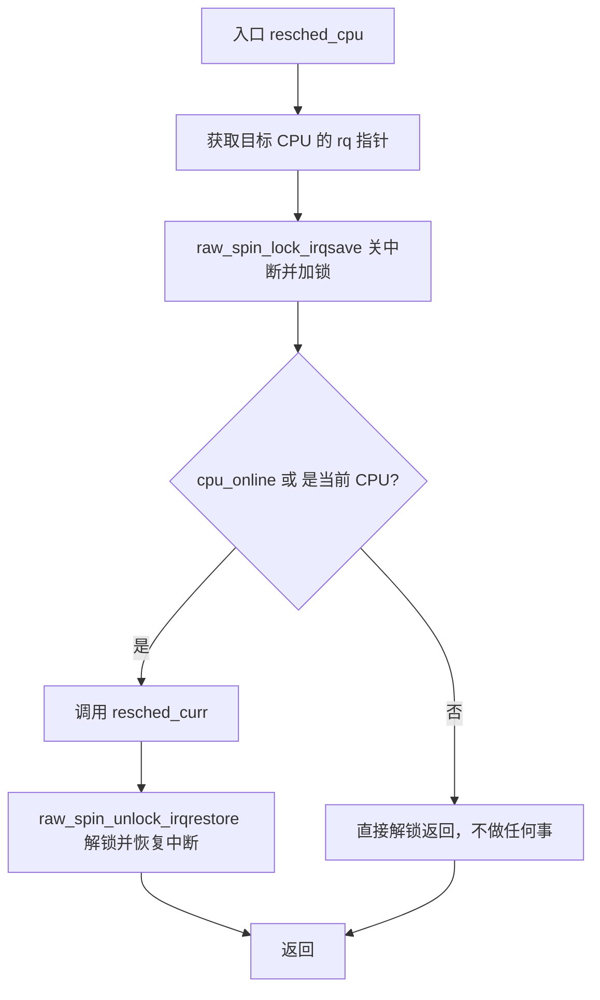
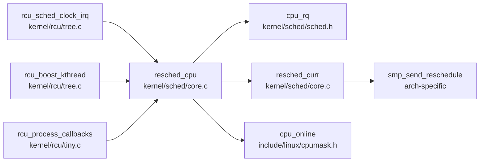

# 每日内核源码分析：resched_cpu

- **日期**：2026-10-01
- **子系统**：kernel/sched
- **源文件**：kernel/sched/core.c:478-487
- **类型**：function

---

## 1. 功能作用

`resched_cpu(int cpu)` 是 Linux 内核调度子系统中的一个底层辅助函数，用于**向指定 CPU 发起重新调度请求**。它的核心作用是：在持有一个 CPU 运行队列锁（rq->lock）的安全上下文中，调用 `resched_curr()` 来设置该 CPU 当前运行任务的 `TIF_NEED_RESCHED` 标志，从而促使目标 CPU 尽快进入调度器，选择新的任务执行。

典型使用场景包括：
- **RCU 子系统**在检测到某个 CPU 可能长时间未发生上下文切换、接近 stall 阈值时，通过 `resched_cpu()` 强制该 CPU 重新调度，以推进 grace period。
- 当某个高优先级任务被唤醒，或负载均衡器决定将任务迁移到另一 CPU 时，需要触发目标 CPU 的重新调度。

## 2. 关键数据结构

- `struct rq`（定义于 `kernel/sched/sched.h:775`）：CPU 的运行队列（runqueue），每个逻辑 CPU 对应一个 `rq`。核心字段包括：
  - `raw_spinlock_t lock`：保护该运行队列的自旋锁。
  - `struct task_struct *curr`：指向当前正在该 CPU 上运行的任务。
  - `unsigned int nr_running`：运行队列中就绪任务的数量。
- `struct task_struct`：进程描述符。`resched_curr()` 最终会操作该结构中的 `thread_info.flags`，设置 `TIF_NEED_RESCHED` 标志。

## 3. 核心逻辑流程图



**关键决策点解释：**
1. **为什么要先获取 `rq->lock`**：`resched_curr()` 要求调用者必须持有目标运行队列的锁，以防止竞态条件（例如当前正在切换的任务）。
2. **`cpu_online(cpu)` 判断**：如果目标 CPU 已经离线，向其发送重新调度请求没有意义，直接跳过。
3. **本地 CPU 的特殊处理**：即使目标 CPU 不在线，如果是当前正在执行的 CPU（`cpu == smp_processor_id()`），仍然允许重新调度自己。
4. **锁的粒度**：仅使用 `raw_spin_lock_irqsave`（本地关中断 + 自旋锁），因为操作非常简短，不需要更重量级的锁。

## 4. 调用关系

### 4.1 调用者（who calls me）

| 调用方 | 所在文件 | 调用场景 |
|--------|----------|----------|
| `rcu_sched_clock_irq` | `kernel/rcu/tree.c:1261` | RCU grace period 推进过程中，若某 CPU 超过 stall 阈值一半时间未切换，则触发该 CPU 重新调度 |
| `rcu_boost_kthread` | `kernel/rcu/tree.c:1496` | RCU boost 内核线程执行时，对当前 CPU 发起重调度 |
| `rcu_process_callbacks` | `kernel/rcu/tiny.c:210` | Tiny RCU 回调处理时调用（单 CPU 场景） |

### 4.2 被调用者（who I call）

- **核心路径调用**：
  - `cpu_rq(cpu)`：根据 CPU 编号获取对应的 `struct rq` 指针。
  - `resched_curr(rq)`：真正执行重调度标记的核心函数。若目标 CPU 是本地 CPU，则设置 `TIF_NEED_RESCHED`；若是远端 CPU，则通过 IPI（核间中断）发送 `smp_send_reschedule()`。
- **辅助调用**：
  - `cpu_online(cpu)`：检查 CPU 是否在线。
  - `smp_processor_id()`：获取当前执行 CPU 的 ID。
  - `raw_spin_lock_irqsave / raw_spin_unlock_irqrestore`：运行队列锁的获取与释放。

### 4.3 调用关系图（Mermaid）



## 5. 易错点 / 边界场景 / 设计权衡

1. **不能在中断上下文外随意调用**：虽然 `resched_cpu()` 本身通过 `raw_spin_lock_irqsave` 做了中断保护，但调用方仍应确保在合适的上下文执行，避免死锁。
2. **远端 CPU 的 IPI 开销**：当 `resched_curr()` 发现目标 CPU 不是本地 CPU 时，会发送核间中断（IPI）。频繁调用 `resched_cpu()` 可能导致 IPI 风暴，因此 RCU 子系统会在注释中建议某些场景改用 `smp_send_reschedule()` 直接发送 IPI，绕过 `resched_cpu()` 的锁开销。
3. **离线 CPU 的处理**：如果目标 CPU 已离线且不是当前 CPU，函数直接返回，不做任何事。这是为了防止对已离线的逻辑 CPU 执行无效操作。
4. **锁顺序**：`resched_cpu()` 内部直接获取 `rq->lock`，调用方必须确保自己没有已经持有该锁，否则会导致自旋锁重入死锁（Linux 自旋锁不可重入）。

---

## 附：核心源码片段

```c
// kernel/sched/core.c:478-487
void resched_cpu(int cpu)
{
	struct rq *rq = cpu_rq(cpu);
	unsigned long flags;

	raw_spin_lock_irqsave(&rq->lock, flags);
	if (cpu_online(cpu) || cpu == smp_processor_id())
		resched_curr(rq);
	raw_spin_unlock_irqrestore(&rq->lock, flags);
}
```
