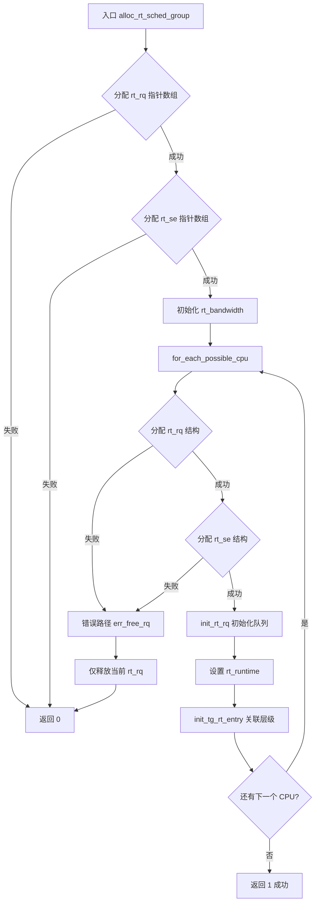
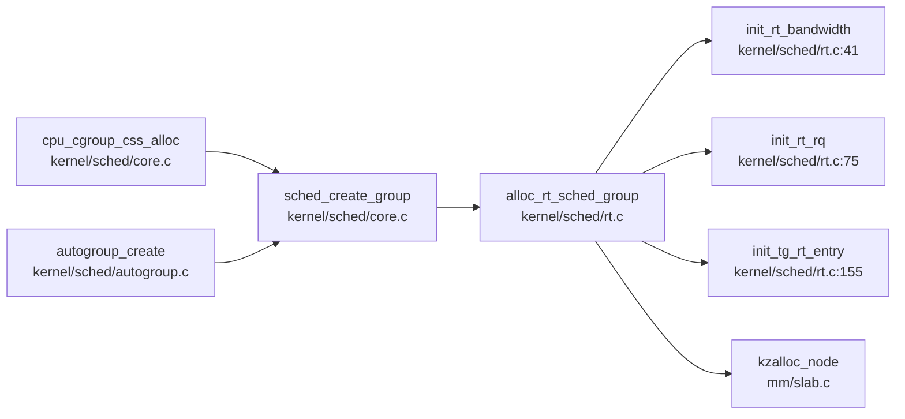

# 每日内核源码分析：alloc_rt_sched_group

- **日期**：2026-10-02
- **子系统**：kernel/sched
- **源文件**：kernel/sched/rt.c:182-220
- **类型**：function

---

## 1. 功能作用

`alloc_rt_sched_group()` 是 Linux 内核 **RT（实时）组调度**子系统的核心初始化函数。它的职责是：在创建一个新的 `task_group`（任务组）时，为该组分配并初始化所有与 **SCHED_FIFO / SCHED_RR** 实时调度类相关的 per-CPU 数据结构。

通俗地说，当系统通过 cgroup 创建一个新的 CPU 控制组（或 autogroup 创建新会话组）时，CFS（完全公平调度器）和 RT（实时调度器）都需要为这个新组准备独立的运行队列。`alloc_rt_sched_group()` 就是 RT 侧的"准备工作"入口：它为每个 CPU 创建一个独立的实时运行队列 `rt_rq` 和调度实体 `rt_se`，并将它们关联到父组的调度层级中。

该函数仅在编译选项 `CONFIG_RT_GROUP_SCHED` 开启时存在；否则编译器会将其替换为一个空实现（直接 `return 1`）。

**典型调用场景**：
- 用户通过 cgroup 创建 `cpu.rt_runtime_us` / `cpu.rt_period_us` 控制的子组时。
- 终端新建会话触发 `autogroup_create()` 时。

---

## 2. 关键数据结构

### `struct task_group`（kernel/sched/sched.h:355）
调度组的核心描述符，同时承载 CFS 和 RT 两类的数据：

| 字段 | 含义 |
|------|------|
| `struct sched_rt_entity **rt_se` | 指向 per-CPU 的实时调度实体指针数组 |
| `struct rt_rq **rt_rq` | 指向 per-CPU 的实时运行队列指针数组 |
| `struct rt_bandwidth rt_bandwidth` | 该组的 RT 带宽限制（防 RT 任务饿死其他组） |
| `struct task_group *parent` | 父调度组，形成层级树 |

### `struct rt_rq`（kernel/sched/sched.h:582）
实时运行队列，每个 CPU 上每个 task_group 都有一份：

| 字段 | 含义 |
|------|------|
| `struct rt_prio_array active` | 按优先级索引的链表数组 + bitmap，RT 调度核心结构 |
| `unsigned int rt_nr_running` | 当前队列上可运行的 RT 任务数 |
| `int highest_prio.curr` | 当前队列中最高优先级（数值最小） |
| `int rt_throttled` | 是否因超出带宽而被限制 |
| `u64 rt_runtime` | 该组在本周期内剩余的 RT 运行时间 |
| `struct rq *rq` | 指向该 rt_rq 所在的物理运行队列 |
| `struct task_group *tg` | 反向指向所属的 task_group |

### `struct sched_rt_entity`（include/linux/sched.h:483）
RT 调度实体，可以代表一个具体任务或一个任务组：

| 字段 | 含义 |
|------|------|
| `struct list_head run_list` | 挂在 `rt_prio_array` 某优先级链表上的节点 |
| `struct sched_rt_entity *parent` | 父实体（组层级中的上级） |
| `struct rt_rq *rt_rq` | 自己所在的运行队列 |
| `struct rt_rq *my_q` | 自己"拥有"的运行队列（如果是组，则指向子组的 rt_rq） |

### `struct rt_bandwidth`
RT 带宽控制结构，用于实现 `cpu.rt_runtime_us` 的限额机制：

| 字段 | 含义 |
|------|------|
| `ktime_t rt_period` | 限制周期 |
| `u64 rt_runtime` | 每周期允许运行的总时间 |
| `struct hrtimer rt_period_timer` | 高精度定时器，周期重置运行时间 |

---

## 3. 核心逻辑流程图



**关键决策点解释**：

1. **两级指针数组设计**：先分配 `rt_rq[]` / `rt_se[]` 指针数组（大小为 `nr_cpu_ids`），再为每个 CPU 分配实际结构。这是为了让 `task_group` 能以 `tg->rt_rq[cpu]` 的方式 O(1) 访问任意 CPU 的队列。
2. **带宽初始化**：调用 `init_rt_bandwidth()` 将周期设为默认值（`def_rt_bandwidth.rt_period`），运行时间初始化为 0。实际限额由 cgroup 接口后续配置。
3. **NUMA 亲和分配**：`kzalloc_node(..., cpu_to_node(i))` 确保每个 CPU 的 rt_rq/rt_se 从本地内存节点分配，减少跨节点访问。
4. **层级关联**：`init_tg_rt_entry()` 将子组的 `rt_se` 挂到父组的 `my_q` 下，形成调度树；如果 `parent == NULL`（根组），则挂到 CPU 全局 `rq->rt` 上。
5. **错误路径的局限性**：`err_free_rq` 标签只 `kfree(rt_rq)` 释放了**当前**失败的 rt_rq，而之前已经分配成功的其他 CPU 的 rt_rq/rt_se 以及指针数组均未被释放。不过上层的 `sched_free_group()` 在检测到 `alloc_rt_sched_group()` 返回 0 后会调用 `free_rt_sched_group()` 进行完整清理，因此实际使用中不会泄漏。

---

## 4. 调用关系

### 4.1 调用者（who calls me）

| 调用方 | 所在文件 | 调用场景 |
|--------|----------|----------|
| `sched_create_group()` | `kernel/sched/core.c:6260` | 通用调度组创建入口，先分配 CFS 结构，再分配 RT 结构 |
| `cpu_cgroup_css_alloc()` | `kernel/sched/core.c:6387` | cgroup 子系统创建新 `cpu` cgroup 时触发 |
| `autogroup_create()` | `kernel/sched/autogroup.c:71` | 新建终端会话时，为会话创建独立的 autogroup |

### 4.2 被调用者（who I call）

- **核心路径调用**：
  - `kcalloc()` / `kzalloc_node()`：分配指针数组和 per-CPU 结构
  - `init_rt_bandwidth()`：初始化 RT 带宽控制参数
  - `init_rt_rq()`：初始化 `rt_prio_array` 的链表和 bitmap
  - `init_tg_rt_entry()`：将 rt_rq/rt_se 绑定到 task_group 和 CPU 运行队列

- **辅助调用**：
  - `ktime_to_ns()`：时间单位转换
  - `cpu_to_node()`：获取 CPU 对应的 NUMA 节点

- **宏 / 内联**：
  - `for_each_possible_cpu()`：遍历所有可能存在的 CPU（而非仅在线 CPU）
  - `GFP_KERNEL`：标准内核内存分配标志

### 4.3 调用关系图（Mermaid）



---

## 5. 易错点 / 边界场景 / 设计权衡

1. **空实现陷阱**：如果内核编译时未开启 `CONFIG_RT_GROUP_SCHED`，`alloc_rt_sched_group()` 在 `rt.c:252` 处会被替换为空函数（直接 `return 1`）。阅读源码时必须注意 `#ifdef` 的范围，否则会对资源分配逻辑产生误解。

2. **错误路径不完整**：`err_free_rq` 只释放当前失败的 `rt_rq`，不循环释放之前成功的 per-CPU 结构。这看起来像一个局部遗漏，但实际上依赖调用方 `sched_create_group()` 在失败后调用 `sched_free_group()` → `free_rt_sched_group()` 来做完整清理。这是一种**委托清理**的设计模式，但增加了代码阅读时的理解成本。

3. **per-CPU 而非 per-online-CPU**：使用 `for_each_possible_cpu()` 而非 `for_each_online_cpu()`。原因是热插拔 CPU 离线后再上线时，已经存在的 task_group 必须已经有对应的 rt_rq/rt_se，否则会访问空指针。

4. **RT 带宽初始值为 0**：`init_rt_bandwidth(..., 0)` 将初始运行时间设为 0，意味着新创建的组默认**没有 RT 运行额度**。必须通过 cgroup 的 `cpu.rt_runtime_us` 文件显式配置后，组内的 RT 任务才能真正运行。这是一种"默认拒绝"的安全设计。

5. **调度层级与 `parent->rt_se[i]` 的假设**：函数要求 `parent` 必须已经初始化完毕（即 `parent->rt_se[i]` 有效）。如果根组未正确初始化，此处会出现空指针解引用。根组的初始化由 `sched_init()` 在系统启动时保证。

---

## 附：核心源码片段

```c
// kernel/sched/rt.c:182-220
int alloc_rt_sched_group(struct task_group *tg, struct task_group *parent)
{
	struct rt_rq *rt_rq;
	struct sched_rt_entity *rt_se;
	int i;

	tg->rt_rq = kcalloc(nr_cpu_ids, sizeof(rt_rq), GFP_KERNEL);
	if (!tg->rt_rq)
		goto err;
	tg->rt_se = kcalloc(nr_cpu_ids, sizeof(rt_se), GFP_KERNEL);
	if (!tg->rt_se)
		goto err;

	init_rt_bandwidth(&tg->rt_bandwidth,
			ktime_to_ns(def_rt_bandwidth.rt_period), 0);

	for_each_possible_cpu(i) {
		rt_rq = kzalloc_node(sizeof(struct rt_rq),
				     GFP_KERNEL, cpu_to_node(i));
		if (!rt_rq)
			goto err;

		rt_se = kzalloc_node(sizeof(struct sched_rt_entity),
				     GFP_KERNEL, cpu_to_node(i));
		if (!rt_se)
			goto err_free_rq;

		init_rt_rq(rt_rq);
		rt_rq->rt_runtime = tg->rt_bandwidth.rt_runtime;
		init_tg_rt_entry(tg, rt_rq, rt_se, i, parent->rt_se[i]);
	}

	return 1;

err_free_rq:
	kfree(rt_rq);
err:
	return 0;
}
```
