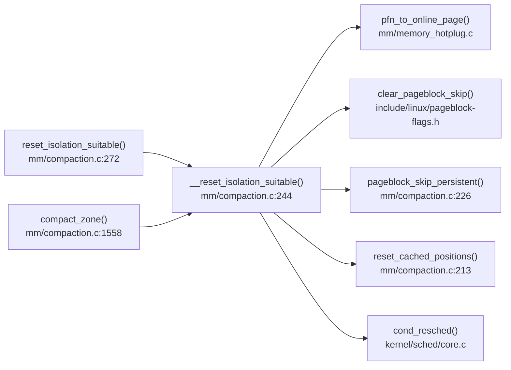

# 每日内核源码分析：__reset_isolation_suitable

- **日期**：2026-10-03
- **子系统**：mm
- **源文件**：mm/compaction.c:244-270
- **类型**：function

---

## 1. 功能作用

`__reset_isolation_suitable()` 是 Linux 内存管理子系统中 **内存压缩（memory compaction）** 机制的关键辅助函数，用于**清除 pageblock 的跳过标记**，使得之前被标记为"不适合隔离"的页块重新参与内存压缩扫描。

在内存压缩过程中，内核会扫描 zone 内的 pageblock（通常是 2MB 或 4MB 的连续物理页区域），尝试将可迁移页移动到 zone 的一端，从而腾出连续的空闲页以满足大页（huge page）或高阶分配请求。如果某个 pageblock 在此次压缩中未能隔离出任何可迁移页，它会被标记为 `PG_migrate_skip`，后续压缩扫描将跳过它以提高效率。

然而，这种跳过信息是**有时效性**的：随着系统运行，原本不可迁移的页可能已被释放或迁移，跳过标记需要被定期清除。`__reset_isolation_suitable()` 正是在这种场景下被调用，它遍历整个 zone，将所有 pageblock 的跳过标记清除，让它们重新进入候选扫描范围。

典型触发场景：
- 当某次完整的内存压缩结束后（`compact_blockskip_flush` 被置位）。
- 当压缩被延迟（deferred）后重新开始时（`compaction_restarting()` 判断为真）。

---

## 2. 关键数据结构

### `struct zone`（include/linux/mmzone.h）

与内存压缩相关的 zone 级缓存字段：

- `compact_blockskip_flush`（bool）
  - 置位时表明需要在下次合适的时机清除 pageblock 跳过标记。
  - 通常在 `update_pageblock_skip()` 设置跳过标记后被置位，或在 `page_alloc.c` 中被手动清除。

- `compact_cached_migrate_pfn[2]`（unsigned long）
  - 异步（index 0）和同步（index 1）压缩模式下，migrate scanner 的缓存起始 PFN。
  - 由 `reset_cached_positions()` 重置为 zone 起始 PFN。

- `compact_cached_free_pfn`（unsigned long）
  - free scanner 的缓存起始 PFN。
  - 由 `reset_cached_positions()` 重置为 zone 末尾附近的 pageblock 起始 PFN。

### `struct compact_control`（mm/internal.h）

控制单次内存压缩过程的上下文结构：

- `zone`：指向被压缩的 zone。
- `free_pfn` / `migrate_pfn`：两个 scanner（free scanner 从高端向低端扫描，migrate scanner 从低端向高端扫描）的当前位置。
- `ignore_skip_hint`：若为 true，则忽略 pageblock 的跳过标记（例如 `/proc/sys/vm/compact_memory` 触发的强制压缩）。
- `mode`：`MIGRATE_ASYNC` 或 `MIGRATE_SYNC`，影响压缩的激进程度。

### pageblock 相关宏与函数

- `pageblock_nr_pages`：一个 pageblock 包含的页数，通常为 `1UL << pageblock_order`（x86 上常为 1024 页 = 4MB）。
- `pageblock_skip_persistent(page)`：判断某页是否属于持久性的大复合页（compound page order >= pageblock_order），这类页块应始终被跳过。
- `clear_pageblock_skip(page)`：清除 pageblock 的 `PG_migrate_skip` 标记。

---

## 3. 核心逻辑流程图

```mermaid
flowchart TD
  A[入口 __reset_isolation_suitable(zone)] --> B[初始化 start_pfn / end_pfn]
  B --> C[compact_blockskip_flush = false]
  C --> D[遍历 zone 内每个 pageblock]
  D --> E{cond_resched}
  E --> F[获取 page = pfn_to_online_page(pfn)]
  F --> G{page 存在?}
  G -->|否| D
  G -->|是| H{page 属于当前 zone?}
  H -->|否| D
  H -->|是| I{pageblock_skip_persistent?}
  I -->|是| D
  I -->|否| J[clear_pageblock_skip(page)]
  J --> D
  D --> K[遍历结束]
  K --> L[reset_cached_positions(zone)]
  L --> M[返回]
```

### 关键决策点解释

1. **cond_resched()**：在遍历每个 pageblock 时主动让出 CPU，防止在大型 zone（如 TB 级内存）上长时间持有 CPU 不释放，避免软锁死（soft-lockup）和调度延迟。

2. **pfn_to_online_page(pfn)**：通过物理页号获取对应的 `struct page*`。若该 PFN 不在线（如热插拔移除的内存），则直接跳过。

3. **zone 归属校验**：`zone != page_zone(page)` 用于处理 zone 边界附近的 PFN 可能属于相邻 zone 的情况（虽然通过 `start_pfn`/`end_pfn` 计算已尽量限定范围，但热插拔或内存布局异常时仍需校验）。

4. **pageblock_skip_persistent()**：对于超大 order 的复合页（如透明大页 THP），其占用的 pageblock 本身不可能包含可释放的小页，因此不需要清除跳过标记，应持久跳过。

5. **reset_cached_positions()**：在清除所有跳过标记后，将 migrate/free scanner 的缓存位置重置到 zone 两端，确保下次压缩从 zone 的完整范围开始扫描。

---

## 4. 调用关系

### 4.1 调用者（who calls me）

| 调用方 | 所在文件 | 调用场景 |
|--------|----------|----------|
| `reset_isolation_suitable()` | `mm/compaction.c:283` | 遍历节点的所有 zone，按需清除跳过标记。通常在 kswapd/kcompactd 的主循环或内存分配失败后被调用。 |
| `compact_zone()` | `mm/compaction.c:1558` | 当 `compaction_restarting()` 判断压缩正在从 deferred 状态重启时，在正式开始扫描前清除旧标记。 |

### 4.2 被调用者（who I call）

- **核心路径调用**：
  - `pfn_to_online_page()`：`mm/memory_hotplug.c` 提供的宏/函数，将 PFN 转换为在线内存的 `struct page*`。
  - `page_zone(page)`：根据 page 获取所属 zone。
  - `pageblock_skip_persistent()`：判断 pageblock 是否包含持久性大页。
  - `clear_pageblock_skip()`：清除 pageblock 的跳过标记（定义于 `include/linux/pageblock-flags.h`）。
  - `reset_cached_positions()`：重置 compact scanner 的缓存位置。

- **辅助调用**：
  - `cond_resched()`：内核调度辅助，检查是否需要调度。
  - `zone_end_pfn(zone)`：计算 zone 的结束 PFN。

### 4.3 调用关系图（Mermaid）



---

## 5. 易错点 / 边界场景 / 设计权衡

1. **skip hint 的时效性与精度权衡**：
   - `update_pageblock_skip()` 在压缩失败时设置跳过标记，而 `__reset_isolation_suitable()` 在"合适的时机"统一清除。这种批处理设计避免了每次压缩失败后立即全 zone 扫描清除标记的开销，但可能导致某些已经可用的 pageblock 被多跳过几轮压缩。

2. **compound page 的持久跳过**：
   - `pageblock_skip_persistent()` 对超大复合页（order >= pageblock_order）始终返回 true。这意味着透明大页（THP）或 hugetlb 占用的 pageblock 永远不会被清除跳过标记——这是正确的，因为这类页块无法通过标准压缩产生更高阶的连续空闲页。

3. **zone 边界的热插拔安全**：
   - 函数通过 `zone_start_pfn` 和 `zone_end_pfn` 限定遍历范围，但仍对每一页执行 `page_zone(page)` 校验。这在内存热插拔场景下是必要的：zone 的物理范围可能在运行时被修改， PFN 到 zone 的映射并非绝对静态。

4. **同步 vs 异步压缩的缓存位置**：
   - `reset_cached_positions()` 将 `compact_cached_migrate_pfn[0]` 和 `[1]` 同时重置，这意味着清除跳过标记会同时影响异步和同步压缩的扫描起点。这种设计简化了状态管理，但在高并发场景下可能导致同步和异步压缩的缓存竞争。

5. **遍历粒度与性能**：
   - 步进粒度为 `pageblock_nr_pages`（如 1024 页），而非单页。这是因为跳过标记是按 pageblock 粒度管理的，单页遍历毫无意义且严重浪费 CPU。

---

## 附：核心源码片段

```c
// mm/compaction.c:244-270
static void __reset_isolation_suitable(struct zone *zone)
{
	unsigned long start_pfn = zone->zone_start_pfn;
	unsigned long end_pfn = zone_end_pfn(zone);
	unsigned long pfn;

	zone->compact_blockskip_flush = false;

	/* Walk the zone and mark every pageblock as suitable for isolation */
	for (pfn = start_pfn; pfn < end_pfn; pfn += pageblock_nr_pages) {
		struct page *page;

		cond_resched();

		page = pfn_to_online_page(pfn);
		if (!page)
			continue;
		if (zone != page_zone(page))
			continue;
		if (pageblock_skip_persistent(page))
			continue;

		clear_pageblock_skip(page);
	}

	reset_cached_positions(zone);
}
```
