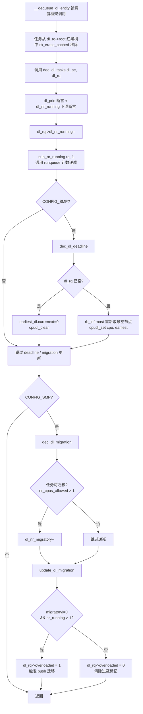

# dec_dl_tasks —— Deadline 调度类出队计数器递减入口

> **内核版本**：linux-4.19（stable）
> **所在文件**：`kernel/sched/deadline.c` L1357
> **所属调度类**：`dl_sched_class`（SCHED_DEADLINE）
> **对称函数**：`inc_dl_tasks()`（L1343，入队时递增）

---

## 1. 功能作用

`dec_dl_tasks` 是 Deadline 调度类的一个 **内部辅助函数**，当一个 deadline 调度实体（`sched_dl_entity`）从其所属的 deadline runqueue（`dl_rq`）中 **出队**（dequeue）时调用。它承担三大职责：

1. **递减 runqueue 运行计数**：更新 `dl_rq->dl_nr_running` 以及通用 runqueue 的统计 `rq->nr_running`。
2. **维护全局最早 deadline 缓存**：在 SMP 场景下，重新计算该 CPU 当前最早 deadline，并同步到跨 CPU 的 `cpudl` 位图结构，供其他 CPU 在做 push/pull 迁移决策时快速查询。
3. **更新可迁移任务状态**：递减可迁移 deadline 任务计数，并根据可迁移任务数 + 总运行数是否大于 1 来重新评估该 runqueue 是否处于 `overloaded` 状态（过载标记将触发 push 迁移）。

由于 `dec_dl_tasks` 只在 `__dequeue_dl_entity` 中被调用，而 `__dequeue_dl_entity` 又由 `__dequeue_task_dl` → `dequeue_task_dl` → `sched_class.dequeue_task` 这一条上层调度框架路径驱动，所以 **一切使任务离开 runqueue 的场景**（阻塞、被节流 throttle、让出 CPU、切换调度策略等）最终都会落到这个函数。

---

## 2. 源码全文（linux-4.19）

```c
// kernel/sched/deadline.c L1357
static inline
void dec_dl_tasks(struct sched_dl_entity *dl_se, struct dl_rq *dl_rq)
{
	int prio = dl_task_of(dl_se)->prio;

	WARN_ON(!dl_prio(prio));
	WARN_ON(!dl_rq->dl_nr_running);
	dl_rq->dl_nr_running--;
	sub_nr_running(rq_of_dl_rq(dl_rq), 1);

	dec_dl_deadline(dl_rq, dl_se->deadline);
	dec_dl_migration(dl_se, dl_rq);
}
```

### 关键前置宏 / 辅助函数

```c
// include/linux/sched/deadline.h
#define MAX_DL_PRIO 0
static inline int dl_prio(int prio)
{
	if (unlikely(prio < MAX_DL_PRIO))   // deadline 任务 prio < 0
		return 1;
	return 0;
}

// kernel/sched/deadline.c L23
static inline struct task_struct *dl_task_of(struct sched_dl_entity *dl_se)
{
	return container_of(dl_se, struct task_struct, dl);
}
```

---

## 3. 关键数据结构

### 3.1 `struct sched_dl_entity`（include/linux/sched.h L501）

调度实体，一个 deadline 任务的调度参数 + 状态容器。`struct task_struct` 内嵌了一个 `dl` 字段作为它的 deadline 调度实体。

| 字段 | 类型 | 含义 |
|------|------|------|
| `rb_node` | `struct rb_node` | 挂入 deadline runqueue 红黑树（按 deadline 升序）的节点 |
| `dl_runtime` | `u64` | 每个调度实例允许运行的最大时间 |
| `dl_deadline` | `u64` | 每个实例的相对 deadline |
| `dl_period` | `u64` | 两个实例之间的周期 |
| `runtime` | `s64` | **当前实例** 剩余运行时间（可能为负，表示 overrun） |
| `deadline` | `u64` | **当前实例** 的绝对 deadline（`clock + dl_deadline`） |
| `dl_throttled` | 1 bit | 预算耗尽被节流，等待 replenishment |
| `dl_non_contending` | 1 bit | 任务虽不活跃但仍占用带宽预算 |
| `dl_timer` | `struct hrtimer` | 用于带宽补充 / 非活跃状态切换的高精度定时器 |

### 3.2 `struct dl_rq`（kernel/sched/sched.h L623）

每个 CPU 都有一个 deadline runqueue（`rq->dl`），维护该 CPU 上所有 SCHED_DEADLINE 任务。

| 字段 | 类型 | 含义 |
|------|------|------|
| `root` | `struct rb_root_cached` | 按 deadline 排序的红黑树，`rb_leftmost` 直接缓存最左节点（最早 deadline） |
| `dl_nr_running` | `unsigned long` | 该 CPU 上处于 runnable 状态的 deadline 任务数量 |
| `earliest_dl.curr` / `.next` | `u64` | **仅 SMP**：当前正在运行任务的 deadline / 下一最早就绪任务的 deadline |
| `dl_nr_migratory` | `unsigned long` | **仅 SMP**：允许在多个 CPU 上运行（`p->nr_cpus_allowed > 1`）的 deadline 任务数 |
| `overloaded` | `int` | **仅 SMP**：`dl_nr_migratory != 0 && dl_nr_running > 1` 时置 1，触发 push 迁移 |
| `running_bw` / `this_bw` / `extra_bw` | `u64` | 活跃带宽、分配带宽、额外带宽，用于 GRUB 算法的带宽管理 |

---

## 4. 核心逻辑逐行解读

```
dec_dl_tasks(dl_se, dl_rq)
│
├─ 1. 取宿主任务的 prio
│     prio = dl_task_of(dl_se)->prio
│          = container_of(dl_se, task_struct, dl)->prio
│
├─ 2. 断言：该任务必须是 deadline 类型
│     WARN_ON(!dl_prio(prio))     // deadline 任务 prio < 0
│
├─ 3. 断言：runqueue 不能空
│     WARN_ON(!dl_rq->dl_nr_running)   // 防御性检查，避免下溢
│
├─ 4. 递减计数
│     dl_rq->dl_nr_running--       // Deadline 私有计数
│     sub_nr_running(rq, 1)        // 通用 runqueue 全局 nr_running--
│
├─ 5. 更新最早 deadline 缓存（SMP 下才真正工作）
│     dec_dl_deadline(dl_rq, dl_se->deadline)
│     ├─ 若 dl_rq 已空 (dl_nr_running == 0)
│     │   ├─ earliest_dl.curr = 0
│     │   ├─ earliest_dl.next = 0
│     │   └─ cpudl_clear(&rq->rd->cpudl, rq->cpu)
│     │
│     └─ 否则（重算最左节点）
│         ├─ leftmost = dl_rq->root.rb_leftmost
│         ├─ entry = rb_entry(leftmost, sched_dl_entity, rb_node)
│         ├─ earliest_dl.curr = entry->deadline
│         └─ cpudl_set(&rq->rd->cpudl, rq->cpu, entry->deadline)
│
└─ 6. 更新迁移状态（SMP 下才真正工作）
      dec_dl_migration(dl_se, dl_rq)
      ├─ p = dl_task_of(dl_se)
      ├─ if (p->nr_cpus_allowed > 1)   // 任务允许在多个 CPU 上跑
      │     dl_rq->dl_nr_migratory--
      └─ update_dl_migration(dl_rq)    // 根据 migratory 重新评估 overloaded
          ├─ 若 dl_nr_migratory && dl_nr_running > 1
          │     dl_set_overload(rq); dl_rq->overloaded = 1
          └─ 否则
                dl_clear_overload(rq); dl_rq->overloaded = 0
```

### 关于 `#ifndef CONFIG_SMP` 的兜底

在非 SMP 编译时，`dec_dl_deadline` 和 `dec_dl_migration` 都被展开为空的 `static inline` 函数：

```c
static inline void dec_dl_deadline(struct dl_rq *dl_rq, u64 deadline) {}
static inline void dec_dl_migration(struct sched_dl_entity *dl_se, struct dl_rq *dl_rq) {}
```

也就是说在单 CPU 下，`dec_dl_tasks` **只剩下两次 WARN_ON + 两次计数递减**，是一个纯粹的轻量维护钩子。

---

## 5. 核心逻辑流程图（Mermaid）



---

## 6. 调用关系

### 6.1 谁调用 `dec_dl_tasks`

```
sched_class_highest
  └─ dequeue_task(current, flags)          ← 调度框架通用入口 (kernel/sched/core.c)
       └─ current->sched_class->dequeue_task(rq, p, flags)
            └─ dequeue_task_dl()           ← kernel/sched/deadline.c (L1750)
                 └─ __dequeue_task_dl()    ← L1557
                      └─ dequeue_dl_entity()
                           └─ __dequeue_dl_entity()
                                ├─ rb_erase_cached(&dl_se->rb_node, &dl_rq->root)
                                └─ dec_dl_tasks(dl_se, dl_rq)    ★ 此处
```

### 6.2 `dec_dl_tasks` 调用谁

| 被调函数 / 宏 | 位置 | 作用 |
|--------------|------|------|
| `dl_task_of(dl_se)` | deadline.c L23 | `container_of` 反向定位宿主 `task_struct` |
| `dl_prio(prio)` | deadline.h L13 | 判定 prio 是否为 deadline（`< 0`） |
| `sub_nr_running(rq, 1)` | core.c 内联 | 通用 runqueue 的 `nr_running--` |
| `dec_dl_deadline()` | deadline.c L1313 (SMP) / L1338 (!SMP) | 重算当前 CPU 最早 deadline，更新 `cpudl` |
| `dec_dl_migration()` | deadline.c L585 (SMP) / L587 (!SMP) | 递减可迁移任务数 + 更新 overloaded |
| `update_dl_migration()` | deadline.c L409 | 根据 migratory / nr_running 判定 overloaded |
| `cpudl_set` / `cpudl_clear` | cpupri.c | 跨 CPU 最早 deadline 的位图维护 |

### 6.3 对称函数 `inc_dl_tasks`

`inc_dl_tasks` 是入队时的镜像函数，它 **递增** 所有计数并更新最早 deadline（只会让 `earliest_dl.curr` 变小，所以是单向判断，无需遍历重算）。两者一起保证了 runqueue 元数据与红黑树实体集合的 **强一致性**。

```c
static inline
void inc_dl_tasks(struct sched_dl_entity *dl_se, struct dl_rq *dl_rq)
{
	int prio = dl_task_of(dl_se)->prio;
	u64 deadline = dl_se->deadline;

	WARN_ON(!dl_prio(prio));
	dl_rq->dl_nr_running++;
	add_nr_running(rq_of_dl_rq(dl_rq), 1);

	inc_dl_deadline(dl_rq, deadline);   // 新 deadline 更早则覆盖
	inc_dl_migration(dl_se, dl_rq);
}
```

---

## 7. 设计要点小结

1. **两个 WARN_ON 形成契约**：`dl_prio` 断言保证这个函数绝不会被非 deadline 任务误调用；`dl_nr_running` 断言保证 runqueue 状态与树节点集合严格同步。
2. **`#ifndef CONFIG_SMP` 的两级编译裁剪**：迁移 + 跨 CPU deadline 缓存都是 SMP 专属，单 CPU 下自动降级为纯粹的计数工具函数，零额外开销。
3. **`cpudl` 加速 push/pull 决策**：`dec_dl_deadline` 通过 `rb_leftmost` O(1) 拿到最早 deadline 后立刻同步到全局 `cpudl`，使其他 CPU 做 **是否要把 pushable 任务迁走** 的决策时无需扫描任何树。
4. **`overloaded` 位 = push 迁移触发器**：当 runqueue 上同时存在 **至少一个可迁移** 任务 **且** 任务总数 > 1 时，该 CPU 被视为过载，`pick_next_task_dl` 会尝试把可迁移任务推给空闲 CPU。

---

*本文档由每日 Linux 内核学习自动化工作流生成 · 2026-09-26*
