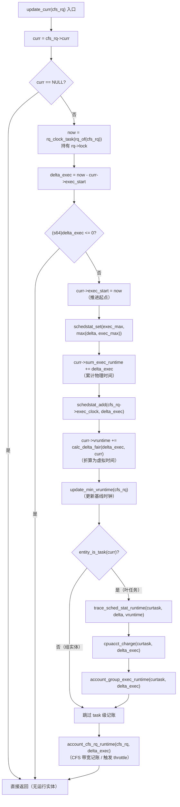
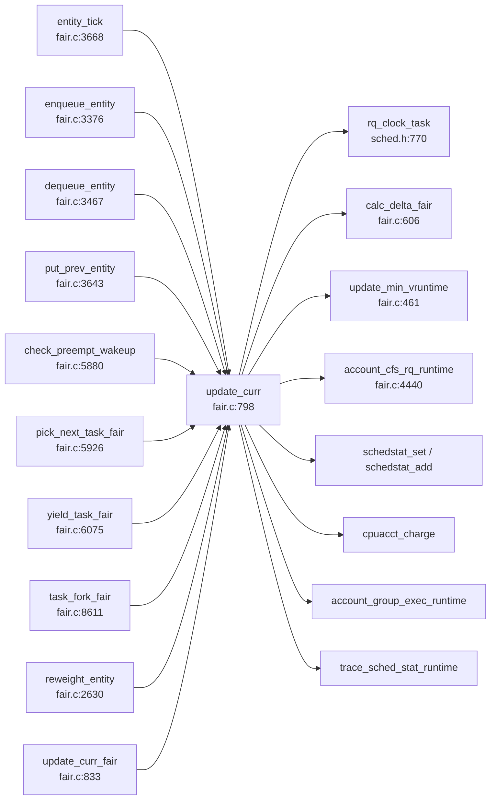

# 每日内核源码分析：update_curr

- **日期**：2026-09-16
- **子系统**：kernel/sched（CFS 完全公平调度器）
- **源文件**：kernel/sched/fair.c:798-831
- **类型**：function（static，仅 fair.c 内部使用）
- **Linux 版本**：v4.9（torvalds/linux@v4.9）
- **主归档**：[daily/2026/09/2026-09-16/kernel-sched_update_curr.md](../../../daily/2026/09/2026-09-16/kernel-sched_update_curr.md)

---

## 1. 功能作用

`update_curr()` 是 CFS（Completely Fair Scheduler，完全公平调度器）维护"当前正在运行实体"运行时统计信息的核心入口。它存在于 `kernel/sched/fair.c` 中，被设计为**轻量、频繁调用**的辅助函数——几乎在每一次会影响 CFS 运行队列状态的入口路径（入队、出队、tick、yield、fork、抢占判定、选下一个任务）里都会被首先调用，以保证 vruntime（虚拟运行时间）等核心记账字段在决策前是最新的。

具体来说，本函数完成四件事：

1. **结算当前实体本次 CPU 占用时长**：用 `rq_clock_task()` 取得 rq 时钟，减去 `curr->exec_start` 得到自上次结算以来的实际运行时长 `delta_exec`，并把 `exec_start` 推进到当前时刻。
2. **累计物理运行时间**：将 `delta_exec` 累加到 `curr->sum_exec_runtime`，这是 task_struct 中真实 CPU 时间（即 top 命令看到的"TIME"）的源头。
3. **更新虚拟运行时间 vruntime**：调用 `calc_delta_fair()`，按 sched_entity 的负载权重把物理 delta 折算为虚拟 delta，累加到 `curr->vruntime`。vruntime 是 CFS 红黑树（`tasks_timeline`）的排序键，CFS 始终选 vruntime 最小的任务运行——这就是"完全公平"得以维持的数学量。
4. **传播给带宽、记账子系统**：更新 `cfs_rq->min_vruntime` 单调基线；若当前实体是叶节点（即一个 task），还要触发 `trace_sched_stat_runtime`、`cpuacct_charge`、`account_group_exec_runtime`；最后通过 `account_cfs_rq_runtime()` 把执行量计入 CFS 带宽控制（`runtime_remaining`），用于组限流（throttle）。

简言之，`update_curr` 是 CFS 公平性的"心跳函数"——它把时间流逝翻译成 CFS 内部状态，是其他所有调度决策能够基于最新信息的前提。

## 2. 关键数据结构

### 2.1 `struct cfs_rq`（定义于 kernel/sched/sched.h:375）

CFS 自身的运行队列，挂在每个 CPU 的 `struct rq` 内（`rq->cfs`）。本函数关心的字段：

| 字段 | 类型 | 含义 |
|------|------|------|
| `curr` | `struct sched_entity *` | 当前正在 cfs_rq 上运行的调度实体，无运行时为 NULL。`update_curr` 第一步就检查它。 |
| `min_vruntime` | `u64` | 该 cfs_rq 的单调虚拟时钟基线。任务在入队/迁移时以此为参照增减 vruntime，保证跨 CPU 迁移时的公平性。本函数通过 `update_min_vruntime()` 更新它。 |
| `exec_clock` | `u64` | 该 cfs_rq 累计执行时钟（仅在启用 schedstat 时维护）。 |
| `tasks_timeline` | `struct rb_root` | 按 vruntime 排序的红黑树根。 |
| `rb_leftmost` | `struct rb_node *` | 红黑树最左节点（vruntime 最小的待运行实体）的缓存，加速 pick_next。 |
| `load` | `struct load_weight` | 该 cfs_rq 自身的权重（用于层级化组调度）。 |

### 2.2 `struct sched_entity`（定义于 include/linux/sched.h:1338）

调度实体——既可以是一个 task，也可以是一组 task（task group）。`task_struct.se` 内嵌，故 `container_of(se, struct task_struct, se)` 可还原 task。本函数直接修改其字段：

| 字段 | 类型 | 含义 |
|------|------|------|
| `exec_start` | `u64` | 上次结算时刻。`update_curr` 入口取 `now - exec_start` 作为本次 delta，然后写回 `now`。 |
| `sum_exec_runtime` | `u64` | 累计物理执行时长（纳秒），即 task 真实 CPU 时间。 |
| `vruntime` | `u64` | **CFS 核心字段**——虚拟运行时间，红黑树排序键。 |
| `load.weight` | `unsigned long` | 该实体的权重，由 nice 值映射；`NICE_0_LOAD=1024` 时权重为 1:1。`calc_delta_fair` 据此缩放 delta。 |
| `on_rq` | `unsigned int` | 标记实体是否在运行队列上，`update_min_vruntime` 会据此选择"是否使用 curr->vruntime`。 |
| `my_q` | `struct cfs_rq *` | 若该实体是组调度（task group），`my_q` 指向其拥有的子 cfs_rq；否则 NULL。`entity_is_task(se) = !se->my_q` 据此判断当前实体是否为叶任务。 |
| `statistics.exec_max` | `u64` | 单次最长执行片段（仅 CONFIG_SCHEDSTATS），用于调试。 |

### 2.3 关键宏/内联函数

- `rq_of(cfs_rq)`：在 `CONFIG_FAIR_GROUP_SCHED` 开启时返回 `cfs_rq->rq`（fair.c:255），否则用 `container_of(cfs_rq, struct rq, cfs)`（fair.c:378）。
- `rq_clock_task(rq)`（kernel/sched/sched.h:770）：返回 rq 的 `clock_task`，要求持有 `rq->lock`（`lockdep_assert_held`）。`clock_task` 不包含 IRQ 时间，相比 `rq->clock` 更能反映任务自身占用 CPU 的进度。
- `entity_is_task(se)`（fair.c:261/383）：`(!se->my_q)`，判断当前实体是否为叶任务。组调度下 `entity_is_task` 才有意义；否则编译期就为常量 1。
- `task_of(se)`（fair.c:263/373）：`container_of(se, struct task_struct, se)`，反向取回任务结构。
- `calc_delta_fair(delta, se)`（fair.c:606）：若权重恰为 `NICE_0_LOAD`，直接返回 delta；否则调用 `__calc_delta()`，按 `weight / NICE_0_LOAD` 的比例缩放——nice 越低权重越大、vruntime 增长越慢，越易被 CFS 选中。
- `update_min_vruntime(cfs_rq)`（fair.c:461）：以"curr 在 on_rq 时的 vruntime"与"红黑树最左节点 vruntime"二者最小值更新 `cfs_rq->min_vruntime`，并用 `max_vruntime` 保证只增不减。

## 3. 核心逻辑流程图



### 关键决策点解读

1. **`!curr` 早返回**：cfs_rq 上当前没有运行任务时（如刚切到 idle），不更新任何字段——避免无意义的 vruntime 推进。
2. **`(s64)delta_exec <= 0` 早返回**：用有符号比较防御时钟回退（部分架构时钟源可能不稳定）或调用顺序错乱（重复调用同一时刻）。这是 CFS 一致性的"安全阀"。
3. **`exec_start = now` 必须在所有累加之前完成**：否则后续路径若被中断再调用 `update_curr` 会重复记账。
4. **物理时间先累计，虚拟时间后折算**：`sum_exec_runtime` 反映真实 CPU 占用，`vruntime` 是 fair 排序的虚拟量，二者解耦，便于 CFS 用权重做"惩罚/奖励"。
5. **`update_min_vruntime` 紧跟 vruntime 更新**：保证 `cfs_rq->min_vruntime` 始终 ≥ 当前实体与最左节点的较小者；它是任务从别的 CPU 迁入时 vruntime 增减的基准。
6. **`entity_is_task` 分支**：只有叶任务才触发 trace、cpuacct、组记账；组实体（task group）本身不需要这些 per-task 统计。
7. **`account_cfs_rq_runtime` 放在最后**：CFS 带宽记账若发现本周期超额，会通过 `check_cfs_rq_runtime()` 在外层路径（如 `entity_tick`）触发 throttle，把整个 cfs_rq 从运行队列摘除。

## 4. 调用关系

### 4.1 调用者（who calls me）—— 在 `kernel/sched/fair.c` 中

| 调用方 | 源位置 | 调用场景 |
|--------|--------|----------|
| `update_curr_fair` | fair.c:833-836 | `task_tick_fair` 之外的"通用时钟推进"包装，被 fair 类的 `task_tick` 等入口使用 |
| `reweight_entity` | fair.c:2636 | 改变 nice/load weight 前，先 commit 上一次未结算的执行时间，避免权重切换导致 vruntime 失真 |
| `enqueue_entity` | fair.c:3388 | 把一个 sched_entity 入红黑树前，先把当前实体的统计刷新，保证入队前后比较公平 |
| `dequeue_entity` | fair.c:3472 | 把一个 sched_entity 出红黑树前，把当前已运行时间结算进账，再摘除 |
| `put_prev_entity` | fair.c:3650 | 在选下一个任务时，把"上一个 curr"放回树前先结算 |
| `entity_tick` | fair.c:3673 | `scheduler_tick` 在 CFS 路径下的每 tick 入口，定期推进 vruntime 并判定是否需要 resched |
| `check_preempt_wakeup` | fair.c:5893 | 唤醒一个任务后，比较 curr 与唤醒者的 vruntime 差以决定是否需要立即抢占 |
| `pick_next_task_fair` | fair.c:5960 | 选下一个运行任务时，若仍有 prev curr 在队列上，先把它已运行的时间结算掉，再做选择 |
| `yield_task_fair` | fair.c:6094 | 处理 `sched_yield()`，先把 curr 已运行的 delta 入账，再把它重新塞回树以让位 |
| `task_fork_fair` | fair.c:8623 | fork 子进程时，先结算父进程的 curr，再以父 vruntime 作为子进程的初始 vruntime（保证子进程不会"占便宜"） |

### 4.2 被调用者（who I call）

- **核心路径调用**：
  - `rq_clock_task()` — 取 rq 时钟，要求持有 `rq->lock`。
  - `calc_delta_fair()` — 把物理 delta 按 `load.weight / NICE_0_LOAD` 折算为虚拟 delta（核心公平性来源）。
  - `update_min_vruntime()` — 维护 cfs_rq 单调基线。
  - `account_cfs_rq_runtime()` — 把 delta 计入 CFS 带宽记账，是 throttle 的数据基础。
- **辅助调用**：
  - `schedstat_set` / `schedstat_add` — 仅在 `CONFIG_SCHEDSTATS` 编译开启时维护统计字段，否则编译期消去。
  - `cpuacct_charge()` — CPU accounting controller（cgroup 子系统）的 per-cpu charge。
  - `account_group_exec_runtime()` — 进程组执行时间记账。
- **关键内联 / 宏**：
  - `rq_of(cfs_rq)` — 反推 rq，避免每次都遍历层级。
  - `entity_is_task(se)` — 通过 `!se->my_q` 判断是否叶任务。
  - `task_of(se)` — `container_of` 反推 task_struct。
  - `trace_sched_stat_runtime` — tracepoint，可被 ftrace/perf 抓取，便于观察 vruntime 增长。

### 4.3 调用关系图



## 5. 易错点 / 边界场景 / 设计权衡

1. **"早返回"不是 bug 而是 invariant**：`delta_exec <= 0` 的早返回很容易被误以为是异常处理。实际上，CFS 在很多路径里会"投机"调用 `update_curr`（如 enqueue/dequeue 都会调），相邻调用间可能没有真实时间流逝（`clock_task` 精度有限或锁定后未推进）。CFS 用有符号比较防御时钟源不稳定，而非"假设计时器一定前进"。
2. **必须先写 `exec_start = now` 再做任何累加**：看似顺序无所谓，但若某架构在累加中途触发 IRQ 再次进入 `update_curr`，未推进的 `exec_start` 会导致 delta 被重复记账。这是 CFS 一致性的关键防御点。
3. **vruntime 与 sum_exec_runtime 解耦**：物理时间是单调累加的"客观事实"，vruntime 是被权重"扭曲"过的"主观度量"。CFS 排序只看 vruntime，所以同一 nice 的两个任务 vruntime 增长率相同——这是完全公平的体现；不同 nice 的任务通过权重差实现"奖励高 nice、惩罚低 nice"。
4. **`rq_clock_task` 而非 `rq->clock`**：`clock_task` 不包含 IRQ 处理时间，避免任务在 IRQ 期间被记账，更精确反映任务自身 CPU 占用。这个选择直接影响 sum_exec_runtime 的准确性。
5. **`min_vruntime` 的"max"防御**：`update_min_vruntime` 内部用 `max_vruntime(cfs_rq->min_vruntime, vruntime)` 保证 `min_vruntime` **只增不减**——一旦基线时钟回退（比如任务迁出后再迁入），跨 CPU 的 vruntime 比较仍能保持单调，避免某些任务通过迁移"占便宜"。
6. **`account_cfs_rq_runtime` 的副作用**：本函数本身不会触发 throttle，但它把 delta 计入 `runtime_remaining`，外层路径（如 `check_cfs_rq_runtime()`）会读取该字段决定是否摘队。因此 `update_curr` 是 throttle 数据流的源头，理解 CFS 带宽控制必须从这开始。
7. **`task_of` 与 `entity_is_task` 的耦合**：在 `CONFIG_FAIR_GROUP_SCHED=n` 时，`entity_is_task` 是常量 1，编译器会消除 `if` 分支；开启组调度时才真正判断 `se->my_q`。这种条件编译把组调度的开销降到几乎为零，是内核里常见的"零成本抽象"模式。
8. **跨版本差异提示**：4.x 系列中 `update_curr` 形参是 `struct cfs_rq *`，但在 5.x 之后部分场景引入了 `sched_delayed` 与 `sched_ext`（BPF 调度器扩展），`update_curr` 的封装关系略有变化——若学习 5.x+ 代码，注意 `cfs_rq_of` 与 `rq_of` 的条件编译分支与延迟入队等新机制。

---

## 附：核心源码片段

```c
// kernel/sched/fair.c:798-831（Linux v4.9）
/*
 * Update the current task's runtime statistics.
 */
static void update_curr(struct cfs_rq *cfs_rq)
{
	struct sched_entity *curr = cfs_rq->curr;
	u64 now = rq_clock_task(rq_of(cfs_rq));
	u64 delta_exec;

	if (unlikely(!curr))
		return;

	delta_exec = now - curr->exec_start;
	if (unlikely((s64)delta_exec <= 0))
		return;

	curr->exec_start = now;

	schedstat_set(curr->statistics.exec_max,
		      max(delta_exec, curr->statistics.exec_max));

	curr->sum_exec_runtime += delta_exec;
	schedstat_add(cfs_rq->exec_clock, delta_exec);

	curr->vruntime += calc_delta_fair(delta_exec, curr);
	update_min_vruntime(cfs_rq);

	if (entity_is_task(curr)) {
		struct task_struct *curtask = task_of(curr);

		trace_sched_stat_runtime(curtask, delta_exec, curr->vruntime);
		cpuacct_charge(curtask, delta_exec);
		account_group_exec_runtime(curtask, delta_exec);
	}

	account_cfs_rq_runtime(cfs_rq, delta_exec);
}
```
