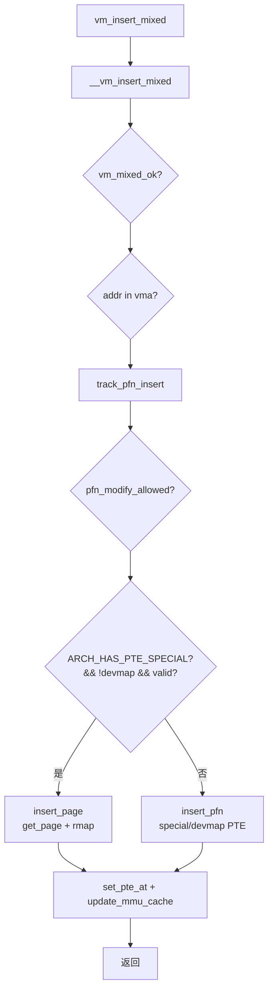

# vm_insert_mixed

> **今日内核学习 —— 2026-09-29**
> 主归档：[daily/2026/09/2026-09-29/mm_vm_insert_mixed.md](../../daily/2026/09/2026-09-29/mm_vm_insert_mixed.md)

## 功能摘要

`vm_insert_mixed`（`mm/memory.c:1943`）是内核 VMA 页表插入家族中最灵活的接口，接受一个携带 flags 的 `pfn_t`，自动根据架构特性和 pfn 类型选择 `insert_page`（refcount + rmap）或 `insert_pfn`（纯 PTE + special/devmap）两条路。核心用于支持 DAX、cramfs 等在同一 VMA 里混合映射系统内存与设备内存的场景。

## 兄弟接口家族

| 接口 | 输入 | VMA flag | 核心差异 |
|------|------|----------|----------|
| `vm_insert_page` | `struct page *` | `VM_MIXEDMAP` | 必须有 page refcount，走 rmap |
| `vm_insert_pfn` | pfn + `PFN_DEV` | `VM_PFNMAP` | pfn 不能 valid（设备内存） |
| `vm_insert_pfn_prot` | pfn + pgprot | 同上 | 可覆盖 per-page pgprot |
| **`vm_insert_mixed`** | **`pfn_t` + flags** | **任一或自动** | **动态选择 page/pfn 路径** |
| `remap_pfn_range` | pfn + 范围 | `VM_PFNMAP` | 批量，强制 special pte |

## 关键决策流程图

## 关键经验

- **架构分支点** `IS_ENABLED(CONFIG_ARCH_HAS_PTE_SPECIAL)` 决定了是否必须 refcount page
- `VM_PFNMAP` 和 `VM_MIXEDMAP` **禁止同时置位**，`vm_insert_pfn_prot` 有硬 BUG_ON
- 读取侧对称函数是 `vm_normal_page()`，`special/devmap` pte 都会让它返回 NULL
- `pfn_modify_allowed` 是安全底线，防止越权提升 pgprot

完整分析见上方主归档链接。
