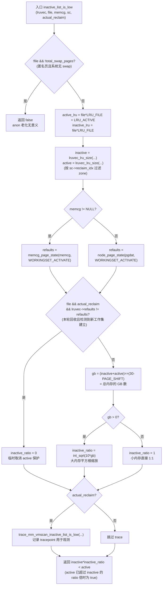
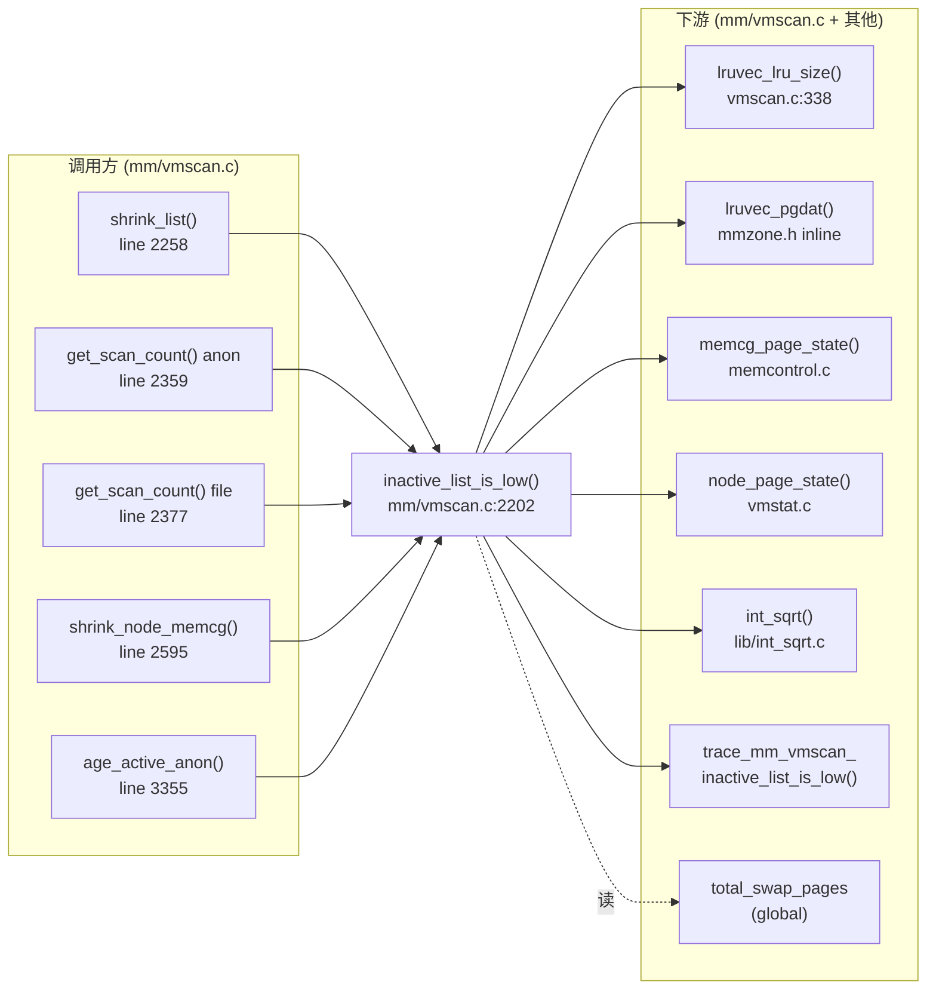

# 每日内核源码分析：inactive_list_is_low

- **日期**：2026-09-13
- **子系统**：mm（内存回收 / page reclaim）
- **源文件**：mm/vmscan.c:2202-2251
- **类型**：function（static bool，5 处调用点）
- **内核版本**：v4.19

---

## 1. 功能作用

`inactive_list_is_low()` 是 Linux 内存回收子系统（mm/vmscan.c）中的一个**核心"门函数"（gate function）**。它回答一个看似简单、实则决定整个 LRU 回收策略走向的问题：

> 当前 LRU 链表（inactive file / inactive anon）相对于 active 链表而言，是否"过小"，需要从 active 链表里"降级"一些页下来补充 inactive 链表？

LRU（Least Recently Used）是 Linux 内存管理对"页框老化"的近似实现。每个 node+memcg 组合维护 4 条核心 LRU：

- `LRU_INACTIVE_ANON` / `LRU_ACTIVE_ANON` —— 匿名页（可换出到 swap）
- `LRU_INACTIVE_FILE` / `LRU_ACTIVE_FILE` —— 文件页（可丢弃 / 写回）

回收路径默认只扫描 inactive 链表；当 inactive 不够大时，需要把 active 上"较老"的页降级到 inactive，否则回收就会过快地踢掉新页（thrashing）。这个判断就由 `inactive_list_is_low()` 完成。

### 典型使用场景（5 个调用点）

| 调用点 | 决策含义 |
|--------|----------|
| `shrink_list()`（line 2258） | 当请求扫描的是 active 链表时，先判断 inactive 是否过小；若过低则调用 `shrink_active_list()` 把部分 active 页降级，再返回 0（active 链表本身不直接回收）。 |
| `get_scan_count()`（line 2359, anon 分支） | 当 anon inactive **不低**且 anon inactive 在本优先级下还有页可扫时，强制 `SCAN_ANON`（专门扫 anon），避免 anon 小 LRU 被 file 抢走扫描配额。 |
| `get_scan_count()`（line 2377, file 分支） | 当 file inactive **不低**且有页可扫时，强制 `SCAN_FILE`，跳过 anon 扫描，保护 anon 工作集。 |
| `shrink_node_memcg()`（line 2595） | 在本轮回收结束后，即使本轮没扫 anon，也要按需把 active anon 部分降级以维持 active/inactive 比例。 |
| `age_active_anon()`（line 3355，kswapd 路径） | kswapd 在每次 `balance_pgdat()` 之前老化 active anon，使被长期挂在 active 上的"惰性"匿名页能进入回收视野。 |

简言之，本函数是 **active→inactive 降级时机判定 + anon/file 扫描配额决策** 的双重门槛。

---

## 2. 关键数据结构

### 2.1 `struct lruvec`（[include/linux/mmzone.h:236](https://github.com/torvalds/linux/blob/v4.19/include/linux/mmzone.h#L236)）

每个 pgdat（节点）× memcg（cgroup）组合一个 `lruvec`，是 LRU 算法的实际承载体。本函数对其三个字段感兴趣：

```c
struct lruvec {
    struct list_head        lists[NR_LRU_LISTS];   // 5 条 LRU 链表头
    struct zone_reclaim_stat reclaim_stat;        // 最近扫描/旋转计数
    atomic_long_t           inactive_age;         // inactive file 的淘汰/激活时序
    unsigned long            refaults;             // 上一次回收周期结束时的 refaults 快照
    struct pglist_data      *pgdat;                // 反向指针，CONFIG_MEMCG 时存在
};
```

关键字段：

- `lists[NR_LRU_LISTS]`：5 个槽位，对应 `enum lru_list` 的 5 个值（见下）。
- `refaults`：本 lruvec 在上次回收周期结束时的 `WORKINGSET_ACTIVATE` 计数快照。用于检测"是否在最近一周期内出现了新工作集建立"，若是，则在本轮回收里临时把 `inactive_ratio` 设为 0，让 active 不受保护，以便快速清掉陈旧工作集。
- `pgdat`：反向指针。`lruvec_pgdat(lruvec)` 即取此字段。

### 2.2 `enum lru_list`（[include/linux/mmzone.h:200](https://github.com/torvalds/linux/blob/v4.19/include/linux/mmzone.h#L200)）

```c
enum lru_list {
    LRU_INACTIVE_ANON = LRU_BASE,              // 0
    LRU_ACTIVE_ANON   = LRU_BASE + LRU_ACTIVE, // 1
    LRU_INACTIVE_FILE = LRU_BASE + LRU_FILE,    // 2
    LRU_ACTIVE_FILE   = LRU_BASE + LRU_FILE + LRU_ACTIVE, // 3
    LRU_UNEVICTABLE,                            // 4
    NR_LRU_LISTS                                // 5
};
```

`LRU_FILE = 2`，`LRU_ACTIVE = 1`，故 `file * LRU_FILE + LRU_ACTIVE` 巧妙地用布尔参数 `file` 算出对应的 active LRU 编号；`file * LRU_FILE` 算出对应的 inactive LRU 编号。这是位运算复用枚举值的典型手法。

### 2.3 `struct scan_control`（[mm/vmscan.c:64](https://github.com/torvalds/linux/blob/v4.19/mm/vmscan.c#L64)）

回收路径的"参数包"，由调用者填好一路下传。本函数只用到：

- `sc->reclaim_idx`：本次回收允许触及的最高 zone 索引。`lruvec_lru_size()` 在统计时会跳过高于此索引的 zone 中的页，从而保证回收不越权（例如 highmem 不应被低端分配触发回收）。
- `sc->priority`（在 caller `get_scan_count` 内用，本函数不直接用）：扫描优先级，DEF_PRIORITY=12，越小越激进。

### 2.4 `struct pglist_data` / `pg_data_t`

节点描述符，本函数通过 `lruvec_pgdat(lruvec)` 取得，用于 `node_page_state(pgdat, WORKINGSET_ACTIVATE)` 读取 node 级统计。

### 2.5 `struct mem_cgroup`

cgroup 内存资源控制器。本函数对 `memcg != NULL` 的情况用 `memcg_page_state(memcg, WORKINGSET_ACTIVATE)` 读 cgroup 级 refault 计数；否则用 node 级。

### 2.6 关键全局/常量

| 名称 | 含义 |
|------|------|
| `total_swap_pages` | 系统总可用 swap 页数。若为 0，则匿名页不可能换出，本函数直接返回 false（不老化 anon）。 |
| `PAGE_SHIFT` | 页大小的 log2，x86/ARM64 上为 12（4KB）。用于把"页数"换算成 GB。 |
| `WORKINGSET_ACTIVATE` | workingset 模块维护的计数量，记录"被换出/丢弃后又重新激活"的页数；其增量反映工作集抖动。 |

---

## 3. 核心逻辑流程图



### 关键决策点逐条解读

1. **`!file && !total_swap_pages` 直接返回 false**：匿名页只能换出到 swap，没有 swap 时把 anon 从 active 降级到 inactive 没有任何意义——它永远不可能被回收，反而让 inactive 链表变臃肿、拖慢扫描。这是一个早返回优化，也是为什么 swapless 嵌入式系统上 anon LRU 几乎不动的原因。

2. **`lruvec_lru_size(..., sc->reclaim_idx)` 而非全 zone 总数**：统计时按 `sc->reclaim_idx` 截断高 zone 的页，保证判断与实际可回收范围一致。例如 NORMAL 区回收时，HIGHMEM 区的页不该被算进"我手上有多少 inactive"，否则会高估可回收空间。

3. **`refaults` 双源切换**：cgroup 启用时按 memcg 读，否则按 node 读。这是 memcg 化回收与全局回收共用同一段代码的标准模式。

4. **`lruvec->refaults != refaults` 触发 `inactive_ratio = 0`**：这是 workingset 机制的关键钩子。`lruvec->refaults` 存的是上一轮回收结束时的 refault 快照。如果本轮调用时 refaults 增量 > 0，说明**有页被踢掉后又重新激活**——这意味着工作集发生了切换，旧的 active 工作集已经过时。把 `inactive_ratio` 设为 0 让 `inactive * 0 < active` 恒为真，迫使 active 链表被立刻降级、陈旧工作集被快速清理。这是 Linux 4.x 引入的"自适应老化"机制的核心。

5. **`int_sqrt(10 * gb)`**：内存越大，目标 inactive 比例反而越小（不是线性 1:1）。函数注释列出了对照表：

   | 总内存 | inactive_ratio | 目标 inactive |
   |--------|----------------|--------------|
   | 10MB   | 1              | 5MB          |
   | 1GB    | 3              | 250MB        |
   | 10GB   | 10             | 0.9GB        |
   | 100GB  | 31             | 3GB          |
   | 1TB    | 101            | 10GB         |

   直觉：大内存机器上 workingset 占主导，inactive 不必太大；小内存机器上反而要更均衡，避免单次扫描回收太彻底导致 thrashing。`int_sqrt` 在内核 lib/ 下，避免浮点开销。

6. **`actual_reclaim` 参数的双重作用**：
   - 影响 tracepoint 触发（仅"真回收"路径才打 trace，避免观测噪声）。
   - 影响 workingset 检测分支：只有 `actual_reclaim==true` 才允许设 `inactive_ratio=0`。在 `get_scan_count()` 这种"只是查一查，还没真回收"的场景下，不能因为检测到 refaults 就激进取消保护——必须等到真正回收时才动手。

7. **`return inactive * inactive_ratio < active`**：注意是"小于"返回 true 表示 inactive 偏低。即 `active/inactive > inactive_ratio` 时认为 active 过大、需要降级。等价表述：active 不应超过 inactive 的 `inactive_ratio` 倍。

---

## 4. 调用关系

### 4.1 调用者（who calls me）—— 5 个调用点全部在 mm/vmscan.c 内

| 调用方 | 所在文件:行 | 调用场景 | `actual_reclaim` 取值 |
|--------|-----------|----------|----------------------|
| `shrink_list()` | mm/vmscan.c:2258 | 主动扫描 active LRU 前判断是否需要先降级 active→inactive | true |
| `get_scan_count()` (anon 分支) | mm/vmscan.c:2359 | 决定扫描配额时判断 anon inactive 是否够用，够则强制 SCAN_ANON | false |
| `get_scan_count()` (file 分支) | mm/vmscan.c:2377 | 决定扫描配额时判断 file inactive 是否够用，够则强制 SCAN_FILE | false |
| `shrink_node_memcg()` | mm/vmscan.c:2595 | 本轮回收结束后对 anon LRU 做主动 rebalance | true |
| `age_active_anon()` | mm/vmscan.c:3355 | kswapd 平衡前主动老化 active anon | true |

> 此函数为 `static`，无 `EXPORT_SYMBOL`，仅在 vmscan.c 内可见——这是该模块"内部决策门函数"的典型特征。

### 4.2 被调用者（who I call）

**核心路径调用：**

| 函数 | 作用 |
|------|------|
| `lruvec_pgdat(lruvec)` | 内联访问器，取 `lruvec->pgdat`。 |
| `lruvec_lru_size(lruvec, lru, zone_idx)` | 在 [mm/vmscan.c:338](https://github.com/torvalds/linux/blob/v4.19/mm/vmscan.c#L338) 定义；按 zone 上限统计该 lru 上页数。 |
| `memcg_page_state(memcg, item)` | 读 memcg vmstat 计数。 |
| `node_page_state(pgdat, item)` | 读 node vmstat 计数。 |

**辅助/计算调用：**

| 函数 | 作用 |
|------|------|
| `int_sqrt(unsigned long x)` | 内核整数平方根（[lib/int_sqrt.c](https://github.com/torvalds/linux/blob/v4.19/lib/int_sqrt.c)），避免 FPU。 |
| `trace_mm_vmscan_inactive_list_is_low(...)` | tracepoint，仅在 `actual_reclaim` 时打点。 |

**宏 / 内联 / 全局：**

- `LRU_FILE`、`LRU_ACTIVE`、`MAX_NR_ZONES`：枚举常量。
- `total_swap_pages`：全局变量，由 swap 初始化路径维护。
- `PAGE_SHIFT`：架构相关宏，x86/ARM64 为 12。
- `WORKINGSET_ACTIVATE`：enum，来自 [include/linux/mmzone.h](https://github.com/torvalds/linux/blob/v4.19/include/linux/mmzone.h) 的 `node_stat_item`。

### 4.3 调用关系图（Mermaid）



---

## 5. 易错点 / 边界场景 / 设计权衡

1. **`actual_reclaim` 参数很容易误读为"是否真的要回收"，实际语义是"当前调用是否处于实际回收路径"**：在 `get_scan_count()` 里两次调用都传 false，这意味着**仅做计划性查询时不触发 workingset 短路、不打 trace**。这种"只读、不决策副作用"的写法是为了让 `get_scan_count()` 在反复迭代时不会污染 trace 输出。

2. **`file * LRU_FILE + LRU_ACTIVE` 的位运算复用枚举**：初看是怪异写法，但本质是把 `bool file` 当作 `LRU_FILE` 的乘数，把 `LRU_ACTIVE` 加进去得到 active LRU 编号。改写为 `file ? LRU_ACTIVE_FILE : LRU_ACTIVE_ANON` 会更易读，但当前写法节省一次条件跳转，且能与 `enum lru_list` 的位布局一一对应。这是内核惯用的"以算代分支"优化。

3. **`inactive_ratio = 0` 不是直接关闭回收**：设为 0 后返回值变成 `0 < active`，等价于"active 一旦非零就要降级"，但**降级动作由调用方 `shrink_active_list()` 执行**，本函数不直接动 LRU。这种"只判定、不修改"的纯函数设计让本函数可被多个调用方安全共享，无需考虑调用次序。

4. **`int_sqrt(10 * gb)` 中 `10 * gb` 是否会溢出？** `gb` 是 `unsigned long`，64 位系统上即使到 PB 级 `gb` 也才 ~10^6，乘以 10 远小于 `ULONG_MAX`，无溢出风险。但 32 位系统上 `unsigned long` 只有 32 位，理论上 4GB 以上节点就溢出——这也是为什么 32 位内核不支持大节点、且代码注释最大只列到 10TB（实际由 64 位 long 保证安全）。

5. **tracepoint 的开销控制**：tracepoint 即使未启用也会插入条件跳转，但在 hot path 上的累积开销可观。本函数通过 `if (actual_reclaim)` 提前过滤掉一半调用，使得 `get_scan_count()` 频繁查询路径不会触发 trace 评估。这是内核 tracepoint 性能优化的标准模式。

6. **`lruvec->refaults` 字段何时更新？** 本函数只读不写。实际更新在 `shrink_node_memcg()` 末尾，由 `lruvec->refaults = refaults` 完成。这意味着 workingset 短路逻辑只在"上一轮回收结束后到本轮回收开始之间"检测增量——这是一个**周期性感知**模型，不是事件级响应。如果工作集在上一轮回收结束前就完成切换，本轮就可能感知不到——这是一个已知的时间窗口。

7. **匿名页与文件页的不对称处理**：函数体顶部 `if (!file && !total_swap_pages)` 只对 anon 早退；但 workingset 短路分支只对 `file` 生效（`if (file && actual_reclaim && ...)`）。原因：workingset 机制主要用于 file page cache（通过 refault distance 模型）；anon 的换入换出由 swap 自己管，不直接走 workingset stat。这种不对称是有意为之，不是 bug。

---

## 附：核心源码片段

```c
// mm/vmscan.c:2186-2251 (Linux v4.19)
/*
 * The inactive anon list should be small enough that the VM never has
 * to do too much work.
 *
 * The inactive file list should be small enough to leave most memory
 * to the established workingset on the scan-resistant active list,
 * but large enough to avoid thrashing the aggregate readahead window.
 *
 * Both inactive lists should also be large enough that each inactive
 * page has a chance to be referenced again before it is reclaimed.
 *
 * If that fails and refaulting is observed, the inactive list grows.
 *
 * The inactive_ratio is the target ratio of ACTIVE to INACTIVE pages
 * on this LRU, maintained by the pageout code. An inactive_ratio
 * of 3 means 3:1 or 25% of the pages are kept on the inactive list.
 *
 * total     target    max
 * memory    ratio     inactive
 * -------------------------------------
 *   10MB       1         5MB
 *  100MB       1        50MB
 *    1GB       3       250MB
 *   10GB      10       0.9GB
 *  100GB      31         3GB
 *    1TB     101        10GB
 *   10TB     320        32GB
 */
static bool inactive_list_is_low(struct lruvec *lruvec, bool file,
                                 struct mem_cgroup *memcg,
                                 struct scan_control *sc, bool actual_reclaim)
{
    enum lru_list active_lru = file * LRU_FILE + LRU_ACTIVE;
    struct pglist_data *pgdat = lruvec_pgdat(lruvec);
    enum lru_list inactive_lru = file * LRU_FILE;
    unsigned long inactive, active;
    unsigned long inactive_ratio;
    unsigned long refaults;
    unsigned long gb;

    /*
     * If we don't have swap space, anonymous page deactivation
     * is pointless.
     */
    if (!file && !total_swap_pages)
        return false;

    inactive = lruvec_lru_size(lruvec, inactive_lru, sc->reclaim_idx);
    active = lruvec_lru_size(lruvec, active_lru, sc->reclaim_idx);

    if (memcg)
        refaults = memcg_page_state(memcg, WORKINGSET_ACTIVATE);
    else
        refaults = node_page_state(pgdat, WORKINGSET_ACTIVATE);

    /*
     * When refaults are being observed, it means a new workingset
     * is being established. Disable active list protection to get
     * rid of the stale workingset quickly.
     */
    if (file && actual_reclaim && lruvec->refaults != refaults) {
        inactive_ratio = 0;
    } else {
        gb = (inactive + active) >> (30 - PAGE_SHIFT);
        if (gb)
            inactive_ratio = int_sqrt(10 * gb);
        else
            inactive_ratio = 1;
    }

    if (actual_reclaim)
        trace_mm_vmscan_inactive_list_is_low(pgdat->node_id, sc->reclaim_idx,
            lruvec_lru_size(lruvec, inactive_lru, MAX_NR_ZONES), inactive,
            lruvec_lru_size(lruvec, active_lru, MAX_NR_ZONES), active,
            inactive_ratio, file);

    return inactive * inactive_ratio < active;
}
```

---

## 参考链接

- 上游源码：<https://github.com/torvalds/linux/blob/v4.19/mm/vmscan.c#L2202-L2251>
- `struct lruvec`：<https://github.com/torvalds/linux/blob/v4.19/include/linux/mmzone.h#L236>
- `enum lru_list`：<https://github.com/torvalds/linux/blob/v4.19/include/linux/mmzone.h#L200>
- workingset 文档：<https://www.kernel.org/doc/html/latest/mm/workingset.html>
- 本仓库 vmscan.c 已分析函数：[wakeup_kswapd.md](./wakeup_kswapd.md)
